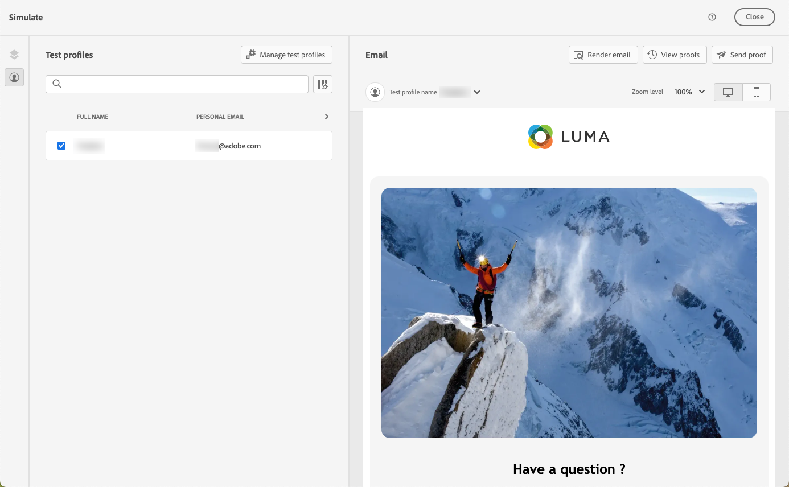
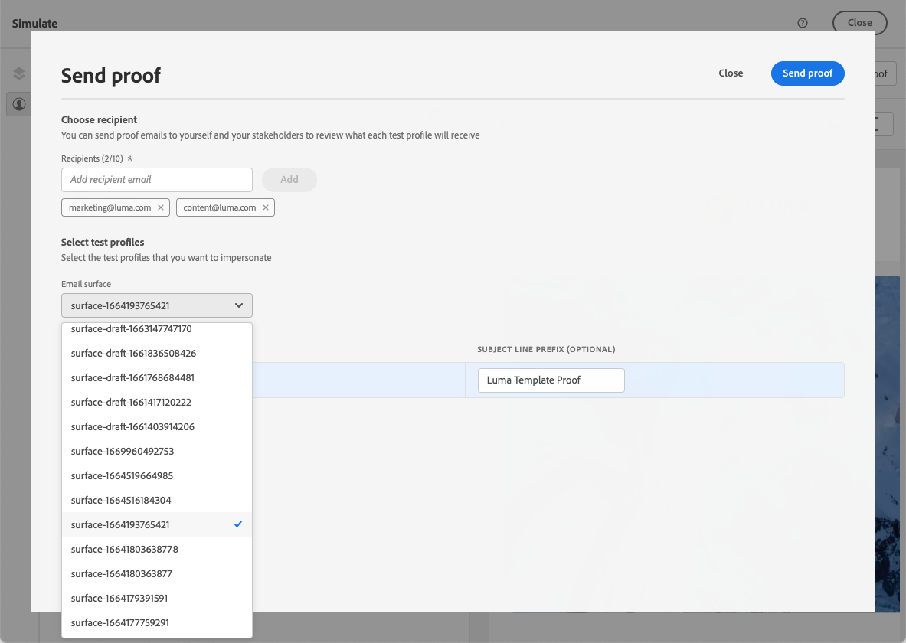

# Test email content templates {#test-template}

You can test the rendering of some of your email templates, whether created from scratch or from an existing content. To do so, follow the steps below.

1. Access the content template list through the **[!UICONTROL Content Management]** > **[!UICONTROL Content Templates]** menu and select any email template.

1. Click **[!UICONTROL Edit content]** from the **[!UICONTROL Template properties]**.

1. Click **[!UICONTROL Simulate content]** to preview and test your content. [Learn how to preview and test content](../content-management/preview-test.md)

    

1. You can send a proof to test your content and have it approved by some internal users before using it in a journey or a campaign.

    * To do so, click the **[!UICONTROL Send proof]** button and follow the steps described in [this section](../content-management/proofs.md).
    
    * Before sending the proof, you must select the [email configuration](../configuration/channel-surfaces.md) that will be used to test your content.

        

>[!CAUTION]
>
>Currently tracking is not supported when testing email content templates, meaning that tracking events, UTM parameters and landing page links will not be effective in the proofs that are being sent from a template. To test tracking, [use the content template](../email/use-email-templates.md) in an email and send a proof using test profiles, or sample input data uploaded from a CSV / JSON file, or added manually. [Learn how to preview & test your content](../content-management/preview-test.md)
