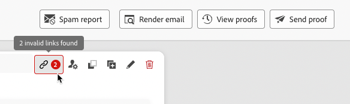
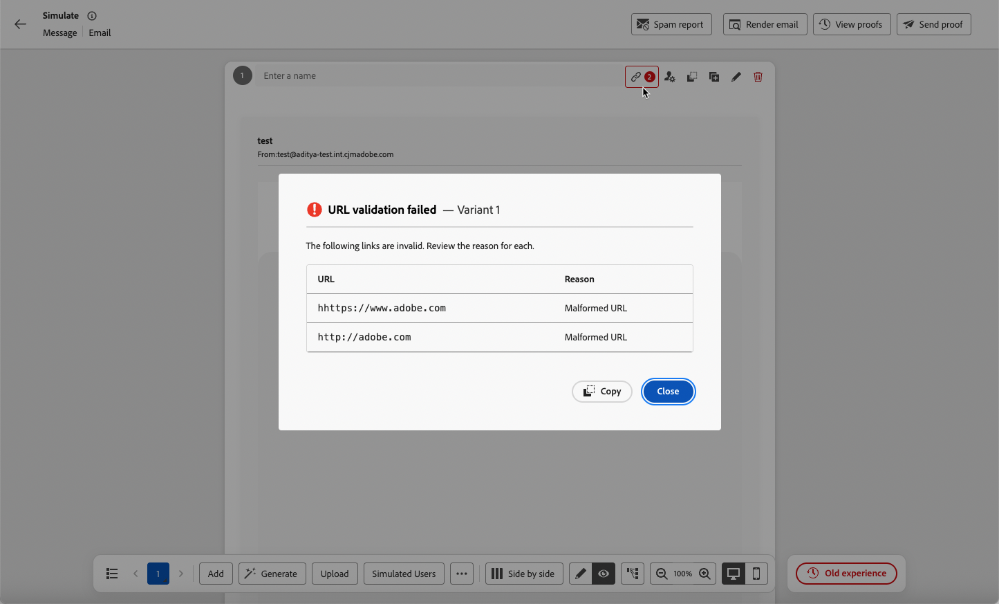
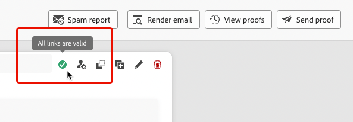

# Validate URLs in your content {#url-validation}

>[!BEGINSHADEBOX]

**On this page:** Learn how Adobe Journey Optimizer checks the web links in your message content when you preview it, so you can catch broken, insecure, or unreachable URLs before you send.

>[!ENDSHADEBOX]

>[!AVAILABILITY]
>
>This capability is released in Limited Availability (LA) for a set of customers. Contact your Adobe representative to gain access.

When you preview your message content, you can have [!DNL Journey Optimizer] check the web links it contains. This helps you catch broken or inaccessible links before your message reaches your audience.

## Run URL validation {#access}

URL validation is available for channel actions in journeys and campaigns across all channels, and when you preview [content templates](content-templates.md). It runs automatically as soon as you open the **[!UICONTROL Simulate]** screen, so you don't need to start it yourself. To review the results:

1. From the content editor, click **[!UICONTROL Simulate content]**. [Learn more about simulation](../test-approve/simulate-content-variations.md)

1. From the **[!UICONTROL Simulate]** screen, check the URL validation icon:

    * If all URLs are valid, the icon shows a green check mark.
    * If any URLs are invalid, the icon flags it.
    
        {width=70%}
        
        Click the icon to open a pop-up window that lists each invalid URL and the reason why it's invalid.

      

1. Click **[!UICONTROL Copy]** to copy the list to your clipboard, then paste it into a document or email for review.

1. Close the window and fix the invalid URLs in your content. Learn more in the [Troubleshooting](#troubleshooting) section.

1. Simulate the content again for validation to re-run automatically. Repeat until the icon shows a green check mark.

    {width=70%}

## How it works {#how-it-works}

* Every `http://` and `https://` URL in your content is checked — including links, images, and stylesheets, not only clickable text links.
* Each URL is checked to confirm that the host resolves, responds with a success status, and responds within an acceptable time. Only the response status is checked; page content is never downloaded.
* If issues are found, they're identified along with the reason and guidance on how to fix them.

>[!IMPORTANT]
>
>If your content contains more than 50 URLs, validation doesn't just skip the extras — the entire request is rejected and no result is returned. Reduce the number of links in your content to get a validation result.

### What gets flagged {#invalid-urls}

| Issue | Example | Error message | Why it's flagged |
|---|---|---|---|
| Insecure scheme | `http://example.com` | "This link uses HTTP. Only HTTPS links are allowed." | HTTP links aren't secure. |
| Malformed URL | Empty URL, bad host, spaces | "This link couldn't be reached." | The URL can't be parsed. |
| Scheme typo | `hhttps://`, `ttps://` | "This link couldn't be reached." | The scheme isn't recognized. |
| Broken or unreachable | A 404 response, or a domain that doesn't resolve | "This link couldn't be reached." | The page doesn't exist or the host can't be reached. |
| Internal or blocked address | `localhost`, `192.168.x.x`, `169.254.169.254` | "This link couldn't be reached." | Internal or private network addresses are blocked for security reasons. |
| Timeout | The host took too long to respond | "This link couldn't be reached." | The host didn't respond in time. |

For steps to fix each of these, see [Troubleshooting](#troubleshooting).

### What doesn't get checked {#not-checked}

The following aren't flagged as broken, even if they appear in your content:

* **Non-web links** — `adbinapp://`, `mailto:`, `tel:`, `sms:`, and `data:` URIs aren't web URLs.
* **Relative links** — `/page` or `./image.jpg` have no host to check.
* **Anchors** — `#section` is a local page reference.
* **Empty links** — An empty `href` isn't a link.

## Caveats {#caveats}

>[!IMPORTANT]
>
>Personalized links are validated against whatever data you're previewing with in the **[!UICONTROL Simulate]** screen — entered manually, imported from a file, generated with AI, or based on simulated users. None of these are backed by a real Adobe Experience Platform profile, so the resolved URL may not exist, and the link is flagged as invalid even if it works for real recipients.
>
>For example, these links may show as invalid unless you're previewing with a real Adobe Experience Platform profile:
>
>* `https://example.com/profile/{{crmID}}`
>* `https://example.com/offer?promoCode={{promoCode}}`
>
>To check whether a personalized link is actually valid, simulate with a real Adobe Experience Platform profile instead.

Content is scanned for URLs wherever they appear, not only in clickable links. As a result, a few other categories are often flagged as false positives:

* **Adobe namespace URLs**, such as `xmlns="http://ns.adobe.com/..."` in XML/HTML, are identifiers rather than pages to visit. They return a 404, which is expected.
* **CDN resource URLs** — images, fonts, or stylesheets that aren't meant to be clicked. If the CDN is slow or temporarily unavailable, they may show as invalid.
* **URLs in comments or metadata** that are never shown to your recipients but are still checked.

>[!NOTE]
>
>Before you treat a flagged URL as a real issue, check whether it's a personalized link previewed without a real profile, a namespace, CDN, or metadata URL, or an actual user-facing link.

## Best practices {#best-practices}

1. Use `https://` for all links — HTTP links aren't allowed.
1. Confirm external dependencies — CDN URLs, third-party APIs, and remote images — are healthy before you preview.
1. Simulate personalized links with a real Adobe Experience Platform profile — manually entered, imported, AI-generated, or simulated-user data can make valid links show as invalid.
1. Stay under the 50-URL limit — going over it doesn't trim the extras, it rejects the whole validation request. Consider splitting your content across multiple messages or templates.
1. Expect namespace or data URIs in your schema to show as invalid — that's expected, since they aren't meant to be clicked.

## Troubleshooting {#troubleshooting}

| Issue | Why | Solution |
|---|---|---|
| "This link uses HTTP. Only HTTPS links are allowed." | Insecure scheme | Update the URL to use `https://`. |
| "This link couldn't be reached." | Malformed URL, scheme typo, 404 response, blocked internal address, or timeout — see [What gets flagged](#invalid-urls) | Fix the URL, or verify the host is correct, online, and reachable. |
| No validation result is returned at all | Content contains more than 50 URLs, so the entire request is rejected | Reduce the number of links in your content, then preview again. |
| A link with a `{{ }}` personalization token is flagged as invalid | The token was resolved without a real Adobe Experience Platform profile, so the resulting URL may not exist. See [Caveats](#caveats). | Simulate again with a real Adobe Experience Platform profile to check whether the link actually works. |
| A flagged URL actually works fine and isn't personalized | False positive — see [Caveats](#caveats) | It's likely a namespace URL, a CDN resource, or content in comments/metadata — safe to ignore if it isn't user-facing. |

