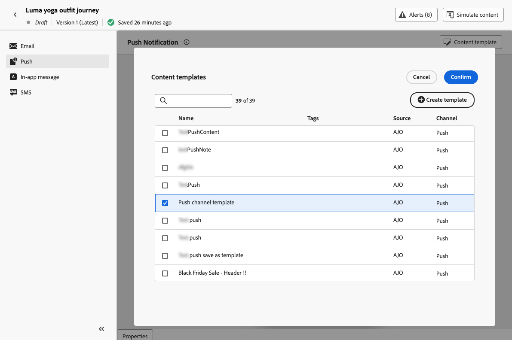

# Use content templates {#use-content-templates}

When creating content for any channel (except Web) in [!DNL Journey Optimizer], you can use a custom template that you either:
 
* Created from scratch using the **[!UICONTROL Content templates]** menu. [Learn more](#create-template-from-scratch)

* Saved from an existing content in a journey or a campaign  using the **[!UICONTROL Save as content template]** option. [Learn more](#save-as-template)

To start building your content with one of these templates, follow the steps below.

1. Whether in a campaign or journey, after selecting **[!UICONTROL Edit content]**, click the **[!UICONTROL Content template]** button.

1. Select **[!UICONTROL Apply content template]**.

    

1. Select the template of your choice from the list. Only templates compatible with the selected channel and/or type are displayed.

    

    >[!NOTE]
    >
    >From this screen, you can also create a new template using the dedicated button, which opens a new tab.

1. Click **[!UICONTROL Confirm]**. The template is applied to your content.

1. Continue editing your content as desired.

>[!NOTE]
>
>To start designing an email from a content template using the [Email Designer](../email/get-started-email-design.md), follow the steps described in [this section](../email/use-email-templates.md).
