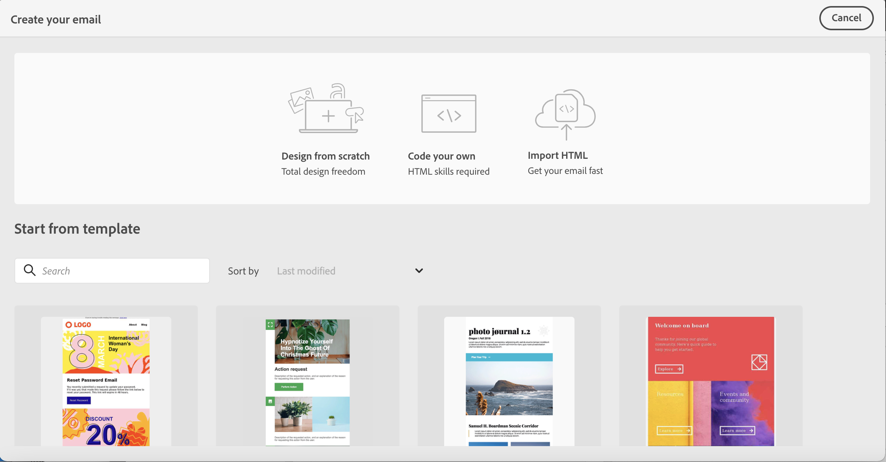
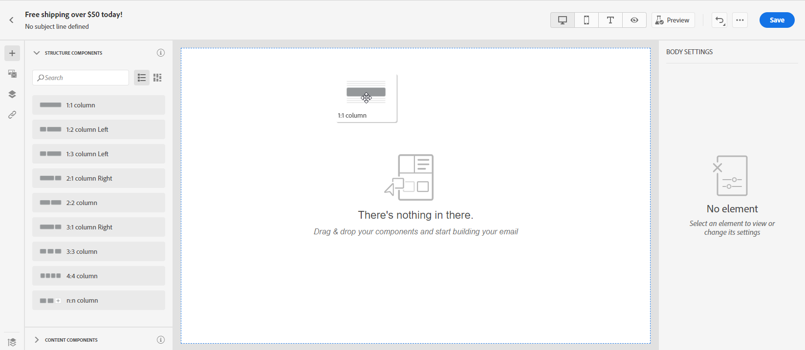
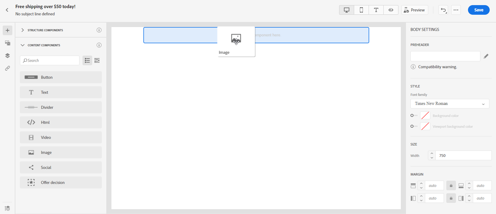
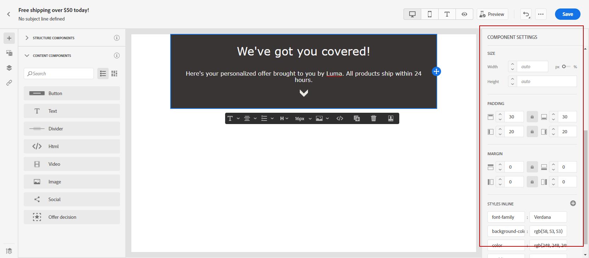
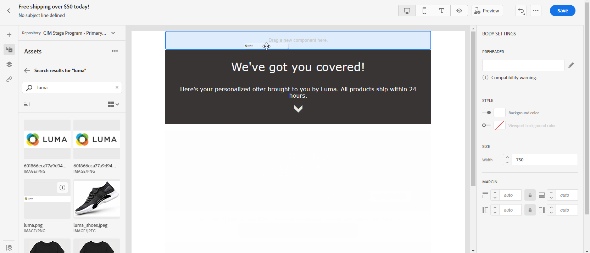
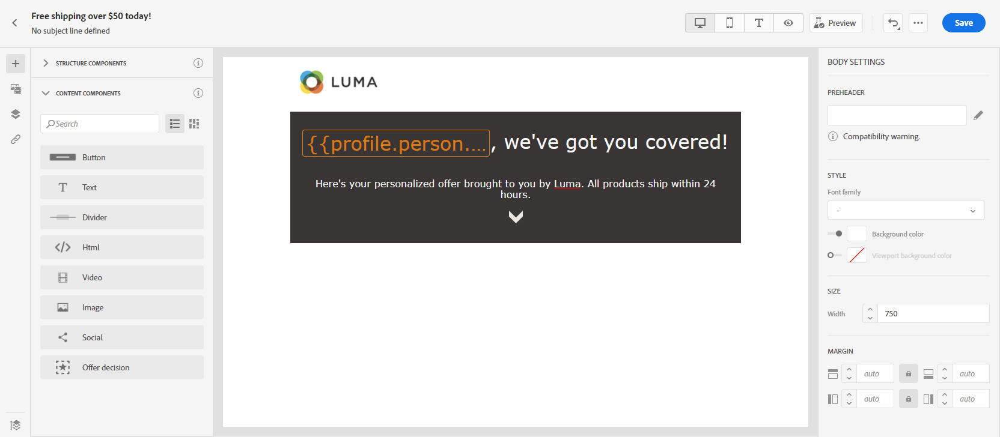
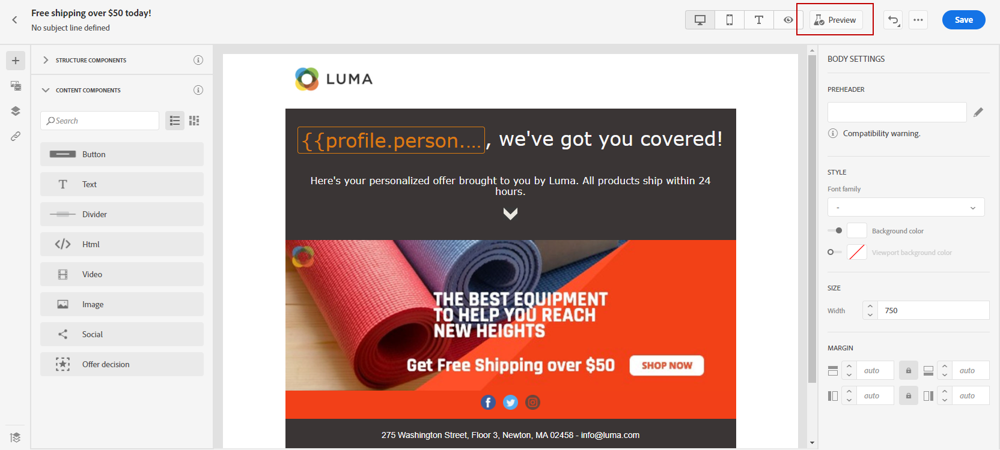
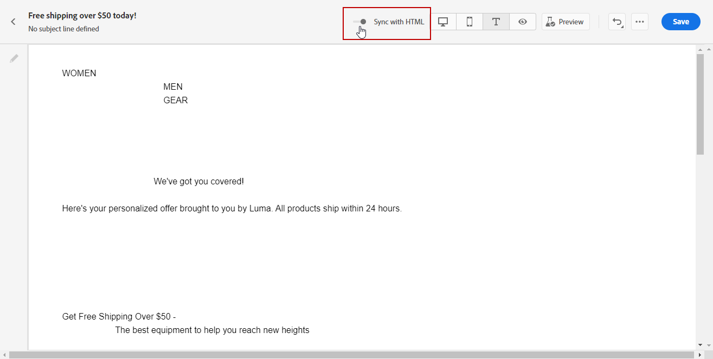
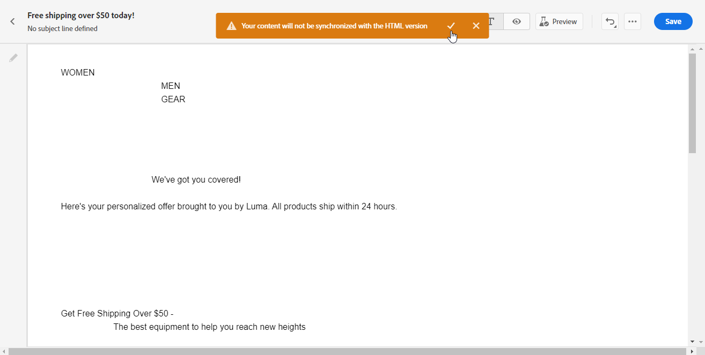

# Design your email content in the user interface {#create-email-content}

Once you have [created your message](create-message.md), you can start creating your email content.

1. From your newly created message, select **[!UICONTROL Email designer]** in the **[!UICONTROL Edit content]** section.

    

1. In the Email Designer home page, choose how you want to design your email from the following options:

    * Select **[!UICONTROL Design from scratch]** to use the email designer capabilities to create your email content.

    * Select **[!UICONTROL Start from template]** to create your email from a built-in list of templates. Note that you cannot create other templates.

    * Select **[!UICONTROL Code your own]** to enter or paste HTML raw code. [Learn more](existing-content.md#import-raw-html-code).

    * Select **[!UICONTROL Import HTML]** to import an HTML file or .zip folder. [Learn more](existing-content.md#import-html-content-from-file).

    

## Design from scratch

To start building your email content with the email designer, follow the steps below:

1. After selecting the **[!UICONTROL Design from scratch]** option, start designing your email content by drag and dropping **[!UICONTROL Structure components]** to define the layout of your email.

    

1. From the **[!UICONTROL Content components]** drop-down, you can add as many **[!UICONTROL Content components]** as you need in your structure component. [Learn more about Content components](content-components.md).

    

1. Each component can be further customized with the **[!UICONTROL Component settings]** section. For example, you can change your text style, the padding or margin of your component. [Learn more about styles in the Email Editor](https://experienceleague.adobe.com/docs/campaign-standard/using/designing-content/styles.html).

    

1. From the **[!UICONTROL Assets picker]**, you can directly add assets stored in the **[!UICONTROL Assets library]** to your email. [Learn more about asset management](assets-essentials.md).

    Double-click the folder which contained your assets and drag and drop the asset you want to add to your email.

    

1. Add personalization fields to customize the content from your profiles data. [Learn more about content personalization](personalization/personalize.md).

    

1. In the **[!UICONTROL Links]** tab in the left pane, check the list of all the URLs of your content that will be tracked. You can modify their **[!UICONTROL Tracking Type]**, **[!UICONTROL Label]** and **[!UICONTROL Tags]** if needed.

    

1. If needed, you can switch to code editor to further personalize your email by clicking **[!UICONTROL Switch to code editor]** from the advanced menu. For more information on the code editor, refer to this [page](existing-content.md#import-raw-html-code).

    >[!NOTE]
    >
    >You will not be able to use the visual designer for this email after switching to the code editor.

    

1. Click **[!UICONTROL Preview]** to check your email rendering. You can choose the desktop or mobile view.

    

1. When your email is ready, click **[!UICONTROL Save & Close]**.

Your email content can now be used in a message. [Learn how to send a message](publish-manage-message.md).

## Define the email structure {#defining-the-email-structure}

>[!CONTEXTUALHELP]
>id="ac_structure_components"
>title="About Structure components"
>abstract="Structure components define the layout of the email."

>[!CONTEXTUALHELP]
>id="ac_edition_columns"
>title="Defining email columns"
>abstract="The Email Designer allows you to easily define the layout of your email by defining column structure."

The Email Designer allows you to easily define the structure of your email. By adding and moving structural elements with simple drag-and-drop actions, you can design the shape of your email within seconds.

To edit the structure of an email:

1. Open an existing content or create a new email content.
1. Access the **[!UICONTROL Structure components]** by selecting the **+** icon on the left.
1. Drag and drop the structure components that you need to shape your email.
   A blue line materializes the exact location of the structure components before you drop it. You can drop it above, between or below any other component, but not inside.

   >[!NOTE]
   >
   >Note that stack of columns are not compatible with all email programs. When not supported, columns will not be stacked.
   >
   >Once placed in the email, you cannot move nor remove your components unless there is already a content component or a fragment placed inside.

1. Several structure components composed of one or more columns are available.

   Select the **[!UICONTROL n:n column]** component to define the number of columns of your choice (between 3 and 10). You can also define the width of each column by moving the arrows at the bottom of each column.

   >[!NOTE]
   >
   >Each column size cannot be under 10% of the total width of the structure component. You cannot remove a column that is not empty.

Once the structure is defined, you are able to add content fragments and components to your email.

## Use a preheader {#preheader}

>[!CONTEXTUALHELP]
>id="ac_edition_preheader"
>title="Using a preheader"
>abstract="The preheader lets your configure a short summary text that will delivers a higher open rate for your email."

A preheader is a short summary text that follows the subject line when viewing an email from your inbox. The preheader delivers an higher open rate.

Select the **[!UICONTROL Preheader]** edit box and complete the content.

You can add a **[!UICONTROL Content block]**, a **[!UICONTROL Dynamic content]** or a **[!UICONTROL Personalization fields]** in the preheader content.

>[!NOTE]
>
>Note that preheader is not compatible with all email programs. When not supported, preheader will not display.

## Background settings {#about-backgrounds}

>[!CONTEXTUALHELP]
>id="ac_edition_backgroundimage"
>title="Background settings"
>abstract="The Email designer lets you personnalize background color or background image for your content.Note that background image is not supported by all email clients."
>additional-url="https://docs.google.com/spreadsheets/d/1TLo62YKm3tThUWDOIliCQFWs3dpNjpDfw6DdTr1oGOw/edit#gid=0" text="Additional info"

When it comes to setting backgrounds with the Email Designer, Adobe recommends the following:

1. Apply a background color to the body of your email if required by your design.
1. In most cases, set background colors at the column level.
1. Try not to use background colors on image or text components as they are difficult to manage.

Below are the available background settings that you can use.

* Set a **[!UICONTROL Background color]** for the whole email. Make sure you select the body settings in the navigation tree accessible from the left Palette.

* Set the same background color for all structure components by selecting **[!UICONTROL Viewport background color]**. This option enables you to select a different setting from the background color.

* Set a different background color for each structure component. Select a structure in the navigation tree accessible from the left Palette to apply a specific background color only to that structure.

  Make sure you do not set a viewport background color as it may hide the structure background colors.

* Set a **[!UICONTROL Background image]** for the content of a structure component.

  >[!NOTE]
  >
  >Some email programs do not support background images. When not supported, the row background color will be used instead. Make sure you select an appropriate fallback background color in case the image cannot be displayed.

* Set a background color at the column level.

  >[!NOTE]
  >
  >This is the most common use case. Adobe recommends setting background colors at the column level as this allows for more flexibility when editing the whole email content.

  You can also set a background image at the column level, but this is rarely used.

### Example: adjust vertical alignment and padding {#example--adjusting-vertical-alignment-and-padding}

You want to adjust padding and vertical alignment inside a structure component composed of three columns. To do this, follow the steps below:

1. Select the structure component directly in the email or using the structure tree available from the left **Palette**.
1. From the **contextual toolbar**, click **[!UICONTROL Select a column]** and choose the one that you want to edit. You can also select it from the structure tree.

   The editable parameters for that column are displayed in the **[!UICONTROL Settings]** pane on the right.

1. Under **[!UICONTROL Vertical alignment]**, select **[!UICONTROL Up]**.

   The content component displays on top of the column.

1. Under **[!UICONTROL Padding]**, define the top padding inside the column. Click the lock icon to break synchronization with the bottom padding.

   Define the left and right padding for that column.

1. Proceed similarly to adjust the other columns' alignment and padding.

1. Save your changes.

## Define a style for links {#about-styling-links}

You can underline a link and select its color and target in the Email Designer.

1. In a component where a link is inserted, select the label text of your link.

1. In the component settings, check **[!UICONTROL Underline link]** to underline the label text of your link.

1. To select in which browsing context your link will be opened select a **[!UICONTROL Target]**.

1. To change the color of your link, click on **[!UICONTROL Link color]**.

1. Pick the color you need.

1. Save your changes.

## Add inline styling attributes {#adding-inline-styling-attributes}

In the Email Designer interface, when you select an element and display its settings on the side panel, you can customize the inline attributes and their value for that specific element.

1. Select an element in your content.
1. On the side panel, look for the **[!UICONTROL Styles Inline]** settings.

1. Modify the values of the existing attributes, or add new ones using the **+** button. You can add any attribute and value that is CSS-compliant.

The styling is then applied to the selected element. If the child elements do not have specific styling attributes defined, the styling of the parent element is inherited.

## Generate a text version of the email {#generate-text-version}

The Email Designer enables you to edit several rendering of your emails such as a text version of your email.

By default, the **[!UICONTROL Plain text]** version of your email and personalization fields are automatically generated and synchronized with the HTML version of your content.

To have a plain text version different from the HTML version:

>[!CAUTION]
>
>After disabling the synchronization and editing your **[!UICONTROL Plain text]**, your changes will be replaced with the HTML version if you re-enable the **[!UICONTROL Sync with HTML]** option.
>
>Changes made in **[!UICONTROL Plain text]** view cannot be reflected in HTML view.

1. From your email, select the **[!UICONTROL Plain text]** tab.

1. Disable this synchronization by clicking the **[!UICONTROL Sync with HTML]** switch.

    

1. Click the check mark to confirm your choice.

    

1. You can then edit the plain text version as desired.
