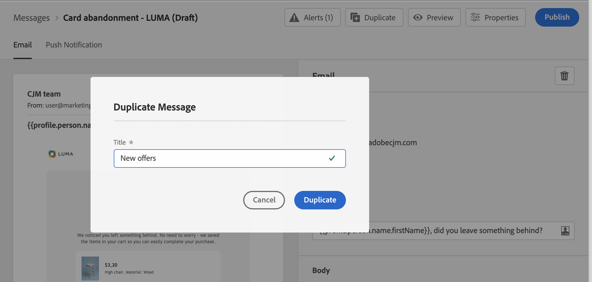

# Create a message {#create-message}

Messages are available from the **[!UICONTROL Messages]** shortcut on the left rail. All messages are listed, sorted by publication date (for published messages) or creation date (for draft messages).

>[!NOTE]
>
>Every user can access, create, edit and publish messages. Learn more about user permissions [in this section](../using/administration/permissions-overview.md).

Use the **[!UICONTROL Show recents]** toggle to add direct links to the messages you accessed in the last 5 days.

Use the filter icon to display only drafted, published or messages being published. You can also search on message label, as below:

## Create a new message

To create a new message, follow the steps below:

1. Access the message list, then click **[!UICONTROL Create Message]**.

1. Define the message properties.

    
    
    * Enter a **[!UICONTROL Title]** (mandatory) and a **[!UICONTROL Description]**. 

    * Select the **[!UICONTROL Preset]** to use for the message.

        Presets include all the parameters that are required for an email and/or push notification to be sent according to your brand. [Learn more about branding](configuration/about-subdomain-delegation.md).

    * Select the channel(s) you want to use for that message: Email and/or Push notification. You must select at least one channel to be able to create the message.

    Note that you can access and modify the message's title, description and preset at any time using the **[!UICONTROL Properties]** button in the message interface.

    

1. Click **[!UICONTROL Create]** to confirm message creation. Your message is added in the message list, in the **[!UICONTROL Draft]** status.

    One tab is available for each selected channel. Use these tabs to configure the content for each channel. You can remove a tab by selecting it and clicking the **[!UICONTROL Delete channel]** button on the right. 

    

    You can now create the content of the message and adapt settings. Detailed information about email and push notification configuration is available in the following sections:

    * [Configure emails](configure-email.md)
    * [Configure push notifications](configure-push.md)

    >[!NOTE]
    >   
    >You can personalize your messages using profiles' data using the Expression Editor. For more on personalization, refer to [this section](personalization/personalize.md).
    

1. Control the rendering of your messages, and check personalization settings with test profiles, using the preview section on the left-hand side. For more on this, refer to [this section](preview.md).

    

1. Check alerts in the upper section of the editor.  Some of them are simple warnings, but others can prevent you from publishing the message. Learn more in [this section](alerts.md).

1. You can now publish your message by clicking the **[!UICONTROL Publish]** button, or keep it as a draft and publish it later on. For more on how to publish messages, refer to [this section](publish-manage-message.md).

## Duplicate a message

To create a message from an existing one, use the **[!UICONTROL Duplicate]** button from the message interface. All settings and configuration will be copied to the new  message

You can rename the message before confirming duplication.

A confirmation message displays at the bottom of the window once the new message is created.

You can also duplicate a message from the message list, using the dedicated icon.

The same confirmation process applies.
