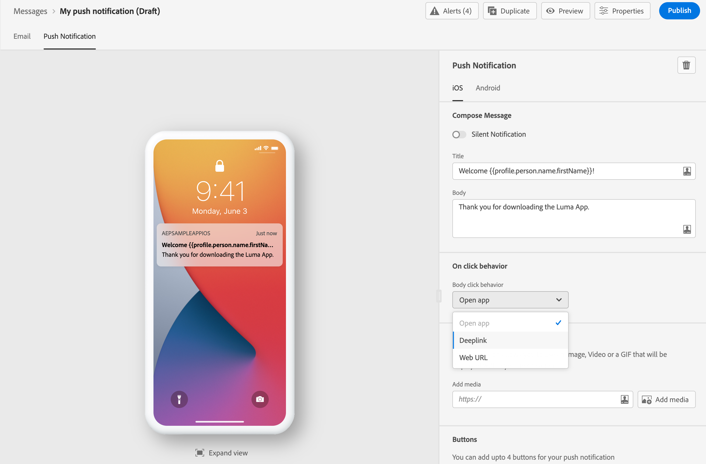
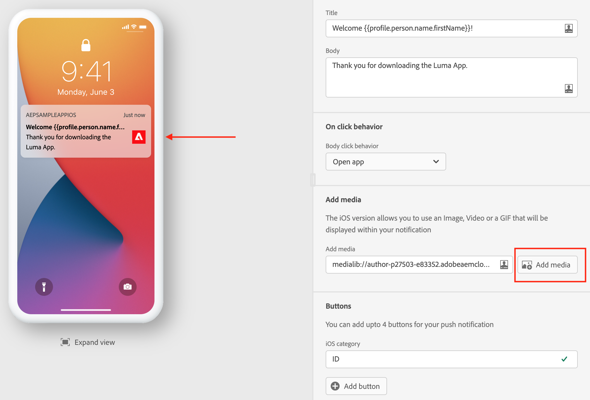
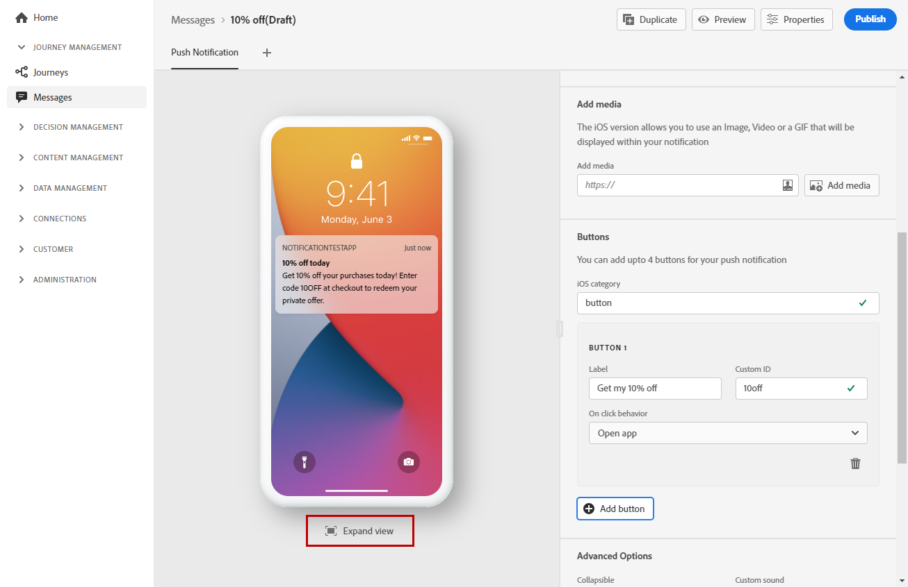

# Create a push notification {#create-push-notification}

Once you [created a message](create-message.md), click the **[!UICONTROL Push Notification]** tab to define the settings and content of the push notification. 

Use the dedicated tabs to define the push notification settings for **iOS** and **Android** operating systems.

>[!NOTE]
>
>The **[!UICONTROL Compose Message]** section is common to both the **[!UICONTROL iOS]** and **[!UICONTROL Android]** tabs. Any change in this section will apply to both tabs.

## Title and Body {#push-title-body}

To compose your message, click the **[!UICONTROL Title]** and **[!UICONTROL Body]** fields. Use the Expression Editor to define content and personalization data. Learn more about personalization in the Expression Editor in [this section](personalization/personalize.md)
    
Use the device preview section to visualize how the push notification displays on iOS and Android devices.

## On click behavior {#on-click-behavior}

Select the behavior when a recipient clicks on the body of the push notification.

* Use the **[!UICONTROL Open app]** option to open the application associated with the message **[!UICONTROL Preset]**.
* Use the **[!UICONTROL Deeplink]** option to redirect the recipient to a specific content located inside the application. Enter the deeplink in the associated field.
* Use the **[!UICONTROL Web URL]** option to redirect the recipient to an external URL. Enter the URL in the associated field.

## Add media {#add-media-push}

In the iOS version of your push notification, you can add an image, a video or a GIF that will be displayed within your notification.

In the Android version, you can only add an image icon, and an image for expanded notifications. 

Two options are available. You can:

*  Click on the **[!UICONTROL Add media]** button to select an asset in **[!DNL Adobe Experience Manager Assets Essentials]**.

    Learn how to use **[!DNL Adobe Experience Manager Assets Essentials]** in [this page](assets-essentials.md).
    
* Or enter the URL of the media by clicking on the **[!UICONTROL Add media]** field. In that case, you can add personalization.

Once added, the media displays on the right of the notification body.

## Add buttons {#add-buttons-push}

You can create an actionable notification by adding buttons to your push content. 

If the device screen is locked, these buttons are not displayed: only the the **Title** and the **Message** of the notification are visible. If their device is unlocked, recipients will see the buttons.

In the iOS version, you can add up to 4 buttons. In the Android version, you can add up to 3 buttons.

>[!NOTE]
>
>For iOS, use the **[!UICONTROL iOS category]** field to associate actions with a notification category.

Click **[!UICONTROL Add button]** to define settings: the label and associated action. Possible actions are the same as for [on-click behavior](#on-click-behavior). 

Click **[!UICONTROL Expand view]** to preview your personalized buttons.

## Send a silent notification {#silent-notification}

A silent push notification (or background notification) is a hidden instruction that is delivered to the application. It is used for example to notify your application about the availability of new content or initiate a download in the background.

Select the **[!UICONTROL Silent Notification]** option to silently notify the application: in this case, the notification is transferred directly to the application. No alert is displayed on the device screen.

Use the **[!UICONTROL Custom data]** section to add key-value pairs.

## Custom data

In the **[!UICONTROL Custom data]** section, you can add custom variables to the payload, depending on your mobile application configuration. For more on how to set up push notifications in Adobe Experience Platform and Adobe Launch, refer to [this section](push-gs.md)

## Advanced options {#advanced-options-push}

You can configure **[!UICONTROL Advanced options]** for your push notification. Available parameters are listed below:

|Parameter | Description |
|---------|---------|
|**[!UICONTROL Collapsible]** (iOS / Android) | A collapsible message is a message that may be replaced by a new message if it has become outdated. A common use cases of collapsible messages are messages used to tell a mobile app to sync data from the server. An example would be a sports app that updates users with the latest score. Only the most recent message is relevant. On the other hand, with non-collapsible message, very message is important to the client app and needs to be delivered. |
|**[!UICONTROL Custom sound]** (iOS / Android) | The sound to be played by the mobile terminal when the notification is received. The sound needs to be bundled in the app.|
|**[!UICONTROL Badges]** (iOS / Android) | A badge is used to display directly on the application icon the number of new unread information.  The badge value will disappear as soon as the user opens or reads the new content from the application. When a notification is received on a device, it can refresh or add a badge value for the related app. For example, if you are storing the number of unread articles of your customers, you can leverage personalization to send the unique unread articles badge value for each customer. For more personalization, refer to [this section](personalization/personalize.md).|
|**[!UICONTROL Notification group]**  (iOS only) | Associate a notification group to the push notification. Starting with iOS 12, notification groups allow you to consolidate message threads and notification topics into thread IDs. For example, a brand might send marketing notifications under one group ID, while keeping more operational type notifications under one or more different IDs. To illustrate this, you can have groupID: 123 "check out the new spring collection of sweaters" and groupID: 456 "your package was delivered" notification groups. In this example, all delivery notifications would be bundled under group ID: 456.|
|**[!UICONTROL Notification channel]** (Android only) | Associate a notification channel to the push notification. Starting in Android 8.0 (API level 26), all notifications must be assigned to a channel in order to display. For more on this, refer to the [Android developer documentation](https://developer.android.com/guide/topics/ui/notifiers/notifications#ManageChannels).|
|**[!UICONTROL Add content-availability flag]** (iOS only) | Sends the content available flag in the push payload to ensure that the app is woken up as soon as it receives the push notification, meaning that the app will be able to access the payload data.  This works even if the app is running in the background and without needing any user interaction (e.g. tapping on Push notification). However, this does not apply if the app is not running. For more on this, refer to the [Apple developer documentation](https://developer.apple.com/library/content/documentation/NetworkingInternet/Conceptual/RemoteNotificationsPG/CreatingtheNotificationPayload.html). |
|**[!UICONTROL Add mutable-content flag]** (iOS only) | Sends the mutable-content flag in the push payload and will allow the push notification content to be modified by a notification service application extension provided in iOS SDK. For more on this, refer to [Apple developer documentation](https://developer.apple.com/library/content/documentation/NetworkingInternet/Conceptual/RemoteNotificationsPG/ModifyingNotifications.html). You can then leverage your mobile app extensions to further modify the content or presentation of arriving push notifications sent from [!DNL Journey Optimizer]. For example, users can leverage this option to decrypt data, change the body or title text of a notification, add a thread identifier to a notification etc.|
|**[!UICONTROL Notification visibility]** (Android only) | Defines the push notification's visibility.  <b>Private</b> will show the notification on all lockscreens, but conceal sensitive or private information on secure lockscreens.  <b>Public</b> will show the notification in its entirety on all lockscreens.  <b>Secret</b> will not reveal any part of the notification on a secure lockscreen.  For more on this, refer the [Android developer documentation](https://developer.android.com/reference/android/app/Notification).|
|**[!UICONTROL Notification priority]** (Android only) | Defines the push notification's importance from Low to Max. This determines how "intrusive" the push notification will be when it is delivered. For more on this, refer to the [Android developer documentation](https://developer.android.com/guide/topics/ui/notifiers/notifications#importance)|
|**[!UICONTROL Delivery priority]** (Android only) | Sets up a high or normal priority for your push notifications. For more information on message priority, refer to the [Google developer documentation](https://firebase.google.com/docs/cloud-messaging/concept-options#setting-the-priority-of-a-message).|

**Related topics**

<!--
* [Understand push notification flow](push-gs.md)
-->

* [Configure push channel](push-gs.md)
* [Create a new message](create-message.md)
* [Add a message in a journey](building-journeys/journeys-message.md)
