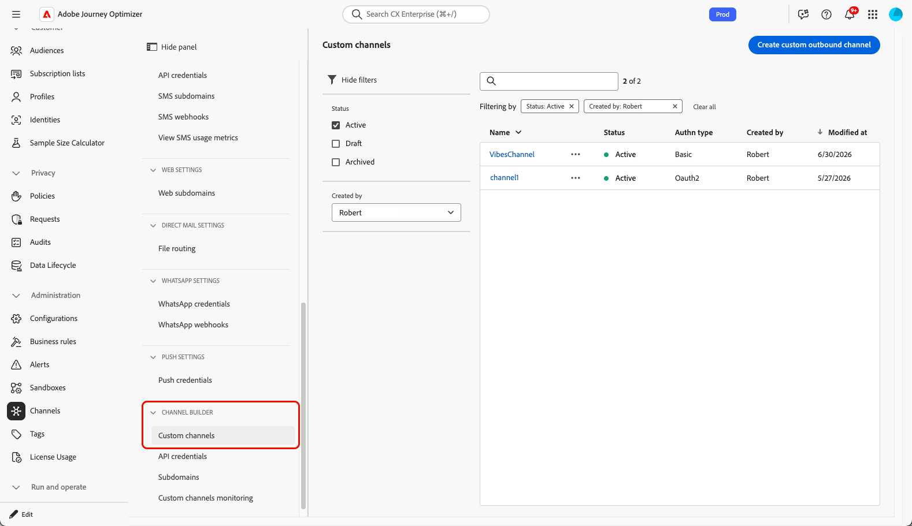
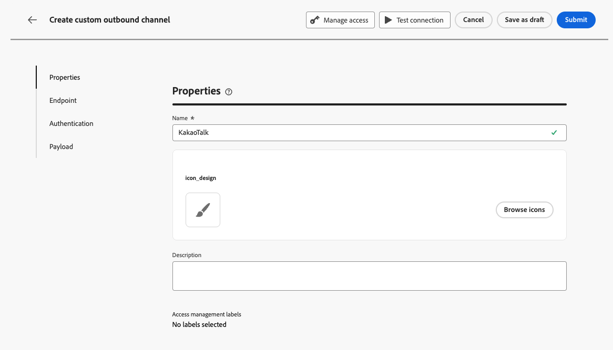
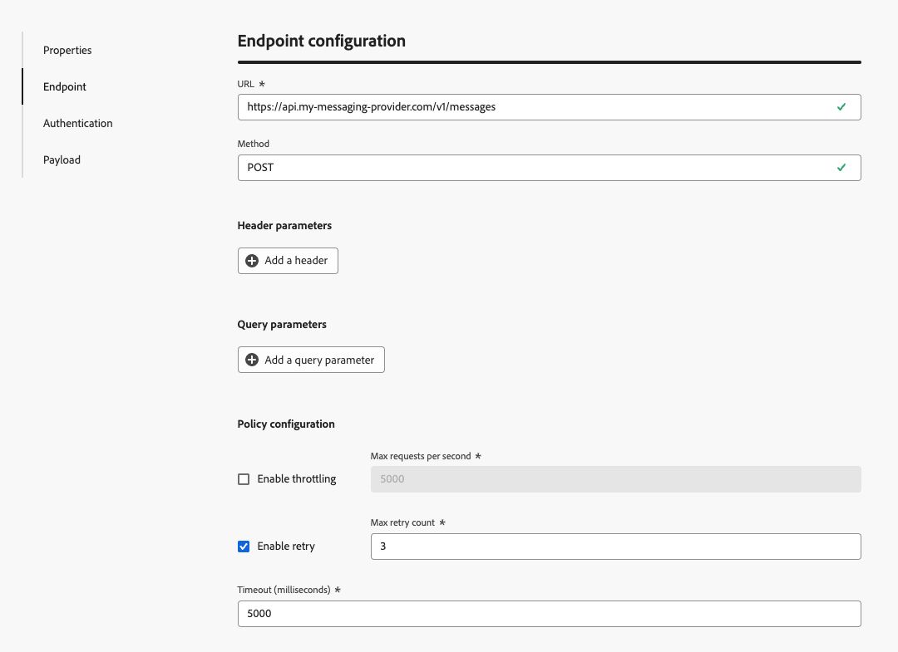
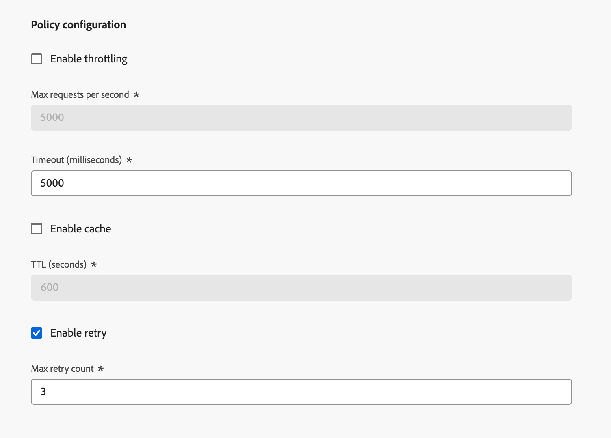

# Set up a custom channel {#create-custom-channel}

>[!BEGINSHADEBOX]

**On this page:** Learn how to create a custom channel in Adobe Journey Optimizer using the Channel Builder, by defining the endpoint URL, headers, authentication, throttling policy, and message payload structure.

>[!ENDSHADEBOX]

>[!CONTEXTUALHELP]
>id="ajo_custom_channel_settings"
>title="About custom channels"
>abstract="A custom channel lets Adobe Journey Optimizer send personalized messages to an external system through your own API endpoint. Define the general properties, endpoint, authentication, and payload, then test and activate your new custom channel. Once done, you can use it when creating a channel configuration so marketers can use it in journeys and campaigns."
>additional-url="<https://experienceleague.adobe.com/docs/journey-optimizer/using/custom-channel/get-started-custom-channel.html>" text="Get started with custom channels"

<!--Contextual help final location TBC (here or in Settings subsection-->

To be able to use a custom channel in campaigns and journeys, an administrator must first create the channel. This involves defining the endpoint, authentication, throttling policy, and message payload structure.

The **Channel Builder** section is the central interface for defining new custom channels. <!--It is accessible to users with the **[!UICONTROL Administrator]** role. -->It enables you to create and configure custom channels, but also manage API credentials, and delegate subdomains.

>[!IMPORTANT]
>
>To access the Channel Builder, create and manage custom channels, you must have the **View custom channels** and **Manage custom channels** permissions granted. <!--[Learn more](../administration/high-low-permissions.md)--> Learn how to manage permissions in [this section](../administration/permissions.md).

## Access and manage custom channels {#access-channel-builder}

To access the **Channel Builder** and manage your custom channels, follow the steps below.

1. Go to **[!UICONTROL Administration]** > **[!UICONTROL Channels]** in the left navigation rail.

1. Select **[!UICONTROL Custom channels]** under the **[!UICONTROL Channel builder]** section.

   {width="70%"}

1. The inventory lists all custom channels in your sandbox, including their current status and the authentification type used to connect to the external endpoint.

1. You can filter the custom channels by status (**Draft**, **Active**, or **Archived**), who created them, and search by name.

1. To edit a channel, click its name in the inventory, make your changes, and save. For active channels, you can only edit certain fields - [learn more](#test-activate).

   >[!CAUTION]
   >
   >Modifying throttling or retry settings on an active channel takes effect immediately for all in-flight and future executions.

1. To archive a channel, open it from the inventory and click **[!UICONTROL Archive]**.

   Archiving an active channel removes it from all selection drop-downs — campaign action selector, journey actions palette, orchestrated campaigns channel list, channel configurations, and content templates. Existing journeys and campaigns that already use the channel continue to function normally.

## Create a custom channel {#create-channel}

To create a new custom channel, follow the steps below.

1. Click the **[!UICONTROL Create custom channel]** button to open the channel creation form. Start by defining the general settings for your custom channel.

   {width="70%"}

1. In the **[!UICONTROL Properties]** section, enter a **[!UICONTROL Name]** for your custom channel. This name will appear in the journeys canvas, campaign action selector, and orchestrated campaigns channel list.

   >[!NOTE]
   >
   >The name must be unique, begin with a letter (A-Z), include only alpha-numeric characters or special chars ( _, ., -) and should be greater than 1 character.

1. You can select an icon from the default icon library, or select a SVG file from your computer.

   >[!NOTE]
   >
   >The file must be no larger than 150KB.

   This icon will be displayed next to the channel name in the journey canvas. If no icon is uploaded, the default icon is used.

1. Enter an optional **[!UICONTROL Description]**.

<!--
1. Optionally, assign **[!UICONTROL Access labels]** to restrict access to this channel based on data usage policies. Learn more
-->

## Set the endpoint configuration {#endpoint-configuration}

You must configure the endpoint, which is the HTTP URL of your external messaging system. [!DNL Journey Optimizer] sends a POST request to this endpoint with the personalized payload when a profile qualifies in a campaign or journey.

{width="70%"}

1. In the **[!UICONTROL Endpoint configuration]** section, enter the host **[!UICONTROL URL]** of your external messaging system.

   <!--The HTTP method to is currently set to **POST**.-->

   >[!IMPORTANT]
   >Your external messaging system must expose an HTTPS endpoint that [!DNL Journey Optimizer] can call via HTTP POST. The endpoint must:
   >
   >* Accept the payload format your channel defines (JSON).
   >* Support one of the authentication methods available in the Channel Builder. [Learn more](#authentication-settings)
   >* Return an HTTP 2xx response to acknowledge successful receipt of the request.

1. Add **[!UICONTROL Headers]** as needed. Headers are key-value pairs transmitted at the HTTP request level. They are sent alongside every request to your endpoint and are typically used for authentication tokens, content type specification, or any other metadata required by your external system.

   <!--At minimum, `Content-Type` and `Charset` are available as default headers.-->

   

   For each header, you can define whether its value is:

   * **[!UICONTROL Constant]** – A static value set once and included in every request. For example, you can define the`Content-Type`parameter with the value `application/json` or the `Charset` parameter with the value `UTF-8`.
   * **[!UICONTROL Variable]** – If a default value is entered here, it is used unless overridden in the channel configuration. For example, you can define a variable for the user ID that is resolved at runtime. [Learn more](custom-channel-configuration.md) <!--From Custom actions section: For these parameters, you can define where to get this information (example: events, data sources), pass values manually or use the advanced expression editor for advanced use cases. Advanced uses cases can be data manipulation and other function usage. Refer to this [page](expression/expressionadvanced.md).-->

1. Optionally, add **[!UICONTROL Query parameters]** using the same constant/variable pattern. Query parameters are appended to the endpoint URL at delivery time. Constant parameters are always added with the same value; variable parameters are resolved at send time, for example to pass a user identifier from the profile.

   {width="70%"}

1. In the **[!UICONTROL Policy configuration]** section, define how [!DNL Journey Optimizer] handles request throughput and failures. This is important to ensure that your external system can handle the volume of requests and to avoid overwhelming it.

   

   * **[!UICONTROL Enable throttling]** – Disabled by default. Set the maximum number of requests per second (default: **5,000c**). Once the limit is reached, requests are queued and sent as soon as possible.
   * **[!UICONTROL Enable retry]** – Enabled by default. Set the maximum retry count (default: **3**, configurable range: 0–10) for failed requests. This helps to avoid overwhelming the endpoint during transient failures.
   * **[!UICONTROL Timeout]** – Default: **5,000 milliseconds**. Set the maximum time to wait for a response from the endpoint before considering the request failed.
   <!--* **[!UICONTROL Enable cache]** – Disabled by default. Set the caching duration (default TTL: **600 seconds**). After the TTL (Time To Live) expires, the next request is sent to the endpoint. Caching is useful for endpoints that return the same response for identical requests, reducing load and improving performance.-->

## Authentication settings {#authentication-settings}

>[!CONTEXTUALHELP]
>id="ajo_custom_channel_authentication"
>title="Define the authentication type"
>abstract="Authentication ensures that only authorized requests are sent to your external messaging system. You can choose from several authentication methods, including API Key, Basic Auth, and OAuth 2.0. Upon activation, Adobe Journey Optimizer automatically generates an initial set of API credentials for the channel, which can be managed in the API credentials inventory. However, even if you can change the credentials later, you must provide the authentication details here to test the connection to your endpoint before activating the channel."
>additional-url="<https://experienceleague.adobe.com/docs/journey-optimizer/using/custom-channel/custom-channel-api-credentials.html>" text="Learn more about API credentials"

Select the **[!UICONTROL Authentication type]** that you need to use for this channel. The available options depend on the authentication methods supported by your external messaging system.

{width="70%"}

Provide the authentication details as required by your endpoint.

* **[!UICONTROL None]** – The request is sent without credentials.
* **[!UICONTROL API Key]** – Provide the key name, value, and location (query parameter or header).
* **[!UICONTROL Basic auth]** – Provide a username and password.
* **[!UICONTROL OAuth 2.0]** – Configure the payload for OAuth 2.0 authentication.
<!--* **[!UICONTROL Custom]** – Define the authentication configuration using a JSON payload.-->

When the authentication type is anything other than **None**, [!DNL Journey Optimizer] automatically generates an initial set of API credentials for this channel when it is activated. You can change these credentials and create new ones in the API credentials inventory. [Learn more](custom-channel-api-credentials.md) <!--TBC-->

However, the authentication details are needed here to test the connection to your endpoint before activating the channel. A **[!UICONTROL Test connection]** button is available to validate the authentication setup. [Learn more](#test-activate)

## Payload configuration {#payload-configuration}

>[!CONTEXTUALHELP]
>id="ajo_custom_channel_payload_config"
>title="Enable field for channel configuration"
>abstract="If enabled, the fields in this column appear in the channel configuration, allowing administrators to set different values per configuration (for example, a different sender ID per brand or region). This is useful for fields that may vary based on the context of the campaign or journey, such as sender information or message templates."
>additional-url="<https://experienceleague.adobe.com/docs/journey-optimizer/using/custom-channel/custom-channel-config.html>" text="Configure dynamic parameters in the custom channel configuration"

<!--Create a page on Custom channel config to explain how to use the payload in a channel configuration.-->

The payload is sent to the endpoint when a profile qualifies in a campaign or journey.

In the payload configuration, define the structure of the message payload and which fields marketers can author and personalize.

1. Click **[!UICONTROL Define payload]**, and choose how to define the payload:

   * **[!UICONTROL Paste sample JSON payload]** – Paste a representative JSON object, and [!DNL Journey Optimizer] automatically infers a schema from it.
   * **[!UICONTROL Import JSON schema]** (Coming soon) – Upload a complete JSON schema file.

      >[!AVAILABILITY]
      >
      >This capability is not available yet. It will be added in a future release.

1. After the schema is generated, [!DNL Journey Optimizer] displays all detected fields in a form view.

    

1. For each field, configure the following settings:

   | Setting | Description |
   | --- | --- |
   | **[!UICONTROL Default value]** | Optional. Used if no personalized value is provided at authoring time. |
   | **[!UICONTROL Type]** | Read-only, derived from the payload. Supported types: `string`, `integer`, `decimal`, `boolean`, `dateTime`, `dateTimeOnly`, `dateOnly`, `listObject`, `listString`, `listInteger`, `listDecimal`, `listBoolean`, `listDateTime`, `listDateTimeOnly`, `listDateOnly`. |
   | **[!UICONTROL Required]** | If enabled, the field must have a value when the channel is used in a campaign or journey. Missing required fields trigger a validation error that prevents activation. |
   | **[!UICONTROL Channel config]** | If enabled, the field appears in the channel configuration, allowing administrators to set different values per configuration (for example, a different sender ID per brand or region). [Learn how](custom-channel-configuration.md) |

   Nested fields are represented using dot notation (for example, `image.id`).<!--TBC-->

## Test and activate {#test-activate}

While the channel is in **[!UICONTROL Draft]** status, use the **[!UICONTROL Test connection]** button on top of the screen to send a test request to your endpoint and validate the end-to-end connection.

{width="70%"}

Check your external system's logs to confirm that the request was received with the expected authentication and payload.

Once the test is successful, you can save or activate the channel.

* Click **[!UICONTROL Save as draft]** to save your progress without making the channel available.
* Click **[!UICONTROL Activate]** to make the channel available for use in channel configurations, campaigns, and journeys.

>[!IMPORTANT]
>
>After a channel is activated, only the following fields remain editable: name, description, icon, throttling, and retry configuration. Endpoint URL, headers, query parameters, authentication, and payload structure are locked.<!--TBC-->

<!--TBC: An activated channel can be **archived** (hidden from all selection drop-downs while existing journeys and campaigns continue to function), but it cannot be **deleted**. Deletion is only possible while the channel is in **[!UICONTROL Draft]** status.TBC-->

## Next steps {#next-steps}

Your custom channel is now created. Complete the configuration by following the remaining steps:

* [Set up API credentials](custom-channel-api-credentials.md) (if the channel uses authentication)
* [Delegate a subdomain](custom-channel-subdomains.md) (optional — required for link tracking)
* [Create a channel configuration](custom-channel-configuration.md)
