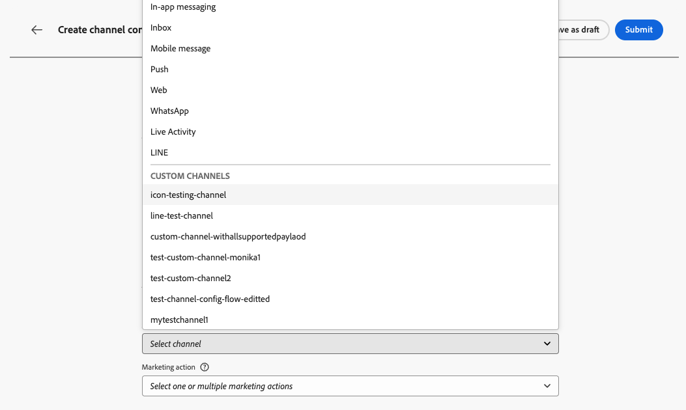
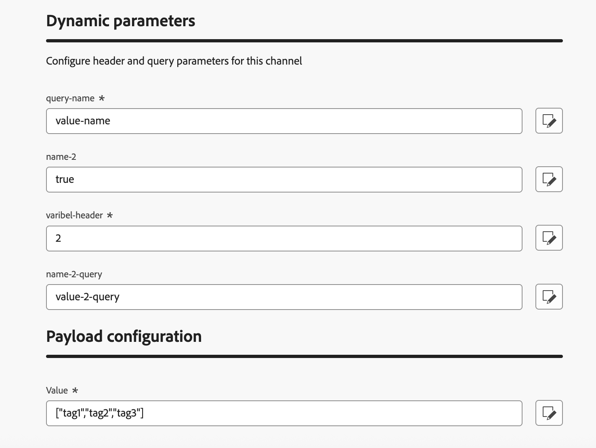

# Create a channel configuration {#create-channel-config}

>[!BEGINSHADEBOX]

**On this page:** Learn how to create a channel configuration for a custom channel in Adobe Journey Optimizer, linking it to API credentials, an optional subdomain, and payload defaults, so marketers can select it when building campaigns and journeys.

>[!ENDSHADEBOX]

A channel configuration links your custom channel to a named, reusable preset that marketers select when building campaigns and journeys.

To create a channel configuration for a custom channel, follow the steps below.

1. Go to **[!UICONTROL Administration]** > **[!UICONTROL Channels]** > **[!UICONTROL Channel configurations]** and click **[!UICONTROL Create channel configuration]**. Learn more on [creating a channel configuration](../configuration/channel-surfaces.md).

1. From the **[!UICONTROL Select channel]** drop-down list, select one of your activated custom channels.

   {width="100%"}

1. If the selected channel uses authentication (type is not **None**), the **[!UICONTROL API credentials]** field appears. Select the credentials to use for this configuration. [Learn more on API credentials](custom-channel-api-credentials.md)

   {width="100%"}

1. If you have set up subdomains for custom channels in [!DNL Journey Optimizer], you can select a delegated subdomain to use for tracking links present in the payload for this configuration. [Learn how to delegate a subdomain](custom-channel-subdomains.md)

1. If the selected channel has headers or query parameters [defined as variable](create-custom-channel.md#endpoint-configuration) for the endpoint URL, the **[!UICONTROL Dynamic parameters]** section appears.

   Enter the value for each parameter. You can use the personalization editor to inject dynamic values (for example, a user identifier resolved from the profile). This allows you to customize the request for each recipient based on their profile data.

   {width="100%"}

1. If the custom channel has payload fields with the **[!UICONTROL Channel config]** checkbox enabled, those fields appear in the **[!UICONTROL Payload configuration]** section. [Learn more](create-custom-channel.md#payload-configuration)

   {width="100%"}

   Configure a value for each field as appropriate for this configuration. This is useful for fields that may vary based on the context of the campaign or journey, such as sender information or message templates.

1. For orchestrated campaigns, complete the **[!UICONTROL Execution details]** section to map profile dimensions and specify the execution address.

   {width="80%"}

1. Click **[!UICONTROL Submit]** to save and activate the channel configuration.

<!--
>[!CAUTION]
>
>If your organization uses approval policies, you may need to request approval before activating journeys or campaigns that use this channel configuration. [Learn more](../test-approve/gs-approval.md)
-->

## Next steps {#next-steps}

Your custom channel is now fully configured. Marketers can start using it to build customer experiences:

* [Create custom channel experiences](create-custom-experience.md)
* [Test your custom channel](test-custom-channel.md)
* [Monitor custom channels](configure-custom-channel.md)
