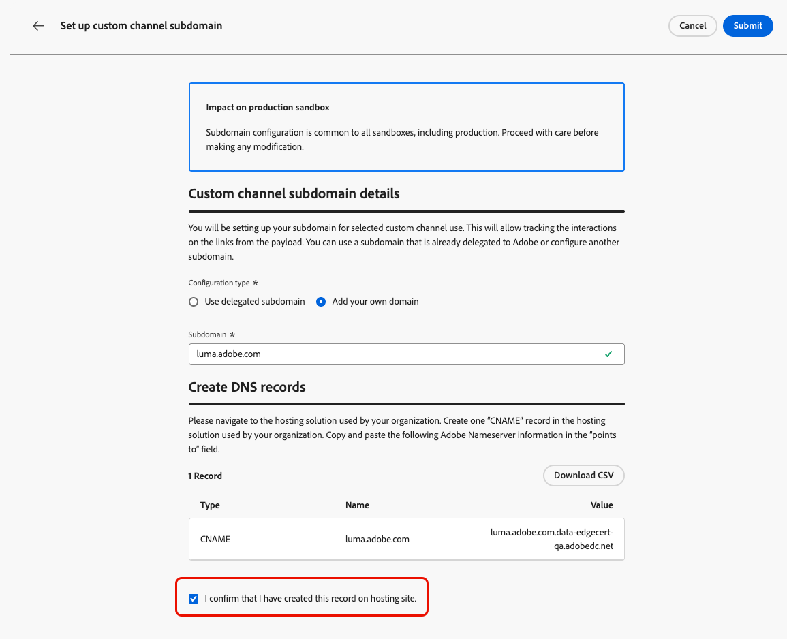

# Configure custom channel subdomains {#custom-channel-subdomains}

>[!BEGINSHADEBOX]

**On this page:** Learn how to set up custom channel subdomains in Adobe Journey Optimizer to enable link tracking in your messages, either by using an existing delegated subdomain or configuring a new one with a DNS record.

>[!ENDSHADEBOX]

>[!CONTEXTUALHELP]
>id="ajo_admin_subdomain_custom_channel"
>title="Delegate a custom channel subdomain"
>abstract="You must configure a subdomain to use for your custom channel messages, as you need this subdomain to create a custom channel configuration. You can use a subdomain already delegated to Adobe, or configure a new subdomain."
>additional-url="https://experienceleague.adobe.com/en/docs/journey-optimizer/using/custom-channel/custom-channel-configuration" text="Configure a custom channel"

>[!CONTEXTUALHELP]
>id="ajo_admin_config_custom_channel_subdomain"
>title="Select a custom channel subdomain"
>abstract="To be able to create a custom channel configuration, make sure you have previously configured at least one custom channel subdomain to pick from the Subdomain name list."
>additional-url="https://experienceleague.adobe.com/en/docs/journey-optimizer/using/custom-channel/custom-channel-configuration" text="Configure a custom channel"

## Get started with custom channel subdomains {#gs-custom-channel-subdomains}

To enable link tracking in your custom channel messages, you must set up the subdomain you will select when [creating a custom channel configuration](custom-channel-configuration.md#subdomain-delegation).

You can either use a subdomain that is already delegated to Adobe, or configure another subdomain. Learn more about delegating subdomains to Adobe in [this section](../configuration/delegate-subdomain.md).

Custom channel subdomain configuration is shared between all environments. Therefore, any modification to a custom channel subdomain also impacts other production sandboxes.

<!--
TBC
>[!NOTE]
>
>To access and edit custom channel subdomains, you must have the **[!UICONTROL Manage Custom Channel Subdomains]** permission on the production sandbox. Learn more about permissions in [this section](../administration/high-low-permissions.md).
-->
## Use an existing subdomain {#custom-channel-use-existing-subdomain}

To use a subdomain that is already delegated to Adobe, follow the steps below.

1. Browse to the **[!UICONTROL Administration]** > **[!UICONTROL Channels]** menu, and select **[!UICONTROL Channel Builder]** > **[!UICONTROL Subdomains]**.

    {width="100%"}

1. Click **[!UICONTROL Create custom channel subdomain]**.

1. Select **[!UICONTROL Use delegated subdomain]** from the **[!UICONTROL Configuration type]** section.

    {width="100%"}

1. Enter the prefix that will display in your custom channel URL. Only alpha-numeric characters and hyphens are allowed.

    The prefix is used to create a unique subdomain for this custom channel. For example, if you enter `promo` and select the subdomain `luma.com`, the resulting subdomain will be `promo.luma.com`.

    >[!CAUTION]
    >
    >Do not use `cdn` or `data` prefixes as these are reserved for internal use. Other restricted or reserved prefixes such as `dmarc` or `spf` should also be avoided.

1. Select a delegated subdomain from the list.

    You cannot select a subdomain that is already used as a custom channel subdomain.

    >[!CAUTION]
    >
    >If you select a domain that was delegated to Adobe using the [CNAME method](../configuration/delegate-subdomain.md#cname-subdomain-setup), you must create the DNS record on your hosting platform. To generate the DNS record, the process is the same as when you configure a new custom channel subdomain. Learn how in [this section](#custom-channel-configure-new-subdomain).

1. Click **[!UICONTROL Submit]**.

1. Once submitted, the subdomain displays in the list with the **[!UICONTROL Processing]** status. For more on subdomains' statuses, refer to [this section](../configuration/delegate-subdomain.md#access-delegated-subdomains).

    Before being able to use that subdomain to send messages, you must wait until Adobe performs the required checks, which can take **up to 4 hours**.

1. Once the checks are successful, the subdomain gets the **[!UICONTROL Success]** status. It is ready to be used to create custom channel configurations.

## Configure a new subdomain {#custom-channel-configure-new-subdomain}

>[!CONTEXTUALHELP]
>id="ajo_admin_custom_channel_subdomain_dns"
>title="Generate the matching DNS record"
>abstract="To configure a new custom channel subdomain, you need to copy the Adobe nameserver information displayed in the Journey Optimizer interface and paste it into your domain-hosting solution to generate the matching DNS record. Once the checks are successful, the subdomain is ready to be used to create custom channel configurations."

To configure a new subdomain, follow the steps below.

1. Browse to the **[!UICONTROL Administration]** > **[!UICONTROL Channels]** menu, then select **[!UICONTROL Channel Builder]** > **[!UICONTROL Subdomains]**.

1. Click **[!UICONTROL Create custom channel subdomain]**.

1. Select **[!UICONTROL Add your own domain]** from the **[!UICONTROL Configuration type]** section.

    {width="70%"}

1. Specify the subdomain to delegate.

    >[!CAUTION]
    >
    >* You cannot use an existing custom channel subdomain.
    >
    >* Capital letters are not allowed in subdomains.

    Delegating an invalid subdomain to Adobe is not allowed. Make sure you enter a valid subdomain which is owned by your organization, such as marketing.yourcompany.com.

    Multi-level subdomains (of the same parent domain) are supported. For example, you can use 'custom.marketing.yourcompany.com'.

1. The record to be placed in your DNS servers displays. Copy this record, or download a CSV file, then navigate to your domain-hosting solution to generate the matching DNS record.

1. Make sure that DNS record has been generated into your domain-hosting solution. If everything is configured properly, check the box "I confirm...", then click **[!UICONTROL Submit]**.

    

    When you configure a new custom channel subdomain, it always points to a CNAME record.

1. Once the subdomain delegation has been submitted, the subdomain displays in the list with the **[!UICONTROL Processing]** status. For more on subdomains' statuses, refer to [this section](../configuration/delegate-subdomain.md#access-delegated-subdomains).

Before using a subdomain to send custom channel messages, you must wait until Adobe performs the required checks, which can take up to 4 hours. Once the checks are successful, the subdomain gets the **[!UICONTROL Success]** status. It is ready to be used to create custom channel configurations.

Note that the subdomain will be marked as **[!UICONTROL Failed]** if you fail to create the validation record on your hosting solution.

<!--

Any specific guardrails to add? If so, can we link to email subdomain guardrails? journey-optimizer.en/help/using/configuration/delegate-subdomain.md#guardrails

Otherwise use the following from SMS subdomains?

## Guardrails {#guardrails}

Currently, the [!DNL Journey Optimizer] user interface does not support the deletion or undelegation of custom channel subdomains once they have been set up.

However, when testing features within [!DNL Journey Optimizer], it may be necessary to create a custom channel subdomain. Once the testing is complete, this can lead to cluttered environments with unnecessary configurations as the UI does not allow for removing or undelegating custom channel subdomains.

Here are some recommended steps and considerations:

* As a best practice, maintain a tidy environment by only creating necessary components and configurations.
* In situations where there is a business impact, contact your Adobe representative who may be able to assist with the removal/undelegation of the custom channel subdomain. [Learn more](#undelegate-subdomain)
* If further assistance is required, reach out to Adobe for guidance on managing your instance effectively.

## Undelegate a subdomain {#undelegate-subdomain}

If you wish to undelegate a custom channel subdomain, reach out to your Adobe representative with the subdomain you want to undelegate.

If the custom channel subdomain points to a CNAME record, you can delete the CNAME DNS record that you created for the custom channel subdomain from your hosting solution (but do not delete the original email subdomain if any).

>[!NOTE]
>
>A custom channel subdomain can point to a CNAME record because it was either an [existing subdomain](#custom-channel-use-existing-subdomain) delegated to Adobe using the [CNAME method](../configuration/delegate-subdomain.md#cname-subdomain-setup), or a [new custom channel subdomain](#custom-channel-configure-new-subdomain) that you configured.

After your request is handled by Adobe, the undelegated domain is no longer displayed on the subdomain inventory page.
-->

## Next steps {#next-steps}

* [Create a channel configuration](custom-channel-configuration.md) to link your custom channel to a subdomain, credentials, and payload defaults that marketers will select in campaigns and journeys.
