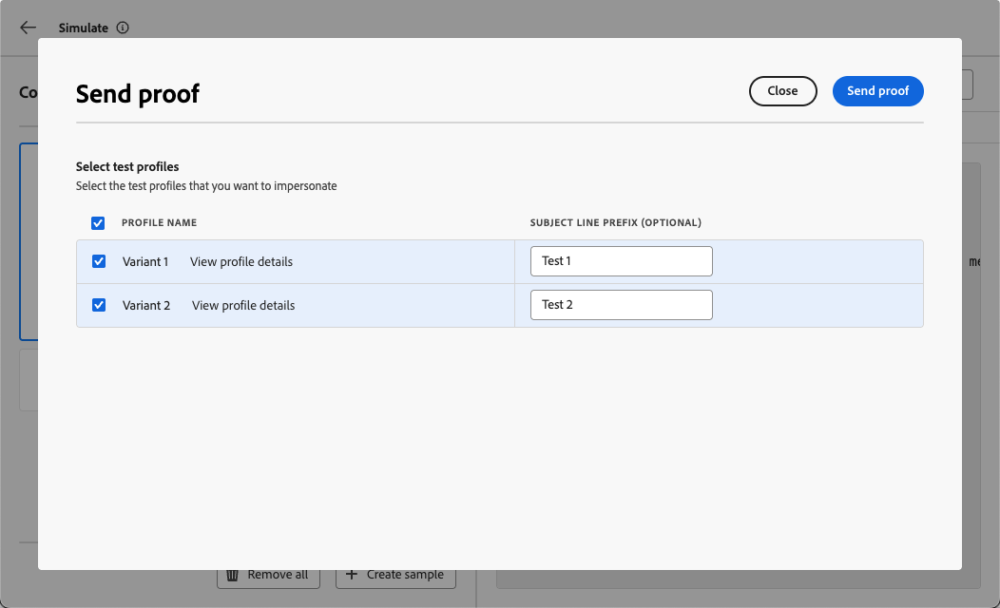

# Test your custom channel {#test-custom-channel}

>[!BEGINSHADEBOX]

**On this page:** Learn how to validate your custom channel before going live, by testing the endpoint connection from the Channel Builder, simulating content with test profiles, and sending proofs.

>[!ENDSHADEBOX]

Before activating a journey or campaign that uses a custom channel, validate that your endpoint is reachable, that authentication works, and that personalization tokens resolve correctly for your target profiles.

## Test the connection from the Channel Builder {#test-connection}

While a custom channel is in **[!UICONTROL Draft]** status, use the **[!UICONTROL Test]** button in the Channel Builder to send a test request to your endpoint and validate the end-to-end connection before activating. [Learn more](create-custom-channel.md#test-connection)

{width="70%"}

This test confirms:

* That the endpoint is reachable from [!DNL Journey Optimizer]'s outbound IPs.
* That the configured authentication credentials are valid.
* That the endpoint returns an HTTP 2xx response.

Check your external system's logs to confirm that the test request was received with the expected headers and payload structure.

## Preview and test your custom channel experience {#preview-test}

Once you have created a custom channel experience, you can validate the end-to-end delivery of personalized content before activating a journey or campaign.

Use the following features to preview and test your custom channel payload and verify the end-to-end experience.

### Simulate content with test profiles {#simulate-content}

The **[!UICONTROL Simulate content]** feature resolves personalization expressions against test profiles so you can inspect the exact payload that would be sent before any real message is delivered.

1. From the journey action or the campaign edition screen, click **[!UICONTROL Simulate content]**.

1. Click **[!UICONTROL Add test profile]** and select one or more profiles. [Learn how to create test profiles](../audience/creating-test-profiles.md)

1. Review the resolved payload in the preview panel. For each test profile, verify:

   * All personalization tokens (for example, `{{profile.person.name.firstName}}`) have been replaced with the expected values from the profile.
   * No unresolved tokens remain (shown as empty strings or literal `{{...}}` syntax).
   * Required payload fields are populated.
   * Helper functions produce the expected formatted output.

   {width="70%"}

>[!TIP]
>
>Test with multiple profiles representing different audience segments to catch edge cases — for example, profiles with missing optional attributes, non-Latin character sets, or null values in personalized fields.

Learn more on previewing and testing content in [this section](../content-management/preview-test.md).

### Send a proof {#send-proof}

To validate end-to-end delivery before activating, send a proof to a set of test recipients:

1. In the **[!UICONTROL Simulate content]** panel, switch to the **[!UICONTROL Send proof]** tab.

1. Add the profiles you want to use. You can upload a CSV file with profiles that are not defined as test profiles in [!DNL Journey Optimizer]. Learn more on [creating test profiles](../audience/creating-test-profiles.md)

   {width="70%"}

1. Click **[!UICONTROL Send proof]**. [!DNL Journey Optimizer] calls your external endpoint with the personalized payload for each selected profile.

1. Check your external system to confirm the proof payloads were received. For messaging channels (for example, WeChat or Kakao Talk), verify that the message appears on the target device or messaging app.

The proof result is displayed using the same validation patterns as email proofing: required fields, type mismatches, and schema validation errors are surfaced before the proof is sent.

Learn more on sending proofs in [this section](../content-management/proofs.md)

### Test in journey test mode {#test-journey}

For end-to-end journey validation, activate the journey in **[!UICONTROL Test mode]**:

1. From the journey canvas, click **[!UICONTROL Test]** in the top-right area.

1. Configure the trigger event or select a test profile for an audience-triggered journey.

1. Click **[!UICONTROL Trigger an event]** or let the profile enter through a **[!UICONTROL Read Audience]** activity.

1. Observe the flow in the canvas. When a profile reaches the custom channel action node, [!DNL Journey Optimizer] calls your external endpoint with the personalized payload.

1. Check your external system's logs to confirm the request was received correctly.

1. Click **[!UICONTROL Stop test]** when done.

Learn more on testing journeys in test mode in [this section](../building-journeys/testing-the-journey.md).

### Simulate a journey {#simulate-journey}

[!DNL Journey Optimizer]'s **Simulation** mode lets you validate your journey end-to-end using simulated users—temporary profile-like entities that do not persist in Adobe Experience Platform—without requiring pre-created test profiles.

For custom channels, simulation resolves personalization expressions and renders the payload preview for each simulated user, so you can verify that the correct content would be delivered before going live.

To simulate a journey using a custom channel:

1. From the journey canvas, click **[!UICONTROL Simulate]** in the top-right area.

1. Add simulated users manually or generate them using the AI-powered **[!UICONTROL Quick simulation]** option.

1. Configure any required entry events, then trigger the simulated users through the journey.

1. When a simulated user reaches the custom channel action node, inspect the resolved payload in the preview panel to confirm that personalization tokens and payload structure are correct.

>[!NOTE]
>
>Simulation is available for both draft and live journeys, and uses temporary simulated users that do not count toward profile quotas or real endpoint calls.

Learn more about journey simulation in [this section](../building-journeys/simulate-journey-gs.md).

### Pre-activation checklist {#checklist}

Before activating your journey or campaign, confirm the following:

* The connection test from the Channel Builder succeeded (endpoint reachable, authentication valid).
* Simulated payloads show expected values for all test profiles.
* No unresolved personalization tokens remain in the payload.
* All required payload fields are populated.
* A proof was sent and received correctly by your external system.
* Error paths on the journey action activity (if configured) handle failure scenarios as expected.

Once testing is complete, proceed to activate. [Learn how](create-custom-experience.md#activate)
