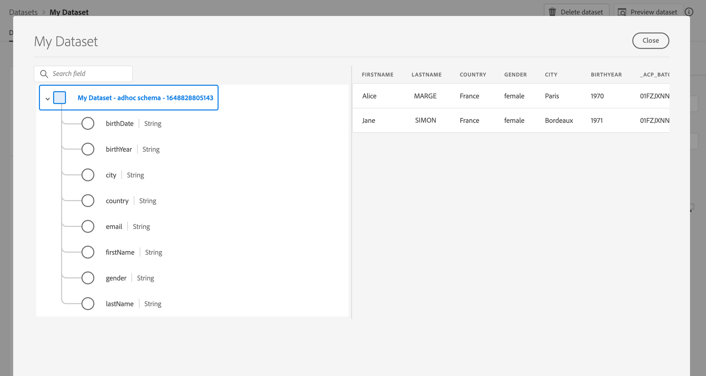

# Get Started with Datasets {#datasets-gs}

All data that is ingested into Adobe Experience Platform is persisted within the Data Lake as datasets. A dataset is a storage and management construct for a collection of data, typically a table, that contains a schema (columns) and fields (rows).

## Access datasets{#access-datasets}

The **Datasets** workspace in [!DNL Adobe Journey Optimizer] user interface allows you to explore data and create datasets. 

Select **Datasets** in the left-navigation to open the Datasets dashboard.

Adding data to [!DNL Adobe Experience Platform] is the foundation to building a Profile. You will then be able to leverage profiles in [!DNL Adobe Journey Optimizer]. First define schemas, use ETL tools to prepare and standardize your data, then create datasets based on your schemas.

Select the **Browse** tab to display the list of all available datasets for your organization. Details are displayed for each listed dataset, including its name, the schema the dataset adheres to, and status of the most recent ingestion run.

By default, only the datasets that you have ingested into are shown. If you want to see the system-generated datasets, enable the **Show system datasets** toggle from the filter.

Select the name of a dataset to access its Dataset activity screen and see details of the dataset you selected. The activity tab includes a graph visualizing the rate of messages being consumed as well as a list of successful and failed batches.

Here are the different datasets available:

**Reporting**

* _Reporting - Message Feedback Event Dataset_: Message delivery logs. Information on all message delivery from Journey Optimizer for reporting and segment creation purposes. Feedback from Email ISPs on bounces is also recorded in this dataset.
* _Reporting - Email Tracking Experience Event Dataset_: Interaction logs for Email channel which is used for reporting and segment creation purposes. Information stored informs on actions performed by the end-user on email (opens, clicks, etc).
* _Reporting - Push Tracking Experience Event Dataset_: Interaction logs for Push channel which is used for reporting and segment creation purposes. Information stored informs on actions performed by the end-user on push notifications.
* _Reporting - Journey Step Event_: Captures All Journey Step Experience Events generated from Journey Optimizer to be consumed by services like Reporting. Also critical for building reports in Customer Journey Analytics for YoY analysis. Tied to a Journey Metadata.
* _Reporting - Journeys_: Metadata dataset housing information of each step in a journey.
* _Reporting - BCC_: Feedback Event Dataset which stores the delivery logs for BCC emails. To be used for reporting purposes.

**Consent**

* _Consent Service Dataset_: stores consent information of a profile.

**Intelligent Services**

* _Send-Time Optimization Scores / Engagement Scores_: Output scores of Journey AI.

To view the complete list of fields and attributes for each schema, consult the [Journey Optimizer schema dictionary](https://experienceleague.adobe.com/tools/ajo-schemas/schema-dictionary.html){target="_blank"}.

## Preview datasets{#preview-datasets}

From the Dataset activity screen, select **Preview dataset** near the top-right corner of your screen to preview the most recent successful batch in this dataset. When a dataset is empty, the preview link is deactivated.

## Create datasets{#create-datasets}

To create a new dataset, start by selecting **Create dataset** in the Datasets dashboard.

You can:

* Create dataset from schema. [Learn more in this documentation](https://experienceleague.adobe.com/docs/experience-platform/catalog/datasets/user-guide.html#schema){target="_blank"}
* Create dataset from CSV file. [Learn more in this documentation](https://experienceleague.adobe.com/docs/experience-platform/ingestion/tutorials/map-a-csv-file.html){target="_blank"}

Watch this video to learn how to create a dataset, map it to a schema, add data to it, and confirm that the data has been ingested.

>[!VIDEO](https://video.tv.adobe.com/v/334293?quality=12)

## Data Governance

In a dataset, browse the **Data Governance** tab to check labels at the dataset and field level. Data Governance categorize data according to the type of policies that apply.

One of the core capabilities of [!DNL Adobe Experience Platform] is to bring data from multiple enterprise systems together to better allow marketers to identify, understand, and engage customers. This data may be subject to usage restrictions defined by your organization or by legal regulations. It is therefore important to ensure that your data operations are compliant with data usage policies.

[!DNL Adobe Experience Platform Data Governance] allows you to manage customer data and ensure compliance with regulations, restrictions, and policies applicable to data use. It plays a key role within Experience Platform at various levels, including cataloging, data lineage, data usage labeling, data usage policies, and controlling usage of data for marketing actions.

Learn more about Data Governance and data usage labels in the [Data Governance documentation](https://experienceleague.adobe.com/docs/experience-platform/data-governance/labels/user-guide.html){target="_blank"}

## Samples and use cases{#uc-datasets}

Learn how to create a schema, a dataset and ingest data to add Test profiles in Adobe Journey Optimizer in [this end-to-end sample](../segment/creating-test-profiles.md)

Learn more about dataset creation in [Adobe Experience Platform documentation](https://experienceleague.adobe.com/docs/experience-platform/catalog/datasets/overview.html){target="_blank"}.

Learn how to use Datasets UI in the [Data Ingestion overview documentation](https://experienceleague.adobe.com/docs/experience-platform/ingestion/home.html){target="_blank"}.

A list of use cases with query examples is available [here](../data/datasets-query-examples.md).

**See also**

* [Streaming ingestion overview](https://experienceleague.adobe.com/docs/experience-platform/ingestion/streaming/overview.html){target="_blank"}
* [Ingest data into Adobe Experience Platform](https://experienceleague.adobe.com/docs/experience-platform/ingestion/tutorials/ingest-batch-data.html){target="_blank"}
