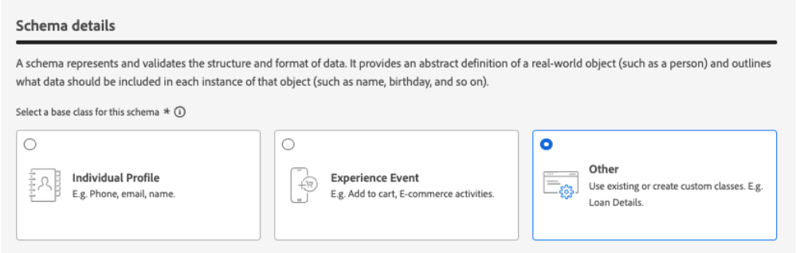
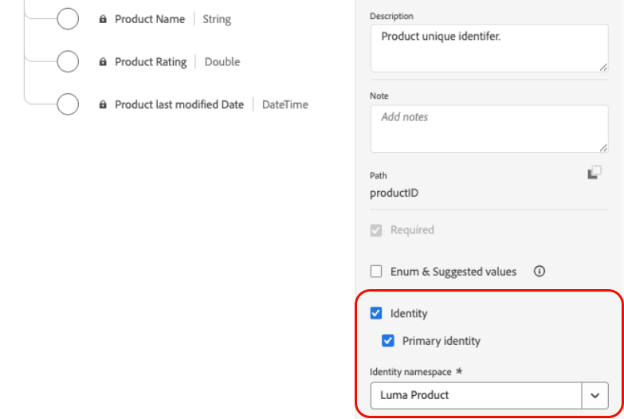
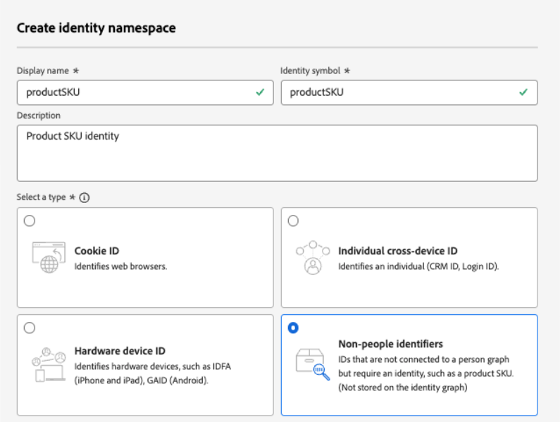
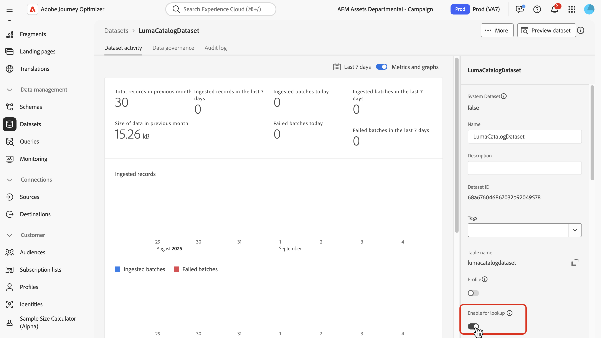
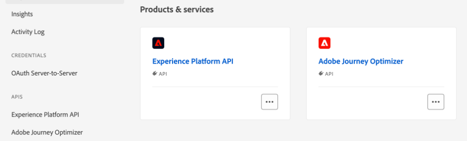
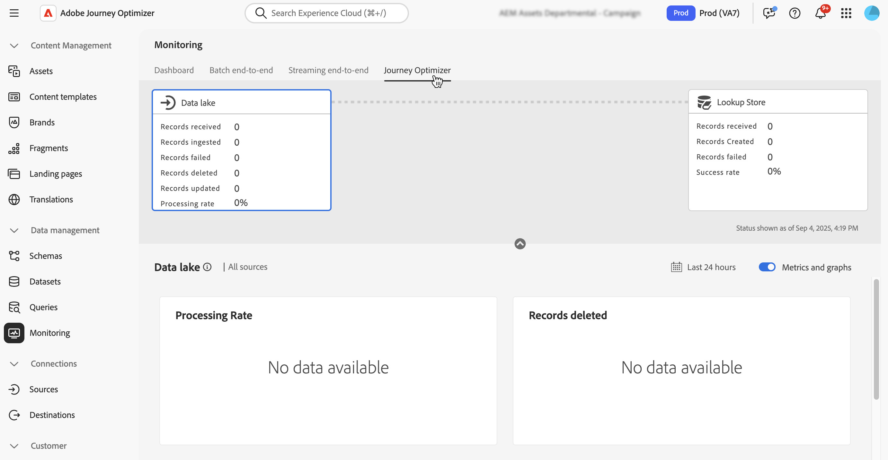

# Use Adobe Experience Platform data {#aep-data}

>[!CONTEXTUALHELP]
>id="lookup-aep-data"
>title="Enable for lookup"
>abstract="Enabling a dataset for lookup allows you to leverage its data within Journey Optimizer personalization, Decisioning and journey orchestration capabilities."

[!DNL Journey Optimizer] allows you to leverage data from [!DNL Adobe Experience Platform] data with personalization, Decisioning, and journey orchestration capabilities. To do this, record-based datasets needed for lookup personalization must first be enabled for the lookup service as described below.

>[!NOTE]
>
>The data lookup capability is only available for a set of organizations (Limited Availability). To gain access, contact your Adobe representative. Learn more about [availability labels](../rn/releases.md#availability-labels).

Learn more on how to access and work with datasets in this section : [Get started with datasets](../data/get-started-datasets.md)

## Must-read

### Guardrails & guidelines {#guidelines}

Before you begin, please review the following restrictions and guidelines:

* **No PII in datasets** – Datasets enabled for lookup should not contain any Personally Identifiable Information (PII).

* **Deletion risk** – Datasets used in personalization are not protected from deletion. You must keep track of which datasets are being used to ensure they are not removed.

* **Schema type** – Datasets must be associated with a schema that is **NOT** of Profile or Event type.

* **Keep the lookup toggle on** - Avoid repeatedly turning datasets on and off. Doing so can lead to unexpected indexing behavior. The best practice is to leave the dataset enabled for as long as you plan to use it for lookups.

* **Edge activation region** - Datasets enabled for lookup are available for inbound edge-based activation only in the region where the dataset's sandbox resides (for example, NLD2 or VA7). You can see the sandbox region in the UI next to the sandbox name.

* **Batch of data deletion** - Removing a batch of data from your dataset completely removes all matching keys from the lookup service. For example:

  **Batch 1**: Sku1, Sku2, Sku3  
  **Batch 2**: Sku1, Sku2, Sku3, Sku4, Sku5, Sku6  
  **Batch 3**: Sku7, Sku8, Sku9, Sku10  

  If you delete **Batch 1**, Sku1, Sku2, and Sku3 are removed from the lookup store. The resulting lookup data will then contain: Sku4, Sku5, Sku6, Sku7, Sku8, Sku9, Sku10.

* **No chained lookups** - Dataset lookups cannot be chained together. In other words, you cannot use the result of one lookup as a variable to then become the key to perform a second lookup.

### Entitlement for lookup service

| Feature Component | Limits | Notes |
| ------- | ------- | ------- |
| Enabled Lookup Datasets | Max 10 per organization | Maximum number of datasets that can be configured for lookup at any given time. This limit applies to the total combined number of lookup datasets across both production and development sandboxes within the customer instance. |
| Dataset Record Count | Up to 2 million records per dataset | Maximum number of records allowed in a single dataset, calculated as the total count across all batches within that dataset. |
| Record Size | Up to 2 KB per record | Default maximum record size supported. |
| Dataset Size | Up to 4 GB | Maximum size of an individual dataset, not the combined size across all datasets in a sandbox. The record count and dataset size limits are independent guardrails — both must be satisfied. |
| Dataset Frequency Updates | Up to 5 updates per day per dataset | Maximum frequency of update operations allowed for a single dataset per day. |

>[!NOTE]
>
>If additional volumes are needed beyond the guardrails listed above, please contact your Adobe representative.

## Enable a dataset for data lookup {#enable}

In order to leverage data from your dataset for personalization, you need to enable the dataset for lookup.

### Prerequisites {#prerequisites-enable}

The schema associated with your dataset that you wish to enable for lookup must be of record-type. The schema should NOT be of profile or event class. 

+++Example



+++

The schema must have a primary identity defined.

+++Example



+++

If a custom namespace was not yet defined, ensure that the identity is a non-person identifier.

+++Example



+++

### Enable the dataset for lookup in the dataset management interface

In the dataset management user interface, use the toggle to enable the dataset for lookup.  
 


### API Method

Follow the directions detailed in [this documentation](https://developer.adobe.com/journey-optimizer-apis/references/authentication/) to configure your environment to send API commands. 

#### Prerequisites

* The developer project must have the Adobe Journey Optimizer and Adobe Experience Platform APIs added to their project. 

    

* You must have manage datasets permission as part of your role.

* The schema for which the dataset is based on must contain a primary identity that can act as the lookup key. 

#### API call structure 

```shell

curl -s -XPATCH "https://platform.adobe.io/data/core/entity/lookup/dataSets/${DATASET_ID}/${ACTION}" \ -H "Authorization: Bearer ${ACCESS_TOKEN}" \ -H "x-api-key: ${API_KEY}" \ -H "x-gw-ims-org-id: ${IMS_ORG}" \ -H "x-sandbox-name: ${SANDBOX_NAME}" 

```

Where: 

* URL is `https://platform.adobe.io/data/core/entity/lookup/dataSets/${DATASET_ID}/${ACTION}`
* Dataset ID is the dataset for which you wish to enable. 
* Action is enable OR disable. 
* Access token can be retrieved from the developer console. 
* API key can be retrieved from the developer console. 
* IMS Org ID is your Adobe organization. 
* Sandbox Name is the sandbox name the dataset is in (i.e. prod, dev etc.). 

>[!NOTE]
>
>If you encounter the error below when attempting an API call to enable datasets, try removing the Adobe Journey Optimizer APIs from your developer console project and then re-adding them:
>
>`"error_code": "403003",`
>`"message": "Api Key is invalid"`

## Dataset monitoring

Once a dataset has been enabled for lookup, you can review the status of ingestion into the lookup service by going to the **[!UICONTROL Monitoring]** menu and selecting the **[!UICONTROL Journey Optimizer]** tab.

This process indicator helps in understanding when new batches of data are available in the lookup service.  



## Next steps

After a dataset has been enabled for lookup using an API call, you can use the data with [!DNL Journey Optimizer] personalization and Decisioning capabilities. For more information, refer to these sections:

* [Use Adobe Experience Platform data for personalization](../personalization/aep-data-perso.md)
* [Use Adobe Experience Platform data for decisioning](../experience-decisioning/aep-data-exd.md)
* [Use Adobe Experience Platform data for journey orchestration](../building-journeys/dataset-lookup.md)
