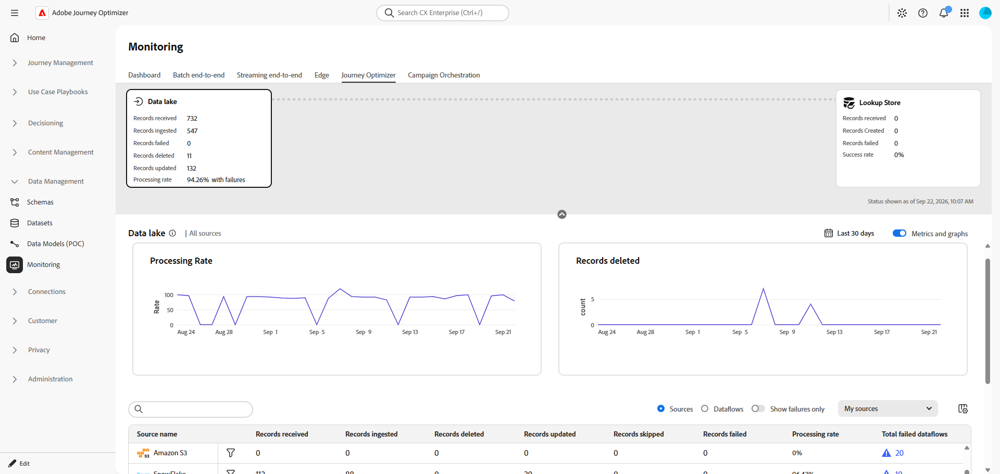
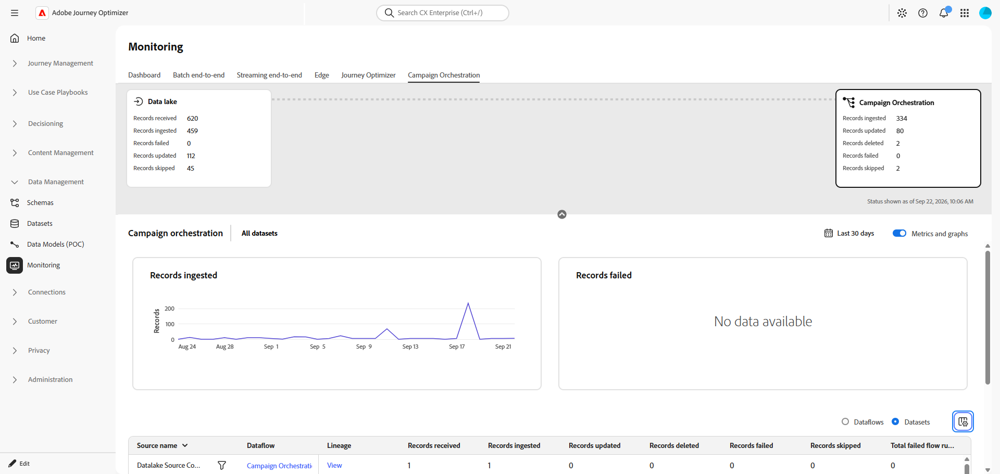

# Monitor data ingestion

Use the Monitoring workspace to review the movement of data through the ingestion pipeline. The workspace provides a high-level view of record processing and lets you investigate ingestion activity by source, dataflow, or dataset.

The monitoring views can help you identify records that were ingested, updated, deleted, skipped, or rejected, and compare activity across the ingestion stages.

## Journey Optimizer {#ajo}

Use the **Journey Optimizer** tab to review ingestion activity for Journey Optimizer data sources and understand the current processing status.

You can filter the monitoring results, change the time range, switch between dataflow and sources details, and inspect failed dataflow runs. Use these details to determine whether a discrepancy is limited to a source, dataflow or ingestion stage.

Start with the trend graphs to check whether ingestion is continuing over the selected period. Then use the detail table to compare records received with records ingested, updated, deleted, skipped, or failed. The table can be reviewed at either the dataflow or sources level, depending on the scope of the investigation.

➡️ For complete monitoring guidance, refer to the [Monitoring dashboard](https://experienceleague.adobe.com/en/docs/experience-platform/dataflows/ui/monitor) documentation.

## Campaign Orchestration {#co}

Use the **Campaign Orchestration** tab to monitor data moving from the Data Lake into the Relational Store used by Orchestrated Campaigns.

Review the following areas:

* Summary cards for the Data Lake and Campaign Orchestration stages.
* Ingestion metrics and trends, including records ingested and records failed.
* Dataflow- and dataset-level details, including records received, ingested, updated, deleted, skipped, and failed.

Use the summary cards to compare the volume received with the volume processed at each stage. A difference between the stages does not necessarily indicate a failure. Review the updated, deleted, skipped, and failed counts to understand how the total was processed.

When a dataflow shows failures, open the related details to identify the affected source or dataset. Use the processing rate and failed dataflow run count to determine whether the issue is isolated or part of a broader ingestion problem.

➡️ For complete monitoring guidance, refer to the [Monitor Orchestrated Campaign ingestion](https://experienceleague.adobe.com/en/docs/experience-platform/dataflows/ui/monitor-orchestrated-campaign) documentation.

