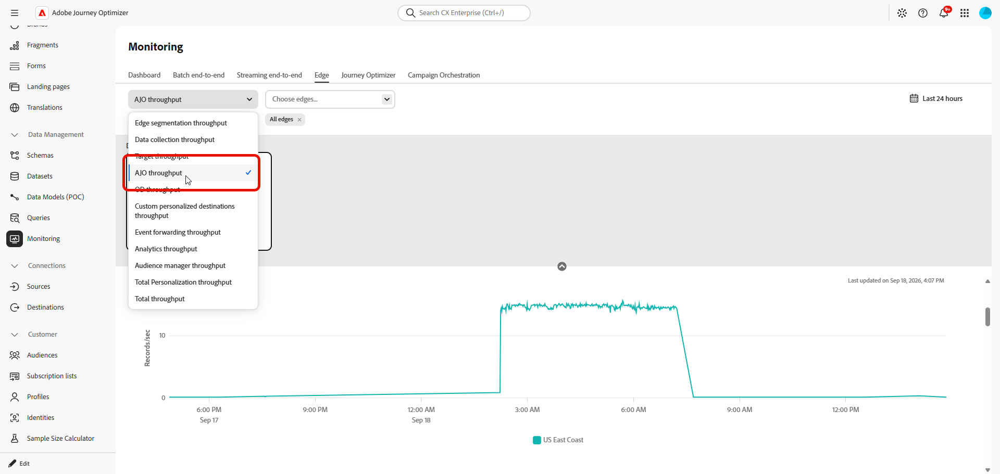
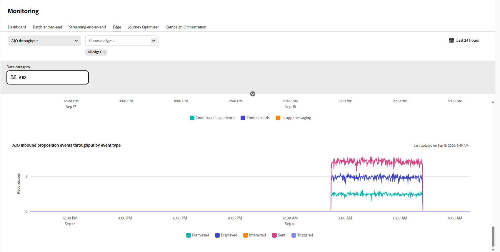

# Monitor inbound data{#monitoring-edge}

>[!BEGINSHADEBOX]

**On this page:** Monitor inbound data health in [!DNL Adobe Journey Optimizer] with the graphs available at **[!UICONTROL Data Management]** > **[!UICONTROL Monitoring]** > **[!UICONTROL Edge]**.

>[!ENDSHADEBOX]

The **[!UICONTROL Monitoring]** workspace includes the following tabs:

| Tab | Description | Documentation |
|---|---|---|
| **[!UICONTROL Dashboard]** | Review dataflow activity and status across your dataflows. | [Dataflow monitoring dashboard](https://experienceleague.adobe.com/en/docs/experience-platform/dataflows/ui/monitor){target="_blank"} |
| **[!UICONTROL Batch end-to-end]** | Monitor the end-to-end flow and quality of batch-ingested data. | [Batch end-to-end data ingestion](https://experienceleague.adobe.com/en/docs/experience-platform/ingestion/quality/monitor-data-ingestion#monitor-batch-end-to-end-data-ingestion){target="_blank"} |
| **[!UICONTROL Streaming end-to-end]** | Monitor the end-to-end flow and quality of streaming-ingested data. | [Streaming end-to-end data ingestion](https://experienceleague.adobe.com/en/docs/experience-platform/ingestion/quality/monitor-data-ingestion#monitor-streaming-end-to-end-data-ingestion){target="_blank"} |
| **[!UICONTROL Edge]** | Monitor data sent to the Edge Network. This page documents the Journey Optimizer-specific graphs available in this tab. | [Monitor Edge dataflows](https://experienceleague.adobe.com/en/docs/experience-platform/dataflows/ui/monitor-edge){target="_blank"} |

## Journey Optimizer graphs

The following graphs are available in **[!UICONTROL Data Management]** > **[!UICONTROL Monitoring]** > **[!UICONTROL Edge]**.

From the drop-down menu, select **[!UICONTROL AJO throughput]**.

### AJO Gateway Throughput {#gateway-throughput}

The **[!UICONTROL AJO Gateway Throughput]** graph shows the total number of records processed by the Journey Optimizer gateway per second over time. Use this metric to monitor the overall volume of inbound requests handled by the gateway.

### AJO Inbound Throughput {#inbound-throughput}

The **[!UICONTROL AJO Inbound Throughput]** graph shows the overall number of inbound records received per second over time. This metric measures the rate at which inbound records reach the Edge service. Use this graph to review inbound data volume and identify changes in traffic levels.

### AJO Inbound Throughput Breakdown {#inbound-throughput-breakdown}

The **[!UICONTROL AJO Inbound Throughput Breakdown]** graph shows inbound records received per second over time, broken down by location. This metric measures the inbound record rate for each location. Use this graph to compare inbound traffic across locations and identify a location with an unusual increase or decrease in volume.

### AJO Inbound Latency {#inbound-latency}

The **[!UICONTROL AJO Inbound Latency]** graph shows the time required to process inbound requests, measured in milliseconds. This metric is presented as a distribution of latency values, including percentiles such as P50 and P90. Use these values to understand typical request latency and identify higher-latency requests.

### AJO Inbound Proposition Events Throughput {#inbound-proposition-events-throughput}

The **[!UICONTROL AJO Inbound Proposition Events Throughput]** graph shows the throughput of proposition events over time. This metric measures tracking signals generated when a user interacts with, views, or triggers a personalized offer.

### AJO Inbound Proposition Events Throughput by Channel {#inbound-proposition-events-throughput-channel}

The **[!UICONTROL AJO Inbound Proposition Events Throughput by Channel]** graph shows proposition event throughput by inbound channel. This metric measures proposition event activity grouped by channel. The available channels include CBE, in-app, and content cards. Use this graph to compare activity across inbound channels.

### AJO Inbound Proposition Events Throughput by Event Type {#inbound-proposition-events-throughput-event-type}

The **[!UICONTROL AJO Inbound Proposition Events Throughput by Event Type]** graph shows proposition event throughput by event type. This metric measures proposition event activity grouped by outcome. The available event types include dismissed, suppressed, displayed, triggered, interacted, and sent. Use this graph to identify which proposition-event outcomes contribute to overall activity.

{{$include /help/_includes/do-not-localize/data/ai-augmented-monitoring.md}}