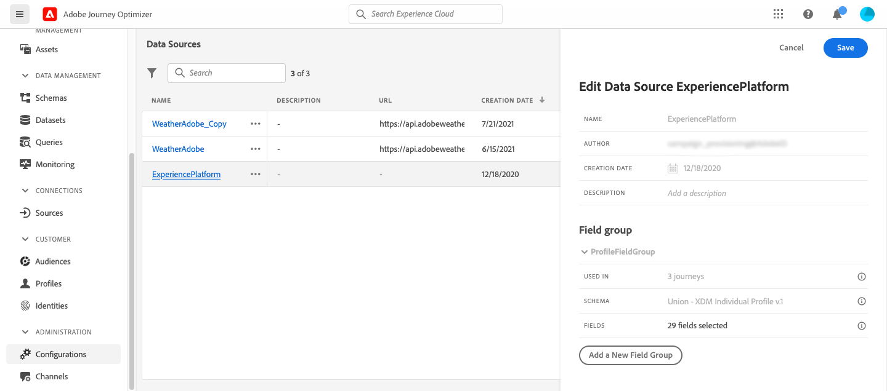
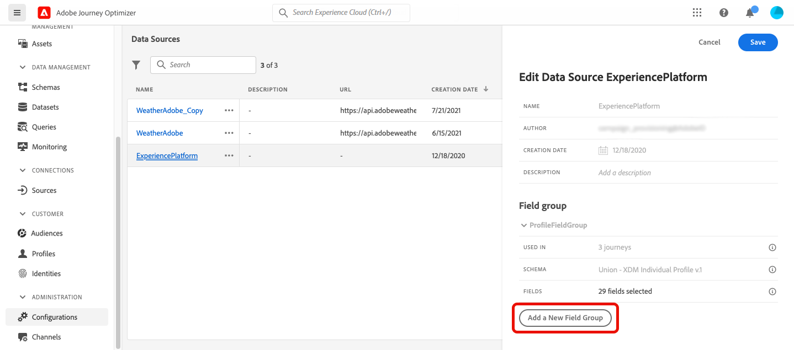

# Adobe Experience Platform data source {#adobe-experience-platform-data-source}

>[!CONTEXTUALHELP]
>id="ajo_journey_data_source_built_in"
>title="Adobe Experience Platform data source"
>abstract="Adobe Experience Platform data source defines the connection to Adobe Real-time Customer Profile. This data source is built-in and pre-configured, and cannot be deleted. It is designed to retrieve and use data from the Real-time Customer Profile Service (for example, check if the person who entered a journey is a female). It allows you to use Profile data."

Adobe Experience Platform data source defines the connection to Adobe Real-time Customer Profile. This data source is built-in and pre-configured, and cannot be deleted. This data source is designed to retrieve and use data from the Real-time Customer Profile Service (for example, check if the person who entered a journey is a female). It allows you to use Profile data. For more information about Adobe Real-time Customer Profile, refer to [Adobe Experience Platform documentation](https://experienceleague.adobe.com/docs/experience-platform/profile/home.html){target="_blank"}.

To allow the connection to the Real-time Customer Profile Service, we must use a key to identify a person, and a namespace that contextualizes the key. As a result, you can only use this data source if your journeys start with an event containing a key and a namespace. [Learn more](../building-journeys/journey.md).

You can edit the pre-configured field group named "ProfileFieldGroup", add new ones and remove the ones that are not used in any draft or live journeys. [Learn more](../datasource/configure-data-sources.md#define-field-groups).

>[!CAUTION]
>
>Using experience events in journey expressions/conditions is not supported. If your use case requires the use of experience events, consider alternative methods. [Learn more](../building-journeys/exp-event-lookup.md)

Main steps to add field groups to the build-in data source are detailed below:

1. From the list of data sources, select the build-in **Adobe Experience Platform** data source.

    This opens the data source configuration pane on the right-hand side of the screen.

    

1. Select **[!UICONTROL Add a New Field Group]** to define a [new series of fields to retrieve](../datasource/configure-data-sources.md#define-field-groups).

    

1. Select a schema from the **[!UICONTROL Schema]** drop-down. Schema creation is performed in Adobe Experience Platform, not performed in Adobe Journey Optimizer.
1. Select the fields to use, and save your changes.

>[!TIP]
>
>Hover over the name of a field group to reveal two icons on the right. Use these to **Duplicate** or **Delete** the field group. Note that the **[!UICONTROL Delete]** icon is only available if the field group is not used in any **Live**, **Draft** or **Finished** journey. Refer to the **[!UICONTROL Used in]** field to check if this is the case.
