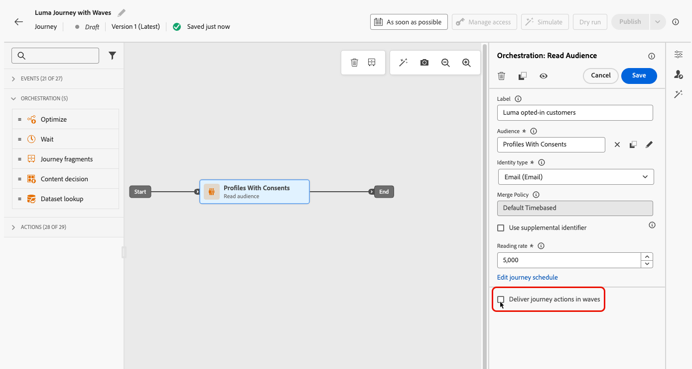
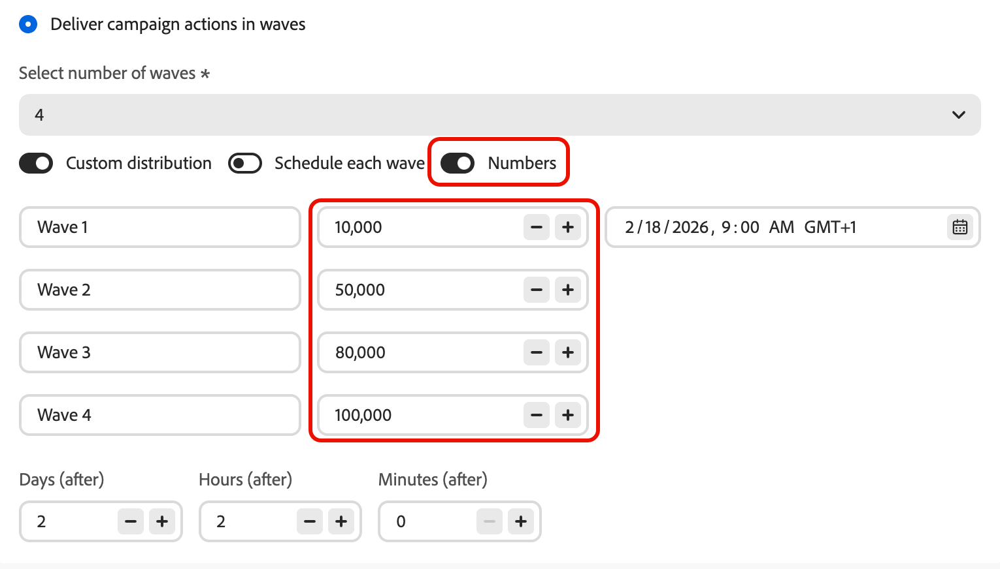

# Send using waves {#send-using-waves}

>[!BEGINSHADEBOX]

**On this page:** Learn how to split outbound message delivery into scheduled batches (waves) to balance load, protect sender reputation, and improve deliverability, available in read-audience journeys, action campaigns, and orchestrated campaigns.

>[!ENDSHADEBOX]

Instead of sending all messages at once, you can schedule delivery in controlled batches called **waves**. Wave sending helps you:

* Balance load and protect downstream systems (such as call centers or landing pages) from being overwhelmed
* Support deliverability and sender reputation, especially for high-volume sends
* Progressively ramp up delivery volume when warming a new IP or platform

You define the number of waves, their size (as a percentage of the audience or as absolute numbers), and when each wave runs.

## Limitations and guardrails {#limitations-guardrails}

The following limitations apply in all contexts:

* You must define at least **2 waves** and you can add up to **10 waves**.
* The minimum interval between the start of two waves is **30 minutes**.
* A wave start cannot be set in the past.

Additional context-specific constraints apply:

>[!BEGINTABS]

>[!TAB Read audience journeys]

* Wave sending is only available for read audience journeys with the **[!DNL As soon as possible]** and **[!UICONTROL Once]** scheduler types. [Learn more about the journey schedule](../building-journeys/read-audience.md#schedule).
* Wave sending is not available for recurring, event-triggered, business-event, test mode, or dry-run journeys.
* A wave start cannot be before the journey start.
* Splitting the audience into waves can take up to 1 hour. Profiles may not enter the journey until the split is complete.
* Within a single journey version, two waves never run at the same time. The next wave starts only after the previous wave has finished. For example, if waves are scheduled 1 hour apart but the first wave runs for 2 hours, the second wave starts when the first finishes—not at its originally scheduled time.
* Wave starts can be delayed when the platform applies quota limits or when system capacity is under heavy load.

>[!TAB Action campaigns]

* Wave sending applies to **outbound** actions only (Email, SMS, Push, Direct mail).
* A wave start cannot be before the campaign start.

<!--
>[!TAB Orchestrated campaigns]

* Wave sending applies to **outbound** channel activities only (Email, SMS, Push, Direct mail).
* Wave sending is configured at the **channel activity level**, independently for each channel activity in the campaign.
-->

>[!ENDTABS]

## Configure wave sending {#configure-wave-sending}

>[!CONTEXTUALHELP]
>id="ajo_wave_sending"
>title="Send using waves"
>abstract="Split message delivery into scheduled batches (waves) to control volume over time. You can define up to 10 waves with equal or custom sizes and timing."

>[!CONTEXTUALHELP]
>id="ajo_orchestration_wave_sending"
>title="Send using waves"
>abstract="Split message delivery into scheduled batches (waves) to control volume over time. You can define up to 10 waves with equal or custom sizes and timing."

The steps to enable wave sending depend on your context — read-audience journey or action campaign. Select the relevant tab below, then refer to the [Wave size and timing](#wave-options) section to finish configuration.

>[!BEGINTABS]

>[!TAB Read audience journeys]

1. Start your journey with a [Read Audience](../building-journeys/read-audience.md) activity.

1. Double-click the **[!UICONTROL Read Audience]** activity to open its properties and select the **[!UICONTROL Deliver journey action in waves]** option.

   {width="100%"}

1. Set the **number of waves** (for example, 4).

   {width="80%"}

   >[!NOTE]
   >
   >You must define at least 2 waves and can add up to 10 waves.

1. Choose how to define wave size and timing as detailed in the [Wave size and timing](#wave-options) section below.

>[!TAB Action campaigns]

1. Create or open an [Action campaign](../campaigns/create-campaign.md) that contains an outbound action (Email, SMS, Push, or Direct mail).

1. In the **[!UICONTROL Schedule]** tab of your campaign, select **[!UICONTROL Deliver campaign actions in waves]**.

   {width="100%"}

   >[!NOTE]
   >
   >The **[!UICONTROL Deliver campaign actions in waves]** option is only displayed when an outbound action is selected in the campaign's **[!UICONTROL Actions]** tab. [Learn more](../campaigns/campaign-action.md)

1. Set the number of waves (for example, 4).

   >[!NOTE]
   >
   >You must define at least 2 waves and can add up to 10 waves.

1. Choose how to define wave size and timing as detailed in the [Wave size and timing](#wave-options) section below.

>[!ENDTABS]

<!--
>[!TAB Orchestrated campaigns]

1. Open a channel activity (Email, SMS, Push, or Direct mail) in your orchestrated campaign canvas.

1. Go to the **[!UICONTROL Schedule]** tab of the channel activity.

1. Under **[!UICONTROL Wave schedule]**, enable the **[!UICONTROL Deliver in waves]** toggle.

    {width="90%"}

1. Set the number of waves using the **[!UICONTROL Select number of waves]** dropdown.

   >[!NOTE]
   >
   >You must define at least 2 waves and can add up to 10 waves.

1. Choose how to define wave size and timing as detailed in the [Wave size and timing](#wave-options) section below.
-->

## Wave size and timing {#wave-options}

Once you have set the number of waves, define how the audience is distributed across them and when each wave runs. Three options are available:

* [Equal waves](#equal-waves) — Split the audience into equal-sized portions with a fixed interval between wave starts. Best for straightforward, evenly timed sends.
* [Custom distribution](#custom-distribution) — Manually set each wave's size as a percentage or an absolute number of profiles. Best for progressive ramp-ups or uneven audience splits.
* [Custom schedule](#custom-schedule) — Assign a specific start date and time to each wave. Best when you need precise timing that does not follow a regular interval.

### Equal waves {#equal-waves}

By default, the audience is split into waves of equal size. Set a fixed interval between the start of each wave (for example, 2 hours). The system then schedules subsequent waves automatically—for example, first wave at 9:00 AM, second at 11:00 AM, third at 1:00 PM, fourth at 3:00 PM.

{width="80%"}

>[!NOTE]
>
>The minimum interval between the start of two waves is **30 minutes**.

### Custom distribution {#custom-distribution}

Select the **[!UICONTROL Custom distribution]** option to define the size of each wave as a percentage of the total audience (for example, 15%, 20%, 25%, 40%).

{width="80%"}

Select **[!UICONTROL Numbers]** to define the size of each wave as an absolute number of profiles (for example, 10,000; 50,000).

{width="80%"}

>[!NOTE]
>
>* When using percentages, all waves must total 100%. A warning is displayed if this is not the case.
>
>* When using numbers, the system does not validate total coverage — ensure your wave sizes cover the intended audience. [Learn more](#faq)

### Custom schedule {#custom-schedule}

Select **[!UICONTROL Schedule each wave]** to define a specific start date and time for each wave. Waves do not need to be evenly spaced (for example, 9:00 AM, 11:00 AM, 5:00 PM, 8:30 PM).

{width="80%"}

>[!NOTE]
>
>The minimum interval between the start of two waves is **30 minutes**.

## Use cases {#use-cases}

Wave sending helps you control when and how many messages go out, which improves deliverability, protects sender reputation, and aligns sends with your operational capacity. Consider using waves in these scenarios:

* **Call center or response management:** Limit how many messages go out per day or per hour so that downstream teams (for example, customer care) can handle responses at a manageable rate.

   {width="50%"}

* **High volume and deliverability:** Avoid sending a very large audience in one shot. Spreading delivery over time helps maintain sender reputation and reduces the risk of being flagged as spam.

   {width="50%"}

* **IP warm-up:** When using a new platform or IP address, progressively increase volume (for example, 10% in the first wave, then 15%, 20%, and so on) to build sending reputation gradually.

   {width="50%"}

## Frequently asked questions {#faq}

+++ What happens if the sum of my wave sizes does not equal the total audience?

* If the sum **exceeds** the audience (for example, you schedule 100,000 in the first wave for an audience of 80,000), the first wave sends to the full audience and the remaining waves have no profiles left—they do not execute.
* If the sum **is less** than the audience (for example, you define four waves totaling 40,000 profiles for an audience of 100,000), only the profiles included in those waves receive the message. The remaining profiles do not receive the communication and are not retried in later waves.

+++

+++ Can I assign different content or audience segments to individual waves?

No. You can only define the size and timing of each wave. The same audience and message content applies to all waves — you cannot target different segments or use different content per wave.

+++

+++ Is the audience re-evaluated before each wave, or is it fixed at activation?

The audience is **evaluated once** at activation (when the journey is triggered or the campaign/activity is started). A snapshot of qualifying profiles is taken at that point and used across all waves — audience membership is not re-evaluated before each subsequent wave.

However, **profile attributes are read at the time each wave processes**, not at activation. This means that for waves spread across multiple days:

* Personalization attributes (for example, a profile's first name or loyalty tier) reflect the profile's state at the time that wave runs.
* **Consent and suppression checks are re-applied at send time for each wave.** If a profile opts out between two waves, they will not receive messages in subsequent waves.

In summary: *who* is included is fixed upfront, but *the data used to personalize and send to those profiles* reflects their current state when their wave is processed.

+++

+++ Does wave sending work with inbound channels?

No. Wave sending applies to **outbound** channel actions only: Email, SMS, Push notifications, and Direct mail. Inbound channels (such as Web, In-app, or Code-based experiences) are not affected by wave sending configuration.

+++

## See also {#see-also}

* [Use an audience in a journey](../building-journeys/read-audience.md) — configure the Read Audience activity
* [Schedule an Action campaign](../campaigns/campaign-schedule.md) — set start date, end date, and frequency
<!-- * [Channel activities in Orchestrated campaigns](../orchestrated/activities/channels.md) — configure channel activities in the orchestrated canvas -->

+++ AI Knowledge Reference

This section contains structured knowledge intended to support interpretation, retrieval, and question answering related to this topic.

For complete understanding, this information should be combined with the documentation on this page. Neither source is intended to stand alone; the page describes the feature, while this section provides additional context that helps disambiguate terminology, intent, applicability, and constraints.

* **TL;DR:** This page explains how to configure wave sending in Adobe Journey Optimizer to deliver outbound messages in controlled batches over time, improving deliverability and protecting sender reputation. Wave sending is available in read-audience journeys, action campaigns, and orchestrated campaigns.

**Intents:**

* Enable wave sending on a Read Audience journey, an Action campaign, or an Orchestrated campaign channel activity
* Configure equal waves with a fixed interval between each wave
* Define custom wave sizes as percentages or absolute profile counts
* Schedule each wave with a specific start date and time
* Control delivery volume to protect sender reputation or align with operational capacity

**Glossary:**

* **Wave sending**: A delivery mode that splits the audience into batches (waves) and sends messages to each batch at scheduled intervals instead of all at once *(product-specific)*
* **Equal waves**: A configuration where the audience is split into equal-sized portions with a fixed interval between wave starts *(product-specific)*
* **Custom distribution**: A configuration where each wave's size is defined manually as a percentage or absolute number of profiles *(product-specific)*
* **Custom schedule**: A configuration where each wave has a specific start date and time, allowing non-uniform spacing *(product-specific)*

**Contexts where wave sending is available:**

* Read audience journeys ("As soon as possible" or "Once" scheduler only — not for recurring, event-triggered, business-event, test, or dry-run journeys)
* Action campaigns (outbound channel actions only)
<!-- * Orchestrated campaigns (outbound channel activities only, configured per channel activity) -->

**Common guardrails (all contexts):**

* Minimum 2 waves, maximum 10 waves
* Minimum 30 minutes between the start of two consecutive waves
* Wave start cannot be in the past
* Percentage-based custom distribution must total 100%
* Number-based custom distribution does not auto-validate total coverage

**Journey-specific guardrails:**

* Wave start cannot be before journey start
* Audience splitting can take up to 1 hour; profiles may be delayed
* Two waves never run simultaneously within the same journey version
* Wave starts can be delayed by platform quota limits or heavy system load

**FAQ:**

* **Q: Does wave sending apply to inbound channels?** — No; outbound only (Email, SMS, Push, Direct mail).
* **Q: Can I assign different content to individual waves?** — No; same audience and content for all waves. Only size and timing can differ.
* **Q: What is the minimum time between two waves?** — 30 minutes between the start of two consecutive waves.
* **Q: What happens if wave sizes exceed or fall short of the audience?** — Excess: first wave sends to full audience, remaining waves do not execute. Shortfall: only profiled in defined waves receive the message; the rest are not retried.
* **Q: Is the audience re-evaluated per wave?** — No; the audience is snapshotted at activation. Profile attributes (personalization, consent) are read at wave processing time.

+++
