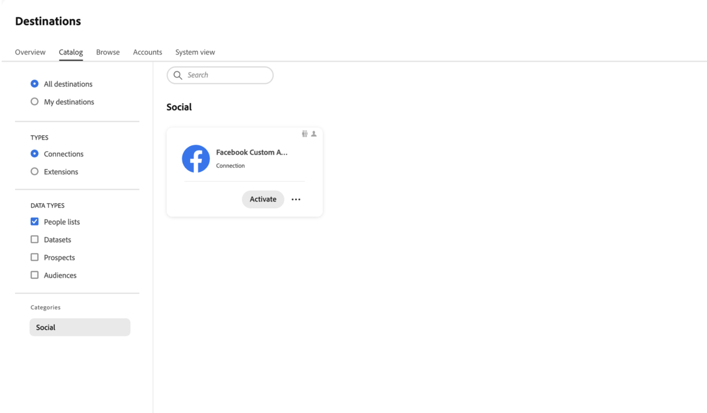
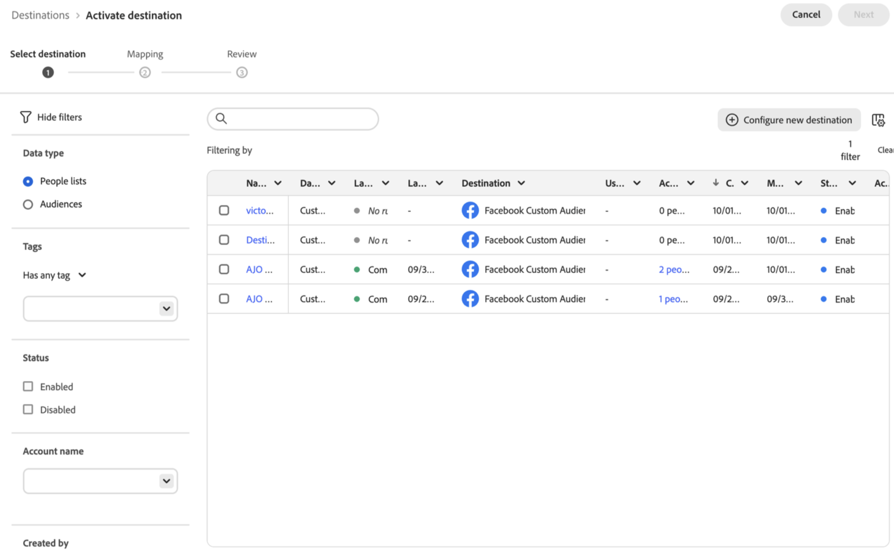
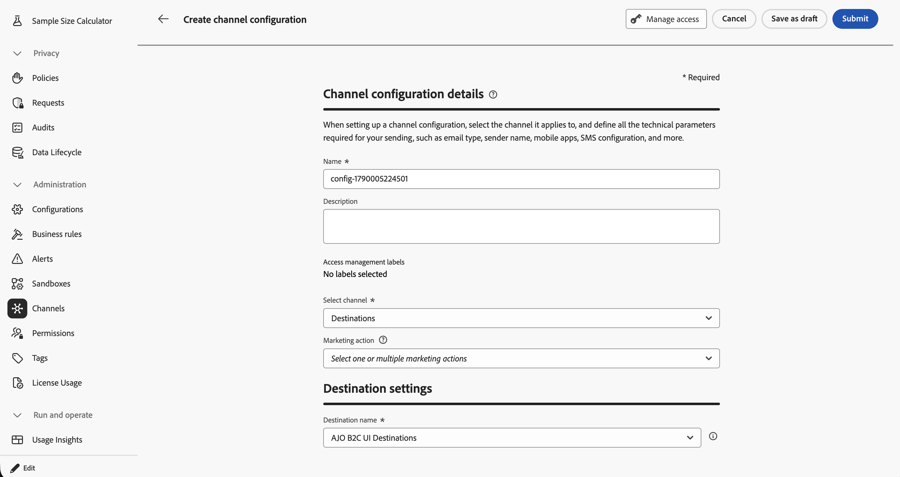
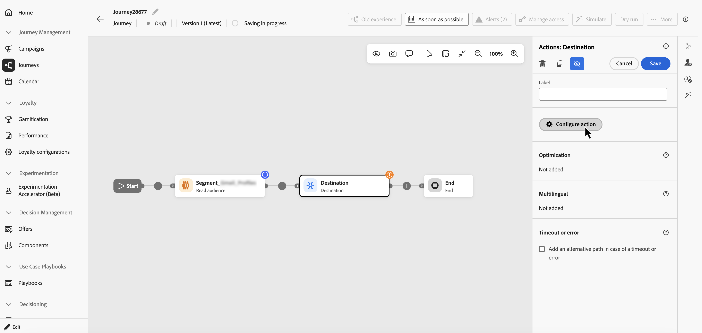
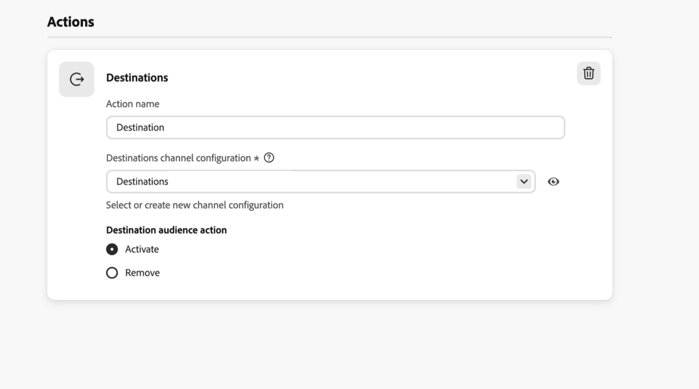
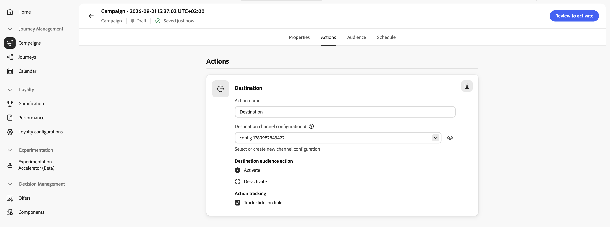

# Use the Destinations channel {#destinations}

>[!BEGINSHADEBOX]

**On this page:** Learn how the Destinations channel works in [!DNL Journey Optimizer], how to configure it for journeys and campaigns, and how to activate or remove profiles in a destination audience.

>[!ENDSHADEBOX]

>[!AVAILABILITY]
>
>The Destinations channel is available in Limited Availability for organizations with both [!DNL Real-Time CDP] and [!DNL Journey Optimizer].

The **Destinations** channel lets you activate or remove profiles in a destination audience as part of a journey or campaign.

The setup consists of three steps:

1. Create and configure the destination in [!DNL Adobe Experience Platform], including its connection and field mappings.

1. In [!DNL Journey Optimizer], create a Destinations channel configuration that points to the destination.

1. Use the Destination action in a journey or campaign to add profiles to, or remove profiles from, destination audience membership.

## Guardrails & limitations

The following guardrails and limitations apply to the Destinations channel:

* The Destinations channel is available across [!DNL Journey Optimizer] journeys and campaigns, except Orchestrated campaigns.

* The initial release supports Facebook Custom Audiences destinations only.

## Configure the destination in Adobe Experience Platform {#configure-destination}

Before configuring the Destinations channel in [!DNL Journey Optimizer], create and configure the destination in [!DNL Adobe Experience Platform].

1. In Experience Platform, select the **Facebook Custom Audiences** destination card.

    Only destinations available with the **[!UICONTROL People lists]** data type in Experience Platform can be used in Journey Optimizer. Currently, only the **Facebook Custom Audiences** destination is available.

    

1. Select the **[!UICONTROL People lists]** option from the filters pane to display the destinations available for use in Journey Optimizer and select **[!UICONTROL Configure new destination]** to begin creating the destination flow.

    

1. The destination setup follows the same flow as the standard Facebook destination, but it does not include an **[!UICONTROL Audience]** step because the audience is supplied later by the Journey Optimizer journey or campaign.

    For more information on how to configure the Facebook destination, see [Facebook Custom Audiences](https://experienceleague.adobe.com/en/docs/experience-platform/destinations/catalog/social/facebook#overview).

## Create a Destinations channel configuration {#create-channel-configuration}

Follow these steps to create a Destinations channel configuration in Journey Optimizer.

Each Destinations channel configuration creates and uses a Facebook audience. If you use the same channel configuration in multiple journeys or campaigns, profiles are added to and removed from the same Facebook audience. If you create two separate channel configurations, Journey Optimizer creates and uses two separate Facebook audiences.

1. Navigate to **[!UICONTROL Administration]** / **[!UICONTROL Channels]**, and select **[!UICONTROL Create channel configuration]**.

1. Enter a **[!UICONTROL Name]** for the configuration and select **[!UICONTROL Destinations]** from the **[!UICONTROL Select channel]** dropdown.

    

1. Select the **[!UICONTROL Marketing action]**(s) to associate consent policies with audience activation using this configuration. All consent policies associated with the selected marketing actions are leveraged to respect your customers' preferences and data usage restrictions. [Learn more](../action/consent.md#surface-marketing-actions)

1. Under **[!UICONTROL Destination settings]**, select the **[!UICONTROL Destination name]** to use as defined in the **[!UICONTROL Destinations]** menu.

1. Select **[!UICONTROL Submit]** to create the configuration.

## Add the destination to a journey or campaign

The Destinations channel can be added to both journeys and campaigns to manage audience membership dynamically. Browse the tabs below to see how to add it to each.

>[!BEGINTABS]

>[!TAB Add to a journey]

1. Start your journey with an [Event](../building-journeys/general-events.md) or a [Read Audience](../building-journeys/read-audience.md) activity.

1. Add an **[!UICONTROL Action]** activity into the canvas and select **[!UICONTROL Destination]** as the action type.

1. Add a label to the action and select **[!UICONTROL Configure action]**.

    

1. In the **[!UICONTROL Actions]** tab, select the destination channel configuration to use.

    

1. Choose to either **[!UICONTROL Activate]** the profile into the destination or **[!UICONTROL Remove]** the profile from the destination.

>[!TAB Add to a campaign]

1. Open the campaign's **[!UICONTROL Actions]** tab and add a **[!UICONTROL Destination]** action.

1. Enter an **[!UICONTROL Action name]**.

1. In **[!UICONTROL Destination channel configuration]**, select the channel configuration to use.

    

1. Choose to either **[!UICONTROL Activate]** the profile into the destination or **[!UICONTROL Remove]** the profile from the destination.

>[!ENDTABS]

After configuring the Destinations action, complete the remaining configuration of your [journey](../building-journeys/journey-gs.md) or [campaign](../campaigns/create-campaign.md).

## Monitor Destinations reporting {#reporting}

Journey Optimizer reports show the number of profiles processed by the Destination action. Facebook-specific reporting, such as delivery or audience performance in Facebook, is not available in Journey Optimizer reports. To view Facebook-specific metrics, use Facebook reporting.
