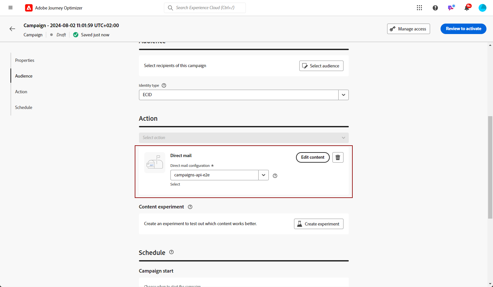
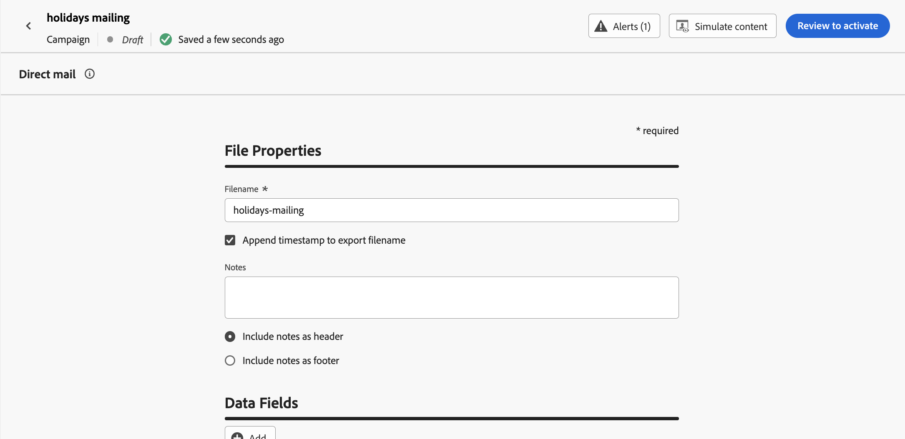
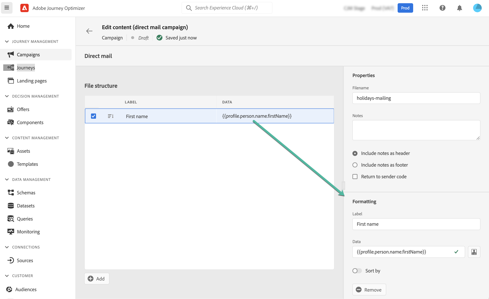

# Create a direct mail message {#create-direct}

>[!CONTEXTUALHELP]
>id="ajo_direct_mail"
>title="Direct mail creation"
>abstract="Create direct mail messages in scheduled campaigns and journeys and design the extraction files required by direct mail providers to send mail to your customers."

>[!CONTEXTUALHELP]
>id="ajo_journey_direct_mail"
>title="End activity"
>abstract="Direct mail is an offline channel that allows you to personalize and generate the extraction files required by third-party direct mail providers to send mail to your customers."

To create direct mail messages, create a scheduled campaign or a journey, and configure the extraction file. This file is required by direct mail providers to send mail to your customers.

>[!IMPORTANT]
>
>Before creating a direct mail message, make sure you have configured:
>
>1. A [file routing configuration](../direct-mail/direct-mail-configuration.md#file-routing-configuration) which specifies the server where the extraction file should be uploaded and stored,
>1. A [direct mail message configuration](../direct-mail/direct-mail-configuration.md#direct-mail-surface) which will reference the file routing configuration.

## Add a Direct mail message {#create-dm-campaign}

Browse the tabs below to learn how to add a Direct mail message in a campaign or a journey.

>[!BEGINTABS]

>[!TAB Add a Direct mail message to a Journey]

1. Open your journey then drag and drop a **[!UICONTROL Direct mail]** activity from the **Actions** section of the palette.

1. Provide basic information on your message (label, description, category), then choose the message configuration to use. The **[!UICONTROL configuration]** field is pre-filled, by default, with the last configuration used for that channel by the user. For more information on how to configure a journey, refer to [this page](../building-journeys/journey-gs.md).

1. Configure the extraction file to send to your direct mail provider. To do so, click the **[!UICONTROL Edit content]** button.

    

1. Adjust the extraction file properties, such as the filename, or the columns to display. For more information on how to configure the extraction file properties, refer to this section: [Create a direct mail message](../direct-mail/create-direct-mail.md#extraction-file).

    

1. Once the content of the extraction file has been defined, you can use test profiles to preview it. If you inserted personalized content, you can check how this content is displayed in the message, using test profile data.

    To do so, click **[!UICONTROL Simulate content]** then add a test profile to check how the extraction file rendering using the test profile data. Detailed information on how to select test profiles and preview your content is available in the [Content Management](../content-management/preview-test.md) section.

    {width="800" align="center"}

When your extraction file is ready, complete the configuration of your [journey](../building-journeys/journey-gs.md) to send it.

>[!TAB Add a Direct mail message to a Campaign]

1. Access the **[!UICONTROL Campaigns]** menu, then click **[!UICONTROL Create campaign]**.

1. Select the **Scheduled - Marketing** campaign type.

1. In the **[!UICONTROL Properties]** section, edit your Campaign's **[!UICONTROL Title]** and **[!UICONTROL Description]**.

1. To define your target audience, click the **[!UICONTROL Select audience]** button and choose from the available Adobe Experience Platform audiences. [Learn more](../audience/about-audiences.md).

   >[!IMPORTANT]
   >
   >For now, audience selection is restricted to 3 million profiles. This limitation can lifted upon request to your Adobe representative.

1. In the **[!UICONTROL Identity namespace]** field, select the appropriate namespace to identify individuals within the chosen audience. [Learn more](../event/about-creating.md#select-the-namespace).

1. In the **[!UICONTROL Actions]** section, choose the **[!UICONTROL Direct mail]**.

1. Select or create a **[!UICONTROL Direct mail configuration]** to use. [Learn how to create a direct mail configuration](direct-mail-configuration.md#direct-mail-surface).

   {width="800" align="center"}

   >[!AVAILABILITY]
   >
   >Direct Mail supports the **Holdout** functionality but does not currently support **Treatments**. [Learn how to work with experiments](../content-management/get-started-experiment.md)
   
1. Campaigns can be scheduled for a specific date or set to recur at regular intervals. Learn how to configure the **[!UICONTROL Schedule]** of your campaign in [this section](../campaigns/campaign-schedule.md). 
    
You can now start configuring the extraction file to send to your direct mail provider.

>[!ENDTABS]

## Configure the extraction file {#extraction-file}

>[!CONTEXTUALHELP]
>id="ajo_direct_mail_data_fields"
>title="Data Fields"
>abstract="Add and configure the columns and the information to be displayed in the extraction file required by direct mail providers to send mail to your customers. You can add up to 50 columns."

>[!CONTEXTUALHELP]
>id="ajo_direct_mail_formatting"
>title="Extraction file formatting"
>abstract="For each field, specify a label and the information to display using the personalization editor.    The <b>Sort by</b> option allows you to use the selected field to sort the extraction file's columns."

The extraction file is required by direct mail providers to send mail to your customers. To define the extraction file configuration, follow these steps:

1. From the campaign configuration screen, click the **[!UICONTROL Edit content]** button to configure the extraction file content.

1. Adjust the extraction file properties:

   1. In the **[!UICONTROL Filename]** field, specify a name for the extraction file.

      >[!NOTE]
      >
      >By default, the file is written to the root directory on the server. The **[!UICONTROL Filename]** field also accepts the format "/your/path/here/Filename.csv", where the specified path is the target directory on the selected server. <!--TBC if for SFTP and Azure only, or for all servers including S3-->

   1. Optionally, enable the **[!UICONTROL Append timestamp to export filename]** option if you want to add an automatic timestamp to the specified file name.

   1. Sometimes you may need to add information at the beginning or at the end of the extraction file. To do this, use the **[!UICONTROL Notes]** field then specify if you want to include the note as header or footer.

      {width="800" align="center"}

1. Configure the columns and the information to be displayed in the extraction file:

   1. Click the **[!UICONTROL Add]** button to create a new column.

   1. The **[!UICONTROL Formatting]** pane displays on the right-hand side, allowing you to set up the selected column. Specify a **[!UICONTROL Label]** for the column.
   
   1. In the **[!UICONTROL Data]** field, select the profile attributes to display using the [personalization editor](../personalization/personalization-build-expressions.md).

   1. To sort the extraction file using a column, select the column and toggle on the **[!UICONTROL Sort by]** option. The **[!UICONTROL Sort By]** icon displays next to the column's label in the **[!UICONTROL Data Fields]** section.

      {width="800" align="center"}

   1. Repeat these steps to add as many columns as needed for your extraction file. Note that you can add up to 50 columns.

      To change the position of a column, drag and drop it to the desired location in the **[!UICONTROL Data field]** section. To delete a column, select it and click the **[!UICONTROL Remove]** button in the **[!UICONTROL Formatting]** pane.

You can now test your direct mail message and send it to your audience. [Learn how to test & send direct mail messages](test-send-direct-mail.md)
