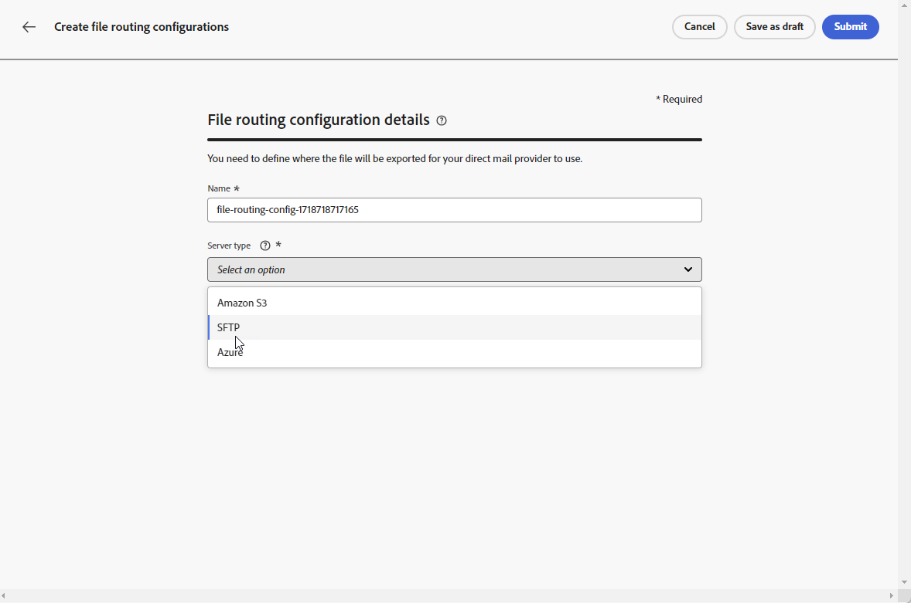
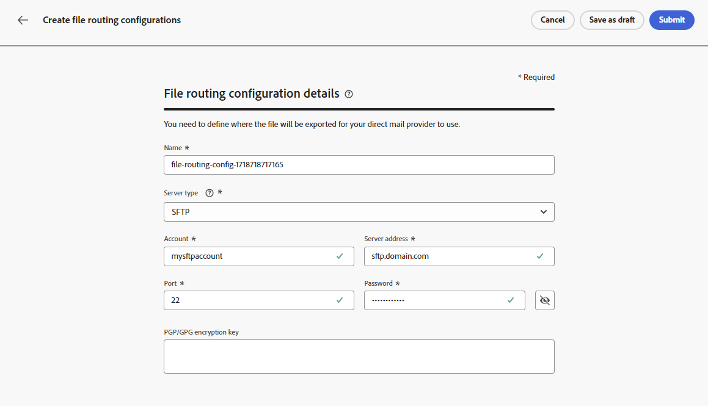

# Direct mail configuration {#direct-mail-configuration}

[!DNL Journey Optimizer] allows you to personalize and generate the files required by direct mail providers to send mail to your customers.

When [creating a direct mail message](../direct-mail/create-direct-mail.md), you define the targeted audience data, including the chosen contact information (postal address for example). A file containing this data will then be automatically generated and exported to a server, where your direct mail provider will be able to retrieve it and take care of the actual sending.

Before being able to generate this file, you need to create:

1. A [file routing configuration](#file-routing-configuration) to specify the server where the file will be exported and encrypt the file, if necessary.

    >[!CAUTION]
    >
    >To create a file routing configuration, you need to have the **[!DNL Manage file routing]** built-in permission. [Learn more](../administration/ootb-product-profiles.md#content-library-manager).

1. A [direct mail configuration](#direct-mail-configuration) that will reference the file routing configuration. If you have not configured any file routing option, you will not be able to create a direct mail configuration.

## Configure file routing {#file-routing-configuration}

>[!CONTEXTUALHELP]
>id="ajo_dm_file_routing_details"
>title="Define the file routing configuration"
>abstract="After you create a direct mail message, the file containing the targeted audience data will be generated and exported to a server. You need to specify the server details so that your direct mail provider can access and use that file for delivering direct mail."
>additional-url="https://experienceleague.adobe.com/en/docs/journey-optimizer/using/channels/direct-mail/create-direct-mail" text="Create a direct mail message"

>[!CONTEXTUALHELP]
>id="ajo_dm_file_routing_details_header"
>title="Define the file routing configuration"
>abstract="You need to define where the file will be exported for your direct mail provider to use."

>[!CONTEXTUALHELP]
>id="ajo_dm_select_file_routing"
>title="File routing configuration"
>abstract="Select the file routing configuration of your choice, which defines where the file will be exported for your direct mail provider to use."

>[!CONTEXTUALHELP]
>id="ajo_dm_file_routing_type"
>title="Select the server type for your file"
>abstract="Choose which type of server you want to use for exporting your direct mail files. Currently only Amazon S3 and SFTP are supported by Journey Optimizer."

>[!CONTEXTUALHELP]
>id="ajo_dm_file_routing_aws_region"
>title="Choose the AWS region"
>abstract="Select the geographic region of the AWS server where you want to export your direct mail files. As a general practice, it is preferred to choose the closest region to your direct mail provider's location."

>[!NOTE]
>
>Currently Amazon S3, SFTP and Azure are supported in [!DNL Journey Optimizer].

To deliver a direct mail message, [!DNL Journey Optimizer] generates and exports the file containing your targeted audience data to a server.

You need to specify that server details so that your direct mail provider can access and use that file for delivering mail.

To configure the file routing, follow the steps below.

>[!BEGINTABS]

>[!TAB Amazon S3]

1. Access the **[!UICONTROL Administration]** > **[!UICONTROL Channels]** > **[!UICONTROL Direct mail settings]** > **[!UICONTROL File Routing]** menu, then click **[!UICONTROL Create routing configuration]**.

    {width="800" align="center"}

1. Set a name for your configuration.

1. Select **Amazon S3** as the **[!UICONTROL Server type]** to use for exporting the direct mail files.

    {width="800" align="center"}

1. Fill in the details and credentials for your server

    * **AWS bucket name**:To know where to find your AWS bucket name, refer to [this page](https://docs.aws.amazon.com/AmazonS3/latest/userguide/UsingBucket.html).

    * **AWS access key**: To know where to find your AWS access key ID, refer to [this page](https://docs.aws.amazon.com/IAM/latest/UserGuide/security-creds.html#access-keys-and-secret-access-keys).

    * **AWS secret key**: To know where to find your AWS secret key, refer to [this page](https://aws.amazon.com/fr/blogs/security/wheres-my-secret-access-key/).

    * **AWS region**: choose the **[!UICONTROL AWS region]** where the server infrastructure will be located. AWS regions are geographic areas that AWS uses to host its cloud infrastructures. As a general practice, it is preferred to choose the region that is closest to you direct mail provider's location.

    {width="800" align="center"}

1. To encrypt the file, copy-paste your encryption key in the **[!UICONTROL PGP/GPG encryption key]** field.

1. Select **[!UICONTROL Submit]**. The file routing configuration is created with the **[!UICONTROL Active]** status. It is now ready to be used in a [direct mail configuration](#direct-mail-surface).

    You can also select **[!UICONTROL Save as draft]** to create the file routing configuration, but you will not be able to select it in a configuration until it is **[!UICONTROL Active]**.

>[!TAB SFTP]

1. Access the **[!UICONTROL Administration]** > **[!UICONTROL Channels]** > **[!UICONTROL Direct mail settings]** > **[!UICONTROL File Routing]** menu, then click **[!UICONTROL Create routing configuration]**.

    {width="800" align="center"}

1. Set a name for your configuration.

1. Select SFTP as **[!UICONTROL Server type]** to use for exporting the direct mail files.

    {width="800" align="center"}

1. Fill in the details and credentials for your server:

    * **Account**: Account name used to connect to the SFTP server.

    * **Server address**: ​URL of the SFTP server.

    * **Port**: FTP connection port number.

    * **Password**:​ Password used to connect to the SFTP server.

    

    >[!NOTE]
    >
    >To specify a path on the server for saving the file, update the direct mail campaign's **[!UICONTROL Filename]** field to include the desired path. [Learn more](create-direct-mail.md#extraction-file)

1. To encrypt the file, copy-paste your encryption key in the **[!UICONTROL PGP/GPG encryption key]** field.

1. Select **[!UICONTROL Submit]**. The file routing configuration is created with the **[!UICONTROL Active]** status. It is now ready to be used in a [direct mail configuration](#direct-mail-surface).

    You can also select **[!UICONTROL Save as draft]** to create the file routing configuration, but you will not be able to select it in a configuration until it is **[!UICONTROL Active]**.

>[!TAB Azure]

1. Access the **[!UICONTROL Administration]** > **[!UICONTROL Channels]** > **[!UICONTROL Direct mail settings]** > **[!UICONTROL File Routing]** menu, then click **[!UICONTROL Create routing configuration]**.

    {width="800" align="center"}

1. Set a name for your configuration.

1. Select Azure **[!UICONTROL Server type]** to use for exporting the direct mail files.

    {width="800" align="center"}

1. Fill in the details and credentials for your server:

    * **Azure Connection String**: To find your **Azure Connection String**, refer to [this page](https://learn.microsoft.com/en-us/azure/storage/common/storage-configure-connection-string#configure-a-connection-string-for-an-azure-storage-account).

        The **Azure Connection String** should follow the format below:

        `DefaultEndpointsProtocol=[http|https];AccountName=myAccountName;AccountKey=myAccountKey`

    * **Container Name**: To find your **Container Name**, refer to [this page](https://learn.microsoft.com/en-us/azure/storage/blobs/blob-containers-portal).

        The **Container Name** should contain only the container's name without any slashes. To specify a path within the container for saving the file, update the direct mail campaign's **[!UICONTROL Filename]** field to include the desired path. [Learn more](create-direct-mail.md#extraction-file)

1. To encrypt the file, copy-paste your encryption key in the **[!UICONTROL PGP/GPG encryption key]** field.

1. Select **[!UICONTROL Submit]**. The file routing configuration is created with the **[!UICONTROL Active]** status. It is now ready to be used in a [direct mail configuration](#direct-mail-surface).

    You can also select **[!UICONTROL Save as draft]** to create the file routing configuration, but you will not be able to select it in a configuration until it is **[!UICONTROL Active]**.

>[!ENDTABS]

## Create a direct mail configuration {#direct-mail-surface}

>[!CONTEXTUALHELP]
>id="ajo_dm_surface_settings"
>title="Define the direct mail settings"
>abstract="A direct mail configuration contains the settings for the formatting of the file which contains the targeted audience data and will be used by the mail provider. You must also define where the file will be exported by selecting the file routing configuration."
>additional-url="https://experienceleague.adobe.com/en/docs/journey-optimizer/using/channels/direct-mail/direct-mail-configuration#file-routing-configuration" text="Configure file routing"

<!--
>[!CONTEXTUALHELP]
>id="ajo_dm_surface_sort"
>title="Define the sort order"
>abstract="If you select this option, the sort will be by profile ID, ascending or descending. If you unselect it, the sorting configuration defined when creating the direct mail message within a journey or a campaign."-->

>[!CONTEXTUALHELP]
>id="ajo_dm_surface_split"
>title="Define the file split threshold"
>abstract="You must set the maximum number of records for each file containing audience data. You can select any number between 1 and 200,000 records. After the specified threshold is reached, another file will be created for the remaining records."

To be able to deliver direct mail with [!DNL Journey Optimizer], you need to create a channel configuration to define the settings for the formatting of the file that will be used by the mail provider.

A direct mail configuration must also include the file routing configuration which defines the server where your direct mail file will be exported.

1. In the left rail, browse to **[!UICONTROL Administration]** > **[!UICONTROL Channels]** and select **[!UICONTROL General settings]** > **[!UICONTROL Channel configurations]**. Click the **[!UICONTROL Create channel configuration]** button. [Learn more](../configuration/channel-surfaces.md)

    

1. Enter a name and a description (optional) for the configuration, then select the channel to configure.

    >[!NOTE]
    >
    > Names must begin with a letter (A-Z). It can only contain alpha-numeric characters. You can also use underscore `_`, dot`.` and hyphen `-` characters.

1. To assign custom or core data usage labels to the configuration, you can select **[!UICONTROL Manage access]**. [Learn more on Object Level Access Control (OLAC)](../administration/object-based-access.md).

1. Select the **[!UICONTROL Direct mail]** channel.

    

1. Select **[!UICONTROL Marketing action]**(s) to associate consent policies to the messages using this configuration. All consent policies associated with the marketing action are leveraged in order to respect the preferences of your customers. [Learn more](../action/consent.md#surface-marketing-actions)

1. Define the direct mail settings in the dedicated section of the channel configuration.

    {width="800" align="center"}

    <!---->

1. Select the file format: **[!UICONTROL CSV]** or **[!UICONTROL Text delimited]**.

1. If you select **[!UICONTROL Text delimited]**, define the column separator of your choice: tabulation, semicolon, pipe, or ampersand.

    

1. Select the **[!UICONTROL File routing configuration]** amongst the ones that you created. This defines where the file will be exported for your direct mail provider to use.

    >[!CAUTION]
    >
    >If you have not configured any file routing option, you will not be able to create a direct mail configuration. [Learn more](#file-routing-configuration)

    {width="800" align="center"}

    <!---->

1. Submit the direct mail configuration.

You can now [create a direct mail message](../direct-mail/create-direct-mail.md) inside a campaign. Once the campaign is started, the file containing the targeted audience data will automatically be exported to the server that you defined. The direct mail provider will then be able to retrieve that file and proceed with the direct mail delivery.

>[!NOTE]
>
>Duplicate rows where all the values in the row are the same are automatically removed from the file.

<!--
    In the **[!UICONTROL Insertion]** section, you can choose to automatically remove duplicate rows.

    Define the maximum number of records (i.e. rows) for each file containing profile data. After the specified threshold is reached, another file will be created for the remaining records.

    

    For example, if there are 100,000 records in the file and the threshold limit is set to 60,000, the records will be split into two files. The first file will contain 60,000 rows, and the second file will contain the remaining 40,000 rows.

    >[!NOTE]
    >
    >NOTE You can set any number between 1 and 200,000 records, meaning each file must contain at least 1 row and no more than 200,000 rows.

-->