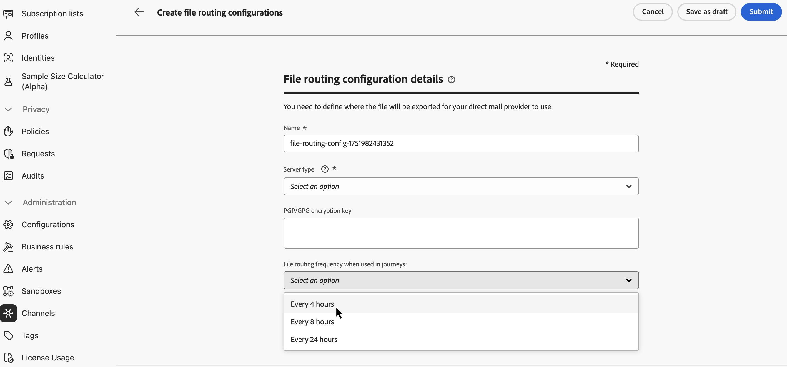
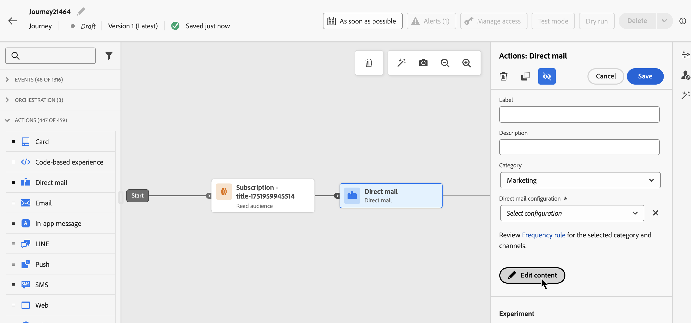
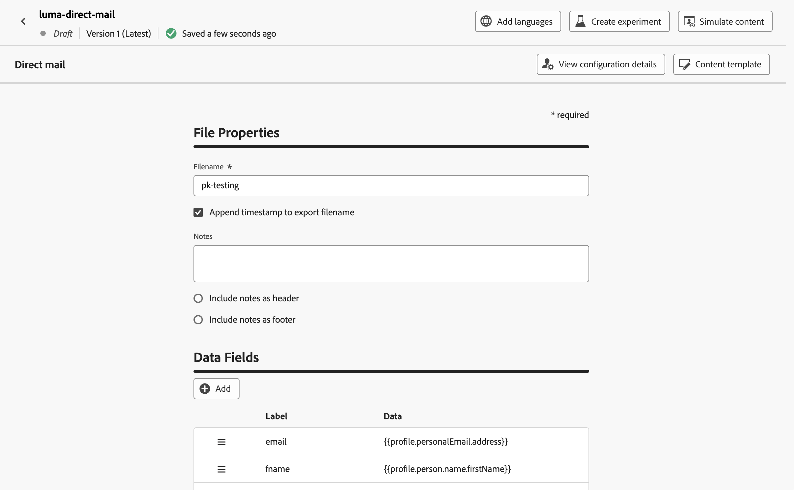
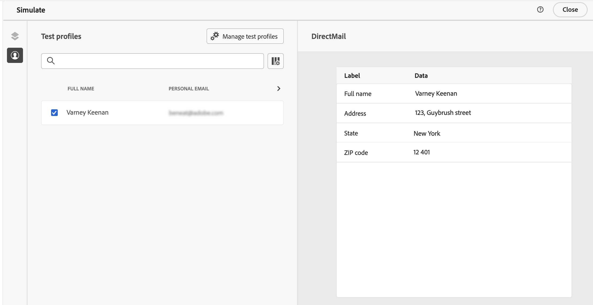

# Send direct mail messages with journeys {#direct-mail-journeys}

>[!CONTEXTUALHELP]
>id="ajo_journey_direct_mail"
>title="End activity"
>abstract="Direct mail is an offline channel that allows you to personalize and generate the extraction files required by third-party direct mail providers to send mail to your customers."

Direct mail is an offline channel that allows you to personalize and generate the extraction files required by third-party direct mail providers to send mail to your customers. 

When creating a direct mail message, [!DNL Journey Optimizer] automatically generates a file containing all the targeted profiles and selected data, such as postal addresses and profile attributes. This file is sent to the server of your choice so that it is accessible by your chosen third-party direct mail provider, who will handle the actual mailing process for you.

You need to work with your chosen third-party direct mail provider to obtain any required consents from you customers, if applicable, so that your customers can receive mail from you. Your use of mailing services is subject to additional terms and conditions from the applicable third-party direct mail provider. Adobe does not control and is not responsible for your use of third-party products. For any issues or requests for assistance related to the mailing of your direct mail message, contact your chosen third-party direct mail provider.

>[!NOTE]
>
>This page details the process to create and send direct mail messages with journeys. For more information on the Direct mail channel and how to create direct mail campaigns, refer to this section: [Get started with direct mail](../direct-mail/get-started-direct-mail.md).

## Create a file routing configuration

>[!CONTEXTUALHELP]
>id="ajo_dm_file_routing_frequency"
>title="Choose the AWS region"
>abstract="If your file routing configuration is going to be sent using journeys, you can specify the frequency at which the file is going to be sent the server."

Before creating a direct mail message, make sure you have configured a file routing configuration which specifies the server where the extraction file should be uploaded and stored. To do so, follow these steps:

1. Access the **[!UICONTROL Administration]** > **[!UICONTROL Channels]** > **[!UICONTROL Direct mail settings]** > **[!UICONTROL File routing]** menu, then click **[!UICONTROL Create file routing config]**.

1. Define the file routing configuration properties such as its name, and the type of server to use. Detailed information on how to setup a file routing configuration is available in the [Direct mail configuration](../direct-mail/direct-mail-configuration.md#file-routing-configuration) section.

    If your file routing configuration is going to be sent using journeys, you can specify the frequency at which the file is going to be sent the server.

    

1. Click **[!UICONTROL Submit]** to confirm the file routing configuration creation. The configuration is created with the **[!UICONTROL Active]** status. It is now ready to be referenced in a direct mail configuration.

## Create a direct mail configuration {#direct-mail-surface}

A direct mail configuration contains the settings for the formatting of the file which contains the targeted audience data and will be used by the mail provider. You must also define where the file will be exported by selecting the file routing configuration. Detailed information on how to create a direct mail configuration is available in the [Direct mail configuration](../direct-mail/direct-mail-configuration.md#file-routing-configuration) section.

Once your direct mail configuration is ready, you can add a direct mail action into your journey.

## Add a Direct mail action to your journey

To add a direct mail action in a journey, follow these steps:

1. Open your journey then drag and drop a **[!UICONTROL Direct mail]** activity from the **Actions** section of the palette.

1. Provide basic information on your message (label, description, category), then choose the message configuration to use. The **[!UICONTROL configuration]** field is pre-filled, by default, with the last configuration used for that channel by the user. For more information on how to configure a journey, refer to [this page](../building-journeys/journey-gs.md).

1. Configure the extraction file to send to your direct mail provider. To do so, click the **[!UICONTROL Edit content]** button.

    

1. Adjust the extraction file properties, such as the filename, or the columns to display. For more information on how to configure the extraction file properties, refer to this section: [Create a direct mail message](../direct-mail/create-direct-mail.md#extraction-file).

    

1. Once the content of the extraction file has been defined, you can use test profiles to preview it. If you inserted personalized content, you can check how this content is displayed in the message, using test profile data.

    To do so, click **[!UICONTROL Simulate content]** then add a test profile to check how the extraction file rendering using the test profile data. Detailed information on how to select test profiles and preview your content is available in the [Content Management](../content-management/preview-test.md) section.

    {width="800" align="center"}

When your extraction file is ready, complete the configuration of your [journey](../building-journeys/journey-gs.md) to send it.
