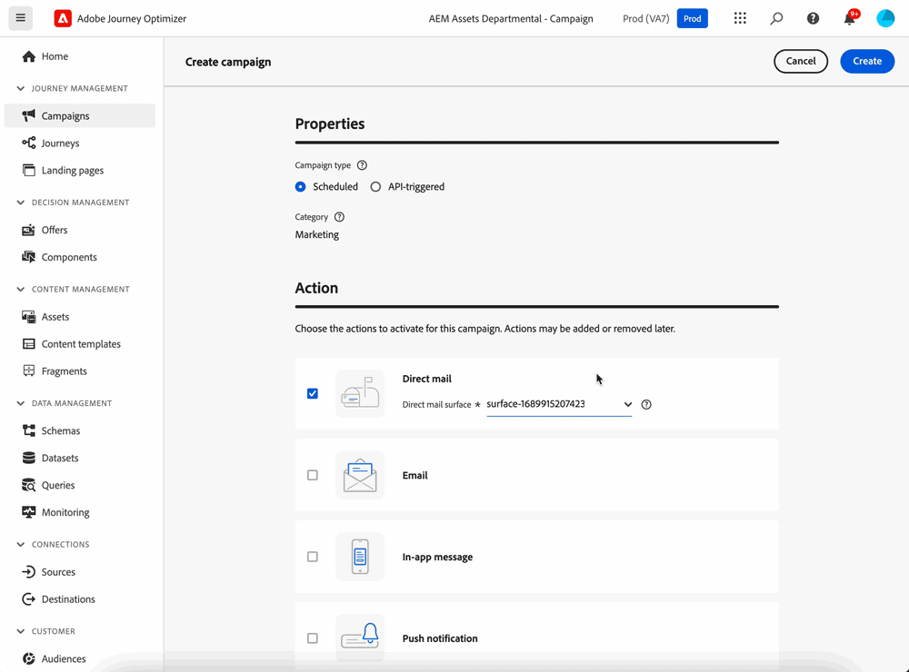

# Get started with direct mail {#create-direct}

Direct mail is an offline channel that allows you to personalize and generate the extraction files required by third-party direct mail providers to send mail to your customers. 

When creating a direct mail campaign, Journey Optimizer automatically generates a file containing all the targeted profiles and selected data, such as postal addresses and profile attributes. This file is sent to the server of your choice so that it is accessible by your chosen third-party direct mail provider, who will handle the actual mailing process for you.

You will need to work with your chosen third-party direct mail provider to obtain any required consents from you customers, if applicable, so that your customers can receive mail from you.

Your use of mailing services is subject to additional terms and conditions from the applicable third-party direct mail provider.  Adobe does not control and is not responsible for your use of third-party products. For any issues or requests for assistance related to the mailing of your direct mail campaign, contact your chosen third-party direct mail provider.

The main steps to send direct mail messages are as follows:

>[!AVAILABILITY]
>
>Direct mail messages can only be created in the context of scheduled campaigns. They are not available for use in orchestrated and API-triggered campaigns or in journeys.

## Additional resources

* **[Create direct mail](create-direct-mail.md)** - Learn how to create direct mail deliveries and configure extraction files for offline channels.
* **[Configure direct mail channel](direct-mail-configuration.md)** - Set up direct mail surfaces and file routing configurations.
* **[Direct mail in journeys](direct-mail-journeys.md)** - Discover how to use direct mail actions within customer journeys.
* **[Test and send direct mail](test-send-direct-mail.md)** - Learn how to test, validate, and publish your direct mail deliveries.
* **[Direct mail tutorials](https://experienceleague.adobe.com/en/docs/journey-optimizer-learn/tutorials/channels/direct-mail-channel/direct-mail){target="_blank"}** - Explore step-by-step video tutorials on direct mail features and best practices.

