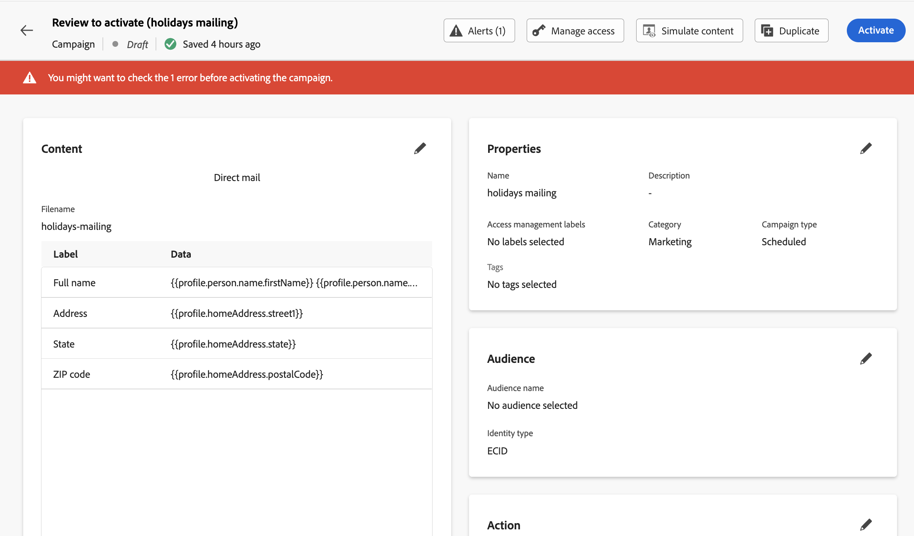

# Check & send a direct mail message {#direct-mail-test-send}

## Preview the extraction file {#preview-dm}

Once the content of the extraction file has been defined, you can use test profiles to preview it. If you inserted personalized content, you can check how this content is displayed in the message, using test profile data.

To do this, click **[!UICONTROL Simulate content]** then add a test profile to check how the extraction file rendering using the test profile data.

{width="800" align="center"}

Detailed information on how to select test profiles and preview your content is available in the [Content Management](../content-management/preview-test.md) section.

Once that the file content is ready to be sent, close the simulate screen then click the **[!UICONTROL Review to activate]** button.

## Validate & activate the direct mail campaign {#dm-validate}

>[!IMPORTANT]
>
> If your campaign is subject to an approval policy, you will need to request approval in order to be able to send your Direct mail campaign. [Learn more](../test-approve/gs-approval.md)

Before activating the direct mail campaign, make sure that the campaign or journey and the extraction file are configured properly. To do this, check alerts in the upper section of the editor. Some of them are simple warnings, but others can prevent you from sending the message. Two types of alerts can happen: warnings and errors.

* **Warnings** refer to recommendations and best practices. For example, a warning message is displayed if your SMS message is empty.

* **Errors** prevent you from publishing the campaign, as long as they are not resolved. For example, an error message warns you when the subject line is missing.

{width="800" align="center"}

When your direct mail campaign is ready, complete the configuration of your [journey](../building-journeys/journey-gs.md) or [campaign](../campaigns/create-campaign.md) to send it.

>[!NOTE]
>
>The exported file by default ends with a newline. This ensures compatibility with standard data-processing tools.

Once sent, you can measure the impact of your direct mail campaign or journey within the reports. For more about direct mail reporting, refer to these sections:
* [Direct mail campaign report](../reports/campaign-global-report-cja-direct.md)
* [Direct mail journey report](../reports/journey-global-report-cja-direct.md)

## Manage consent for direct mail {#dm-consent-management}

In [!DNL Journey Optimizer], consent is handled by the Experience Platform [Consent schema](https://experienceleague.adobe.com/docs/experience-platform/xdm/field-groups/profile/consents.html){target="_blank"}. By default, the value for the consent field is empty and treated as consent to receive your communications.

If a profile has opted out from receiving direct mail, in the corresponding Experience Platform profile attributes, the value for `consents.marketing.postalMail.val` will be `n` and the corresponding profile will be excluded from subsequent deliveries.

To enable it again, the profile attribute has to be changed back to `consents.marketing.postalMail.val` : `y`.

To manage a profile's attributes, go to Experience Platform and access the profile by selecting an identity namespace and a corresponding identity value. Learn more in the [Experience Platform documentation](https://experienceleague.adobe.com/docs/experience-platform/profile/ui/user-guide.html#getting-started){target="_blank"}.

Learn more about managing opt-out in Journey Optimizer in [this section](../privacy/opt-out.md).
