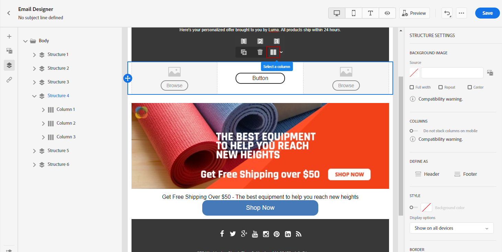
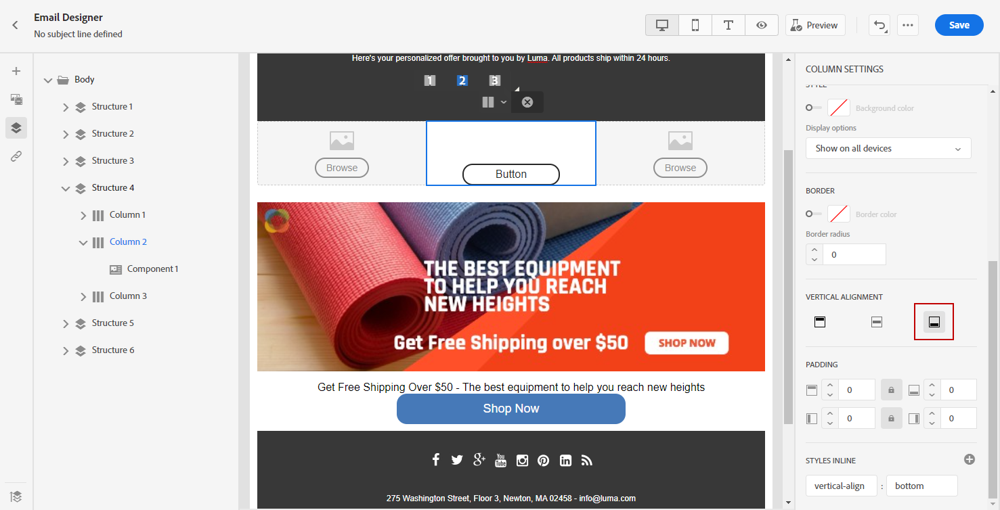
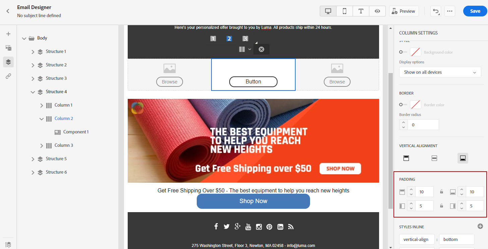

# Adjust vertical alignment & padding {#alignment-and-padding}

In this example, we will adjust padding and vertical alignment inside a structure component composed of three columns.

1. Select the structure component directly in the email or using the **[!UICONTROL Navigation tree]** available in the left-hand menu.

1. From the toolbar, click **[!UICONTROL Select a column]** and choose the one that you want to edit. You can also select it from the structure tree.

   The editable parameters for that column are displayed in the **[!UICONTROL Styles]** tab.

   

1. Under **[!UICONTROL Alignment]**, select **[!UICONTROL Top]**, **[!UICONTROL Middle]** or **[!UICONTROL Bottom]**.

   

1. Under **[!UICONTROL Padding]**, define the padding for all side. 

   Select **[!UICONTROL Different padding for each side]** if you want to fine tune the padding. Click the lock icon to break synchronization.

   

1. Proceed similarly to adjust the other columns' alignment and padding.

1. Save your changes.

>[!TIP]
>
>When designing email content for Gmail on Android devices, ensure that images and dividers use column padding rather than large, fixed margins. Gmail on Android often renders oversized images and margins incorrectly, causing layout overflow or reduced divider lines. Use a smaller image width or rely on column-based padding for consistent display.

## Manage fragment padding with breadcrumb navigation {#fragment-padding-breadcrumb}

When working with [fragments](../content-management/fragments.md) in the Email Designer, you may encounter hidden or residual padding that affects mobile rendering differently than desktop. This is particularly common when fragments have been unlocked or when [inheritance has been broken](use-visual-fragments.md#break-inheritance), as leftover styling can remain in the underlying column or text components.

To identify and edit leftover padding in fragments:

1. Use the **[!UICONTROL Navigation tree]** or click directly on elements in the editor to select each parent structure or column within your fragment. This helps you locate hidden padding or margin that may be specific to mobile devices.

1. After selecting the element in the breadcrumb, navigate to the **[!UICONTROL Styles]** tab on the right.

1. Review the **[!UICONTROL Padding]** settings and remove or readjust the padding as needed to achieve correct mobile alignment.

1. If alignment issues persist when reusing fragments, repeat this process for other columns or text components within the fragment.

>[!NOTE]
>
>This behavior is expected when fragments are repeatedly inserted and removed, as styling rules can accumulate. Always verify padding values using the breadcrumb navigation, especially when targeting mobile devices.