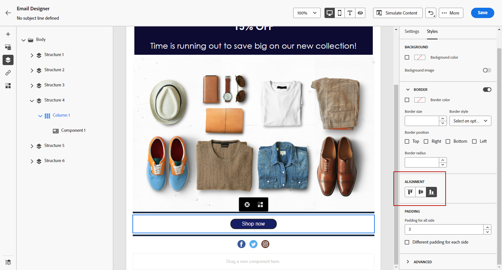

# Adjust vertical alignment & padding {#alignment-and-padding}

In this example, we will adjust padding and vertical alignment inside a structure component composed of three columns.

1. Select the structure component directly in the email or using the **[!UICONTROL Navigation tree]** available in the left-hand menu.

1. From the toolbar, click **[!UICONTROL Select a column]** and choose the one that you want to edit. You can also select it from the structure tree.

   The editable parameters for that column are displayed in the **[!UICONTROL Styles]** tab.

   

1. Under **[!UICONTROL Alignment]**, select **[!UICONTROL Top]**, **[!UICONTROL Middle]** or **[!UICONTROL Bottom]**.

   

1. Under **[!UICONTROL Padding]**, define the padding for all side. 

   Select **[!UICONTROL Different padding for each side]** if you want to fine tune the padding. Click the lock icon to break synchronization.

   

1. Proceed similarly to adjust the other columns' alignment and padding.

1. Save your changes.
