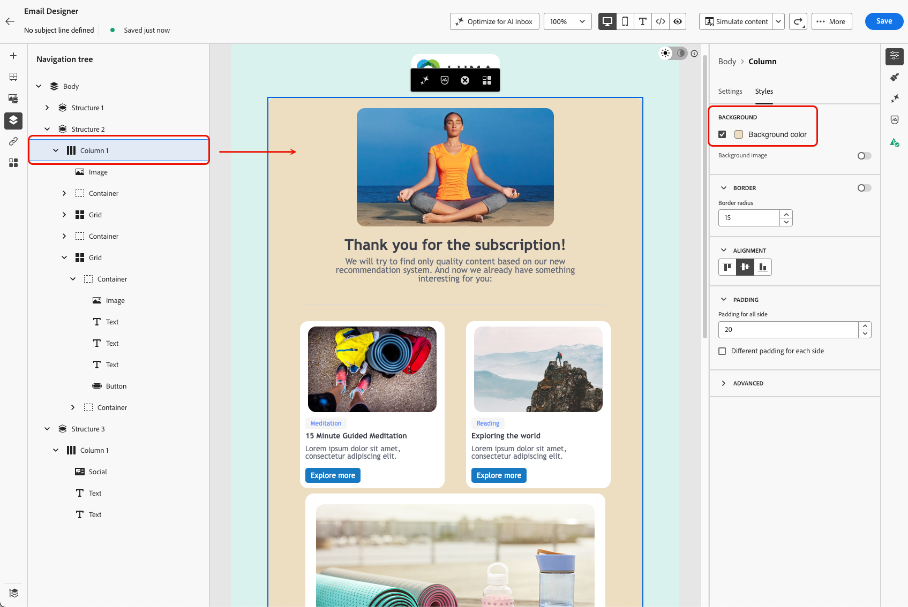
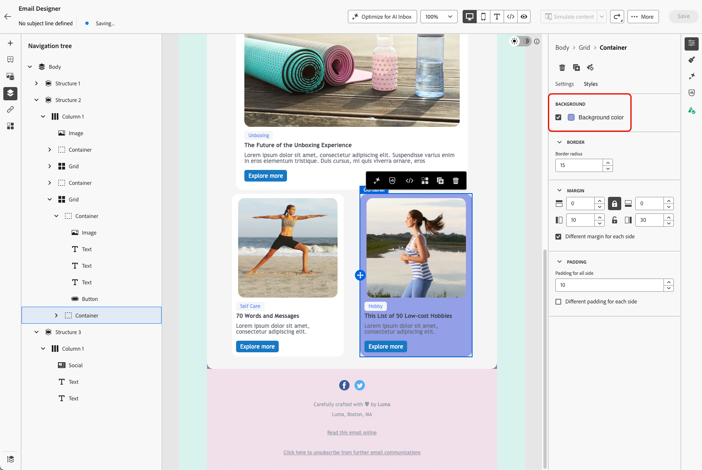

# Personalize your email background {#backgrounds}

>[!BEGINSHADEBOX]

**On this page:** Learn how to set background colors and images at the body, viewport, structure, and column levels of your email in the Email Designer.

>[!ENDSHADEBOX]

>[!CONTEXTUALHELP]
>id="ac_edition_backgroundimage"
>title="Background settings"
>abstract="You can personalize the background color or background image for your content. Note that background image is not supported by all email clients." 

When it comes to setting backgrounds with the Email Designer, Adobe recommends the following:

1. Apply a background color to the body of your email if required by your design.
1. Usually, set background colors at the column level.
1. Try not to use background colors on image or text components as they are difficult to manage.

Below are the available background settings that you can use.

1. Set a **[!UICONTROL Background color]** for the whole email. Make sure you select the body settings in the navigation tree accessible from the left Palette.

    

1. Set a **[!UICONTROL Viewport color]** to apply the same background color across all structure components, independently of the body's background color.

    

1. To apply a background color to a single structure component, select it and set a specific **[!UICONTROL Background color]** for that structure.

    

    >[!TIP]
    >
    >In that case, make sure you do not set a viewport background color as it may hide the structure background colors.

1. Set a **[!UICONTROL Background image]** for the content of a structure component.

    >[!NOTE]
    >
    >Some email programs do not support background images. When not supported, the row background color will be used instead. Make sure you select an appropriate fallback background color in case the image cannot be displayed.

    Once a background image is set, use the **[!UICONTROL Image placement]** dropdown to control how the image fills the structure or column:

    * **[!UICONTROL Fit]** - Stretches the image to fill the container on both axes, without preserving its aspect ratio.
    * **[!UICONTROL Full Width]** - Scales the image proportionally to the container's width and centers it vertically.
    * **[!UICONTROL Full Width - Top]** - Same as **[!UICONTROL Full Width]**, anchored to the top of the container. Overflow is cropped at the bottom.
    * **[!UICONTROL Full Width - Bottom]** - Same as **[!UICONTROL Full Width]**, anchored to the bottom of the container. Overflow is cropped at the top.
    * **[!UICONTROL Full Height]** - Scales the image proportionally to the container's height and centers it horizontally.
    * **[!UICONTROL Full Height - Left]** - Same as **[!UICONTROL Full Height]**, anchored to the left of the container. Overflow is cropped on the right.
    * **[!UICONTROL Full Height - Right]** - Same as **[!UICONTROL Full Height]**, anchored to the right of the container. Overflow is cropped on the left.
    * **[!UICONTROL Repeat]** - Tiles the image at its original size to fill the container.
    * **[!UICONTROL Left]**, **[!UICONTROL Right]**, **[!UICONTROL Center]**, **[!UICONTROL Top]**, **[!UICONTROL Bottom]** - Positions the image at its original size, anchored to the corresponding edge or center of the container.

    

    >[!NOTE]
    >
    >**[!UICONTROL Full Width - Top]**, **[!UICONTROL Full Width - Bottom]**, **[!UICONTROL Full Height - Left]**, and **[!UICONTROL Full Height - Right]** give you more control over which part of the image stays in view when it doesn't match the structure's proportions, compared to using **[!UICONTROL Fit]**, **[!UICONTROL Full Width]**, or **[!UICONTROL Full Height]** alone.

1. Finally, you can set a background color at the column level.

    

    >[!NOTE]
    >
    >This is the most common use case. Adobe recommends setting background colors at the column level as this allows for more flexibility when editing the whole email content.

    You can also set a background image at the column level, but this is rarely used.

{{$include /help/_includes/do-not-localize/email/ai-augmented-backgrounds.md}}
