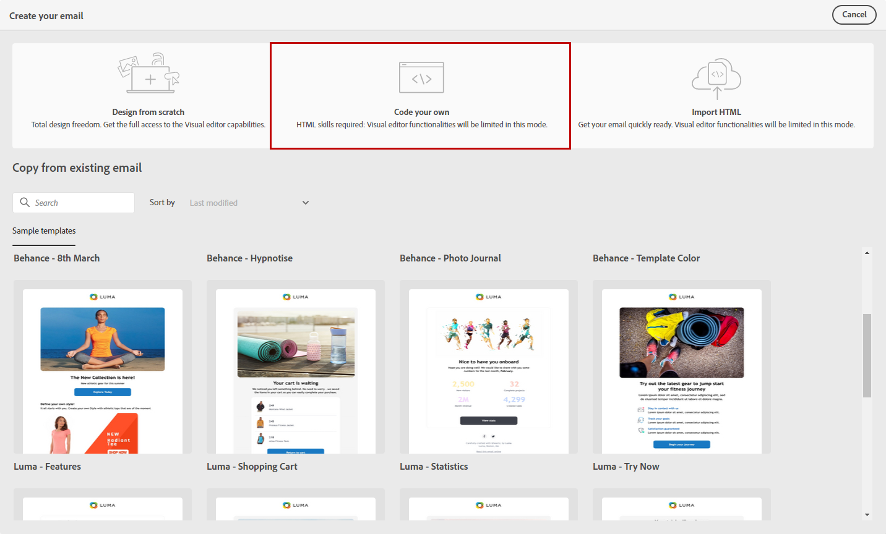
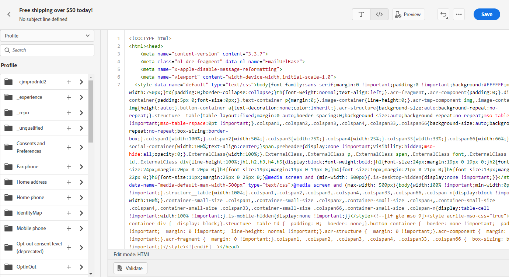
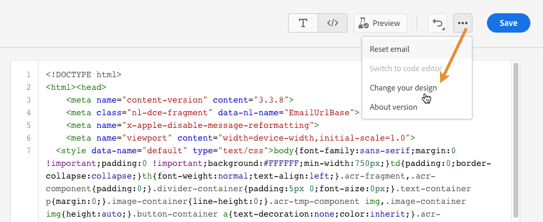
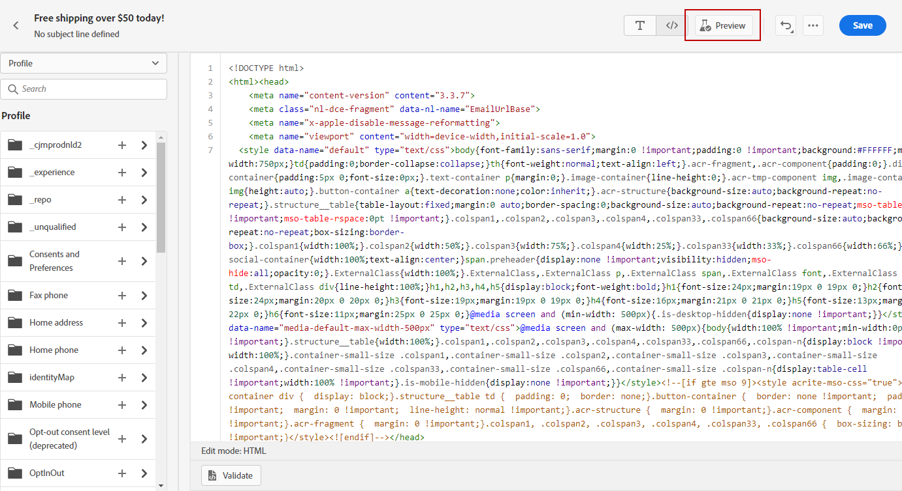
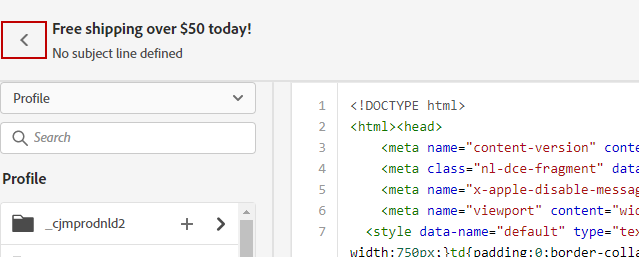

# Code your own content {#code-content}

Use the **[!UICONTROL Code your own]** mode to import raw HTML and/or code your email content. This method requires HTML skills.

➡️ [Discover this feature in video](#video)

>[!CAUTION]
>
> Images from [Adobe Experience Manager Assets](../integrations/assets.md) cannot be referenced when using this method. The images referenced in your HTML code must be stored into a public location. 

1. From the Email Designer home page, select **[!UICONTROL Code your own]**.

    

1. Enter or paste your raw HTML code. 

1. Use the left pane to leverage [!DNL Journey Optimizer] personalization capabilities. [Learn more](../personalization/personalize.md)

    

    >[!NOTE]
    >
    >The personalization editor in the Email Designer has some function limitations compared to journey expressions. [Learn more about date/time function limitations](#date-time-limitations)

1. If you want to clear your email content and start your email from a new design, select **[!UICONTROL Change your design]** from the options menu.
    
    

    >[!NOTE]
    >
    >This action opens the selected template in the Email Designer. From there, you can either complete the design of your email, or go back to the code editor using the **[!UICONTROL Switch to code editor]** option.

1. Click the **[!UICONTROL Preview]** button to check the message design and personalization using test profiles. [Learn more](../content-management/preview-test.md)

    

1. Once your code is ready, click **[!UICONTROL Save]** then go back to the message creation screen to finalize your message.

    

## Date and time function limitations {#date-time-limitations}

When using personalization in the Email Designer code editor, the `now()` function is not available for dynamic date calculations.

>[!IMPORTANT]
>
>The `now()` function is **not supported** in the Email Builder's expression language. While `now()` is available in journey conditions, it cannot be used within email content or the code editor.

**Available alternatives:**

Use the following functions to work with current date and time in email personalization:

* **`getCurrentZonedDateTime()`** - Returns the current date and time with time zone information. This is the recommended alternative to `now()`.
  
  Example: `` returns `2024-12-06T17:22:02.281067+05:30[Asia/Kolkata]`

* **`currentTimeInMillis()`** - Returns current time in epoch milliseconds.
  
  Example: ``

**Recommended workarounds:**

If you need to perform date calculations in your email content:

* **Pre-calculate date fields** - Calculate required date values in your data pipeline or profile attributes before sending the email, then reference these pre-calculated values in your personalization.
  
  Example: ``

* **Use date manipulation functions** - Use [date/time functions](../personalization/functions/dates.md) like `dayOfYear()` or `diffInDays()` with date values from profile attributes.
  
  Example: ``

* **Use computed attributes** - Create [computed attributes](../audience/computed-attributes.md) that perform complex date calculations, making the results available as profile attributes.

Learn more about [Date Time Functions in personalization](../personalization/functions/dates.md).
