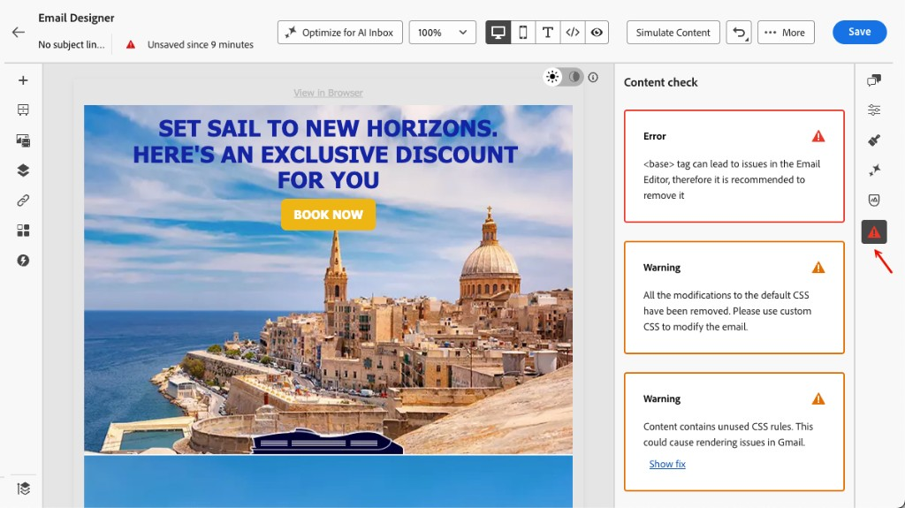
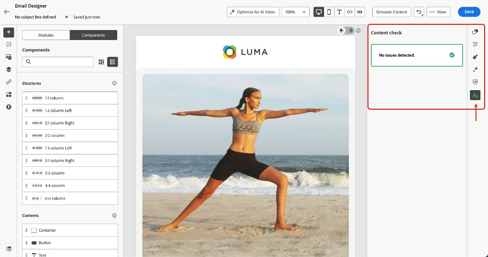

# Content checks in the Email Designer {#content-checks}

[!DNL Journey Optimizer] includes automated technical validation directly in the Email Designer, helping you catch HTML and CSS issues before sending.

Results are surfaced as errors, warnings, or informational notices in the authoring panel, with contextual details and one-click fixes where available, so issues can be resolved without leaving the Email Designer.

## Access content checks {#access-content-checks}

Content checks are always available in the Email Designer. To view them, click the Issues icon in the right rail to open the **[!UICONTROL Content check]** pane — all detected issues are listed there.

Checks are automatically run against the current state of your email and after each edit.

When no issues are detected, the pane displays **No issues detected** and the corresponding icon is green.

## Understand severity levels {#severity}

Checks are surfaced with three severity levels:

| Severity | Color | Description |
|---|---|---|
| **Error** | Red | A critical issue that will cause delivery or rendering failures. Resolve before sending. |
| **Warning** | Orange | A potential issue that may affect rendering in specific email clients. Recommended to review and resolve. |
| **Info** | Blue | Informational notice about a condition that does not block sending but may affect the long-term maintainability of your content. |

For some detected issue, you can click the **[!UICONTROL Show details]** button to see more context. Click **[!UICONTROL Hide details]** to collapse.

{width="80%"}

Similary, you can click the **[!UICONTROL Show fix]** button and apply a one-click fix where available. If the fix cannot be applied automatically, a messsage is displayed and you must manually solve the issue.

{width="80%"}

## Fix detected issues {#fix-issues}

The tables below list all possible messages and the recommended action for each. Expand the category matching the message you see in the **[!UICONTROL Content check]** pane.

+++ Unsupported HTML elements

| Message | Severity | What to do |
|---|---|---|
| Your content contains a `<script>` tag, which is not supported in any email system. Remove it to avoid delivery and rendering issues. | Error | Locate and remove all `<script>` tags from your HTML content. |
| Your content contains a `<base>` tag, which can cause link and resource resolution issues in the Email Designer. To fix, you need to remove it. | Error | Remove the `<base>` tag from your HTML. |
| Your content contains an HTML meta tag with refresh, which is not supported in the Email Designer. Remove it to prevent unexpected behavior. | Warning | Remove the meta refresh tag from your HTML. |
| Your content contains empty divs, which can cause layout issues in Microsoft Outlook (MSO). To fix this, remove the empty divs and use the spacing of sibling elements instead. | Warning | Delete the empty `
` elements and adjust padding or margin on surrounding elements to maintain spacing. |

+++

+++ CSS issues

| Message | Severity | What to do |
|---|---|---|
| Total CSS size exceeds Gmail's 16 KB limit and will cause rendering issues in Gmail. | Error | Use **[!UICONTROL Apply fix]** to remove unused CSS rules automatically, or manually simplify your styles. |
| Total CSS size is close to Gmail's 16 KB limit and could cause rendering issues if more CSS is added. | Warning | Use **[!UICONTROL Apply fix]** to remove unused CSS rules, or reduce styles before adding more content. |
| Total CSS size for this fragment exceeds 3 KB. Combining this with other fragments could cause the total email CSS to exceed Gmail's 16 KB limit and cause rendering issues. | Warning | Simplify the CSS in this fragment to keep the combined email CSS under 16 KB. |
| Content contains unused CSS rules. This could cause rendering issues in Gmail. | Warning | Use **[!UICONTROL Apply fix]** to automatically remove CSS rules that reference elements no longer present in the email. |
| Your content has modifications to the system-generated default CSS. These changes may be overridden by future Email Designer updates. To preserve your styles, add them using the Custom CSS feature instead. | Info | Move your custom styles to [Custom CSS](custom-css.md) to ensure they are preserved across Email Designer updates. |

+++

+++ HTML size

| Message | Severity | What to do |
|---|---|---|
| Estimated HTML size exceeds Gmail's 100 KB limit and will cause rendering issues in Gmail. The actual HTML size may differ at send time. | Error | Reduce email content — remove unnecessary elements, simplify structure, or split content across multiple sends. |
| Estimated HTML size is close to Gmail's 100 KB limit and could cause rendering issues if more HTML is added. The actual HTML size may differ at send time. | Warning | Simplify content before adding more. Emails exceeding the Gmail limit will be clipped for recipients. |
| Estimated HTML size for this fragment exceeds 20 KB. Combining this with other fragments could cause the total email HTML to exceed Gmail's 100 KB limit and cause rendering issues. The actual HTML size may differ at send time. | Warning | Reduce the HTML in this fragment to keep the combined email size under Gmail's 100 KB limit. |

+++

## About HTML and CSS size {#size-estimation}

HTML and CSS size values are **estimates computed at authoring time** and may differ from the actual size delivered to recipients — for example, when your email uses conditional blocks (only one branch renders per recipient) or when HTML minification is enabled at send time.

Size warnings are proactive signals to help you optimize content before sending, not hard blocks.
