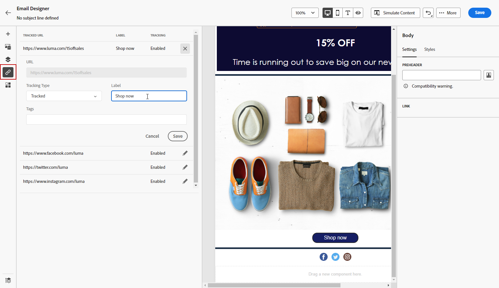

# Design content from scratch {#content-from-scratch}

>[!CONTEXTUALHELP]
>id="ac_structure_components_email"
>title="Add Structure components"
>abstract="Structure components define the layout of the email. Drag and drop a **Structure** component into the canvas to start designing your email content."

>[!CONTEXTUALHELP]
>id="ac_structure_components_landing_page"
>title="Add Structure components"
>abstract="Structure components define the layout of the landing page. Drag and drop a **Structure** component into the canvas to start designing the content of your landing page."

>[!CONTEXTUALHELP]
>id="ac_structure_components_fragment"
>title="Add Structure components"
>abstract="Structure components define the layout of the fragment. Drag and drop a **Structure** component into the canvas to start designing the content of your fragment."

>[!CONTEXTUALHELP]
>id="ac_structure_components_template"
>title="Add Structure components"
>abstract="Structure components define the layout of the template. Drag and drop a **Structure** component into the canvas to start designing the content of your template."

>[!CONTEXTUALHELP]
>id="ac_edition_columns_email"
>title="Define email columns"
>abstract="The Email Designer allows you to easily define the layout of your email by selecting the column structure."

>[!CONTEXTUALHELP]
>id="ac_edition_columns_landing_page"
>title="Define landing page columns"
>abstract="The Designer allows you to easily define the layout of your landing page by selecting the column structure."

>[!CONTEXTUALHELP]
>id="ac_edition_columns_fragment"
>title="Define fragment columns"
>abstract="The Designer allows you to easily define the layout of your fragment by selecting the column structure."

>[!CONTEXTUALHELP]
>id="ac_edition_columns_template"
>title="Define template columns"
>abstract="The Designer allows you to easily define the layout of your template by selecting the column structure."

Use Adobe Journey Optimizer Designer to easily define the structure of your contents. By adding and moving structural elements with simple drag-and-drop actions, you can design the shape of your contents within seconds.

To start building your content, follow the steps below:

1. From the Designer home page, select the **[!UICONTROL Design from scratch]** option.

    

1. Start designing your content by drag and dropping **[!UICONTROL Structures]** into the canvas to define the layout of your email.

   >[!NOTE]
   >
   >Stacking columns is not compatible with all email programs. When not supported, columns will not be stacked.

    <!--Once placed in the email, you cannot move nor remove your components unless there is already a content component or a fragment placed inside. This is not true in AJO - TBC?-->

1. Add as many **[!UICONTROL Structures]** as needed and edit their settings in the dedicated pane on the right.

    

    Select the **[!UICONTROL n:n column]** component to define the number of columns of your choice (between 3 and 10). You can also define the width of each column by moving the arrows at the bottom of each column.

   >[!NOTE]
   >
   >Each column size cannot be under 10% of the total width of the structure component. You cannot remove a column that is not empty.

1. Expand the **[!UICONTROL Contents]** section and add as many elements as you need into one or more structure components. [Learn more about content components](content-components.md)

1. Each component can be further customized using the **[!UICONTROL Settings]** or **[!UICONTROL Style]** tabs in the right menu. For example, you can change the text style, padding or margin of each component. [Learn more about alignment and padding](alignment-and-padding.md)

    

1. From the **[!UICONTROL Asset picker]**, you can directly select assets stored in the **[!UICONTROL Assets library]**. [Learn more about asset management](../content-management/assets-essentials.md)

    Double-click the folder which contains your assets. Drag and drop them into a structure component.

    

1. Insert personalization fields to customize your content from profiles attributes, audience memberships, Contextual attributes, and more. [Learn more about content personalization](../personalization/personalize.md)

    

1. Click **[!UICONTROL Enable condition content]** to add dynamic content and adapt the content to the targeted profiles based on conditional rules. [Get started with dynamic content](../personalization/get-started-dynamic-content.md)

    

1. Click the **[!UICONTROL Links]** tab from the left pane to display all the URLs of your content that will be tracked. You can modify their **[!UICONTROL Tracking Type]** or **[!UICONTROL Label]** and add **[!UICONTROL Tags]** if needed. [Learn more about links and tracking](message-tracking.md)

    

1. If needed, you can further personalize your email by clicking **[!UICONTROL Switch to code editor]** from the advanced menu. This allows you to edit the email source code, for example to add tracking or custom HTML tags. [Learn more about the code editor](code-content.md)

    >[!CAUTION]
    >
    >You cannot revert back to the visual designer for this email after switching to the code editor.

1. Once your content is ready, click the **[!UICONTROL Simulate content]** button to check rendering. You can choose the desktop or mobile view. [Learn more about previewing your email](preview.md)

    

1. When your content is ready, click **[!UICONTROL Save]**.

