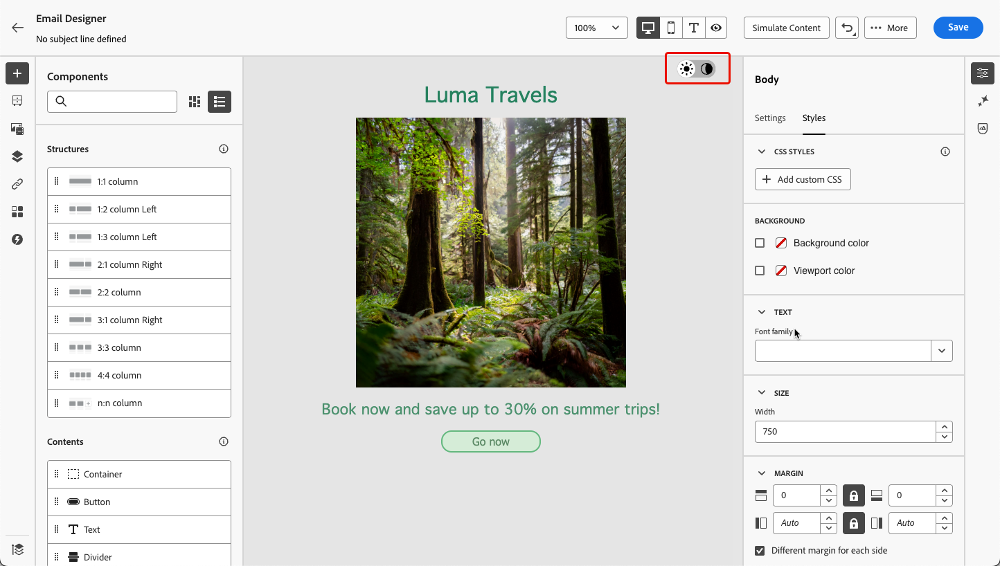
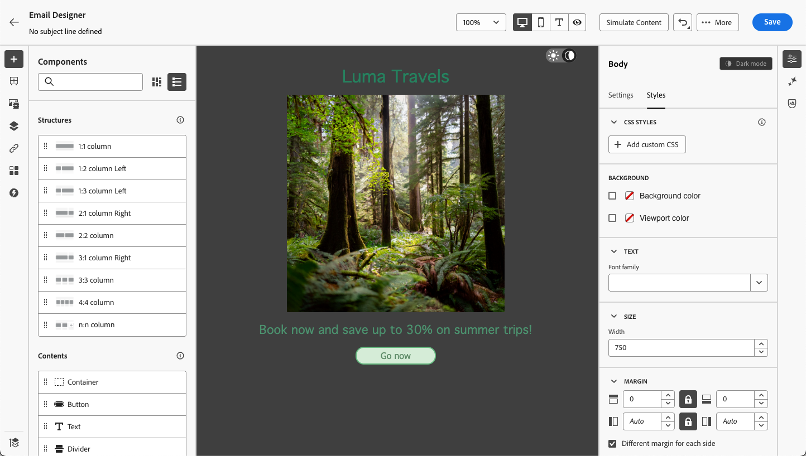
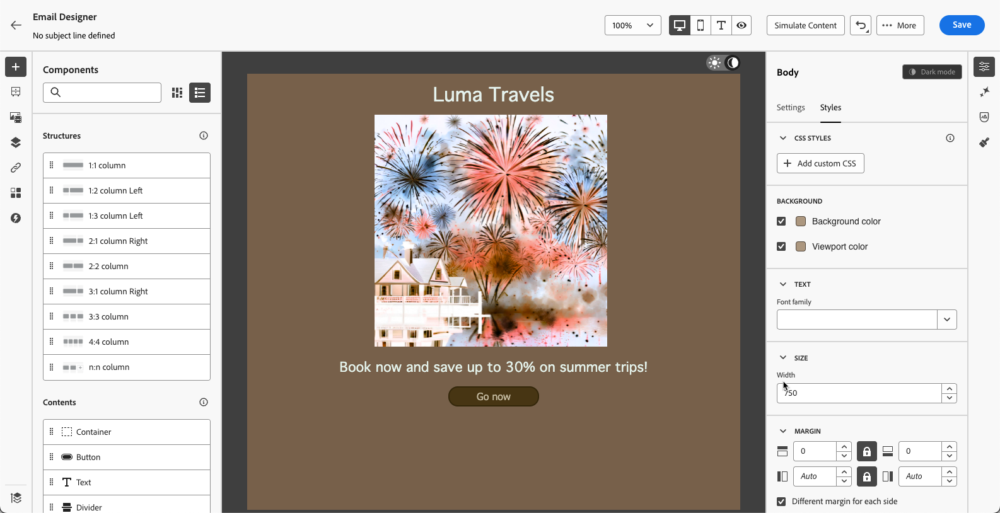
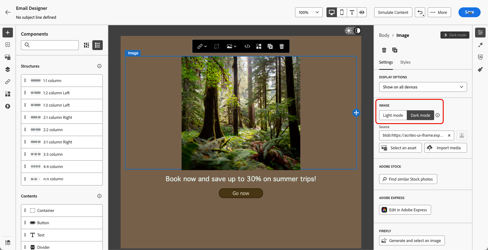
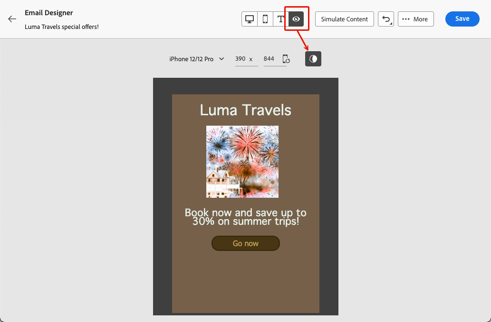
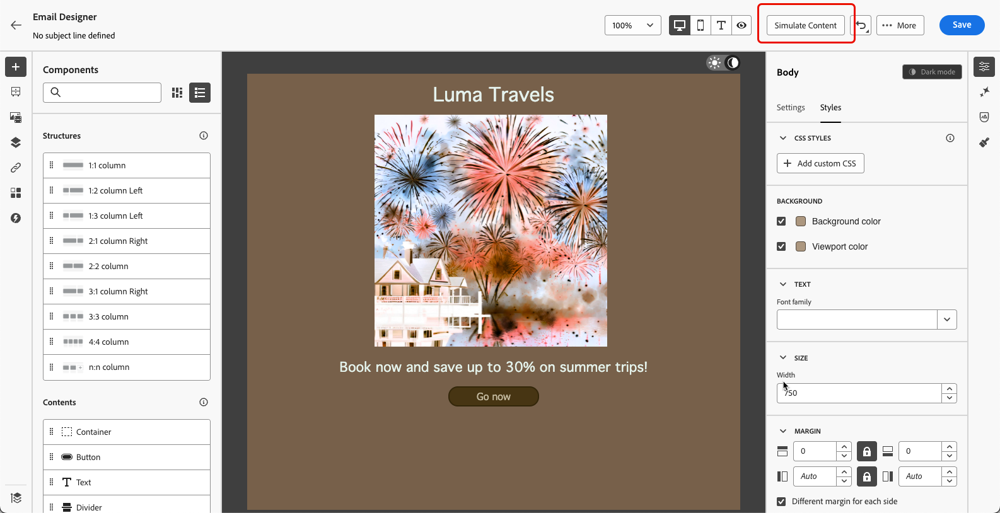

# Manage dark mode content {#dark-mode}

>[!CONTEXTUALHELP]
>id="ac_edition_darkmode"
>title="Switch to dark mode"
>abstract="Switch to dark mode where you can preview how it may render and define specific custom settings.  Caution : The final rendering depends on the recipient's email client. Not all email clients support custom dark mode."

>[!CONTEXTUALHELP]
>id="ac_edition_darkmode_image"
>title="Use a specific image for dark mode"
>abstract="You can select another image that will display when dark mode is on.  Caution : Adding a specific image for dark mode does not guarantee it renders correctly in all email clients. Not all email clients support custom dark mode."

>[!CONTEXTUALHELP]
>id="ac_edition_darkmode_preview"
>title="Switch to dark mode"
>abstract="Switch to dark mode to preview how it may render on supporting email clients.  Caution : The final rendering depends on the recipient's email client. Not all email clients support custom dark mode."

>[!AVAILABILITY]
>
>This capability is currently in beta version and only available to beta customers. To join the beta program, contact your Adobe representative.

When designing your emails, the [!DNL Journey Optimizer] [Email Designer](get-started-email-design.md) allows you to switch to **[!UICONTROL Dark mode]** where you can define specific custom settings. When dark mode is on, the supporting email clients will display the settings that you defined for this mode.

>[!WARNING]
>
>The dark mode final rendering depends on the recipient's email client.
>
>Not all email clients support custom dark mode. <!--[See the list](#non-supporting-email-clients)-->Moreover, some email clients only apply their own default dark mode for all emails that are received. In this case, the custom settings that you defined in the Email Designer cannot be rendered.

A list of the email clients supporting dark mode is presented in [this section](#supporting-email-clients).

## What is dark mode? {#what-is-dark-mode}

Dark mode allows supported email clients and apps to display emails with darker backgrounds and lighter colors for text, buttons and other UI elements. It enables to reduce eye strain, save battery life, and improve readability in low-light environments for a more comfortable viewing experience.

<!--Dark Mode uses a dark color palette with light text and UI elements to reduce eye strain, save battery life, and improve readability in low-light environments.-->

As a growing trend across major operating systems and apps (Apple Mail, Gmail, Outlook, Twitter, Slack), it has become an important consideration in modern email design to ensure content remains legible and visually appealing for all users.

However, it is not possible to guarantee that your email will look exactly the same in dark mode across all devices. Some visual changes may also be caused by the email app or device overriding the original design. 

Indeed, the way dark mode is applied by email clients can vary as follows<!--between different devices and apps-->:

* Not all email clients support this feature.

    >[!NOTE]
    >
    >A list of the email clients not supporting dark mode is presented in [this section](#non-supporting-email-clients).

* Some email clients automatically adjust colors, backgrounds, and images. In this case, if you define custom settings in the Email Designer, those settings will probably not be rendered.

* Other email clients give the option to render custom dark mode (such as with the `@media (prefers-color-scheme: dark)` method). In this case, the specific settings you define in the Email Designer should be displayed. Learn how to define custom dark mode settings in the Email Designer in [this section](#define-custom-dark-mode).

## Dark mode in the Email Designer {#dark-mode-email-designer}

When it comes to dark mode in the Email Designer, there are two aspects to consider:

* You can get a preview of how the default dark mode will render in most supporting email clients. [Learn more](#preview-dark-mode)

<!--
    >[!CAUTION]
    >
    >The final rendering may vary according to the recipient's email client. To see the exact rendering for each email client, use the [Email rendering](../content-management/rendering.md) option.-->

* If you want to override the default settings of supporting email clients, you can define custom dark mode settings applying to the email you are editing. [Learn more](#define-custom-dark-mode)

<!--
    >[!WARNING]
    >
    >Not all email clients support custom dark mode. Some email clients only apply their own default dark mode for all emails that are received. In this case, the custom settings that you defined in the Email Designer cannot be rendered. [Learn more](#guardrails)-->

### Preview default dark mode {#preview-dark-mode}

To access dark mode in the Email Designer and get a preview of the default dark mode settings, follow the steps below.

1. From the Email Designer home page, select the **[!UICONTROL Design from scratch]** option. [Learn more](content-from-scratch.md)

<!--Should work with templates and themes, NOT for LP and fragments - but TBC with eng.
    >[!NOTE]
    >
    >Currently you may not be able to switch to dark mode if you select an [email template](use-email-templates.md) or if you apply a [theme](apply-email-themes.md).-->

1. Add [structures](content-from-scratch.md) and [content components](content-components.md) to your content.

1. On top right of the central canvas, switch the toggle to **[!UICONTROL Dark mode]**.

    

1. The default dark mode preview displays.

    

By default, the Email Designer dark mode preview applies the 'full color invert' color scheme to all elements except images and icons.

It means that it detects areas with light and dark elements and inverts them, so that light backgrounds become dark and dark text becomes light, whereas dark backgrounds become light and light text becomes dark.

>[!CAUTION]
>
>The final rendering may vary according to the recipient's email client. To see a simulation that comes as close as possible to the final result for each email client, use the [Email rendering](../content-management/rendering.md) option.

<!--This is custom dark mode:

  

Here you can see that we have applied a different background, defined another image and change the color of the text and button.-->

### Define custom dark mode {#define-custom-dark-mode}

After switching to **[!UICONTROL Dark mode]**, you can choose to edit specific styling elements of your content that will be displayed only when dark mode is enabled in the recipient's email client - provided it supports that feature.

>[!WARNING]
>
>Not all email clients support dark mode. Moreover, some email clients only apply their own default dark mode for all emails that are received. In both cases, the custom settings that you defined in the Email Designer cannot be rendered.

To leverage the Email Designer custom dark mode styling, Journey Optimizer uses the<!-- `@media (prefers-color-scheme: dark)` method--> `@media (prefers-color-scheme: dark)` CSS query, which detects if the user's email client is set to dark mode and applies the dark-themed design that was defined in your email.

To define custom dark mode settings, follow the steps below.

1. Make sure you switch to the **[!UICONTROL Dark mode]** preview in the Email Designer. [Learn how](#preview-dark-mode)

1. Edit any styling color attributes such as text, backgrounds, button, etc.

1. You cannot change the colors of images and icons, but you can define specific assets for dark mode only. To do so, select any image. Switch to **[!UICONTROL Dark mode]** using the dedicated toggle in the **[!UICONTROL Settings]** pane and select a different asset.

    

    <!---->

1. At any time you can **[!UICONTROL Switch to live view]** in order to check how your content might render on various device sizes. From this view, select the Dark mode toggle on top of the screen to preview the dark mode version of your content across the different devices.

    {width="80%" align="center"}

    >[!CAUTION]
    >
    >The live view is a generic preview designed to compare how the rendering might look across various device sizes. The final rendering may vary according to the recipient's email client.

1. Once you are satisfied with the changes for dark mode, click **[!UICONTROL Simulate Content]**.

    

1. Select **[!UICONTROL Render email]** and connect to your Litmus account. You can see the final dark mode rendering for various email clients. Learn more on [Email rendering](../content-management/rendering.md).

    >[!WARNING]
    >
    >While simulation closely approximates how emails will appear in dark mode, actual rendering may differ due to variations in email service providers or device-level settings.

## Best practices {#best-practices}

As dark mode adoption increases across major email clients, it is essential to consider how your emails render in both light and dark environments - whether you are using [custom dark mode](#define-custom-dark-mode) or not.

Dark mode can alter colors, backgrounds, and images — sometimes overriding design choices. To ensure visual consistency, accessibility, and brand integrity, follow the best practices listed below.

**Optimize your images and logos**

* Avoid images with hardcoded white or light backgrounds.

* Save logos and icons as PNGs with transparent backgrounds to avoid visible white boxes in dark mode.

* If transparency is not an option, place images on a solid background in your design to prevent awkward color inversions.

**Watch your backgrounds**

* Ensure sufficient contrast between text and background colors for readability in both light and dark modes.

* Avoid relying on background colors alone for critical content. Some clients override background colors in dark mode, so ensure key information is still visible.

**Design accessible content in dark mode**

<!--KEEP dark mode accessibility best practices IN ONE SINGLE LOCATION - for now listed on this page.
If needed, it can be moved to the Design accessible content page:
The best practices for designing accesible content in dark mode are listed in [this section](accessible-content.md#dark-mode).-->

* Use color combinations easy to distinguish for people with color blindness.

* Use a midtone palette to ensure contrast against both light and dark backgrounds.

* Use accessible color combinations with high contrast to improve readability and meet Web Content Accessibility Guidelines (WCAG) standards. Use tools like WebAIM's Contrast Checker to verify color contrast.

* Avoid thin fonts as it can impact readability. If your brand requires a thin font, bold it in dark mode.

* Skip pure white on pure black as it can cause eye strain and might be automatically inverted by some email clients.

* Provide accessible fallback styling if dark mode is not supported.

**Test your emails in dark mode environment**

* Use the Email Designer's [dark mode preview](#preview-dark-mode) which uses inverted color schemes to spot issues early.

* Use the [Email rendering](../content-management/rendering.md) option that leverages Litmus to simulate your designs across major email clients (Apple Mail, Gmail, Outlook) and see how colors and images behave in dark mode.

<!--**Inline critical styles**

Inline CSS helps maintain more control over styling, as some clients strip external styles in dark mode.-->

## Email clients supporting dark mode {#supporting-email-clients}

Below is a list of the main email clients supporting dark mode.

>[!NOTE]
>
>Some versions of these email clients do not support dark mode, so they are also presented in this table for the sake of clarity.

| Email clients supporting dark mode| Compatible versions | *Unsupported versions* |
|---------|----------|---------|
| Apple Mail macOS| 12.4, 16.0 | *10.3* |
| Apple Mail iOS | 13.0, 16.1 | *12.2* |
| Outloook macOS | 2019, 16.70, 16.80 | NA |
| Outlook.com | 2019-07, 2022-12 | NA |
| Outloook iOS | 2020-01, 2022-12 | NA |
| Outloook Android | 2023-03 | *2020-01, 2022-12* |
| Samsung Email (Android) | 6.1 | *6.0* |
| Mozilla Thunderbird (macOS) | 68.4 | *60.8, 78.5, 91.13* |
| Fastmail (Desktop Webmail)| 2022-12 | *2021-07* |
| HEY (Desktop Webmail)| 2020-06 | *2022-12* |
| Orange Desktop Webmail| 2019-08, 2021-03, 2022-12, 2024-04 | NA |
| Orange iOS | 2022-12, 2024-04 | *2020-01* |
| Orange Android | 2024-04 | *2020-01, 2022-12* |
| LaPoste.net | 2021-08, 2022-12 | NA |
| SFR  Desktop Webmail | 2019-08, 2022-12 | NA |
| GMX (iOs and Android) | 2022-06 | NA |
| 1&1 (Desktop Webmail and Android) | 2022-06 | NA |
| WEB.DE (iOs and Android) | 2022-06 | NA |
| Free.fr | 2022-12 | NA |

>[!WARNING]
>
>The dark mode final rendering depends on each email client, so results can vary from one to another.

<!--
* Check out the list of [email clients supporting dark mode](https://www.caniemail.com/search/?s=dark){target="_blank"}

* Learn more on Dark mode in this [Litmus blog post](https://www.litmus.com/blog/the-ultimate-guide-to-dark-mode-for-email-marketers){target="_blank"}
-->

## Email clients not supporting dark mode {#non-supporting-email-clients}

Some email clients allow users to switch their interface to dark mode, but this setting does not affect how HTML emails are displayed. Regardless of whether the interface is in light or dark mode, your email will render the same. Here is a list of those clients:

| Email clients not supporting dark mode| 
|---------|
| Gmail (Desktop Webmail, iOS, Android, Mobile Webmail) | 
| Outloook Windows |
| Outlook Windows Mail | 
| Yahoo!Mail | 
| AOL | 
| ProtonMail |
| SFR iOS |
| SFR Android | 
| GMX Desktop Webmail | 
| Mail.ru | 
| WEB.DE Desktop Webmail | 
| T-online.de |
