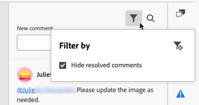

# Collaborate on email content in the Email Designer {#email-collaboration}

>[!CONTEXTUALHELP]
>id="ajo_email_collaboration"
>title="Collaborate on your emails"
>abstract="Add comments, tag reviewers, and track feedback directly in the Email Designer, without leaving the authoring experience."

The Email Designer includes collaboration tools for commenting and resolution so that marketing teams can seamlessly review, discuss, and finalize email content directly within [!DNL Journey Optimizer]. Instead of sharing drafts over external tools (like chat, email threads, or spreadsheets), users can comment, suggest edits, and resolve feedback within the Email Designer. Use these tools to streamline your workflow, reduce errors, and ensure that stakeholders are aligned before launching your email.

* **Centralized feedback** - Collect and track all feedback in one place.
* **Faster reviews** - Collaborators can review the email copy and assets within the authoring environment.
* **Improved accuracy** - Reduces the risk of miscommunication by keeping all edits tied to the email itself.
* **Transparency** - All comments and resolutions remain logged, making it clear what changes were suggested and implemented.
* **Collaboration in context** - Review email body copy, images, and call-to-action (CTA) elements within the layout.

<!--Check if like some other collaboration workflows, specific permission is required to use the collaboration tools in the Email Designer.-->

## Display collaboration tools and comments {#access-collaboration}

While creating, editing, or reviewing content in the Email Designer, you can access the **[!UICONTROL Collaboration]** panel to add or manage comments for the email content.

Click the **[!UICONTROL Collaboration]** icon in the right navigation.

{width="90%"}

## Collaboration workflow {#collaboration-workflow}

You can use the collaboration tools to follow a standard content workflow:

1. **Invite** your collaborators and reviewers.
1. **Reviewers** add comments.
1. Read comments, **add replies** to discuss feedback, and make needed edits.
1. **Reviewers or authors** resolve comments.

### Best practices for using the collaboration tools {#best-practices}

* Use **@** tagging so that feedback reaches the right team member quickly.
* Group related feedback into a single comment thread instead of multiple scattered notes.
* Always resolve comments as soon as they are addressed to maintain a clean workflow.
* Save a final approved version for compliance/audit purposes.

## Invite collaborators and reviewers {#invite-collaborators}

You can invite collaborators and reviewers to provide feedback on your email content, or add any comment that might be relevant to the email design workflow. Follow the steps below.

1. Select the body of the email to enter a general comment about the email content.
1. Click the **[!UICONTROL Collaboration]** icon in the right navigation.
1. At the top of the right panel, enter your invitation text for users to collaborate and provide feedback.
1. Use the **@** symbol to address and notify users. These users receive email and in-product [!DNL Pulse] notifications.

   As you enter the first few letters of the name after the symbol, a popup list displays matching user names. You can enter more letters in the name to improve the results.

   {width="90%"}

1. Select the name to add for notification. Add as many collaborators or reviewers as you want to include in the invitation.

   {width="90%"}

1. Click **[!UICONTROL Submit]**.

Each new comment starts a thread where collaborators can use **[!UICONTROL Reply]** to continue the discussion. Each comment/thread that is associated with a design element is numbered so that you can easily identify the element where it applies.

### Component comments {#component-comments}

1. Select a structure or content component.
1. In the toolbar, click the **[!UICONTROL Collaboration]** tool.

   {width="80%"}

1. Enter your comment in the text field.
1. Click **[!UICONTROL Submit]**.

Collaborators can click the numbered pin icon on the email canvas to view the comment.

## Reply to a comment {#reply-to-comment}

For each comment, you can use the **[!UICONTROL Reply]** function to continue a discussion or answer a question.

Click **[!UICONTROL Reply]** at the bottom of the comment and enter the text for your reply. To include a quote of the current comment in your reply, click the **[!UICONTROL More menu]** (…) icon and choose **[!UICONTROL Quote reply]**.

{width="100%"}

## Resolve comments {#resolve-comments}

As an author or designer, assess the feedback from reviewers and determine what changes you want to make. When changes are complete and the request is satisfied, click the **[!UICONTROL More menu]** (…) icon and choose **[!UICONTROL Resolve]**.

{width="100%"}

Once resolved, the comment/thread is hidden from the main view but can be accessed through the filter options.

## Manage comments {#manage-comments}

Manage the comments and threads to assess the status of your collaboration effort.

### Place a comment {#place-comment}

If a comment is not associated with an element on the email canvas, you can pin the comment to an element as needed. Click the **[!UICONTROL More menu]** (…) icon and choose **[!UICONTROL Place the comment]**. Then, select the design component on the canvas.

{width="60%"}

### Remove or delete comments {#remove-delete-comments}

You can clean up your comments log by removing and deleting them. Click the **[!UICONTROL More menu]** (…) icon and choose **[!UICONTROL Remove Comment]** or **[!UICONTROL Delete]**.

* When you remove a comment, the action decouples that comment from the design element (selected when the comment was created). The comment is still part of the comment record for the email.
* When you delete a comment, the action permanently deletes it from the record.

### Resolved comments {#resolved-comments}

By default, resolved comments are hidden in the **[!UICONTROL Collaboration]** panel. You can display resolved comments at any time by clearing the filter. Click the **[!UICONTROL Filter]** icon and clear the **[!UICONTROL Hide resolved comments]** checkbox.

{width="60%"}

The resolved comments include an **[!UICONTROL Unresolve]** icon. If you determine that a comment/thread is not resolved and further changes are needed, click the icon to remove the **[!UICONTROL Resolved]** designation.

{width="60%"}
