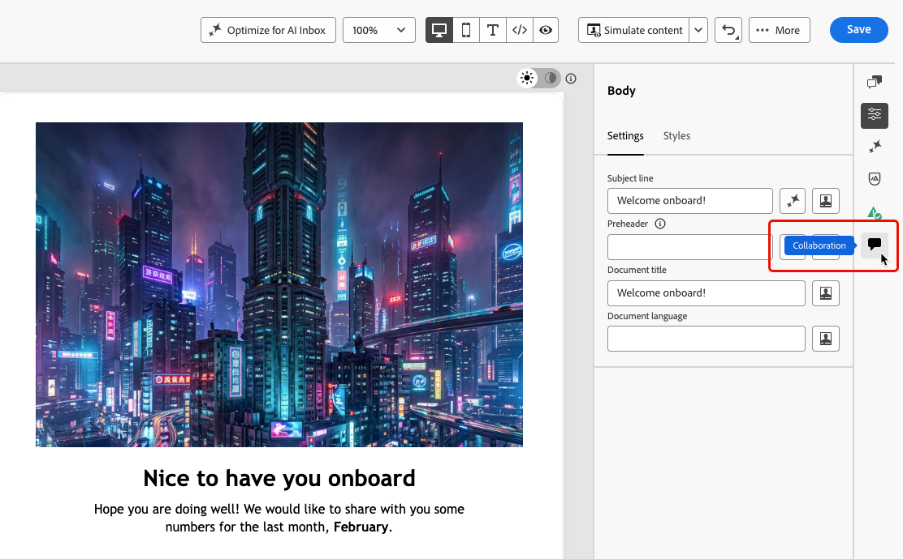
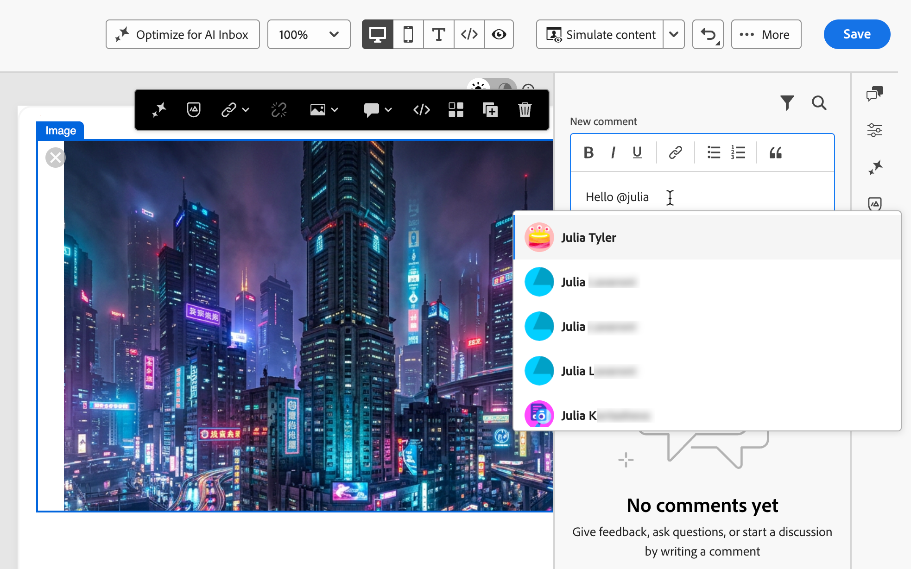
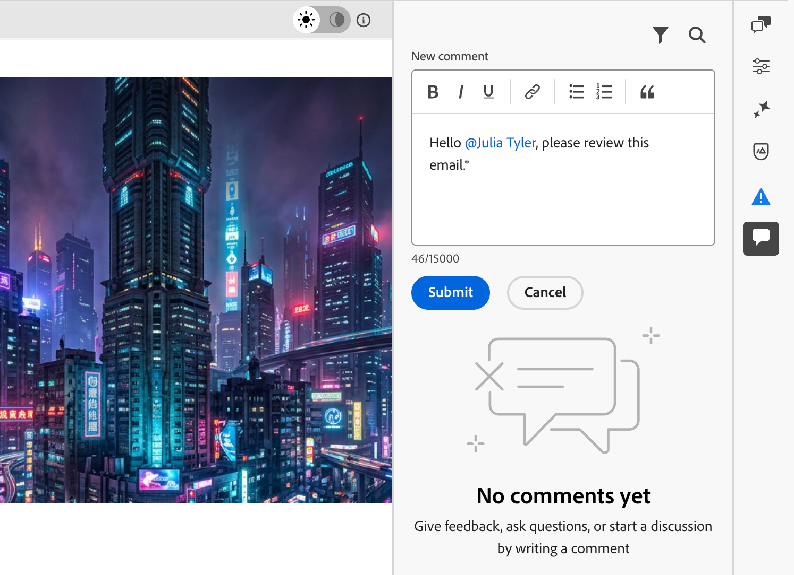
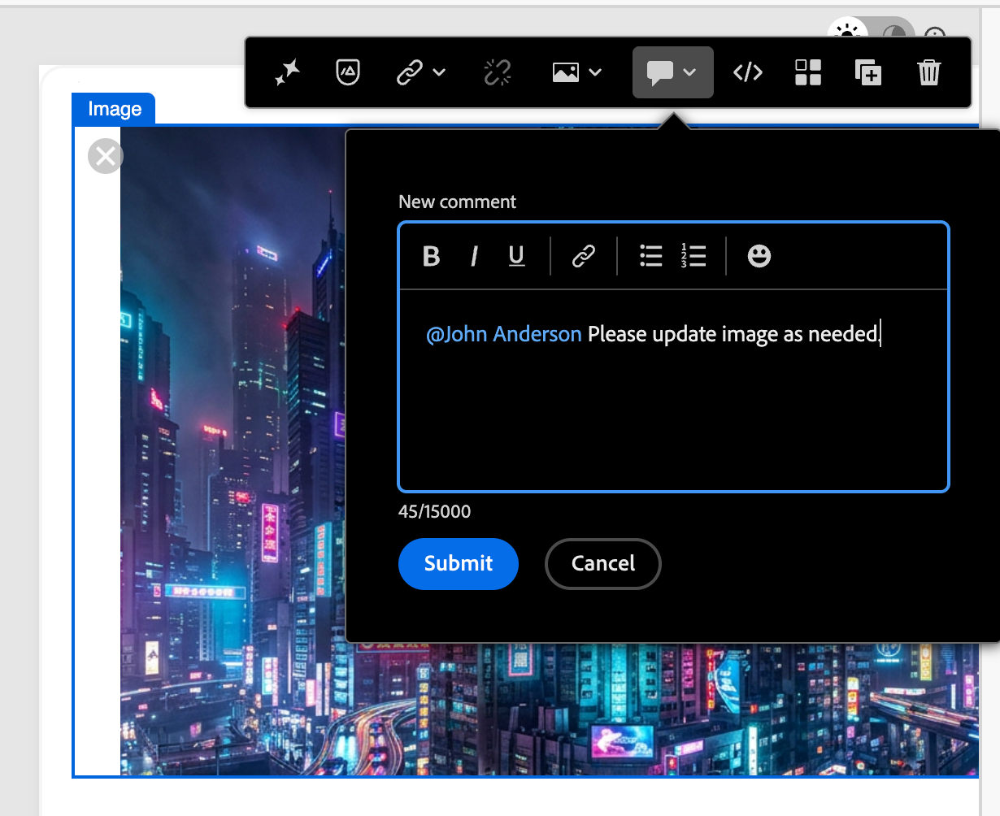
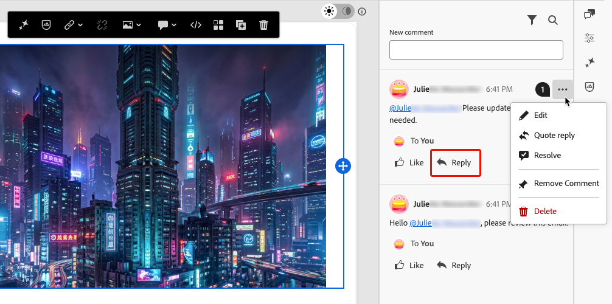
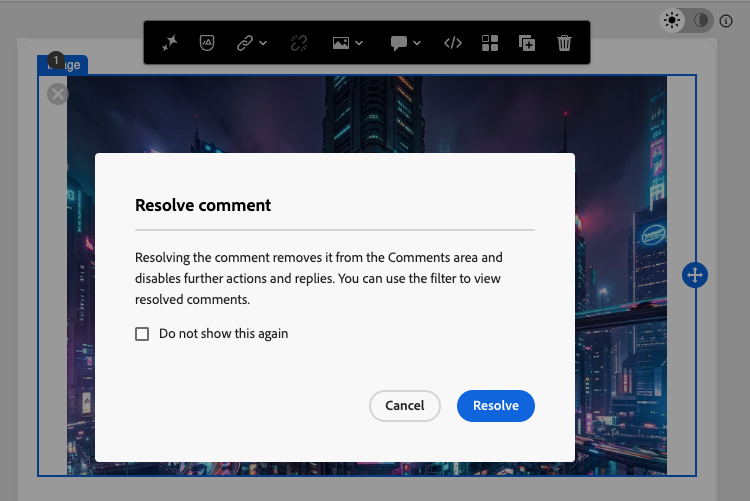
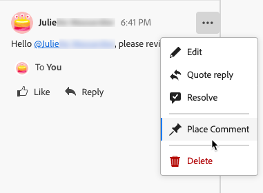
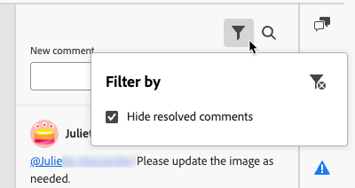
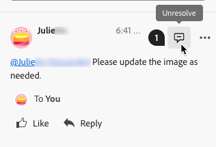

# Collaborate on email content in the Email Designer {#email-collaboration}

>[!CONTEXTUALHELP]
>id="ajo_email_collaboration"
>title="Collaborate on your emails"
>abstract="Add comments, tag reviewers, and track feedback directly in the Email Designer, without leaving the authoring experience."

The Email Designer includes commenting and resolution tools so your team can review, discuss, and finalize email content without leaving [!DNL Journey Optimizer]. Rather than passing drafts back and forth over chat, email threads, or spreadsheets, reviewers and authors can comment, suggest edits, and resolve feedback right on the email itself.

This keeps all the feedback in one place, speeds up reviews since everyone is working in the same authoring environment, and cuts down on the kind of miscommunication that comes from tracking edits in a separate document. Every comment and resolution stays logged against the email, so there's always a clear record of what was suggested and what actually changed.

<!--Check if like some other collaboration workflows, specific permission is required to use the collaboration tools in the Email Designer.-->

## Display collaboration tools and comments {#access-collaboration}

While creating, editing, or reviewing content in the Email Designer, you can access the **[!UICONTROL Collaboration]** panel to add or manage comments for the email content.

Click the **[!UICONTROL Collaboration]** icon in the right navigation.

{width="90%"}

### Collaboration workflow {#collaboration-workflow}

A typical review cycle looks like this:

1. [Invite](#invite-collaborators) your collaborators and reviewers.
1. Reviewers add comments.
1. Read the comments, [reply](#reply-to-comment) to discuss the feedback, and make the edits needed.
1. Reviewers or authors [resolve](#resolve-comments) the comments once they're addressed.

### Best practices for using the collaboration tools {#best-practices}

* Tag people with **@** so feedback reaches the right person instead of getting buried in a general comment.
* Keep related feedback in a single thread rather than spreading it across several separate comments.
* Resolve comments as you address them - it keeps the panel readable for everyone else on the team.
* Once everything is resolved, save a final approved version in case you need it later for compliance or an audit.

## Invite collaborators and reviewers {#invite-collaborators}

You can invite collaborators and reviewers to provide feedback on your email content, or add any comment that might be relevant to the email design workflow. Follow the steps below.

1. Select the body of the email to enter a general comment about the email content.
1. Click the **[!UICONTROL Collaboration]** icon in the right navigation.
1. At the top of the right panel, start entering your invitation text for users to collaborate and provide feedback.
1. Use the **@** symbol to address and notify users. These users receive email and in-product [!DNL Pulse] notifications.

   As you enter the first few letters of the name after the symbol, a popup list displays matching user names. You can enter more letters in the name to improve the results.

   {width="90%"}

1. Select the name to add for notification and complete your invitation message.

   {width="80%"}

   Add as many collaborators or reviewers as you want to include in the invitation.

1. Click **[!UICONTROL Submit]**.

Each new comment starts a thread where collaborators can use **[!UICONTROL Reply]** to continue the discussion. Each comment/thread that is associated with a design element is numbered so that you can easily identify the element where it applies.

### Component comments {#component-comments}

In addition to general comments on the email body, you can add a comment directly on a specific structure or content component.

1. Select a structure or content component.
1. In the toolbar, click the **[!UICONTROL Collaboration]** tool.

   {width="80%"}

1. Enter your comment in the text field.
1. Use the **@** symbol to tag and notify collaborators or reviewers, as needed.
1. Click **[!UICONTROL Submit]**.

Collaborators can click the numbered pin icon on the email canvas to view the comment.

## Reply to a comment {#reply-to-comment}

For each comment, you can use the **[!UICONTROL Reply]** function to continue a discussion or answer a question.

1. Click **[!UICONTROL Reply]** at the bottom of the comment.

1. Enter the text for your reply.

1. To include a quote of the current comment in your reply, click the **(…)** icon and choose **[!UICONTROL Quote reply]**.

{width="100%"}

## Resolve comments {#resolve-comments}

As an author or designer, assess the feedback from reviewers and determine what changes you want to make.

1. When changes are complete and the request is satisfied, click the **(…)** icon.

1. Select **[!UICONTROL Resolve]** from the contextual menu.

1. Click **[!UICONTROL Resolve]** to confirm the action.

   {width="100%"}

Once resolved, the comment/thread is hidden from the main view but can be accessed through the filter options.

## Manage comments {#manage-comments}

Manage the comments and threads to assess the status of your collaboration effort.

### Place a comment {#place-comment}

If a comment is not associated with an element on the email canvas, you can pin the comment to an element as needed. Click the **(…)** icon and choose **[!UICONTROL Place the comment]**. Then, select the design component on the canvas.

{width="60%"}

### Remove or delete comments {#remove-delete-comments}

You can clean up your comments log by removing and deleting them. Click the **(…)** icon and choose **[!UICONTROL Remove Comment]** or **[!UICONTROL Delete]**.

* When you remove a comment, the action decouples that comment from the design element (selected when the comment was created). The comment is still part of the comment record for the email.
* When you delete a comment, the action permanently deletes it from the record.

### Resolved comments {#resolved-comments}

By default, resolved comments are hidden in the **[!UICONTROL Collaboration]** panel.

You can display resolved comments at any time by clearing the filter. Click the **[!UICONTROL Filter]** icon and clear the **[!UICONTROL Hide resolved comments]** checkbox.

{width="60%"}

The resolved comments include an **[!UICONTROL Unresolve]** icon. If you determine that a comment/thread is not resolved and further changes are needed, click the icon to remove the **[!UICONTROL Resolved]** designation.

{width="60%"}
