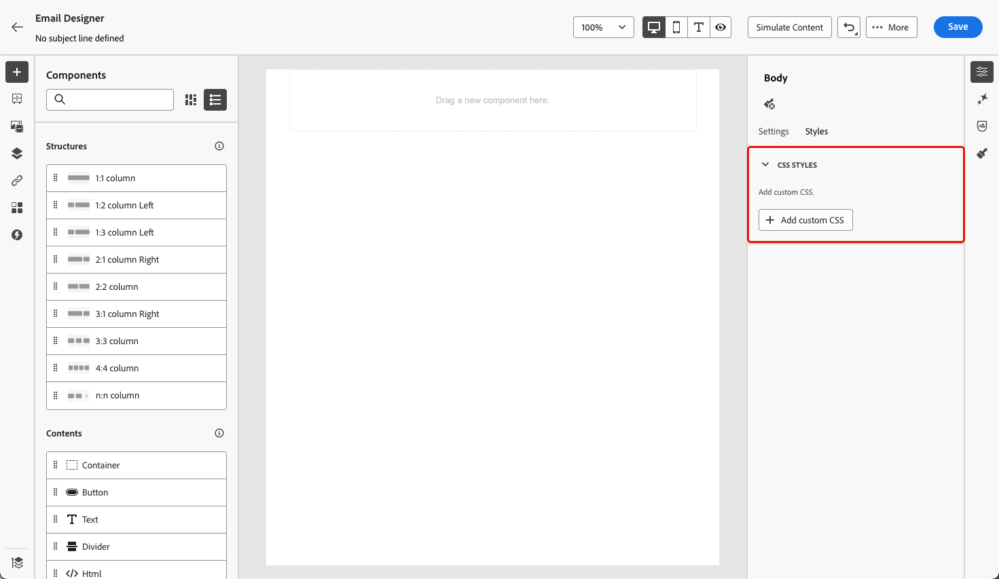

# Add metadata to your email content {#email-metadata}

>[!CONTEXTUALHELP]
>id="ac_edition_css"
>title="Add custom CSS"
>abstract="xxx."

When designing your emails, you can add your own custom CSS directly within the [!DNL Journey Optimizer] [Email Designer](get-started-email-design.md).

What is expected in the Add custom CSS text area is a valid CSS string.



Conditions of availability

The Add custom CSS feature is available only when there is a content defined in the editor. To see the Add custom CSS section, the user needs to add content in the editor. If the user removes all their content, the section will disappear and the custom css will not be applied. If the user adds content back, the section will be available and the custom css will be applied.

**Examples of invalid CSS inputs**

Invalid CSS can't be saved and if the CSS is invalid a red toast will appear to indicate the CSS could not be saved.

`<style>` is not accepted


```
<style type="text/css">
  .acr-Form {
    width: 100%;
    padding: 20px 100px;
    border-spacing: 0px 8px;
    box-sizing: border-box;
    margin: 0;
  }
</style>
```


missing brace is invalid

```
body {
 background: red; 
```
