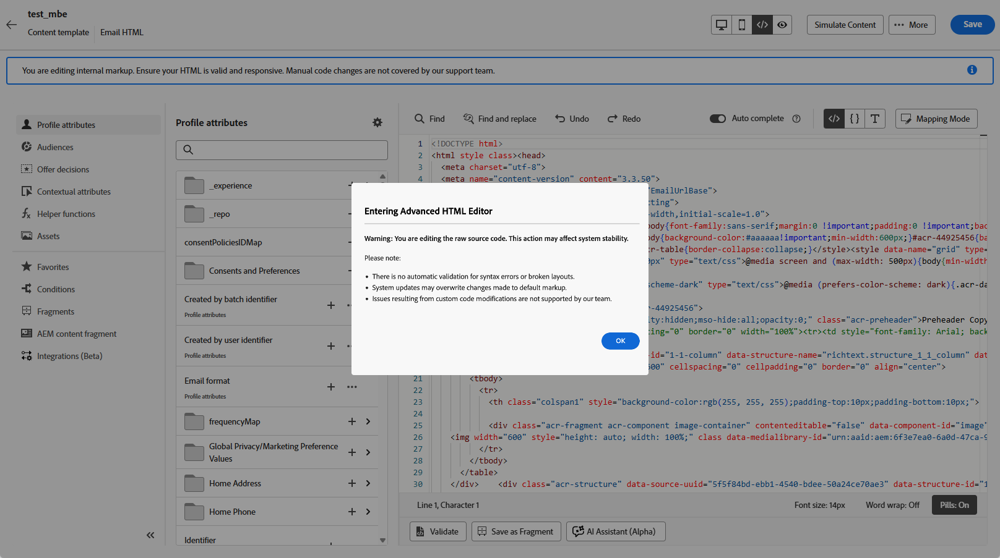
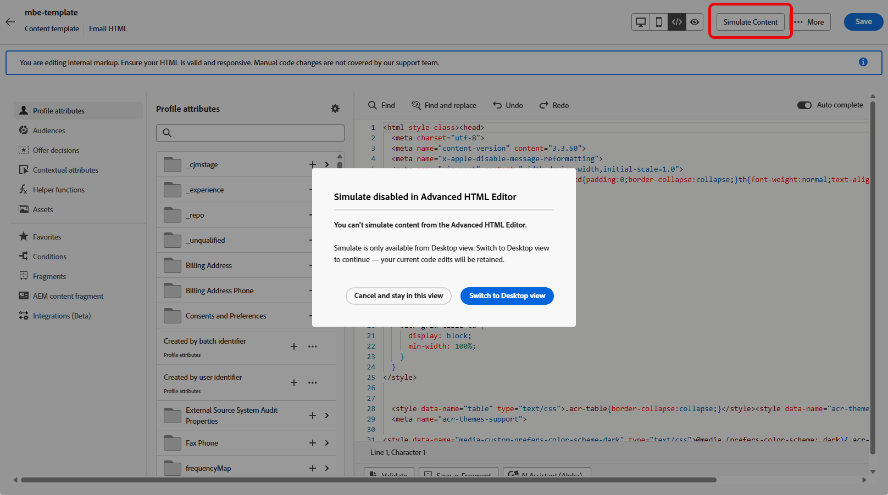

# Edit email content with the advanced HTML editor {#email-expert-mode}

>[!AVAILABILITY]
>
>This capability is available in Limited Availability. Contact your Adobe representative to gain access.

The **advanced HTML editor** is an expert mode that lets you view and edit the raw HTML source of **email content** directly in the [!DNL Journey Optimizer] [Email Designer](get-started-email-design.md)—whether you are [designing an email](content-from-scratch.md) for a journey, a campaign, or editing an [email content template](../content-management/create-content-templates.md).

This capability lets you insert advanced expressions—such as conditions—directly in the source. When you switch back to the visual (Desktop) view, the content is re-rendered so you can check how it looks and continue editing in either view.

## Guardrails {#guardrails}

When you use the advanced HTML editor, the following guardrails protect content compatibility and set expectations.

* The advanced HTML editor **does not validate** your code. It does not check syntax errors or broken layouts. Review your content carefully before saving.

* Future system updates may overwrite changes you make to default markup. **Your changes may not persist**.

* The [!DNL Adobe] support team **cannot troubleshoot or resolve** issues caused by custom code and manual changes. Keep a backup of your content in case you need to revert.

* You cannot simulate content in advanced HTML view. Switch to Desktop view to preview your content.

* To ensure content compatibility, **you cannot save** in advanced HTML view. Switch back to Desktop view when you are ready to save your changes.

>[!WARNING]
>
>The advanced HTML editor is not the same as **[!UICONTROL Code your own]** mode in the Email Designer. In [!UICONTROL Code your own] mode, you cannot switch back to the visual editor—once you choose that path, you stay in code-only editing. The advanced HTML editor, by contrast, lets you toggle between HTML view and Desktop (visual) view at any time. [Learn more about the code editor](code-content.md)

## Switch to advanced HTML view {#switch-to-html-view}

To open the advanced HTML editor and edit your HTML source, follow these steps.

1. Open the email or template you want to edit in the Email Designer—for example, [create or edit an email](create-email.md) from a journey or campaign, or open an [email content template](../content-management/create-content-templates.md) and edit its body in the [Email Designer](get-started-email-design.md).

1. Click the **[!UICONTROL HTML]** button in the top-right corner of the screen.

    

1. The first time you open the advanced HTML editor, a warning message is displayed. Review it carefully and click **[!UICONTROL OK]** to continue. [Learn more](#guardrails)

    {zoomable="yes"}

    >[!NOTE]
    >
    >This warning appears only the first time you open the advanced HTML editor and resets each month.

1. The advanced HTML editor displays.

    

1. Add the desired changes to your email content.

    >[!WARNING]
    >
    >Make sure to enter correct HTML and CSS code as there is no syntax validation process and no support is provided by [!DNL Adobe]. [Learn more](#guardrails)

1. Content simulation and saving are not available in advanced HTML view for compatibility reasons. Switch back to Desktop view to preview your content and save your changes.

    {zoomable="yes"}

    >[!NOTE]
    >
    >Your edits are preserved when you switch views.

<!--
    {zoomable="yes"}
-->

## Related topics

* [Code your own email content](code-content.md)
* [Create content templates](../content-management/create-content-templates.md)
* [Get started with the Email Designer](get-started-email-design.md)
