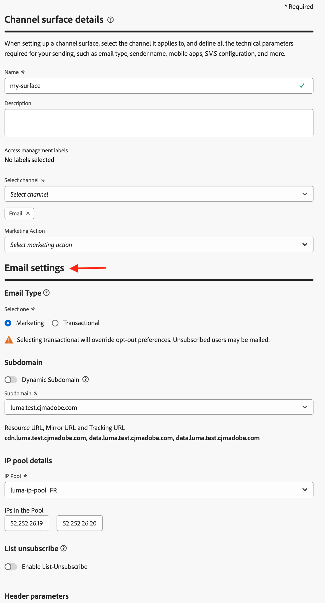
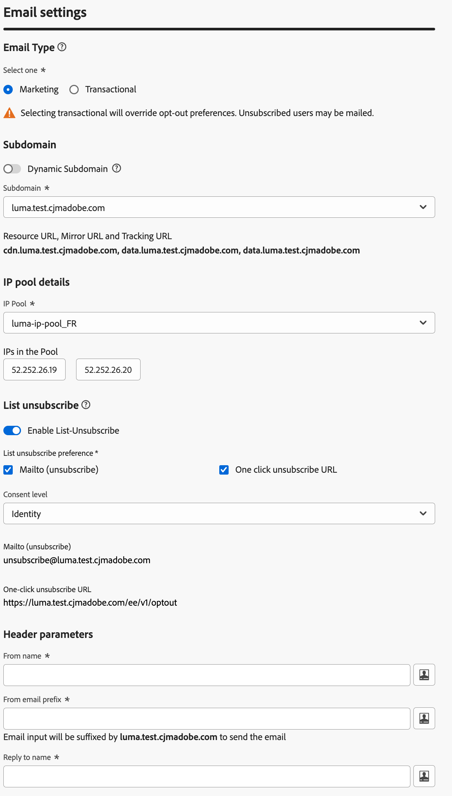
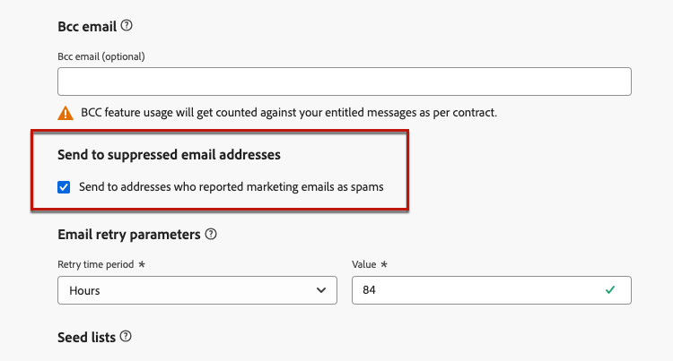
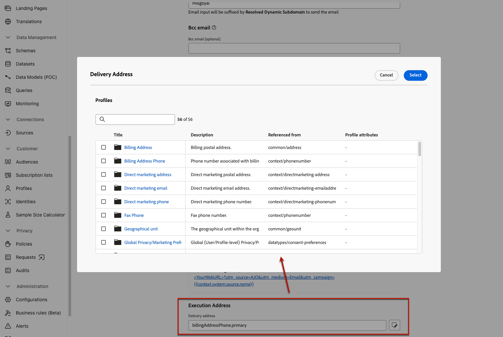

# Configure email settings {#email-settings}

To start creating an email, you need to set up email channel configurations that define all the technical parameters required for your messages. [Learn how to create configurations](../configuration/channel-surfaces.md)

>[!NOTE]
>
>To preserve your reputation and improve your deliverability, set up the subdomains you will use for sending emails before creating an email configuration. [Learn more](../configuration/about-subdomain-delegation.md)

Define the email settings in the dedicated section of the channel configuration, as detailed below. 

{width="50%" align="left"}

The email configuration gets picked up for sending communications following the logic below:

* For batch journeys, it does not apply to batch execution that had already started before the email surface configuration is made. The changes is picked up at the next recurrence or new execution.

* For transactional messages, the change is picked up immediately for the next communication (up to five-minute delay).

>[!NOTE]
>
>The updated email configuration settings is automatically picked up in the journey(s) or campaign(s) where the configuration is used.

## Email type {#email-type}

>[!CONTEXTUALHELP]
>id="ajo_admin_presets_emailtype"
>title="Define the email type"
>abstract="Select the type of emails that will be sent when using this configuration: Marketing for promotional emails, which require user consent, or Transactional for non-commercial emails, that can also be sent to unsubscribed profiles in specific contexts."

In the **Email Type** section, select the type of message for the configuration: **[!UICONTROL Marketing]** or **[!UICONTROL Transactional]**.

* Select **Marketing** for promotional email, such as weekly promotions for a retail store. These messages require user consent.

* Select **Transactional** for non-commercial email, such as order confirmation, password reset notifications, or delivery information for example. These emails can be sent to profiles who **unsubscribed** from marketing communications. These messages can only be sent in specific contexts.

When creating a message, you must choose a valid channel configuration matching the category you selected for your email.

## Subdomain {#subdomains}

Select the subdomain to use to send the emails.

>[!NOTE]
>
>For increased control over your email settings, you can define dynamic subdomains. [Learn more](../email/surface-personalization.md#dynamic-subdomains)

To preserve the reputation of your domain, speed up the IP warming process and improve deliverability, delegate your sending subdomains to Adobe. [Learn more](../configuration/about-subdomain-delegation.md)

## IP pool details {#ip-pools}

Select the IP pool to associate with the configuration. [Learn more](../configuration/ip-pools.md)

{width="50%" align="left"}

You cannot proceed with configuration creation while the selected IP pool is under [edition](../configuration/ip-pools.md#edit-ip-pool) (**[!UICONTROL Processing]** status) and has never been associated with the selected subdomain. Otherwise, the oldest version of the IP pool/subdomain association will still be used. If this is the case, save the configuration as draft and retry once the IP pool has the **[!UICONTROL Success]** status.

>[!NOTE]
>
>For non-production environments, Adobe does not create out-of-the-box test subdomains nor grant access to a shared sending IP pool. You need to [delegate your own subdomains](../configuration/delegate-subdomain.md) and use the IPs from the pool assigned to your organization.

After an IP pool has been selected, PTR information is visible when hovering over the IP addresses displayed below the IP pool drop-down list. [Learn more on PTR records](../configuration/ptr-records.md)

>[!NOTE]
>
>If a PTR record is not configured, reach out to your Adobe representative.

## List unsubscribe {#list-unsubscribe}

Upon selecting a subdomain from the list, the **[!UICONTROL Enable List-Unsubscribe]** option displays. It is enabled by default.

It enables you to include a one-click unsubscribe URL into the email header. [Learn more](list-unsubscribe.md)

## Header parameters {#email-header}

In the **[!UICONTROL Header parameters]** section, enter the sender names and email addresses associated to the type of emails sent using that configuration. [Learn more](header-parameters.md)

## BCC email {#bcc-email}

You can send an identical copy (or blind carbon copy) of emails sent by [!DNL Journey Optimizer] to a BCC inbox where they will be stored for compliance or archival purposes.

To do this, enable the **[!UICONTROL BCC email]** optional feature at the channel configuration level. [Learn more](../configuration/archiving-support.md#bcc-email)

Additionally, when defining the **[!UICONTROL Bcc email]** address, make sure to use a subdomain that has a valid MX record configuration, otherwise the email configuration processing will fail.

If you get an error upon submitting the email configuration, it means that the MX record is not configured for the subdomain of the address you entered. Contact your administrator for configuring the corresponding MX record or use another address with a valid MX record configuration.

## Sending to suppressed email addresses {#send-to-suppressed-email-addresses}

>[!CONTEXTUALHELP]
>id="ajo_surface_suppressed_addresses"
>title="Override suppression list precedence"
>abstract="You can decide to send transactional messages to profiles even if their email addresses are on the Adobe Journey Optimizer suppression list due to spam complaint. This option is disabled by default."
>additional-url="https://experienceleague.adobe.com/docs/journey-optimizer/using/configuration/monitor-reputation/manage-suppression-list.html" text="Manage the suppression list"

>[!IMPORTANT]
>
>This option is only available if you selected the **[!UICONTROL Transactional]** email type. [Learn more](#email-type)

In [!DNL Journey Optimizer], all the email addresses that are marked as hard bounces, soft bounces, and spam complaints are automatically collected into the [suppression list](../configuration/manage-suppression-list.md) and excluded from sending in a journey or a campaign.

However, you can decide to go on sending messages of the **transactional** type to profiles even if their email addresses are on the suppression list due to spam complaint by the user.

Indeed, transactional messages generally contain useful and expected information, such as an order confirmation or a password reset notification. Therefore, even if they have reported one of your marketing messages as spam, most of the time you do want your customers to receive this type of non-commercial email.

To include email addresses suppressed due to spam complaint in your transactional message audience, select the corresponding option from the **[!UICONTROL Send to suppressed email addresses]** section.

>[!NOTE]
>
>This option is disabled by default.

As a deliverability best practice, this option is disabled by default to ensure your customers who have opted out are not contacted. However, you may change this default option, which then permits you to send transactional messages to your customers.

Once this option is enabled, although a customer marked your marketing email as spam, such customer will be able to receive your transactional messages using the current configuration. Always make sure to manage opt-out preferences in accordance with deliverability best practices.

## Seed list {#seed-list}

>[!CONTEXTUALHELP]
>id="ajo_surface_seed_list"
>title="Add a seed list"
>abstract="Select the seed list of your choice to automatically add specific internal addresses to your audiences. These seed addresses will be included at the delivery execution time and will receive an exact copy of the message for assurance purposes."
>additional-url="https://experienceleague.adobe.com/docs/journey-optimizer/using/configuration/seed-lists.html#use-seed-list" text="What are seed lists?"

A seed list in [!DNL Journey Optimizer] enables you to automatically include specific email seed addresses in your deliveries. [Learn more](../configuration/seed-lists.md)

>[!CAUTION]
>
>Currently this feature only applies to the email channel.

Select the list that is relevant to you in the **[!UICONTROL Seed list]** section. Learn how to create a seed list in [this section](../configuration/seed-lists.md#create-seed-list).

{width="80%"}

>[!NOTE]
>
>Only one seed list can be selected at a time.

When the current configuration is used in a campaign or journey, the email addresses on the selected seed list are included at the delivery execution time, meaning they will receive a copy of the delivery for assurance purposes.

Learn how to use seed list in a campaign or a journey in [this section](../configuration/seed-lists.md#use-seed-list).

## Email retry parameters {#email-retry}

>[!CONTEXTUALHELP]
>id="ajo_admin_presets_retryperiod"
>title="Adjust the retry time period"
>abstract="Retries are performed for 3.5 days (84 hours) when an email delivery fails due to a temporary soft bounce error. You can adjust this default retry time period to better suit your needs."
>additional-url="https://experienceleague.adobe.com/docs/journey-optimizer/using/configuration/monitor-reputation/retries.html" text="About retries"

You can configure the **Email retry parameters**.

By default, the [retry time period](../configuration/retries.md#retry-duration) is set to 84 hours, but you can adjust this setting to better suit your needs.

You must enter an integer value (in hours or minutes) within the following range:

* For marketing emails, the minimum retry period is 6 hours.
* For transactional emails, the minimum retry period is 10 minutes.
* For both email types, the maximum retry period is 84 hours (or 5040 minutes).

Learn more on retries in [this section](../configuration/retries.md).

## URL tracking {#url-tracking}

You can use **[!UICONTROL URL tracking parameters]** to measure the effectiveness of your marketing efforts across channels. [Learn more](url-tracking.md)

## Execution address {#execution-address}

>[!CONTEXTUALHELP]
>id="ajo_email_config_execution_address"
>title="Override the default execution address to use"
>abstract="When several email addresses are available in the database (personal, professional, etc.), you can choose which one to prioritize for sending. The primary address is defined at the sandbox level, but here you can override the default setting for this specific email configuration."

When you target a profile, several email addresses may be available in the database (professional email address, personal email address, etc.).

In that case, [!DNL Journey Optimizer] uses the address specified in the **[!UICONTROL Execution fields]** at the sandbox level to determine which email address to use from the profile service in priority. [Learn more](../configuration/primary-email-addresses.md)

>[!NOTE]
>
>To check the fields that are currently used by default, access the **[!UICONTROL Administration]** > **[!UICONTROL Channels]** > **[!UICONTROL General settings]** > **[!UICONTROL Executions fields]** menu.

However, you can change this default execution field at the email channel configuration level. You can then apply this setting to specific campaigns or journeys.

To do this, edit the **[!UICONTROL Delivery address]** field and select an item from the list of available email-type XDM fields.

The execution field is updated and is then used as the primary address. It overrides the general setting at the sandbox level.
