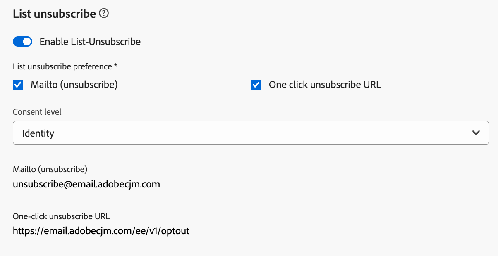

# Configure email settings {#email-settings}

To start creating an email, you need to set up email channel surfaces that define all the technical parameters required for your messages. [Learn how to create surfaces](../configuration/channel-surfaces.md)

>[!NOTE]
>
>To preserve your reputation and improve your deliverability, set up the subdomains you will use for sending emails before creating an email surface. [Learn more](../configuration/about-subdomain-delegation.md)

Define the email settings in the dedicated section of the channel surface configuration, as detailed below. 

{width="50%" align="left"}

The email surface configuration gets picked up for sending communications following the logic below:

* For batch journeys, it does not apply to batch execution that had already started before the email surface configuration is made. The changes is picked up at the next recurrence or new execution.

* For transactional messages, the change is picked up immediately for the next communication (up to five-minute delay).

>[!NOTE]
>
>The updated email surface settings is automatically picked up in the journey(s) or campaign(s) where the surface is used.

## Email type {#email-type}

>[!CONTEXTUALHELP]
>id="ajo_admin_presets_emailtype"
>title="Define the email type"
>abstract="Select the type of emails that will be sent when using this surface: Marketing for promotional emails, which require user consent, or Transactional for non-commercial emails, that can also be sent to unsubscribed profiles in specific contexts."

In the **Email Type** section, select the type of message for the surface: **[!UICONTROL Marketing]** or **[!UICONTROL Transactional]**.

* Select **Marketing** for promotional email, such as weekly promotions for a retail store. These messages require user consent.

* Select **Transactional** for non-commercial email, such as order confirmation, password reset notifications, or delivery information for example. These emails can be sent to profiles who **unsubscribed** from marketing communications. These messages can only be sent in specific contexts.

When creating a message, you must choose a valid channel surface matching the category you selected for your email.

## Subdomain {#subdomains}

Select the subdomain to use to send the emails.

To preserve the reputation of your domain, speed up the IP warming process and improve deliverability, delegate your sending subdomains to Adobe. [Learn more](../configuration/about-subdomain-delegation.md)

<!--If needed, you can define dynamic subdomains. [Learn more](../email/surface-personalization.md#dynamic-subdomains)-->

## IP pool details {#ip-pools}

Select the IP pool to associate with the surface. [Learn more](../configuration/ip-pools.md)

{width="50%" align="left"}

You cannot proceed with surface creation while the selected IP pool is under [edition](../configuration/ip-pools.md#edit-ip-pool) (**[!UICONTROL Processing]** status) and has never been associated with the selected subdomain. Otherwise, the oldest version of the IP pool/subdomain association will still be used. If this is the case, save the surface as draft and retry once the IP pool has the **[!UICONTROL Success]** status.

>[!NOTE]
>
>For non-production environments, Adobe does not create out-of-the-box test subdomains nor grant access to a shared sending IP pool. You need to [delegate your own subdomains](../configuration/delegate-subdomain.md) and use the IPs from the pool assigned to your organization.

After an IP pool has been selected, PTR information is visible when hovering over the IP addresses displayed below the IP pool drop-down list. [Learn more on PTR records](../configuration/ptr-records.md)

>[!NOTE]
>
>If a PTR record is not configured, reach out to your Adobe representative.

## List Unsubscribe Header{#list-unsubscribe}

<!--Do not modify - Legal Review Done -->

Upon [selecting a subdomain](#subdomains-and-ip-pools) from the list, the **[!UICONTROL Enable List-Unsubscribe]** option displays.

This option is enabled by default to include a one-click unsubscribe URL into the email header, such as:

If you disable this option, no one-click unsubscribe URL is displayed in the email header.

You can select the consent level from the **[!UICONTROL Consent level]** drop down list. It can be specific to the channel or to the profile identity. Based on this setting, when a user unsubscribes using the list unsubscribe URL in the header of an email, the consent gets updated in Adobe Journey Optimizer either at the channel level or ID level.

The List Unsubscribe Header offers two features (Mailto and One-click unsubscribe URL, as explained below) which are enabled by default unless you uncheck one or both features:

* A **Mailto (unsubscribe)** address, which is the destination address where unsubscribe requests are routed to for auto-processing.

    In Journey Optimizer, the unsubscribe email address is the default **Mailto (unsubscribe)** address displayed in the channel surface, based on your [selected subdomain](#subdomains-and-ip-pools).

    {width="50%" align="left"}

* The **One-click unsubscribe URL**, which by default is the one-click opt our URL generated List Unsubscribe Header, based on the subdomain you set and configured in the Channel Surface Settings. 

    >[!AVAILABILITY]
    >
    >One-click Unsubscribe URL Header will be available in Adobe Journey Optimizer starting June 3, 2024.
    >

The **[!UICONTROL Mailto (unsubscribe)]** feature and the **[!UICONTROL One-click Unsubscribe URL]** feature are optional. If you do not want to use the default generated one-click unsubscribe URL, you can uncheck the feature. In the scenario where the **[!UICONTROL Opt-out configuration]** option is toggled on and the **[!UICONTROL One-click Unsubscribe URL]** feature is unchecked, if you add a [one-click opt-out link](../privacy/opt-out.md#one-click-opt-out) to a message created using this surface, the list unsubscribe header will pick up the one-click opt-out link you have inserted in the body of the email and use that as the one-click unsubscribe URL value.
 

>[!NOTE]
>
>If you do not add a one-click opt-out link into your message content and the default one-click unsubscribe URL is unchecked in the Channel Surface Settings, no URL will be passed into the email header as part of the List Unsubscribe header.

Learn more on managing unsubscribe capabilities in your messages in [this section](../email/email-opt-out.md#unsubscribe-header).

## Header parameters {#email-header}

In the **[!UICONTROL Header parameters]** section, enter the sender names and email addresses associated to the type of emails sent using that surface.

* **[!UICONTROL Sender name]**: The name of the sender, such as your brand's name.
* **[!UICONTROL Sender email]**: The email address you want to use for your communications.
* **[!UICONTROL Reply to (name)]**: The name that will be used when the recipient clicks the **Reply** button in their email client software.
* **[!UICONTROL Reply to (email)]**: The email address that will be used when the recipient clicks the **Reply** button in their email client software. [Learn more](#reply-to-email)
* **[!UICONTROL Error email]**: All errors generated by ISPs after a few days of mail being delivered (asynchronous bounces) are received on this address. The out-of-office notifications and challenge responses are also received on this address.

    If you want to receive the out-of-office notifications and challenge responses on a specific email address that is not delegated to Adobe, you need to setup a [forward process](#forward-email). In that case, make sure you have a manual or automated solution in place to process the emails landing into this inbox.

>[!CAUTION]
>
>The **[!UICONTROL Sender email]** and **[!UICONTROL Error email]** addresses must use the current selected [delegated subdomain](../configuration/about-subdomain-delegation.md). For example, if the delegated subdomain is *marketing.luma.com*, you can use *contact@marketing.luma.com* and *error@marketing.luma.com*.

>[!NOTE]
>
>Addresses must begin with a letter (A-Z) and can only contain alpha-numeric characters. You can also use underscore `_`, dot`.` and hyphen `-` characters.

### Reply to email {#reply-to-email}

When defining the **[!UICONTROL Reply to (email)]** address, you can specify any email address provided it is a valid address, in correct format and without any typo.

The inbox used for replies will receive all reply emails, except out-of-office notifications and challenge responses, which are received on the **[!UICONTROL Error email]** address.

To ensure proper reply management, follow the recommendations below:

* Ensure the dedicated inbox has enough reception capacity to receive all the reply emails that are sent using the email surface. If the inbox returns bounces, some replies from your customers may not be received.

* Replies must be processed keeping in mind privacy and compliance obligations as they may contain personally identifiable information (PII).

* Do not mark messages as spam in the reply inbox, as it will impact all the other replies sent to this address.

Additionally, when defining the **[!UICONTROL Reply to (email)]** address, make sure to use a subdomain that has a valid MX record configuration, otherwise the email surface processing will fail.

If you get an error upon submitting the email surface, it means that the MX record is not configured for the subdomain of the address you entered. Contact your administrator for configuring the corresponding MX record or use another address with a valid MX record configuration.

>[!NOTE]
>
>If the subdomain of the address you entered is a domain that was [fully delegated](../configuration/delegate-subdomain.md#full-subdomain-delegation) to Adobe, contact your Adobe account executive.

### Forward email {#forward-email}

To forward to a specific email address all emails received by [!DNL Journey Optimizer] for the delegated subdomain, contact Adobe Customer Care.

>[!NOTE]
>
>If the subdomain used for the **[!UICONTROL Reply to (email)]** address is not delegated to Adobe, the forwarding cannot work for this address.

You need to provide:

* The forward email address of your choice. Note that the forward email address domain cannot match any subdomain delegated to Adobe.
* Your sandbox name.
* The surface name or the subdomain for which the forward email address will be used.
<!--* The current **[!UICONTROL Reply to (email)]** address or **[!UICONTROL Error email]** address set at the channel surface level.-->

>[!NOTE]
>
>There can be only one forward email address per subdomain. Consequently, if multiple surfaces use the same subdomain, the same forward email address must be used for all of them.

The forward email address is set up by Adobe. This can take 3 to 4 days.

Once done, all messages received on the **[!UICONTROL Reply to (email)]** and **[!UICONTROL Error email]** adresses are forwarded to the specific email address you provided.

## BCC email {#bcc-email}

You can send an identical copy (or blind carbon copy) of emails sent by [!DNL Journey Optimizer] to a BCC inbox where they will be stored for compliance or archival purposes.

To do this, enable the **[!UICONTROL BCC email]** optional feature at the channel surface level. [Learn more](../configuration/archiving-support.md#bcc-email)

Additionally, when defining the **[!UICONTROL Bcc email]** address, make sure to use a subdomain that has a valid MX record configuration, otherwise the email surface processing will fail.

If you get an error upon submitting the email surface, it means that the MX record is not configured for the subdomain of the address you entered. Contact your administrator for configuring the corresponding MX record or use another address with a valid MX record configuration.

## Sending to suppressed email addresses {#send-to-suppressed-email-addresses}

>[!CONTEXTUALHELP]
>id="ajo_surface_suppressed_addresses"
>title="Override suppression list precedence"
>abstract="You can decide to send transactional messages to profiles even if their email addresses are on the Adobe Journey Optimizer suppression list due to spam complaint. This option is disabled by default."
>additional-url="https://experienceleague.adobe.com/docs/journey-optimizer/using/configuration/monitor-reputation/manage-suppression-list.html" text="Manage the suppression list"

>[!IMPORTANT]
>
>This option is only available if you selected the **[!UICONTROL Transactional]** email type. [Learn more](#email-type)

In [!DNL Journey Optimizer], all the email addresses that are marked as hard bounces, soft bounces, and spam complaints are automatically collected into the [suppression list](../configuration/manage-suppression-list.md) and excluded from sending in a journey or a campaign.

However, you can decide to go on sending messages of the **transactional** type to profiles even if their email addresses are on the suppression list due to spam complaint by the user.

Indeed, transactional messages generally contain useful and expected information, such as an order confirmation or a password reset notification. Therefore, even if they have reported one of your marketing messages as spam, most of the time you do want your customers to receive this type of non-commercial email.

To include email addresses suppressed due to spam complaint in your transactional message audience, select the corresponding option from the **[!UICONTROL Send to suppressed email addresses]** section.

>[!NOTE]
>
>This option is disabled by default.

As a deliverability best practice, this option is disabled by default to ensure your customers who have opted out are not contacted. However, you may change this default option, which then permits you to send transactional messages to your customers.

Once this option is enabled, although a customer marked your marketing email as spam, such customer will be able to receive your transactional messages using the current surface. Always make sure to manage opt-out preferences in accordance with deliverability best practices.

## Seed list {#seed-list}

>[!CONTEXTUALHELP]
>id="ajo_surface_seed_list"
>title="Add a seed list"
>abstract="Select the seed list of your choice to automatically add specific internal addresses to your audiences. These seed addresses will be included at the delivery execution time and will receive an exact copy of the message for assurance purposes."
>additional-url="https://experienceleague.adobe.com/docs/journey-optimizer/using/configuration/seed-lists.html#use-seed-list" text="What are seed lists?"

A seed list in [!DNL Journey Optimizer] enables you to automatically include specific email seed addresses in your deliveries. [Learn more](../configuration/seed-lists.md)

>[!CAUTION]
>
>Currently this feature only applies to the email channel.

Select the list that is relevant to you in the **[!UICONTROL Seed list]** section. Learn how to create a seed list in [this section](../configuration/seed-lists.md#create-seed-list).

>[!NOTE]
>
>Only one seed list can be selected at a time.

When the current surface is used in a campaign or journey, the email addresses on the selected seed list are included at the delivery execution time, meaning they will receive a copy of the delivery for assurance purposes.

Learn how to use seed list in a campaign or a journey in [this section](../configuration/seed-lists.md#use-seed-list).

## Email retry parameters {#email-retry}

>[!CONTEXTUALHELP]
>id="ajo_admin_presets_retryperiod"
>title="Adjust the retry time period"
>abstract="Retries are performed for 3.5 days (84 hours) when an email delivery fails due to a temporary soft bounce error. You can adjust this default retry time period to better suit your needs."
>additional-url="https://experienceleague.adobe.com/docs/journey-optimizer/using/configuration/monitor-reputation/retries.html" text="About retries"

You can configure the **Email retry parameters**.

By default, the [retry time period](../configuration/retries.md#retry-duration) is set to 84 hours, but you can adjust this setting to better suit your needs.

You must enter an integer value (in hours or minutes) within the following range:

* For marketing emails, the minimum retry period is 6 hours.
* For transactional emails, the minimum retry period is 10 minutes.
* For both email types, the maximum retry period is 84 hours (or 5040 minutes).

Learn more on retries in [this section](../configuration/retries.md).

## URL tracking {#url-tracking}

>[!CONTEXTUALHELP]
>id="ajo_admin_preset_utm"
>title="Define URL tracking parameters"
>abstract="Use this section to automatically append tracking parameters to the URLs present in your email content. This feature is optional."

>[!CONTEXTUALHELP]
>id="ajo_admin_preset_url_preview"
>title="Preview URL tracking parameters"
>abstract="Review how tracking parameters will be appended to the URLs present in your email content."

You can use **[!UICONTROL URL tracking parameters]** to measure the effectiveness of your marketing efforts across channels. This feature is optional.

The parameters defined in this section will be appended to the end of the URLs included in your email message content. You can then capture these parameters in web analytics tools such as Adobe Analytics or Google Analytics, and create various performance reports.

You can add up to 10 tracking parameters using the **[!UICONTROL Add new parameter]** button.

To configure a URL tracking parameter, you can directly enter the desired values in the **[!UICONTROL Name]** and **[!UICONTROL Value]** fields.

You can also edit each **[!UICONTROL Value]** field using the [personalization editor](../personalization/personalization-build-expressions.md). Click the edition icon to open the editor. From there, you can select the available contextual attributes and/or directly edit the text.

The following predefined values are available through the personalization editor:

* **Source action id**: ID of the Email action added to the journey or campaign.

* **Source action name**: name of the Email action added to the journey or campaign.

* **Source id**: ID of the journey or campaign the email was sent with.

* **Source name**: name of the journey or campaign the email was sent with.

* **Source version id**: ID of the journey or campaign version the email was sent with.

* **Offer id**: ID of the offer used in the email.

>[!NOTE]
>
>You can combine typing text values and using contextual attributes from the personalization editor. Each **[!UICONTROL Value]** field can contain a number of characters up to the limit of 5 KB.

<!--You can drag and drop the parameters to reorder them.-->

Below are examples of Adobe Analytics and Google Analytics compatible URLs.

* Adobe Analytics compatible URL: `www.YourLandingURL.com?cid=email_AJO_{{context.system.source.id}}_image_{{context.system.source.name}}`

* Google Analytics compatible URL: `www.YourLandingURL.com?utm_medium=email&utm_source=AJO&utm_campaign={{context.system.source.id}}&utm_content=image`

You can dynamically preview the resulting tracking URL. Each time you add, edit or remove a parameter, the preview is automatically updated.

>[!NOTE]
>
>You can also add dynamic personalized tracking parameters to the links present in your email content, but this is not possible at the surface level. You need to do this when authoring your message using the email designer. [Learn more](message-tracking.md#url-tracking)
