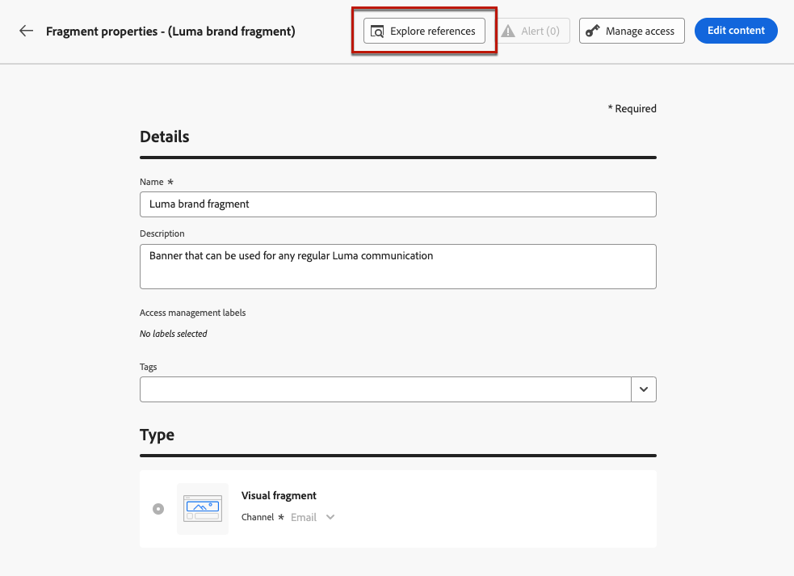
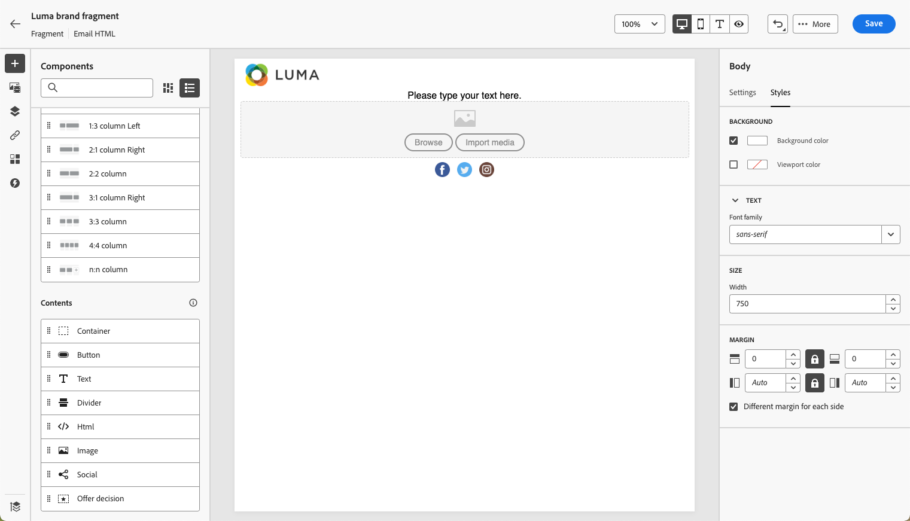
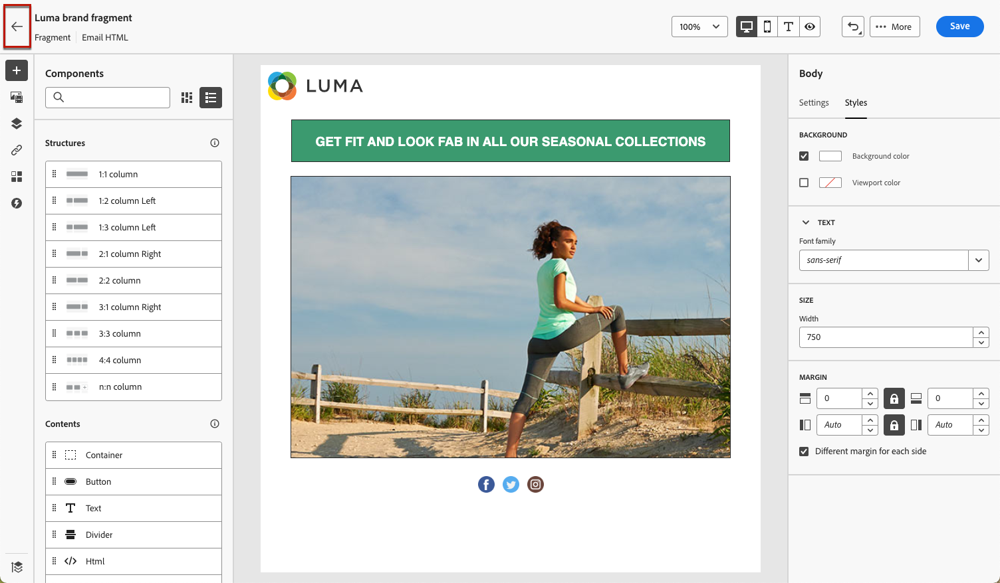
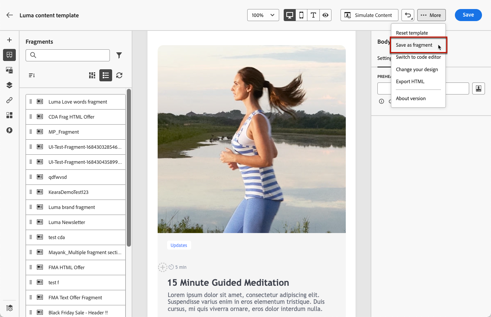

# Work with fragments {#fragments}

A fragment is a reusable component that can be referenced in one or more emails across [!DNL Journey Optimizer] campaigns and journeys.

This functionality allows to prebuild multiple custom content blocks that can be used by non-technical marketing users to quickly assemble email contents in an improved design process.

<!--
➡️ [Learn how to create and use templates in this video](#video-templates)-->

>[!CAUTION]
>
>To create, edit and archive fragments, you must have the **[!DNL Manage Library Items]** permission included in the **[!DNL Content Library Manager]** product profile. [Learn more](../administration/ootb-product-profiles.md#content-library-manager)

To make the best use of fragments:

* Create your own fragments. See [Create fragments](#create-fragments)
* Use them as many times as needed in your emails. See [Use fragments](#use-fragments)

>[!NOTE]
>
>Currently this feature is only available for emails.

## Access and manage fragments {#access-manage-fragments}

To access the fragment list, select **[!UICONTROL Content Management]** > **[!UICONTROL Fragments]** from the left menu.

All the fragments that were created on the current sandbox - either from the **[!UICONTROL Fragments]** menu, either using the [Save as fragment](#save-as-fragment) option - are displayed.

You can filter fragments on the creation or modification date. You can choose to show all fragments, or only the items that the current user created or modified. You can also display the **[!UICONTROL Archived]** fragments. [Learn more](#archive-fragments)

From the **[!UICONTROL More actions]** icon next to each fragment, you can:

* Duplicate a fragment.

* Use the **[!UICONTROL Explore references]** option to see the journeys, campaigns or templates where it is used. [Learn more](#explore-references)

* Archive a fragment. [Learn more](#archive-fragments)

### Edit fragments {#edit-fragments}

To edit a fragment, follow the steps below.

1. Click the desired item from the **[!UICONTROL Fragment]** list.
1. From the fragment properties, you can [explore references](#explore-references), [manage its access](../administration/object-based-access.md) and update the fragment details.

    

1. Select the corresponding button to edit content as you would do when creating a fragment from scratch. [Learn more](#create-from-scratch)

>[!NOTE]
>
>When you edit a fragment, the changes are automatically propagated to all emails or templates containing that fragment, except emails used in **[!UICONTROL Live]** journeys or campaigns. You can also break inheritance from the original fragment. [Learn more](#break-inheritance)

<!--Changes made to a fragment are not propagated to live journeys or campaigns where it is used.-->

<!--When added to an email, if you want to modify a fragment for a specific email, you can break the synchronization with the original fragment. The fragment becomes part of the email content and the changes will not be synchronized anymore. [Learn more](#break-inheritance)-->

### Explore references {#explore-references}

You can display the list of the journeys, campaigns and content templates that are currently using a fragment. 

To do so, select **[!UICONTROL Explore references]** either from the **[!UICONTROL More actions]** menu in the fragment list or from the fragment properties screen.

Select a tab to toggle between journeys, campaigns and templates. You can see their status and click a name to be redirected to the corresponding item where the fragment is referenced.

>[!NOTE]
>
>If the fragment is used in a journey, campaign or template that has a label preventing you from accessing it, you will see an alert message on top of the selected tab. [Learn more on Object Level Access Control (OLAC)](../administration/object-based-access.md)

### Archive fragments {#archive-fragments}

You can clean the fragment list from the items that are no longer relevant to your brand.

To do so, click the **[!UICONTROL More actions]** icon next to the desired fragment and select **[!UICONTROL Archive]**. It will disappear from the fragment list, which prevents users from using it in future emails or templates.

>[!NOTE]
>
>If you archive a fragment that is used in an email or in a content template, <!--it will remain in the email or template, but you won't be able to select it from the fragment list to edit it-->the email or template will not be affected.

To unarchive a fragment, filter on the **[!UICONTROL Archived]** items and select **[!UICONTROL Unarchive]** from the **[!UICONTROL More actions]** menu. It is now again accessible from the fragment list, and can be used in any email or template.

## Create fragments {#create-fragments}

There are two ways you can create fragments:

* Create a fragment from scratch, using the **[!UICONTROL Fragments]** dedicated menu. [Learn how](#create-template-from-scratch)

* When designing an email or a content template, save a portion of your content as fragment. [Learn how](#save-as-template)

Once saved, your fragment is available for use in a journey, a campaign or a template. Whether created from scratch or from an existing content, you can now use this fragment when building any [email](get-started-email-design.md) or [content template](content-templates.md) within [!DNL Journey Optimizer]. [Learn more](#use-fragments)

### Create from scratch {#create-from-scratch}

>[!CONTEXTUALHELP]
>id="ajo_create_fragment"
>title="Define your own fragment"
>abstract="Create a standalone fragment from scratch to make your content reusable across multiple journeys and campaigns."

To create a fragment from scratch, follow the steps below.

1. Access the fragment list through the **[!UICONTROL Content Management]** > **[!UICONTROL Fragments]** left menu.

1. Select **[!UICONTROL Create fragment]**.

1. Fill in the fragment details, i.e. name and description (if needed).

    

    >[!NOTE]
    >
    >Currently only the **[!UICONTROL Visual fragment]** type and the **Email** channel are supported.

1. To assign custom or core data usage labels to the fragment, select **[!UICONTROL Manage access]**. [Learn more on Object Level Access Control (OLAC)](../administration/object-based-access.md).

1. Click **[!UICONTROL Create]**.

1. The [Email Designer](get-started-email-design.md) displays. Edit your content as needed, the same way you would do for any email inside a journey or a campaign.

    >[!NOTE]
    >
    >You can add personalization fields and dynamic content, but contextual attributes are not supported in fragments.

    

1. Once your fragment is ready, click **[!UICONTROL Save]**.

1. If needed, click the arrow next to the fragment name to go back to the **[!UICONTROL Details]** screen and edit it.

    

This fragment is now ready to be used when building any [email](get-started-email-design.md) or [content template](content-templates.md) within [!DNL Journey Optimizer]. [Learn how](#use-fragments)

### Save as fragment {#save-as-fragment}

When designing a [content template](content-templates.md) or an [email](get-started-email-design.md) in a campaign or a journey, you can save a portion of your content as fragment for future reuse. To do this, follow the steps below.

1. In the [Email Designer](get-started-email-design.md), click the ellipsis on top right of the screen.

1. Select **[!UICONTROL Save as fragment]** from the drop-down menu.

    

1. The **[!UICONTROL Save as fragment]** screen displays. There select the elements you want to include into your fragment, including personalization fields and dynamic content. Note that contextual attributes are not supported in fragments.

    >[!CAUTION]
    >
    >You can only select sections that are adjacent to each other. You cannot select an empty structure or another fragment.

    

1. Click **[!UICONTROL Create]**. Fill in the fragment details, i.e. name and description (if needed).

    

    >[!NOTE]
    >
    >Currently only the **[!UICONTROL Visual fragment]** type and the **Email** channel are supported.

1. To assign custom or core data usage labels to the fragment, select **[!UICONTROL Manage access]**. [Learn more on Object Level Access Control (OLAC)](../administration/object-based-access.md).

1. Click **[!UICONTROL Create]** again. The fragment is saved into the **[!UICONTROL Fragments]** list, accessible from the [!DNL Journey Optimizer] dedicated menu.

    It becomes a standalone fragment that can be [accessed](#access-manage-fragments), [edited](#edit-fragments) and [archived](#archive-fragments) as any other item on that list.

You can now use this fragment when building any [email](get-started-email-design.md) or [content template](content-templates.md) within [!DNL Journey Optimizer]. [Learn how](#use-fragments)

>[!NOTE]
>
>Any change to that new fragment is not propagated to the email or template it comes from. Similarly, when the original content is edited within that email or template, the new fragment is not modified.

## Use fragments {#use-fragments}

You can use a fragment in an [email](get-started-email-design.md) within a journey or a campaign, or in a [content template](content-templates.md).

1. Open any email or template content using the [Email Designer](get-started-email-design.md).

1. Select the **[!UICONTROL Fragments]** icon from the left rail.

    

1. The list of all fragments created on the current sandbox is displayed. You can:

    * Search for a specific fragment by starting typing its label.
    * Sort fragments in ascending or descending order.
    * Change the way the fragments are displayed (cards or list view).

1. You can also refresh the list.

    >[!NOTE]
    >
    >If some fragments were modified or added while you are editing your content, the list will be updated with the latest changes.

1. Drag and drop any fragment from the list into the area where you want to insert it.

    

1. Like any other component, you can move the fragment around in your content.

1. Select the fragment to display the corresponding pane on the right. From there, you can delete the fragment from your content, or duplicate it. You can also perform these actions directly from the contextual menu that displays on top of the fragment.

    

1. From the **[!UICONTROL Settings]** tab, you can:

    * Choose the devices you want the fragment to be displayed on.
    * Open the fragment in a new tab to edit it if needed. [Learn more](#edit-fragments)
    * Explore references. [Learn more](#explore-references)

1. You can further customize your fragment using the **[!UICONTROL Styles]** tab.

1. If needed, you can break the inheritance with the original fragment. [Learn more](#break-inheritance)

1. Add as many fragments as you want and **[!UICONTROL Save]** your changes.

### Break inheritance {#break-inheritance}

When you edit a fragment, the changes are synchronized. They are automatically propagated to all **[!UICONTROL Draft]** journeys/campaigns and content templates containing that fragment.

>[!NOTE]
>
>The changes are not propagated to emails used in **[!UICONTROL Live]** journeys or campaigns.

When added to an email or a content template, fragments are synchronized by default.

However, you can break the inheritance from the original fragment. In that case, the content of the fragment is copied into the current design, and the changes will not be synchronized anymore.

To break inheritance, follow the steps below:

1. Select the fragment.

1. Click the unlock icon from the contextual toolbar.

    

1. That fragment becomes a standalone element that is not linked anymore to the original fragment. Edit it as any other content component in your content. [Learn more](content-components.md)

<!--

## How-to video {#video-templates}

Learn how to create, edit, and use fragments in [!DNL Journey Optimizer].

>[!VIDEO](https://video.tv.adobe.com/v/3413743/?quality=12)

-->
