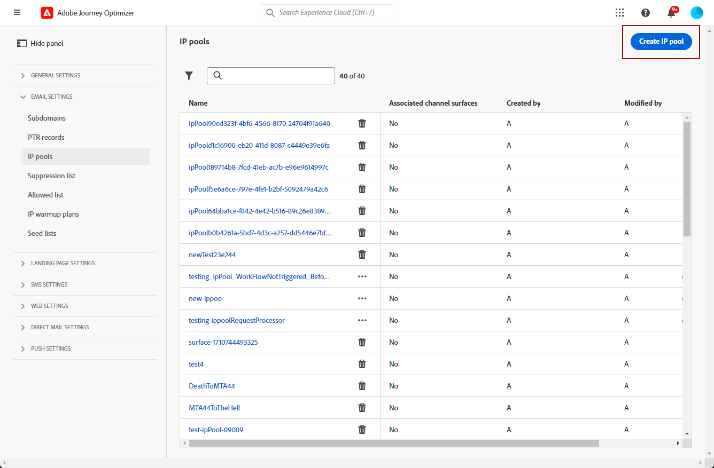
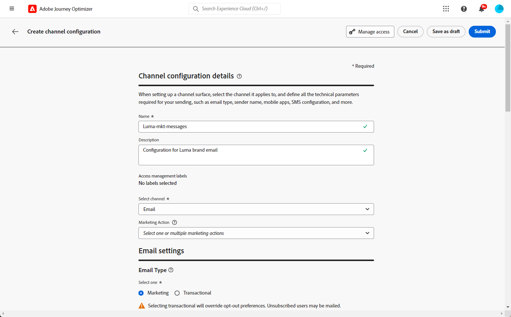
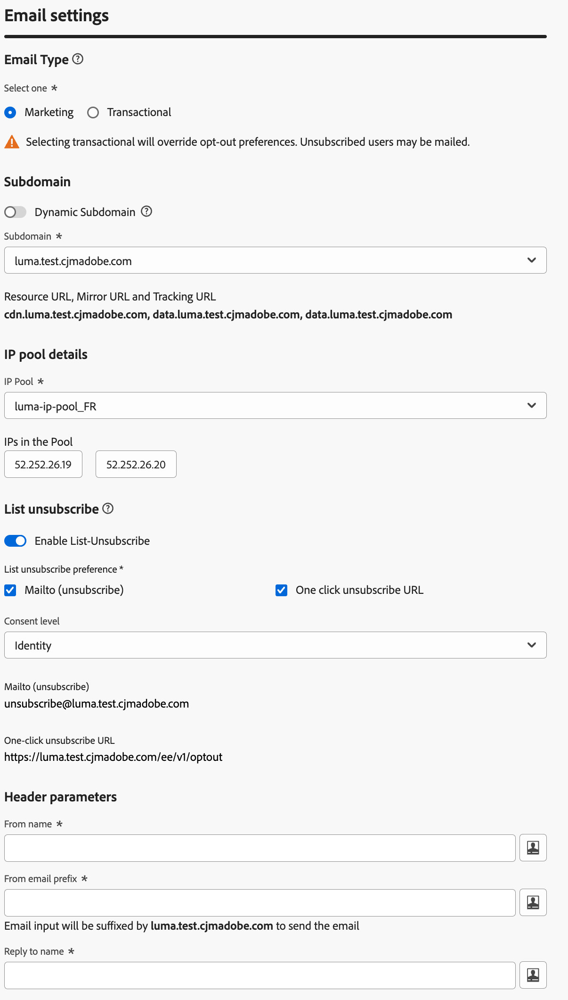
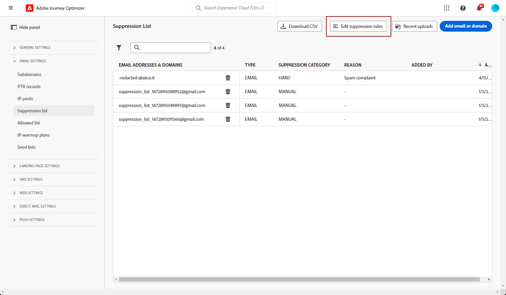

# Get started with email configuration {#get-starte-email-config}

>[!BEGINSHADEBOX]

**On this page:** Learn the essential steps to configure the email channel in Adobe Journey Optimizer, from delegating subdomains and creating IP pools to setting up channel configurations, execution fields, and retries.

>[!ENDSHADEBOX]

Configuring the email channel in Adobe Journey Optimizer is your gateway to creating impactful, personalized email experiences that effectively engage your audience.

This section guides you through the essential configuration steps you need to follow to send emails through [!DNL Journey Optimizer]. You'll also discover how to set up email headers, personalize settings for multiple brands, enable URL tracking for analytics, and even add one-click unsubscribe links for user convenience. Each topic builds on the last, giving you the tools to fine-tune your email strategy while maintaining control and precision.

To be able to send emails through journeys and campaigns in [!DNL Journey Optimizer], you need to go through a number of configuration steps. These steps are listed below:

1. To ensure optimal deliverability and protect your reputation, start by **delegating to Adobe the subdomains** you are going to use to send your emails with [!DNL Journey Optimizer]. These subdomains will determine elements such as the web pages to be tracked and the mirror page URLs. [Learn more](../configuration/about-subdomain-delegation.md)

    

1. Create IP pools to **group together IP addresses** provisioned with your instance. [Learn more](../configuration/ip-pools.md)

    

1. Create **channel configurations** and select the **[!UICONTROL Email]** channel. [Learn more](../configuration/channel-surfaces.md)

    

1. In each email channel configuration, configure all the **technical parameters** required to deliver emails. [Learn more](email-settings.md)

    * This is where you select the subdomain to use to send the emails and the IP pools to associate with the configuration. [Learn more](email-settings.md#ip-pools)

    
    
    * The **[!UICONTROL From email prefix]** and **[!UICONTROL Error email prefix]** use the currently selected [delegated subdomain](../configuration/about-subdomain-delegation.md). Optionally, **[!UICONTROL Sender name]** and **[!UICONTROL Sender email]** can identify a different transmitting party (full **Sender** address, not tied to that subdomain suffix). [Learn more](header-parameters.md#sender-header)

    

1. Complete your email channel configuration by setting up other advanced parameters such as enabling BCC, defining URL tracking for analytics, or adding one-click unsubscribe links for user convenience. [Learn more](email-settings.md)

1. Determine which **execution fields** to use in priority for your recipients when several addresses are available in Adobe Experience Platform. [Learn more](../configuration/primary-email-addresses.md)

    

1. Manage the number of days during which **retries** are performed before sending email addresses to the suppression list. [Learn more](../configuration/manage-suppression-list.md)

    

:::: landing-cards-container
:::

Get Started with Email Configuration

Learn the essential steps to configure email capabilities, including subdomain delegation, IP pools, and suppression list management.

[Start configuring email](get-started-email-config.md)
:::

:::

Define Email Configuration Settings

Set up email configurations for deliverability, compliance, and customization with advanced features like BCC, suppression overrides, and URL tracking.

[Configure settings](email-settings.md)
:::

:::

Enable and Configure List Unsubscribe

Learn how to enable the 'List unsubscribe' feature to include one-click unsubscribe URLs in email headers for recipient opt-outs.

[Set up List Unsubscribe](list-unsubscribe.md)
:::

:::

Configure Email Header Parameters

Customize sender and reply email addresses, handle errors, and forward emails for effective communication.

[Set up header parameters](header-parameters.md)
:::

:::

Configure URL Tracking for Email Channel

Set up URL tracking parameters to measure the effectiveness of email campaigns and integrate with analytics tools.

[Set up URL tracking](url-tracking.md)
:::

:::

Personalized Email Configuration Settings

Set up dynamic subdomains, personalized headers, and URL tracking to deliver tailored email experiences.

[Configure personalized email](surface-personalization.md)
:::

::::
