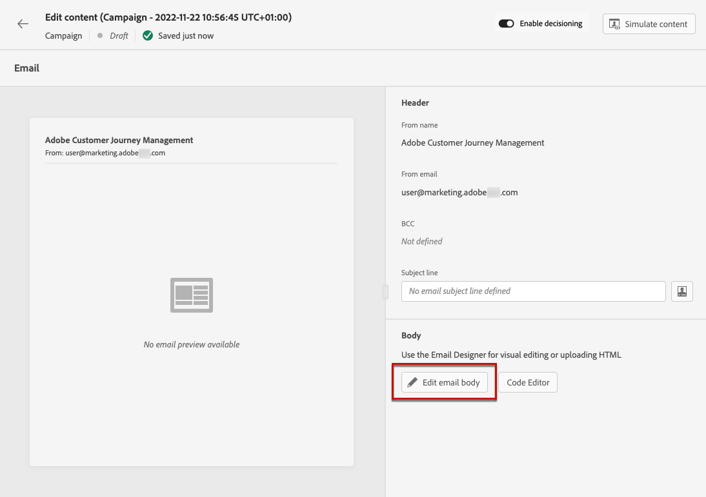
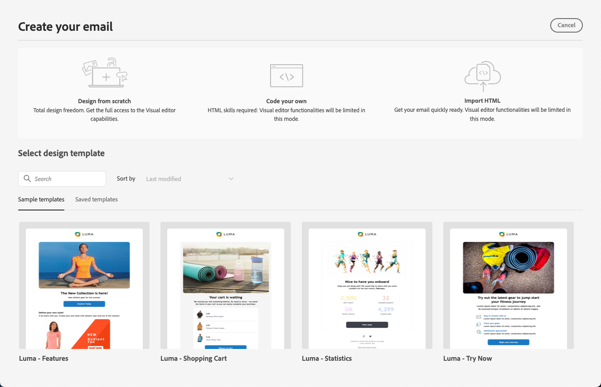
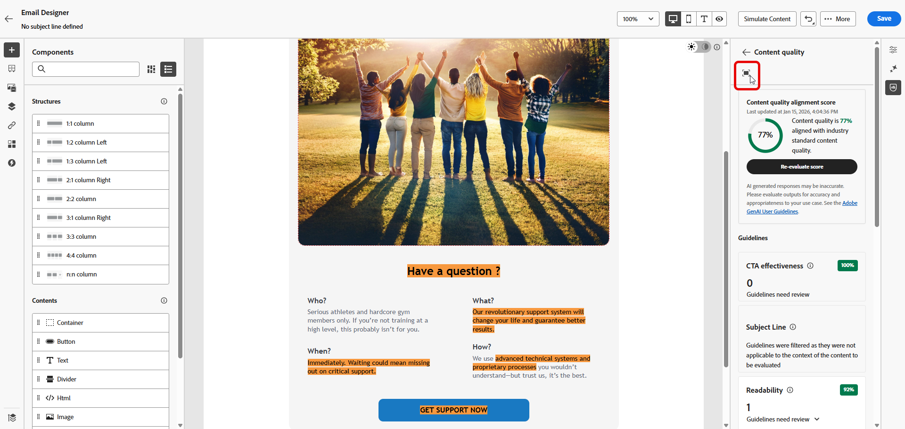
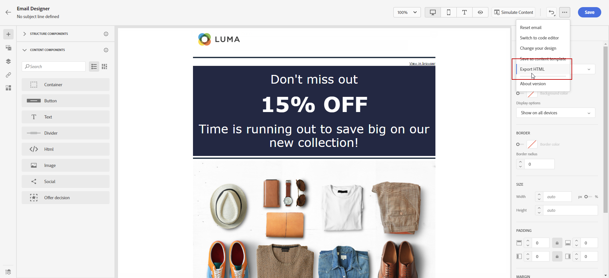

# Get started with email design {#get-started-content-design}

>[!BEGINSHADEBOX]

**On this page:** Learn how to design your email content in the Email Designer, the key steps to build it from scratch, code, or imported HTML, and the best practices that keep your emails rendering well across clients.

>[!ENDSHADEBOX]

To access the Email Designer and start designing your email content, you must first [create an email](create-email.md) in a journey or a campaign.

You can then use [!DNL Journey Optimizer] **email design capabilities** to import existing content or start building responsive emails from scratch. [Learn more](content-from-scratch.md)

The Email Designer also enables you to:

* Leverage **Adobe Experience Manager Assets Essentials** to enrich your emails, build and manage your own assets database. [Learn more](../integrations/assets.md)

* Find **Adobe Stock photos** to build your content and improve your email design. [Learn more](../integrations/stock.md)

* Enhance customers' experience by creating personalized and dynamic messages based on their profile attributes. Learn more about [personalization](../personalization/personalize.md) and [dynamic content](../personalization/get-started-dynamic-content.md).

➡️ [Discover this feature in video](#video)

## Key steps to create email content {#key-steps}

Once you have created an email, you can start designing your email content.

1. From the journey or campaign configuration screen, go through the **[!UICONTROL Edit content]** screen to access the Email Designer. [Learn more](create-email.md#define-email-content)

    

1. On the Email Designer home page, choose how you want to design your email from the following options:

    * **Design your email from scratch** through the Email Designer's interface and leverage images from [Adobe Experience Manager Assets](../integrations/assets.md). Learn how to design your email content in [this section](content-from-scratch.md).

    * **Code or paste raw HTML** directly in the Email Designer. Learn how to code your own content in [this section](code-content.md).
    
        >[!NOTE]
        >
        >In a campaign, you can also select the **[!UICONTROL Code Editor]** button from the **[!UICONTROL Edit content]** screen. [Learn more](create-email.md#define-email-content)

    * **Import existing HTML content** from a file or a .zip folder. Learn how to import an email content in [this section](existing-content.md).

    * **Convert image designs to HTML templates** using the AI-powered image to HTML converter. Learn how to transform static images into editable email templates in [this section](../content-management/image-to-html.md).

    * **Select an existing content** from a list of built-in or custom templates. Learn how to work with email templates in [this section](../email/use-email-templates.md).

    

1. Once your email content has been defined and personalized, you can verify your email content with **automated content checks** to catch HTML and CSS issues — such as unsupported tags, empty divs, and size limit violations — directly in the authoring panel, before sending. [Learn more](content-check.md)

    >[!NOTE]
    >
    >The system also checks for key settings as you design and displays alerts for warnings (recommendations and best practices) and errors (blocking issues that prevent testing or activation). [Learn more about email alerts](create-email.md#check-email-alerts)

    

1. You can also validate your content quality to identify potential issues with readability, content cohesiveness, and effectiveness. [Learn more about content quality validation](../content-management/brands-score.md#validate-quality)

    

1. Finally, you can export your content for validation or for later use. Click **[!UICONTROL Export HTML]** to save on your computer a zip file which will include your HTML and assets.

   

## Email design best practices {#best-practices}

When sending emails, it's important to consider that recipients may forward them, which can sometimes cause issues with the email's rendering. This is particularly true when using CSS classes that may not be supported by the email provider used for forwarding, for example, if you are using the "is-desktop-hidden" CSS class to hide an image on mobile devices.

To minimize these rendering issues, we recommend keeping your email design structure as simple as possible. Try to use a single design that works well for both desktop and mobile devices, and avoid using complex CSS classes or other design elements that may not be fully supported by all email clients.

>[!NOTE]
>
>The same applies when emails are opened in Gmail or Outlook via a mobile web browser, where CSS handling differs significantly from native apps — simple, table-based layouts with fully inlined styles are the safest choice. [Learn more](#mobile-web-limitations)

By following these best practices, you can help ensure that your emails are consistently rendered correctly, regardless of how they are viewed or forwarded by recipients.

Refer to the table below for best practices for email design:

| Recommended|Use with care|Not recommended|
|-|-|-|
| <ul><li><b>Static, table-based layouts</b> for structure</li> <li><b>HTML tables and nested tables</b> for layout consistency</li> <li><b>Template widths</b> between 600px and 800px </li> <li><b>Simple, inline CSS</b> for styling </li> <li><b>Web-safe fonts</b> for universal compatibility</li>| <ul><li><b>Background images</b> may not appear on certain email platforms.</li><li><b>Custom web fonts</b> lack universal support.</li><li><b>Wide layouts</b> can display poorly on smaller screens.</li><li><b>Image maps</b> offer limited functionality.</li><li><b>Embedded CSS</b> is sometimes removed during email delivery.</li>| <ul><li><b>JavaScript</b> is generally unsupported in email environments.</li> <li> <b>`<iframe>`</b> tags are blocked on most platforms. </li> <li><b>Flash</b> is outdated and no longer supported.</li> <li><b>Embedded audio</b> often fails to play.</li> <li><b>Embedded video</b> is incompatible with many email platforms.</li> <li> <b>Forms</b> do not work within emails.</li> <li> `
` layering can lead to rendering issues.</li>|

>[!NOTE]
>
>The [European accessibility act](https://eur-lex.europa.eu/legal-content/EN/TXT/?uri=CELEX%3A32019L0882){target="_blank"} states that all digital communications should be accessible. In addition to the email design best practices listed in this section, make sure you also follow the guidelines listed on [this page](accessible-content.md) specific to building accessible content with the Email Designer.

## Specific guardrails and limitations {#email-guardrails}

Even well-structured emails can render differently depending on the client or environment where they are opened. The sections below document known limitations and client-specific behaviors to keep in mind when designing your emails.

### Mobile web browser limitations {#mobile-web-limitations}

Email rendering may differ when recipients open Gmail or Outlook **via a mobile web browser** (e.g., Chrome on a phone), rather than using a native mobile app or desktop client. This is a known limitation of mobile webmail environments and is not specific to Journey Optimizer.

This rendering difference stems from how webmail clients behave inside a mobile browser. The browser renders the full desktop webmail UI first, placing the email two layers deep — beyond the reach of any responsive CSS or media queries. Gmail Web additionally strips CSS `<style>` blocks and wraps email content in its own `
`, which can override your styles and create alignment conflicts.

Typical symptoms include text alignment shifting (left-aligned text appearing centered), extra white separator lines between content sections, and an overall layout that differs from the template design.

These issues only occur in Gmail Web and Outlook Web when accessed via a mobile browser. Outlook and Gmail native mobile apps, as well as all desktop clients, are not affected.

>[!TIP]
>
>To minimize the impact:
>
>* Use simple table-based layouts with fully inlined CSS.
>
>* Avoid relying on media queries or `<style>` blocks for critical layout properties such as text alignment.

### Outlook rendering considerations {#outlook-tips}

Outlook has a number of rendering quirks that can affect your email layout if not accounted for during design. To help ensure your emails render correctly in Outlook, follow these best practices:

* Use even numbers for padding, font sizes, and widths. Outlook converts pixels to points internally, which can introduce uneven spacing and unwanted white lines when odd numbers are used.
* Set table widths in pixels, not percentages. Percentage-based widths can break the layout in Outlook. Apply width values directly in the style attribute of each table.
* Always set image widths using the `width` attribute. Outlook ignores CSS `width` and `height` properties on images and falls back to the file's native dimensions if no HTML attribute is present.
* Include Alt text on all images. This prevents display and security issues when images are blocked.
* Apply borders to table cells, not to the table element itself. If a border is not rendering as expected, move it from the `<table>` to the `<td>`.
* Avoid rounded corners. CSS `border-radius` is not reliably supported in Outlook — square corners are the safe default.

For dark mode design considerations, including how to use media queries and Outlook.com-specific image swap techniques, refer to [this page](dark-mode.md).

## How-to videos {#video}

Learn how to create email content with the message editor.

>[!VIDEO](https://video.tv.adobe.com/v/334150?quality=12)

Learn how to configure content experiments to A/B test and explore email content best drives your business objectives.

>[!VIDEO](https://video.tv.adobe.com/v/3419893)
