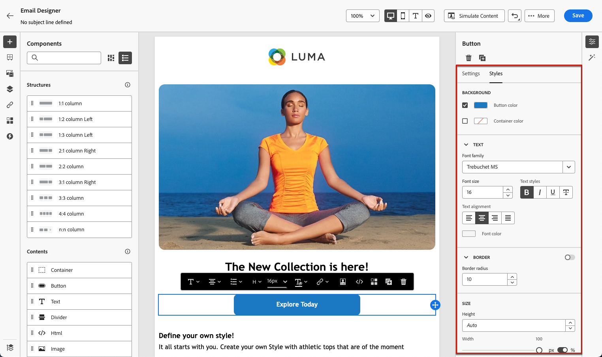

# Get started with email style {#get-started-email-style}

Once you started creating your email content in [!DNL Journey Optimizer], you can adjust a number of styling parameters and attributes from the Email Designer **[!UICONTROL Styles]** pane.

You can either apply your changes to the email body, to a structure component or to a content component.

Follow the links below to discover how to adjust some of the style settings in your email.

* Learn how to [personalize your email background](backgrounds.md)
* Learn how to [manage vertical alignment and padding](alignment-and-padding.md)
* Learn how to [customize inline styling attributes](inline-styling.md)
* Learn how to [add custom CSS to your email content](custom-css.md)
* Learn how to [manage dark mode content](dark-mode.md)

>[!NOTE]
>
>The [European accessibility act](https://eur-lex.europa.eu/legal-content/EN/TXT/?uri=CELEX%3A32019L0882){target="_blank"} states that all digital communications should be accessible. Make sure you follow the specific styling guidelines listed on [this page](../email/accessible-content.md) when designing content in [!DNL Journey Optimizer], such as adjusting colors, labels and icons to ensure clarity, and optimizing your design for mobile and responsive layouts.