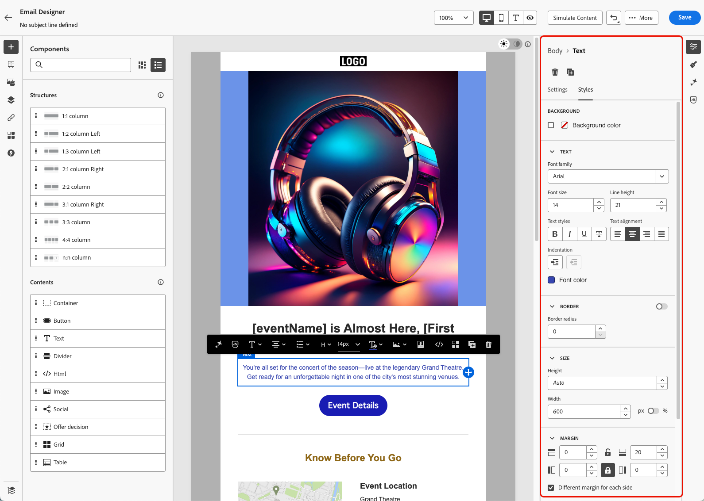
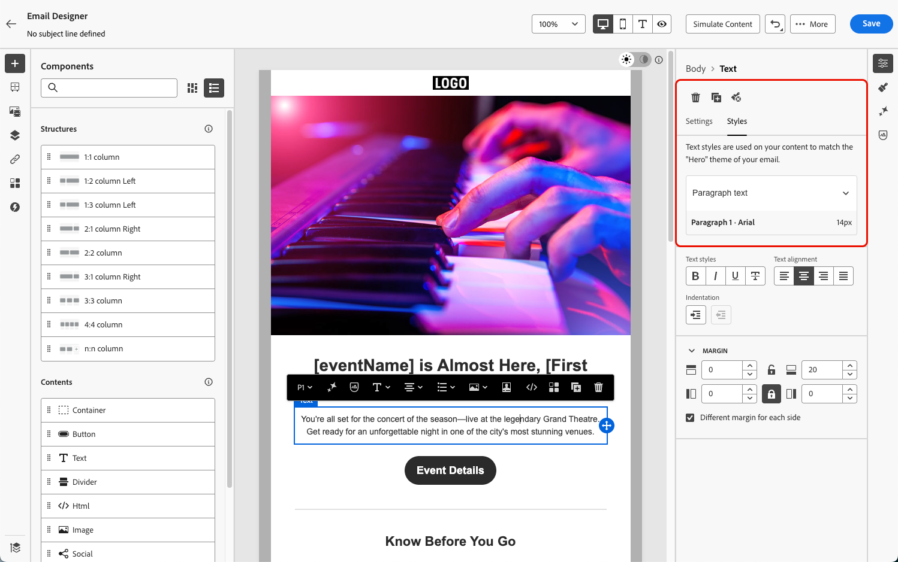

# Get started with email style {#get-started-email-style}

>[!BEGINSHADEBOX]

**On this page:** Learn how to adjust the style of your email content from the Email Designer Styles pane, applying settings such as colors, fonts, borders, margins, and padding to the body, structure, or content components.

>[!ENDSHADEBOX]

Once you started creating your email content in [!DNL Journey Optimizer], you can adjust a number of styling parameters and attributes from the Email Designer **[!UICONTROL Styles]** pane.

You can either apply your changes to the email body, to a structure component or to a content component.

Select any element in your email and click the **[!UICONTROL Styles]** tab. All the styling options for the selected element are displayed in the right pane.

For example, if you select a text component:

* You can adjust the **[!UICONTROL Background color]** and **[!UICONTROL Font color]** of that paragraph;
* You can update the **[!UICONTROL Text]** parameters such as font family, size, height, alignement, etc., and manage the spacing before the first character on a line by using the **[!UICONTROL Indentation]** setting;
* You can also adjust options like the **[!UICONTROL Border]**, **[!UICONTROL Margin]** and **[!UICONTROL Padding]** of the text component.

If you are using a default [content template](use-email-templates.md) or if you applied a theme to your email, you can only adjust a few style settings to match the selected theme. [Learn more on themes](apply-email-themes.md)

Follow the links below to discover how to adjust some of the specific style settings in your email.

* Learn how to [personalize your email background](backgrounds.md)
* Learn how to [manage vertical alignment and padding](alignment-and-padding.md)
* Learn how to [customize inline styling attributes](inline-styling.md)
* Learn how to [add custom CSS to your email content](custom-css.md)
* Learn how to [manage dark mode content](dark-mode.md)

>[!NOTE]
>
>The [European accessibility act](https://eur-lex.europa.eu/legal-content/EN/TXT/?uri=CELEX%3A32019L0882){target="_blank"} states that all digital communications should be accessible. Make sure you follow the specific styling guidelines listed on [this page](../email/accessible-content.md) when designing content in [!DNL Journey Optimizer], such as adjusting colors, labels and icons to ensure clarity, and optimizing your design for mobile and responsive layouts.