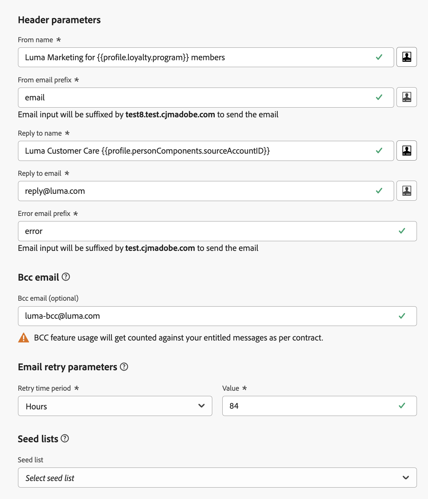

# Header parameters {#email-header}

When configuring a new [email channel configuration](email-settings.md), in the **[!UICONTROL Header parameters]** section, define the identities used for your messages: the **From** header (author seen by recipients), optional **Sender** values when the transmitting party differs from **From**, and **Reply to** and **Error** routing as needed.

>[!NOTE]
>
>For increased control over your email settings, you can personalize the header parameters. [Learn more](../email/surface-personalization.md#personalize-header)
>
>When [editing an email configuration](../configuration/channel-surfaces.md#edit-channel-surface), you cannot add new [profile attributes](../personalization/personalization-build-expressions.md#sources) to header parameters. You must create a new channel configuration.

* **[!UICONTROL From name]**: The name of the sender, such as your brand's name.
* **[!UICONTROL From email prefix]**: The email address you want to use for your communications.
* **[!UICONTROL Sender name]** (optional): The name of the party responsible for transmitting the message when it differs from the **From** author. [Learn more](#sender-header)
* **[!UICONTROL Sender email]** (optional): The email address of that transmitting party. Together with **[!UICONTROL Sender name]**, this populates the SMTP **Sender** header. [Learn more](#sender-header)
* **[!UICONTROL Reply to name]**: The name that will be used when the recipient clicks the **Reply** button in their email client software.
* **[!UICONTROL Reply to email]**: The email address that will be used when the recipient clicks the **Reply** button in their email client software. [Learn more](#reply-to-email)
* **[!UICONTROL Error email prefix]**: All errors generated by ISPs after a few days of mail being delivered (asynchronous bounces) are received on this address. The out-of-office notifications and challenge responses are also received on this address.

    If you want to receive the out-of-office notifications and challenge responses on a specific email address that is not delegated to Adobe, you need to setup a [forward process](#forward-email). In that case, make sure you have a manual or automated solution in place to process the emails landing into this inbox.

>[!NOTE]
>
>The **[!UICONTROL From email prefix]** and **[!UICONTROL Error email prefix]** addresses use the current selected [delegated subdomain](../configuration/about-subdomain-delegation.md) to send the email. For example, if the delegated subdomain is *marketing.luma.com*:
>
>* Enter *contact* as the **[!UICONTROL From email prefix]** - the sender email is *contact@marketing.luma.com*.
>* Enter *error* as the **[!UICONTROL Error email prefix]** - the error address is *error@marketing.luma.com*.

{width="80%"}

>[!NOTE]
>
>For **[!UICONTROL From email prefix]** and **[!UICONTROL Error email prefix]**, values must begin with a letter (A-Z) and can only contain alphanumeric characters. You can also use underscore `_`, dot `.`, and hyphen `-` characters. **[!UICONTROL Sender email]**, when used, is a full email address validated for format only—see [Optional Sender header](#sender-header).

## Optional Sender header {#sender-header}

Some use cases require the mailbox that **transmits** the message to be different from the **From** author—for example a parent organization sending on behalf of a subsidiary, a shared marketing team for several brands, or an agency sending for clients. When **[!UICONTROL Sender name]** and **[!UICONTROL Sender email]** are set, [!DNL Journey Optimizer] adds a **Sender** SMTP header as defined in [RFC 5322](https://datatracker.ietf.org/doc/html/rfc5322#section-3.6.2){target="_blank"}. Email clients that support this may show wording such as **Sender on behalf of From** or a **via** indicator.

>[!NOTE]
>
>If you leave **[!UICONTROL Sender name]** and **[!UICONTROL Sender email]** empty, no **Sender** header is added and delivery behaves as it did before this option existed.

If the resolved **Sender** would be identical to **From**, the **Sender** header is omitted, in line with RFC 5322.

**Authentication and sending domain**

SPF, DKIM, and DMARC continue to rely on **From** and the envelope (**Return-Path**). The [delegated subdomain](../configuration/about-subdomain-delegation.md) selected for the configuration remains the sending domain used for those checks. The **Sender** address is not used for SPF, DKIM, or DMARC alignment; only **format** validation is performed (no MX record, delegation, or DMARC validation on **[!UICONTROL Sender email]**).

**Personalization**

You can personalize **[!UICONTROL Sender name]** and **[!UICONTROL Sender email]** like other header fields. [Learn more](surface-personalization.md#personalize-header) If **Sender** is configured and personalization does not resolve to a value for a recipient, the message is not delivered to that recipient.

## Reply to email {#reply-to-email}

When defining the **[!UICONTROL Reply to email]** address, you can specify any email address provided it is a valid address, in correct format and without any typo.

The inbox used for replies will receive all reply emails, except out-of-office notifications and challenge responses, which are received on the **Error email** address.

To ensure proper reply management, follow the recommendations below:

* Ensure the dedicated inbox has enough reception capacity to receive all the reply emails that are sent using the email configuration. If the inbox returns bounces, some replies from your customers may not be received.

* Replies must be processed keeping in mind privacy and compliance obligations as they may contain personally identifiable information (PII).

* Do not mark messages as spam in the reply inbox, as it will impact all the other replies sent to this address.

Additionally, when defining the **[!UICONTROL Reply to email]** address, make sure to use a subdomain that has a valid MX record configuration, otherwise the email configuration processing will fail.

If you get an error upon submitting the email configuration, it means that the MX record is not configured for the subdomain of the address you entered. Contact your administrator for configuring the corresponding MX record or use another address with a valid MX record configuration.

>[!NOTE]
>
>If the subdomain of the address you entered is a domain that was [fully delegated](../configuration/delegate-subdomain.md#set-up-subdomain) to Adobe, contact your Adobe representative.

## Forward email {#forward-email}

To forward to a specific email address all emails received by [!DNL Journey Optimizer] for the delegated subdomain, contact Adobe Customer Care.

>[!NOTE]
>
>If the subdomain used for the **[!UICONTROL Reply to email]** address is not delegated to Adobe, the forwarding cannot work for this address.

You need to provide:

* The forward email address of your choice. Note that the forward email address domain cannot match any subdomain delegated to Adobe.
* Your sandbox name.
* The configuration name or the subdomain for which the forward email address will be used.
<!--* The current **[!UICONTROL Reply to (email)]** address or **[!UICONTROL Error email]** address set at the channel configuration level.-->

>[!NOTE]
>
>* There can be only one forward email address per subdomain — if multiple configurations use the same subdomain, the same forward email address must be used for all of them.
>* If forwarding is not enabled, emails sent directly to the **From email** address are discarded by default.

The forward email address is set up by Adobe. This can take 3 to 4 days.

Once done, all messages received on the **[!UICONTROL Reply to email]** and **Error email** adresses, as well as all emails sent to the **From email** address, are forwarded to the specific email address you provided.
