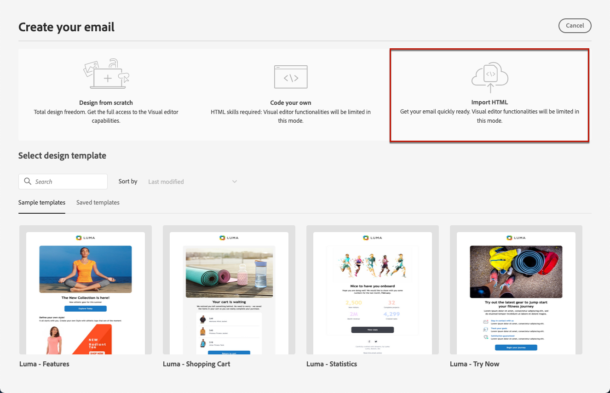

# Convert images to HTML templates with Template Accelerator {#image-to-html}

>[!CONTEXTUALHELP]
>id="ajo_template_accelerator"
>title="Template Accelerator"
>abstract="Use Template Accelerator to convert static image designs (JPEG or PNG) into fully customizable HTML email templates. This AI-powered feature helps you quickly transform visual designs into responsive, editable email content. Note: All existing content in your email will be deleted when you upload an image for conversion."

>[!AVAILABILITY]
>
>This capability is available in Limited Availability. Contact your Adobe representative to gain access.

## Overview {#overview}

Template Accelerator is an innovative AI-powered feature available in the **Content Templates** menu that dramatically speeds up email creation by converting static image designs into fully customizable HTML email content templates. This tool enables marketers to transform visual designs from graphic designers or design tools into responsive, editable email templates that can be saved to the Content Templates library and then reused across multiple journeys and campaigns.

By leveraging generative AI technology, Template Accelerator analyzes the layout, typography, colors, and visual elements in your image and generates clean, structured HTML code that maintains design fidelity while ensuring full editability and compatibility with the Email Designer.

**Key benefits:**

* **Accelerated authoring**: Reduce email creation time by instantly converting design mockups into reusable content templates
* **Designer-developer bridge**: Eliminate the need for manual HTML coding when working with visual designs
* **Design fidelity**: Maintain the integrity of your original design while creating editable content
* **Reusability**: Save templates to the Content Templates library for use across multiple journeys and campaigns
* **Email compatibility**: Generate HTML that works seamlessly with the Email Designer and across email clients

## Prerequisites {#prerequisites}

Before using Template Accelerator, ensure you have:

* Access to Adobe Journey Optimizer with the Email Designer
* An image file in JPEG or PNG format containing your email design
* Limited Availability access to the Template Accelerator feature (contact your Adobe representative)

>[!NOTE]
>
>For best results, use high-quality images with clear visual elements and readable text. Images should ideally be between 600-800 pixels wide to match standard email dimensions.

## Convert an image to HTML template {#convert-image}

To convert an image design into a fully customizable HTML email template, follow these steps:

1. Access the Content Templates list by selecting **[!UICONTROL Content Management]** > **[!UICONTROL Content Templates]** from the left menu.

1. Click **[!UICONTROL Create template]**.

1. Fill in the template details and select **[!UICONTROL Email]** as the channel.

1. Click **[!UICONTROL Create]** to access the Email Designer.

1. On the Email Designer home page, select **[!UICONTROL Import HTML]**.

    

1. In the import dialog, you will see the **[!UICONTROL Convert image to HTML]** section.

    >[!CAUTION]
    >
    >When you upload an image for conversion, **all content currently added in the email will be deleted and replaced** with the generated template. If you have existing content in your email, make sure to save it before proceeding with the image conversion.

1. Click the **[!UICONTROL Load image]** button to select your image file.

1. Drag and drop your image file (JPEG or PNG), or click to browse and select your image file.

1. Click **[!UICONTROL Generate]** to start the AI-powered conversion process.

    >[!NOTE]
    >
    >The generation process can take up to 5 minutes depending on the complexity and size of your image design. Please be patient while the AI analyzes and converts your image.

1. Once the conversion is complete, your content template will be automatically saved as a draft. You can then review and edit the generated HTML template in the Email Designer canvas.

1. The converted template opens in the Email Designer with full editing capabilities. You can now:

    * Edit text content and apply personalization
    * Modify images and add links
    * Adjust colors, fonts, and styling
    * Add, remove, or rearrange content components
    * Leverage all Email Designer features as with any other template

    

1. Make any necessary adjustments to refine the template and match your brand guidelines.

1. Once satisfied with your template, click **[!UICONTROL Save]** to save the content template.

1. Your template is now available in the Content Templates library and can be used when creating emails in journeys or campaigns. [Learn how to use content templates](use-email-templates.md)

## Use your converted template in emails {#use-template}

Once you've created and saved your content template using Template Accelerator, you can use it when designing emails in journeys or campaigns:

1. When creating an email in a journey or campaign, access the Email Designer from the **[!UICONTROL Edit content]** screen.

1. On the Email Designer home page, go to the **[!UICONTROL Saved templates]** tab.

1. Select your Template Accelerator-generated template from the list.

1. Click **[!UICONTROL Use this template]** to apply it to your email.

1. Continue editing and personalizing your email content as needed.

Learn more about [working with email templates](use-email-templates.md) and [creating content templates](../content-management/content-templates.md).

## Best practices {#best-practices}

To achieve optimal results when using Template Accelerator, follow these recommendations:

**Before you start**

* **Save existing content**: Converting an image to HTML will replace all existing content in your email. Always save your current work before using this feature.
* **Plan your workflow**: Use Template Accelerator at the beginning of your email creation process, or ensure you're ready to replace all current content.

**Image preparation**

* **Resolution**: Use high-resolution images (at least 1200px wide) for better text recognition and element detection
* **Clarity**: Ensure text is clearly readable and visual elements are well-defined
* **Width**: Design images at standard email widths (600-800px) to match typical email client requirements
* **File format**: Use JPEG or PNG format - avoid compressed or low-quality images
* **Complete design**: Include the full email design in a single image, from header to footer

**Design considerations**

* **Simple layouts**: Simpler, well-structured layouts convert more accurately than highly complex designs
* **Standard elements**: Use common email design patterns (header, body sections, CTAs, footer)
* **Text legibility**: Ensure sufficient contrast between text and backgrounds
* **Web-safe fonts**: Designs using common web-safe fonts will have better fidelity
* **Avoid overlapping elements**: Keep design elements clearly separated for better structure recognition

**After conversion**

* **Review your draft**: Once conversion is complete, your template is automatically saved as a draft. Take time to carefully review the generated HTML for accuracy
* **Test thoroughly**: Test the email across different email clients and devices
* **Refine manually**: Make adjustments as needed using the Email Designer's full editing capabilities
* **Brand alignment**: Verify colors, fonts, and styling match your brand guidelines
* **Personalization**: Add dynamic content and personalization tokens as required
* **Accessibility**: Review and enhance accessibility features if needed

## Limitations and considerations {#limitations}

Be aware of the following limitations when using Template Accelerator:

* **AI interpretation**: The AI generates HTML based on visual interpretation of your image. Complex or unusual designs may require manual adjustments after conversion.

* **Text accuracy**: While the AI attempts to recognize and reproduce text accurately, always verify text content and make corrections as needed.

* **Dynamic content**: The conversion process creates static HTML based on your image. You'll need to add personalization, dynamic content, and tracking manually after conversion.

* **Complex layouts**: Highly complex designs with intricate layering, unusual shapes, or non-standard elements may not convert perfectly. Simpler designs generally yield better results.

* **Processing time**: The conversion process can take up to 5 minutes depending on the complexity and size of your image. The template is automatically saved as a draft once the conversion is complete.

* **Limited Availability**: As a Limited Availability feature, Template Accelerator is continuously being improved. Functionality and accuracy may vary, and your feedback helps enhance the feature.

>[!NOTE]
>
>Template Accelerator is designed to provide a strong starting point for email creation. The generated HTML should be reviewed and refined using the Email Designer to ensure it meets your exact requirements.

## Frequently asked questions {#faq}

+++What happens to my existing email content when I use Template Accelerator?

All existing content in your email will be deleted and replaced with the newly generated template when you upload an image for conversion. Make sure to save any important content before using this feature. It's best to use Template Accelerator at the beginning of your email creation process.

+++

+++What file formats are supported?

Template Accelerator supports JPEG (.jpg, .jpeg) and PNG (.png) image formats.

+++

+++How long does the conversion process take?

The conversion can take up to 5 minutes, depending on the complexity and size of your image design. Once the conversion is complete, your file will be automatically saved as a draft for you to review and edit.

+++

+++Can I edit the generated template?

Yes! The generated HTML template opens in the Email Designer with full editing capabilities. You can modify all aspects of the template, including text, images, styling, layout, and structure.

+++

+++What happens if the conversion doesn't match my design exactly?

The AI does its best to accurately interpret your design, but some manual refinement may be needed. Use the Email Designer to adjust any elements that need fine-tuning.

+++

+++Can I use this feature for landing pages or other content types?

Template Accelerator is currently designed specifically for email templates. For other content types, use the standard design and import options available in the Email Designer.

+++

+++Do I need special permissions to use this feature?

Template Accelerator is available in Limited Availability. You need Limited Availability access (contact your Adobe representative to gain access) and standard Email Designer permissions to use this feature.

+++

+++Can I reuse converted templates across multiple campaigns?

Yes! Templates created with Template Accelerator are automatically saved to the Content Templates library. You can access and reuse them in any email across your journeys and campaigns. [Learn more](../content-management/content-templates.md)

+++

## Related topics {#related-topics}

* [Get started with content templates](../content-management/content-templates.md)
* [Create content templates](../content-management/create-content-templates.md)
* [Use email templates](use-email-templates.md)
* [Get started with email design](get-started-email-design.md)
* [Import your email content](existing-content.md)
* [Design content from scratch](content-from-scratch.md)

