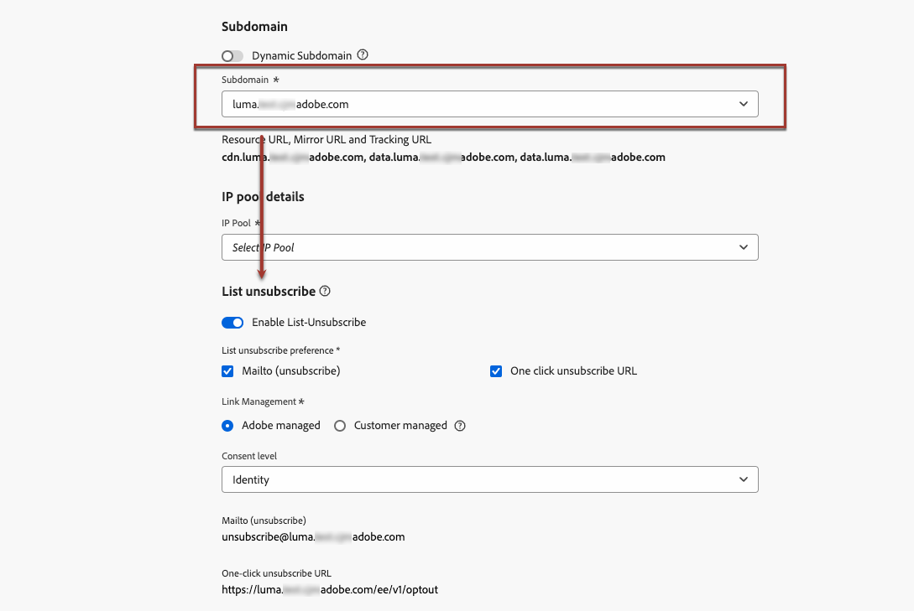
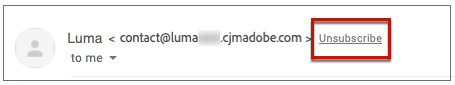
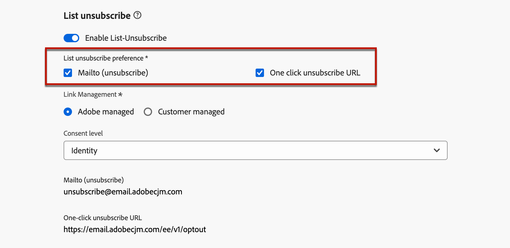
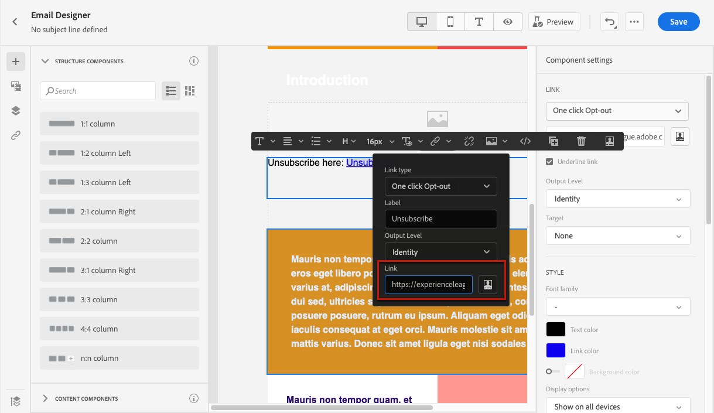

# List unsubscribe{#list-unsubscribe}

<!--Do not modify - Legal Review Done -->

In [!DNL Adobe Journey Optimizer], when configuring a new email channel configuration, upon [selecting a subdomain](email-settings.md#ip-pools) from the list, the **[!UICONTROL Enable List-Unsubscribe]** option displays. It is enabled by default.



The one-click list unsubscribe URL is an unsubscribe link or button displayed next to the email sender information, and lets recipients instantly opt out of your mailing lists with a single click.

For example, the one-click unsubscribe URL displays a link as below in Gmail:



>[!IMPORTANT]
>
>To display the one-click unsubscribe URL in the email header, the recipients' email client must support this feature.

Depending on the email client, and the email configuration unsubscription settings, clicking the unsubscribe link in the email header can have the following impacts:

* When the **Mailto (unsubscribe)** feature is enabled, the unsubscribe request is sent to the default unsubscribe address based on the subdomain you configured.
* When the **One-click unsubscribe URL** feature is enabled - or if you inserted an unsubscription URL in your email body content -, the recipient is directly opted-out, either at the channel level or at the ID level (depending on how the consent is set up), when the recipient clicks on the one-click unsubscribe URL (based on the subdomain you configured).

>[!NOTE]
>
>Learn how to manage the unsubscription settings in [this section](#enable-list-unsubscribe) below.

In both cases, when a recipient clicks the opt-out link, their unsubscribe request is processed accordingly. The corresponding profile is immediately opted out and this choice is updated in [Experience Platform](https://experienceleague.adobe.com/docs/experience-platform/profile/ui/user-guide.html){target="_blank"}. Learn more about consent processing in the [Experience Platform documentation](https://experienceleague.adobe.com/docs/experience-platform/landing/governance-privacy-security/consent/adobe/overview.html){target="_blank"}.

>[!NOTE]
>
>Occasionally, unsubscribe events may take longer to reflect at the profile level due to downstream data processing. Allow some time for the system to update.

## Enable List unsubscribe {#enable-list-unsubscribe}

>[!CONTEXTUALHELP]
>id="ajo_admin_preset_unsubscribe"
>title="Add an unsubscribe URL to your emails"
>abstract="Enable this option to automatically add an unsubscribe URL to the email header. You can also set an unsubscribe URL in a message by inserting a one-click opt-out link into the email content."
>additional-url="https://experienceleague.adobe.com/en/docs/journey-optimizer/using/channels/email/email-opt-out#one-click-opt-out" text="Set One-click opt-out from the email content"

When the **[!UICONTROL Enable List-Unsubscribe]** option is enabled, if supported by the recipients' email client, the email header includes both a mailto and/or a URL by default that recipients can use to unsubscribe from your mailing list.

>[!NOTE]
>
>If you disable this option, no one-click unsubscribe URL is displayed in the email header.

The List unsubscribe header offers two options, which are enabled by default unless you uncheck one or both:

{width="80%"}

* A **[!UICONTROL Mailto (unsubscribe)]** address, which is the destination address where unsubscribe requests are routed to for auto-processing. In [!DNL Journey Optimizer], the unsubscribe email address is the default **[!UICONTROL Mailto (unsubscribe)]** address displayed in the channel configuration, based on the [selected subdomain](email-settings.md#subdomains). <!--With this method, clicking the Unsubscribe link sends a pre-filled email to the unsubscribe address specified in the email header.-->

* The **[!UICONTROL One-click unsubscribe URL]**, which by default is the one-click opt-out URL generated List unsubscribe header, based on the [selected subdomain](email-settings.md#subdomains). <!--With this method, clicking the Unsubscribe link directly unsubscribes the user, requiring only a single action to unsubscribe.-->

You can select the **[!UICONTROL Consent level]** from the corresponding drop-down list. It can be specific to the channel or to the profile identity. Based on this setting, when a user unsubscribes using the list unsubscribe URL in the header of an email, the consent gets updated in [!DNL Adobe Journey Optimizer], either at the channel level or ID level.

## Guardrails and recommendations {#list-unsubscribe-guardrails}

The one-click list unsubscribe URL feature enables your recipients to easily opt out from your communications. However, as not all email clients support this link in the email header, Adobe recommends you also add a [one-click opt-out link](email-opt-out.md#one-click-opt-out) or an [unsubscribe link](email-opt-out.md#add-unsubscribe-link) into your email's body.

The **[!UICONTROL Mailto (unsubscribe)]** feature and the **[!UICONTROL One-click unsubscribe URL]** feature are optional.

* If you have toggled on the **[!UICONTROL Enable List-Unsubscribe]** option in the [email configuration settings](email-settings.md), we recommend that you enable both methods - **Mailto (unsubscribe)** and **One-Click Unsubscribe URL**. Not all email clients support the HTTP method. With the Mailto list-unsubscribe feature provided for you to select an alternative, your sender reputation can be better protected and all your recipients are able to have access to use the unsubscribe functionality.

* If you do not want to use the default generated one-click unsubscribe URL, you can uncheck the feature.

    * In the scenario where the **[!UICONTROL Enable List-Unsubscribe]** option is toggled on and the **[!UICONTROL One-click Unsubscribe URL]** feature is unchecked, if you add a [one-click opt-out link](../email/email-opt-out.md#one-click-opt-out) to a message created using this configuration, the List unsubscribe header picks up the one-click opt-out link you have inserted in the body of the email and uses that as the one-click unsubscribe URL value.
 
        

    * If you do not add a one-click opt-out link into your message content and the default **[!UICONTROL One-click unsubscribe URL]** is unchecked in the channel configuration settings, no URL is passed into the email header as part of the List unsubscribe header.

    >[!NOTE]
    >
    >Learn more about managing unsubscribe capabilities within your messages in [this section](../email/email-opt-out.md#unsubscribe-header).

In [!DNL Journey Optimizer], consent is handled by the Experience Platform [Consent schema](https://experienceleague.adobe.com/docs/experience-platform/xdm/field-groups/profile/consents.html){target="_blank"}. By default, the value for the consent field is empty and treated as consent to receive your communications. You can modify this default value while onboarding to one of the possible values listed [here](https://experienceleague.adobe.com/docs/experience-platform/xdm/data-types/consents.html#choice-values){target="_blank"}, or use [consent policies](../action/consent.md) to override the default logic.

Currently, [!DNL Journey Optimizer] does not append a specific tag to unsubscribe events triggered by the List unsubscribe feature. If you need to differentiate List unsubscribe clicks from other unsubscribe actions, you must implement custom tagging externally, or leverage an external landing page for tracking.         

## Manage unsubscribe data externally {#custom-managed}

>[!CONTEXTUALHELP]
>id="ajo_email_config_unsubscribe_custom"
>title="Define how unsubscribe data is managed"
>abstract="**Adobe managed**: Consent data is managed by you within the Adobe system.<br>**Customer managed**: Consent data is managed by you in an external system and no synchronization of consent data is updated in the Adobe system unless initiated by you."

>[!CONTEXTUALHELP]
>id="ajo_email_config_unsubscribe_custom_url"
>title="Enter your own one-click unsubscribe URL"
>abstract="The **One-click Unsubscribe URL** must use the POST request method."

If you are managing consent outside of Adobe, select the **[!UICONTROL Customer managed]** option to enter a custom unsubscribe email address and your own one-click unsubscribe URL.

{width="80%"}

The **[!UICONTROL One-click Unsubscribe URL]** must be POST URL.

>[!WARNING]
>
>If you are using the **[!UICONTROL Customer managed]** option, Adobe is not storing any unsubscribe or consent data. With the **[!UICONTROL Customer managed]** option, organizations are electing to use an external system and will be responsible for managing their consent data in such external system. There is no auto synchronization of consent data between the external system and  [!DNL Journey Optimizer]. Any synching of consent data, which is sourced from the external system to update user consent data in [!DNL Journey Optimizer], must be initiated by the organization as a data transfer to push the consent data back into [!DNL Journey Optimizer].

### Append custom attributes to your endpoints {#custom-attributes}

With the **[!UICONTROL Customer managed]** option selected, if you enter custom endpoints and use them in a campaign or journey, [!DNL Journey Optimizer] appends some default profile specific parameters to the consent update event <!--sent to the custom endpoint -->when your recipients click the unsubscribe link.

To further personalize your endpoints<!-- (**[!UICONTROL Mailto (unsubscribe)]** and **[!UICONTROL One-click Unsubscribe URL]**)-->, you can define custom attributes that will be also appended to the consent event.

>[!AVAILABILITY]
>
>This capability is available in Limited Availability. Contact your Adobe representative to gain access.
>
>For the **[!UICONTROL Mailto (unsubscribe)]** option, you need to use the new query parameters described in the **Mailto (unsubscribe) with custom attributes (Limited Availability)** section [below](#configure-decrypt-api).

To define custom attributes for your endpoints, use the **[!UICONTROL URL tracking parameters]** section. All the URL tracking parameters you define in the corresponding section will be appended to the end of your custom endpoints, in addition to the default parameters. [Learn how to set custom URL tracking](url-tracking.md)

### Configure the decrypt API {#configure-decrypt-api}

When your recipients click a custom unsubscribe link, the parameters appended to the consent update event are sent to the endpoint in an encrypted manner. Thus, the external consent system needs to implement a specific API through [Adobe Developer](https://developer.adobe.com){target="_blank"} to decrypt the parameters sent by Adobe.

The GET call to retrieve these parameters depends on the List unsubscribe option you are using - **[!UICONTROL One-click unsubscribe URL]** or **[!UICONTROL Mailto (unsubscribe)]**.

<!--To configure the API to send back the information to [!DNL Adobe Journey Optimizer] when a recipient has unsubscribed using the List unsubscribe option with custom endpoints, follow the steps below.-->

+++ One-click unsubscribe URL

With the **[!UICONTROL One-click unsubscribe URL]** option, clicking the Unsubscribe link directly unsubscribes the user.

The GET call is as follows:

Endpoint: https://platform.adobe.io/journey/imp/consent/decrypt

Query parameters:

* **params**: contains the encrypted payload
* **pid**: encrypted profile ID

These two parameters will be included into the consent update event sent to the custom endpoints.

Header requirements:

* x-api-key
* x-gw-ims-org-id
* authorization (user token from your technical account)

Below are sample parameters and the consent response:

|Query parameter | Sample payload |
|---------|----------|
| pid | {<br>"pid"  : "5142733041546020095851529937068211571",<br>"pns"  : "CRMID",<br>"e"    : "john@google.com",<br>"ens"  : "Email",<br>} |
| params | {<br>"m"  : "messageExecutionId",<br>"ci"  : "campaignId",<br>"jv" : "journeyVersionId",<br>"ja" : "journeyActionId",<br>"s"  : "sandboxId",<br>"us" : "unsubscribeScope"<br>} |

Consent response:

```
{
    "profileNameSpace": " CRMID ",
    "profileId": "5142733041546020095851529937068211571",
    "emailAddress": "john@google.com",
    "emailNameSpace": "Email",
    "sandboxId": "sandboxId",
    "optOutLevel": "channel",
    "channelType": "email",
    "timestamp": "2024-11-26T14:25:09.316930Z"
    "utm": [
         {
            "utm_source": "AJO",
            "utm_medium": "Email"
        }
    ]
}
```

+++

+++ Mailto (unsubscribe)

With the **[!UICONTROL Mailto (unsubscribe)]** option, clicking the Unsubscribe link sends a pre-filled email to the unsubscribe address specified.

The GET call is as follows.

Endpoint: https://platform.adobe.io/journey/imp/consent/decrypt

Query parameters:

* **emailParams**: string that contains the **params** (encrypted payload) and **pid** (encrypted profile ID) parameters.

The **params** and **pid** parameters will be included into the consent update event sent to the custom endpoints.

Header requirements:

* x-api-key
* x-gw-ims-org-id
* authorization (user token from your technical account)

Below are sample parameters and the consent response:

|Query parameter | Sample payload |
|---------|----------|
| emailParams | {<br>"p"  : "profileId",<br>"pn"  : "profileNamespace",<br>"en"  : "emailNamespace",<br>"ci"  : "campaignId",<br>"jv" : "journeyVersionId",<br>"ja" : "journeyActionId",<br>"si"  : "sandboxId",<br>"us": "unsubscribeScope"<br>} |

Consent response:

```
{
    "profileNameSpace": " CRMID ",
    "profileId": "5142733041546020095851529937068211571",
    "emailAddress": "john@google.com",
    "emailNameSpace": "Email",
    "sandboxId": "sandboxId",
    "optOutLevel": "channel",
    "channelType": "email",
    "timestamp": "2024-11-26T14:25:09.316930Z"
}
```

+++

+++ Mailto (unsubscribe) with custom attributes (Limited Availability)

With the **[!UICONTROL Mailto (unsubscribe)]** option, clicking the Unsubscribe link sends a pre-filled email to the unsubscribe address specified.

Starting from October 2025, if using the **[!UICONTROL Customer managed]** option for the **[!UICONTROL Mailto (unsubscribe)]** endpoint, you can define custom attributes that will be appended to the consent event. In this case, you need to use the query parameters described below.

>[!AVAILABILITY]
>
>This capability is available in Limited Availability. Contact your Adobe representative to gain access.

The GET call is as follows.

Endpoint: https://platform.adobe.io/journey/imp/consent/decrypt

Query parameters:

* **emailParamsSub**: string extracted from the subject of the email received at the Mailto address.

    * Example: *unsubscribev1.abc*

    * Parsed value: *v1.abc*

* **emailParamsBody**: string extracted from the email body (if present) in the format *unsubscribev1.xyz*.

    * Parsed value: *v1.xyz*

API example: https://platform.adobe.io/journey/imp/consent/decrypt?emailParamsSub=v1.abc&emailParamsBody=v1.xyz

>[!CAUTION]
>
>If you were using the previous implementation (for example: https://platform.adobe.io/journey/imp/consent/decrypt?emailParams=<v1.xxx>), you need to use the new **emailParamsSub** and **emailParamsBody** parameters instead of **emailParams**. Contact your Adobe representative for more information.

The **emailParamsSub** and **emailParamsBody** parameters will be included into the consent update event sent to the custom endpoints.

Header requirements:

* x-api-key
* x-gw-ims-org-id
* authorization (user token from your technical account)

Consent response:

```
{
    "profileNameSpace": " CRMID ",
    "profileId": "5142733041546020095851529937068211571",
    "emailAddress": "john@google.com",
    "emailNameSpace": "Email",
    "sandboxId": "sandboxId",
    "optOutLevel": "channel",
    "channelType": "email",
    "timestamp": "2024-11-26T14:25:09.316930Z"
    "utm": [
        {
            "utm_source": "AJO",
            "utm_medium": "Email"
        }
    ]
}
```

+++
