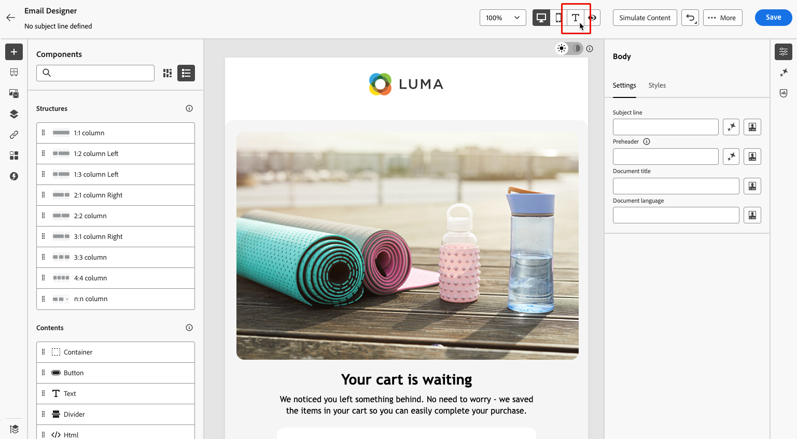
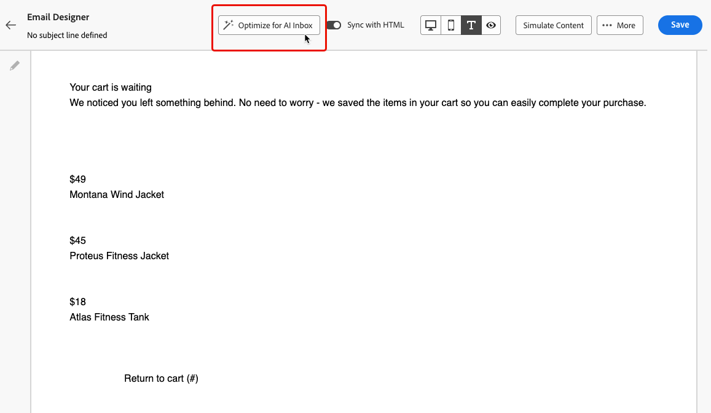
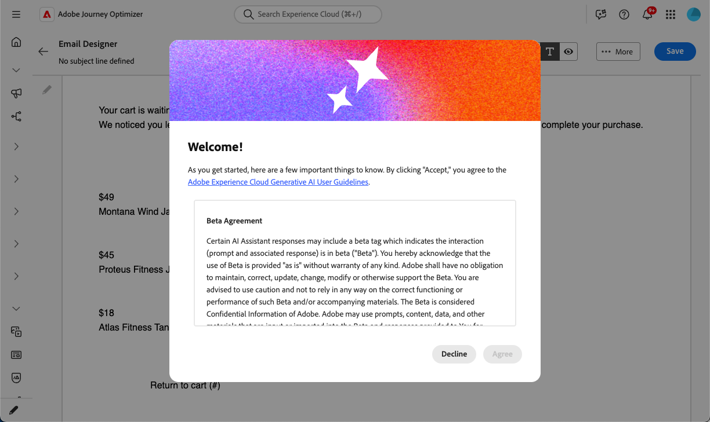
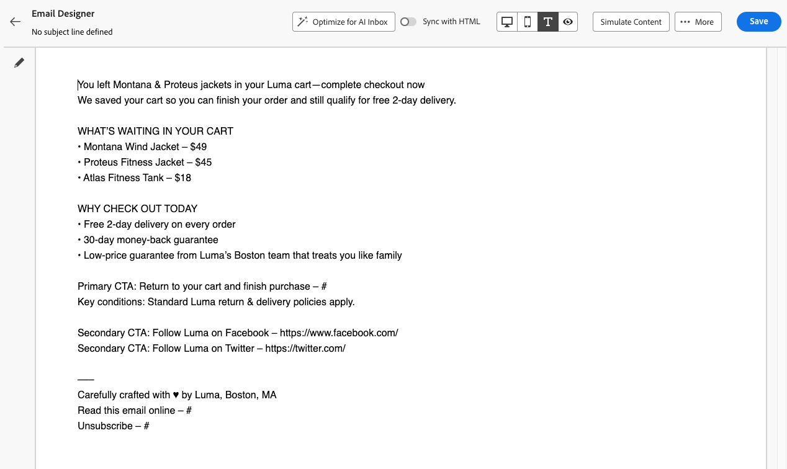

# Optimize email text for AI inboxes {#email-text-optimizer}

[!DNL Adobe Journey Optimizer] comes with an email-channel capability that helps you structure the [text version](text-version-email.md) of your messages for improved AI-assisted inbox experiences—such as [!DNL Apple Intelligence] and [!DNL Google Gemini] in [!DNL Gmail]—so they can answer questions and summarize mail based on your content more accurately, with better results.

>[!NOTE]
>
>This capability changes plain text only, not the HTML version of your email content.

You can use this capability to refine plain text so AI-assisted inbox experiences are more likely to surface the offers, calls to action, and details you intend—rather than thin auto-generated text or unrelated context.

## How it works {#how-it-works}

Typical questions recipients may ask in AI-assisted inbox experiences are *What is this email about?* or *What are these offers?*.

* The answers provided by these AI assistants may be a short summary (for example that the message is promotional, mentions VIP early access and a sale, and includes links to product categories) but still omit objectives the marketer cared about because the assistants are inferring from whatever text they effectively see—not necessarily the full story you intended.

* Also, the assistants may proactively search for discounts or coupons related to the brand and fold those into the answer, so the user is no longer looking at only what your message actually promised. That behavior is useful to end users, but dilutes control for marketers who need answers to track the real terms in the send.

To prevent these issues, [!DNL Journey Optimizer] rewrites the plain text so that coupons, discount ranges, call to actions, and other priorities appear up front in clear linear copy. The goal is for inbox AI to ground summaries and Q&A in your defined offers and actions—instead of leaning on a thin default text part or on unrelated web results.

>[!IMPORTANT]
>
>Exact AI-assistant behaviors depend on the inbox provider and model version. After your email is delivered, answers and summaries provided by external AI clients can be wrong, incomplete, or mixed with web results.
>
>The Optimize email text for AI inboxes capability only improves the plain text you author in Journey Optimizer; it does not guarantee how a third-party assistant will interpret or display the message. Read more about the [limitations and risks of third-party inbox AI](#inbox-ai-risks).

## Recommended use cases {#use-cases}

<!--
* **Critical details only in images** — Offers, promo codes, or deadlines shown in banners or graphics are invisible in plain text. Use the optimizer (and manual edits) so the same facts appear as text, improving extraction by AI summaries and text-only clients.
-->

* **Dense or fragmented auto-generated text** — When default plain text is hard to scan, optimization can produce a clearer linear narrative with explicit offers and links.

* **Controlling inbox Q&A** — When you expect recipients to ask assistants *what the email is about* or *what the offers are*, a strong plain text version reduces partial summaries and reduces reliance on web-supplemented answers that are not tied to your approved copy.

## Optimize for AI inbox experiences {#optimize-with-ai}

>[!IMPORTANT]
>
>Before you use this capability, read the related [Risks and limitations](#inbox-ai-risks).
>
>To access this feature, you must agree to a user agreement which displays the first time you use Generative AI in [!DNL Journey Optimizer]. For more information, read the [Adobe Experience Cloud Generative AI User Guidelines](https://www.adobe.com/legal/licenses-terms/adobe-gen-ai-user-guidelines.html){target="_blank"}.

To optimize the plain text version of your email for AI inboxes with [!DNL Journey Optimizer], follow the steps below.

1. Open your email in the [Email Designer](content-from-scratch.md) (from a campaign, journey, or template, depending on your workflow).

1. Select the **[!UICONTROL Plain text]** icon to open the text version of your email. [Learn more](text-version-email.md)

    {zoomable="yes"}

1. The text version of your email is displayed. Click the **[!UICONTROL Optimize for AI Inbox]** button to generate an improved plain text version that highlights key information for AI-assisted reading and summarization.

    {zoomable="yes" width="80%"}

    >[!NOTE]
    >
    >Upon clicking the **[!UICONTROL Optimize for AI Inbox]** button, the **[!UICONTROL Sync with HTML]** option is automatically disabled. [Learn more](text-version-email.md#plain-text-custom)

1. If this is the first time you are using Generative AI in [!DNL Journey Optimizer], you will be asked to agree to the user agreement. To learn more, check out the [Adobe Generative AI User Guidelines](https://www.adobe.com/legal/licenses-terms/adobe-gen-ai-user-guidelines.html){target="_blank"}.

    {width=50%}

    Click **[!UICONTROL Agree]** to continue.

1. The generated text is displayed. Review the changes, edit if needed, then save your email as usual.

    {zoomable="yes" width="80%"}

    >[!NOTE]
    >
    >**Optimize email text for AI inboxes** updates the plain text body only. It does not change your HTML design, layout, or images.

1. You can switch back to the HTML version of your email at any time by clicking the **[!UICONTROL Switch to Desktop view]** icon. Your changes in the text version are preserved.

    >[!CAUTION]
    >
    >If you enable again the **[!UICONTROL Sync with HTML]** option, your changes will be lost and replaced with text content generated from the HTML version.

## Risks and limitations of third-party inbox AI {#inbox-ai-risks}

The Optimize email text for AI inboxes capability helps you prepare plain text for how mailbox providers may process your [!DNL Journey Optimizer] sends. It does not control those providers' products. Once a message is delivered, any AI features in [!DNL Gmail], [!DNL Apple] Mail, [!DNL Outlook], or other clients operate under their terms, models, and policies—not Adobe's.

* **Unpredictable presentation** — Summaries, notification blurbs, and conversational answers can omit offers, misstate prices or dates, merge content with unrelated web results, or paraphrase in ways that no longer match your approved copy. Behavior changes when vendors update models or UI without notice.

* **No guarantee of parity with HTML** — Recipients who rely on previews or assistant answers may never see your full HTML design, images, or legal footers. What they believe the message "says" may come only from a short AI-generated digest.

* **Privacy, compliance, and data use** — Inbox AI may process message content on provider infrastructure subject to that provider's privacy policy, retention, and regional rules. Organizations in regulated industries should assess whether recipient use of such features affects their obligations, independent of how the email was authored in [!DNL Journey Optimizer].

* **Brand and legal exposure** — Incorrect or incomplete AI summaries can still create customer confusion or disputes about promotions, terms, or opt-out language. **Optimize email text for AI inboxes** improves the text layer you supply; it does not ensure that a third party's model will reproduce it faithfully.

* **[!UICONTROL Optimize for AI Inbox]** in [!DNL Journey Optimizer] — The authoring-time control in the Email Designer is separate from end-user inbox assistants. Always review generated plain text before send.

## Related topics {#related-topics}

* [Manage the text version of an email](text-version-email.md)
* [Get started with email design](get-started-email-design.md)
* For Adobe generative features more broadly, see [Get started with AI Assistant to create content](../content-management/gs-generative.md).
