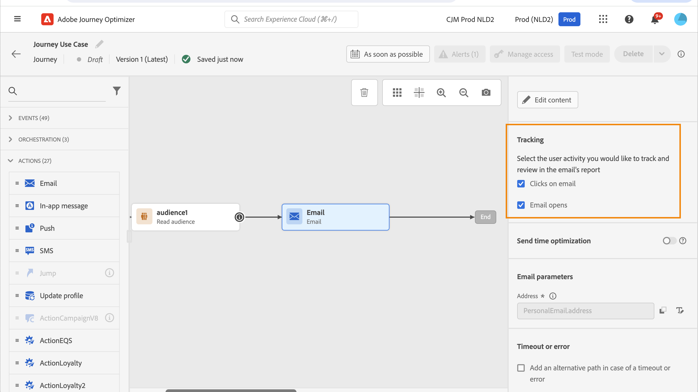
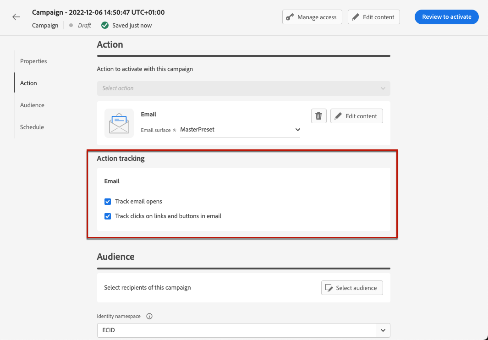
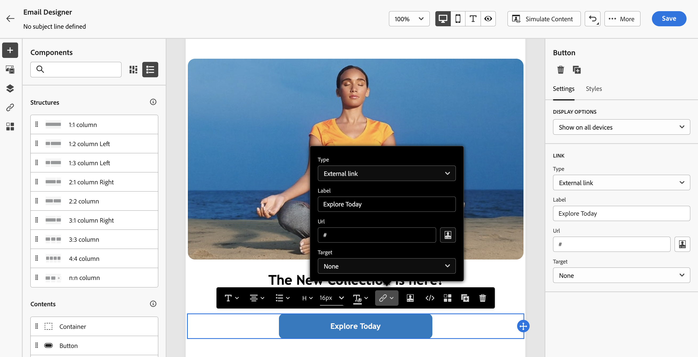
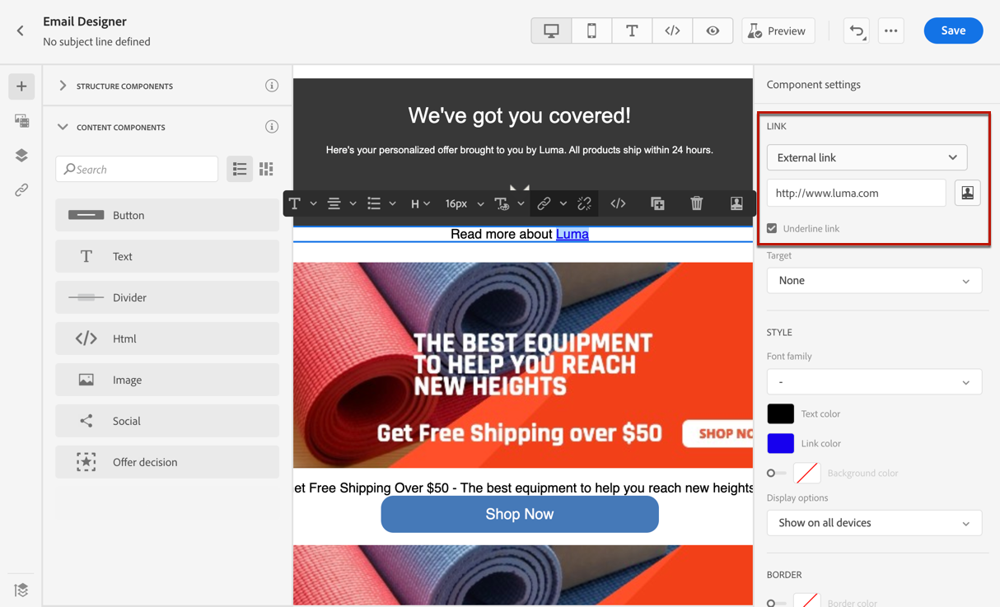
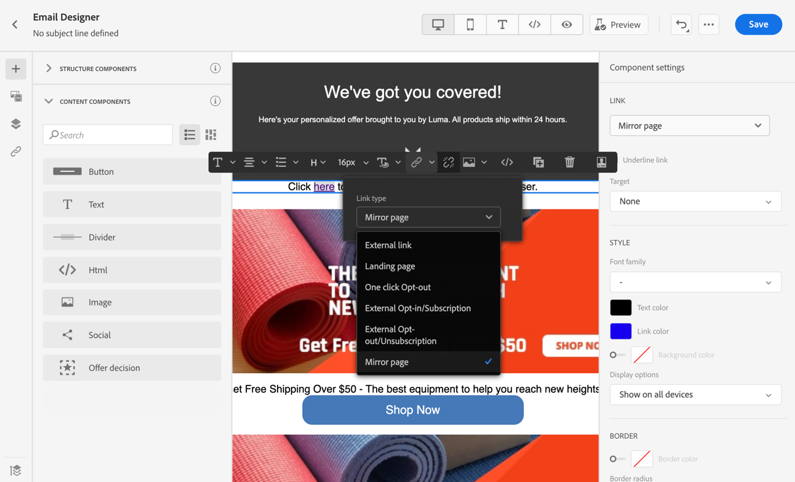
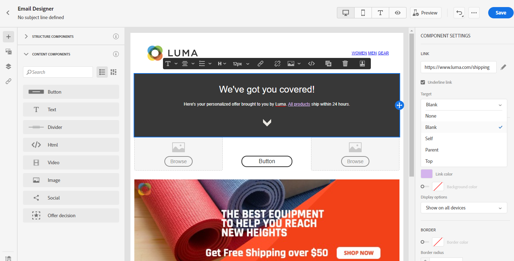
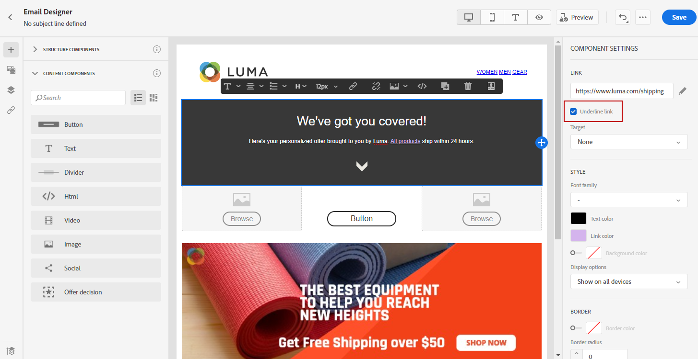
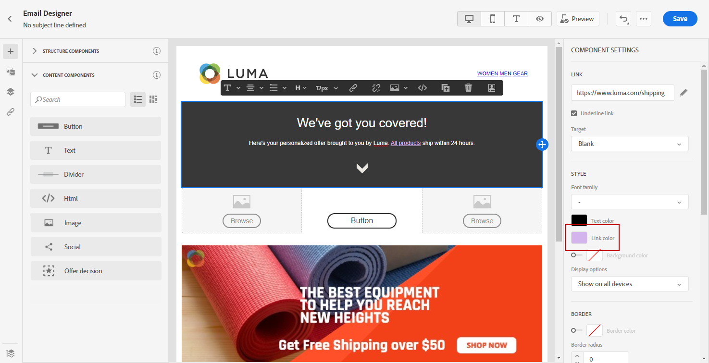
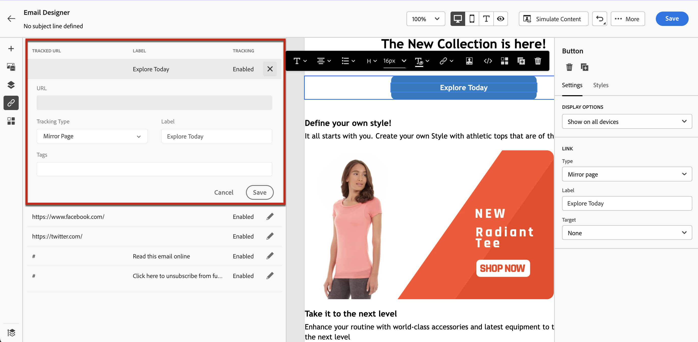

# Add links & track messages {#tracking}

>[!BEGINSHADEBOX]

**On this page:** Learn how to insert and manage links, add a mirror page, and enable open and click tracking to monitor recipient engagement with your emails.

>[!ENDSHADEBOX]

Use [!DNL Journey Optimizer] to add links to your content and track the messages sent in order to monitor the behavior of your recipients.

>[!NOTE]
>
>When links are included in your content, they expire **25 months** after the message is sent, except links to a mirror page, which expire after **90 days**. Once that delay elapses, the links are no longer available.

## Enable tracking {#enable-tracking}

You can enable tracking at the email message level by checking the **[!UICONTROL Email opens]** and/or **[!UICONTROL Click on email]** options when creating your message inside a journey or a campaign, as shown in the tabs below:

>[!BEGINTABS]

>[!TAB Enable tracking in a journey]

>[!TAB Enable tracking in a campaign]

>[!ENDTABS]

>[!NOTE]
>
>Both options are enabled by default.

When enabled, these options track the behavior of the recipients of your messages:

* The **[!UICONTROL Email opens]** metric checks how many messages have been opened.
* The **[!UICONTROL Click on email]** metric calculates the number of clicks on links in an email.

### Track across multiple emails {#track-across-multiple-emails}

A unique tracking identifier (urlID) is only generated when both the **URL** and the **label** are unique. Links that share the same URL and have the same effective label (including when the label is blank) reuse the same urlID, which means you cannot tell which link was clicked.

To track the same URL across multiple emails (or multiple times in one email), use a unique label for each similar URL; otherwise, [!DNL Journey Optimizer] will not be able to track which link was clicked. You can set distinct labels in the Email Designer or, for HTML, via the `data-label` attribute.

| URL | Tag | Label | urlID behavior |
| --- | --- | --- | --- |
| `https://www.example.com` | First | (blank) | Gets a urlID (e.g. A) |
| `https://www.example.com` | Second | (blank) | Reuses urlID A — cannot tell which link was clicked |
| `https://www.example.com` | Third | First Label | Gets a urlID (e.g. B) |
| `https://www.example.com` | Fourth | Second Label | Gets a urlID (e.g. C) |

## Insert links {#insert-links}

When [tracking is enabled](#enable-tracking), all links included in the message content are tracked.

>[!NOTE]
>
>Links from fragments used in an email are also tracked. [Learn more on fragments](../content-management/fragments.md)

To insert links into your email content, follow the steps below:

1. Select an element (text or image) and click **[!UICONTROL Insert link]** from the contextual toolbar.

    

1. Choose the type of link you want to create:

    * Select **[!UICONTROL External link]** to insert a link to an external URL.

    * Select **[!UICONTROL Landing page]** to insert a link to a landing page. [Learn more](../landing-pages/create-lp.md)

    * Select **[!UICONTROL One click Opt-out]** to insert a link to enable users to quickly unsubscribe from your communications without the need to confirm opting out. [Learn more](email-opt-out.md#one-click-opt-out).

    * Select **[!UICONTROL External Opt-in/Subscription]** to insert a link to accept receiving communications from your brand.

    * Select **[!UICONTROL External Opt-out/Unsubscription]** to insert a link to unsubscribe from receiving communications from your brand. Learn more about opt-out management in [this section](email-opt-out.md#email-opt-out).

    * Select **[!UICONTROL Mirror page]** to add a link to the email mirror page. [Learn more](#mirror-page)

    * Select **[!UICONTROL Deeplink]** to insert a link to a mobile app. This ensures users are taken directly to the right in-app content instead of being redirected to browsers or app stores, preserving context and engagement. [Learn more](deeplinks.md)

        >[!IMPORTANT]
        >
        >Before using deep linking, make sure you have completed the corresponding [configuration steps](deeplinks.md#configuration) in Journey Optimizer and implemented [deep link handling](deeplinks.md#mobile-implementation) in your mobile app. If you have not done so, the deep link will not direct users to the intended in-app content.
        >
        >Also, make sure [link tracking is enabled](#enable-tracking) for your message so that the URL is rewritten through Adobe systems.

1. Enter the desired URL in the corresponding field, or select a landing page, and define the link settings and styles. [Learn more](#adjust-links)

    >[!NOTE]
    >
    >For interpreting URLs, [!DNL Journey Optimizer] complies with the URI syntax ([RFC 3986 standard](https://datatracker.ietf.org/doc/html/rfc3986){target="_blank"}), which disables some special international characters in URLs. When trying to send the proof or email, if you are returned an error involving a URL added to your content, you can URL encode the string as a workaround.

1. You can personalize your links. [Learn more](url-personalization.md)

1. Save your changes.

1. Once the link is created, you can still modify it from the **[!UICONTROL Settings]** and **[!UICONTROL Styles]** panes on the right.

    

>[!NOTE]
>
>Marketing-type email messages must include an [opt-out link](../privacy/opt-out.md#opt-out-decision-management), which is not required for transactional messages. The message category (**[!UICONTROL Marketing]** or **[!UICONTROL Transactional]**) is defined in the [channel configuration](email-settings.md#email-type) when creating the message.

Once the message is sent, the retention period for a link is **25 months**. After that delay, the link is no longer available.

>[!CAUTION]
>
>When both the **label** and **URL** of a button are made editable in a [customizable fragment](../content-management/customizable-fragments.md), tracking reports show the URL instead of the button label.

## Link to a mirror page {#mirror-page}

The mirror page is an online version of your email. Adding a link to the mirror page is an email marketing good practice. Users can browse to the mirror page of an email, for example if they are experiencing rendering issues or broken images when trying to view it in their inbox. It is also recommended to provide an online version for accessibility reasons, or to encourage social sharing.

The mirror page generated by Adobe Journey Optimizer contains all personalization data.

To add a link to a mirror page in your email, [insert a link](#insert-links) and select **[!UICONTROL Mirror page]** as the type of link.

The mirror page is automatically created. Once the email is sent, when the recipients click the mirror page link, the content of the email is displayed in their default web browser.

The retention period for a mirror page is **90 days**. After that delay, the mirror page is no longer available.

>[!CAUTION]
>
>* Mirror pages links are auto-generated and cannot be edited. They contain all the encrypted personalized data that is required to render the original email. As a result, using personalized attributes with large values may generate lengthy mirror pages URLs, which can prevent the link from working in web browsers that have a maximum URLs length.
>
>* When creating emails that rely heavily on runtime personalization (e.g., `#each` loops, nested objects, large payload data), mirror page URLs can become excessively large, particularly in API-triggered campaigns that use extensive contextual data from payloads. This can cause HTTP errors (404, 422, 502) in browsers or mail clients. Adobe recommends limiting the breadth and depth of dynamic fields, reducing reliance on complex fragments, and flattening personalization structures to prevent link failures.
>
>* In the [proof](../content-management/proofs.md) sent to the test profiles, the link to the mirror page is not active. It is only active in the final messages.

## Customize link appearance and target {#adjust-links}

You can make adjustments to your links such as underlining them, change their color, or select their target.  These changes are set in the **[!UICONTROL Settings]** and **[!UICONTROL Styles]** panes on the right section of the content editor.

### Target {#link-target}

The **target** attribute is used to control where a linked page will open. Adding a target attribute in an anchor tag can specify if the link should open in a new tab, the same tab, or a different frame.

To define the target of a link, follow these steps:

1. In a **[!UICONTROL Text]** component where a link is inserted, select your link.

1. From the **[!UICONTROL Settings]** tab, select where the link opens in the **[!UICONTROL Target]** drop-down. Possible values are listed below:

    * **[!UICONTROL None]**: opens the link in the same frame as it was clicked (default).
    * **[!UICONTROL Blank]**: opens the link in a new window or tab.
    * **[!UICONTROL Self]**: opens the link in the same frame as it was clicked.
    * **[!UICONTROL Parent]**: opens the link in the parent frame.
    * **[!UICONTROL Top]**: opens the link in the full body of the window.

   

1. Save your changes.

### Underline link {#link-underline}

Check the **[!UICONTROL Underline link]** option to underline the label of your link.

### Link color {#link-color}

To change the color of your link, click on **[!UICONTROL Link color]** from the **[!UICONTROL Styles]** tab.

## Manage tracking {#manage-tracking}

The [Email Designer](content-from-scratch.md) allows you to manage the tracked URLs, such as editing the tracking type for each link.

1. Click the **[!UICONTROL Links]** icon from the left pane to display the list of all the URLs of your content that will be tracked.

    This list enables you to have a centralized view and to locate each URL in the email content.

1. To edit a link, click the corresponding pencil icon.

1. You can modify the **[!UICONTROL Tracking Type]** if needed:

   

    For each tracked URL, you can set the tracking mode to one of these values:

    * **[!UICONTROL Tracked]**: Activates tracking on this URL.
    * **[!UICONTROL Opt out]**: Considers this URL as an opt-out or unsubscription URL.
    * **[!UICONTROL Mirror page]**: Considers this URL is a mirror page URL.
    * **[!UICONTROL Never]**: Never activates tracking of this URL. 

Reporting on openings and clicks is available in the [Live report](../reports/live-report.md) and in the [Customer Journey Analytics report](../reports/report-gs-cja.md).

## Personalize URL tracking {#url-tracking}

For detailed guidance on URL personalization (including how to personalize URL tracking parameters and how to personalize a complete/base URL), refer to [URL personalization](url-personalization.md).

