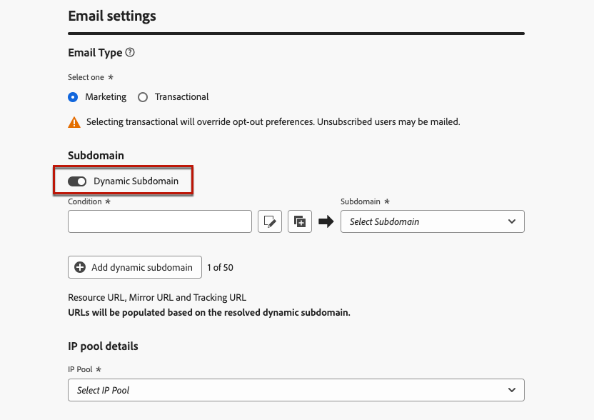
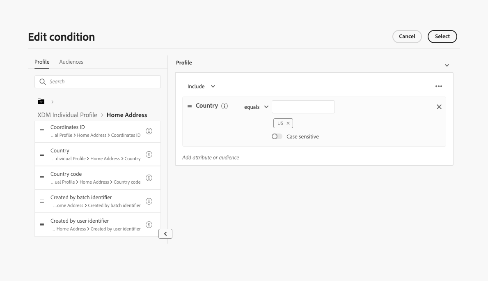

# Configure email dynamic subdomains {#surface-personalization}

For increased flexibility and control over your email settings, when creating email surfaces, [!DNL Journey Optimizer] allows you to define personalized values for subdomains, headers and URL tracking parameters.

## Add dynamic subdomains {#dynamic-subdomains}

>[!CONTEXTUALHELP]
>id="ajo_surface_perso_not_available"
>title="Personalization not available"
>abstract="This surface was created without any personalization attributes. Refer to the documentation for steps to solve if personalization is required."

>[!CONTEXTUALHELP]
>id="ajo_surface_dynamic_subdomain"
>title="Enable dynamic subdomains"
>abstract="When creating an email surface, you can set up dynamic subdomains based on conditions that you define using the Expression Editor. You can add up to 50 dynamic subdomains."

>[!CONTEXTUALHELP]
>id="ajo_surface_dynamic_subdomain_list"
>title="Some subdomains may be unavailable"
>abstract="Certain subdomains are currently unavailable for selection due to pending feedback loop registration. This process may take up to 10 business days. Once complete, you can choose from all available subdomains."

When creating an email surface, you can set up dynamic subdomains based on specific conditions.

For example, if you have legal constraints to send messages from a dedicated email address per country, you can use dynamic subdomains. This allows you to create a single surface with several sending subdomains corresponding to different countries - instead of creating multiple surfaces for each country. You can then target customers based in various countries consolidated into one campaign.

To define dynamic subdomains, follow the steps below.

1. Create a channel surface. [Learn how](../configuration/channel-surfaces.md)

1. Select the **[!UICONTROL Email]** channel.

1. In the **Subdomain** section, enable the **[!UICONTROL Dynamic Subdomain]** option.

    

1. Select the Edit icon next to the first **[!UICONTROL Condition]** field.

1. The [Expression Editor](../personalization/personalization-build-expressions.md) opens. In this example, set a condition such as `Country` equals `US`.

    

1. Select the subdomain you want to associate with this condition. [Learn more on subdomains](../configuration/about-subdomain-delegation.md)

    >[!NOTE]
    >
    >Certain subdomains are currently unavailable for selection due to pending [feedback loop](../reports/deliverability.md#feedback-loops) registration. This process may take up to 10 business days. Once complete, you can choose from all available subdomains. <!--where FL registration happens? is it when delegating a subdomain and you're awaiting from subdomain validation? or is it on ISP side only?-->

    

    All recipients based in the United States will receive messages using the selected subdomain for that country, meaning that all URLs involved (such as mirror page, tracking URL or unsubscribe link) will be populated based on that subdomain.

1. Set other dynamic subdomain as wanted. You can add up to 50 items.

    

1. Select the [IP pool](../configuration/ip-pools.md) to associate with the surface. [Learn more](email-settings.md#subdomains-and-ip-pools)

Once you have added one or more dynamic subdomains to a surface, the following items will be populated based on the resolved dynamic subdomain for this surface:

* All URLs (resource URL, mirror page URL and tracking URL)

* The [unsubscribe URL](email-settings.md#list-unsubscribe)

* The **From email** and **Error email** suffixes

## Personalize your header (#personalize-header)

You can also use personalization for all the header parameters defined in a surface.

For example, if you have multiple brands, you can create a single surface and use personalized values for your email headers. This allows you to make sure that all emails sent from your different brands are addressed to each of your customers with the correct **From** names and emails. Similarly, when your recipients hit the **Reply** button in their email client software, you want the **Reply to** names and emails correspond to the correct brand for the right user.

To use personalized variables for your surface header parameters, follow the steps below.

1. Define your header parameters as you would usually do. [Learn how](email-settings.md#email-header)

1. For each field, select the Edit icon.

    

1. The [Expression Editor](../personalization/personalization-build-expressions.md) opens. Define your condition as wanted ans save your changes.<!--In this example, set a condition such as -->

    >[!NOTE]
    >
    >You can only select **[!UICONTROL Profile attributes]** and **[!UICONTROL Helper functions]**.

1. Repeat the steps above for each parameter you want to add personalization to.

    >[!NOTE]
    >
    >If you added one or more dynamic subdomains to your surface, the **From email** and **Error email** suffixes will be populated based on the resolved [dynamic subdomain](#dynamic-subdomains).

<!--
## Use personalized URL tracking {#personalize-url-tracking}

To use personalized URL tracking prameters, follow the steps below.

select the profile attribute of your choice from the expression editor.

1. Repeat the steps above for each tracking parameter you want to personalize.

Now when the email is sent out, this parameter will be automatically appended to the end of the URL. You can then capture this parameter in web analytics tools or in performance reports.
-->
