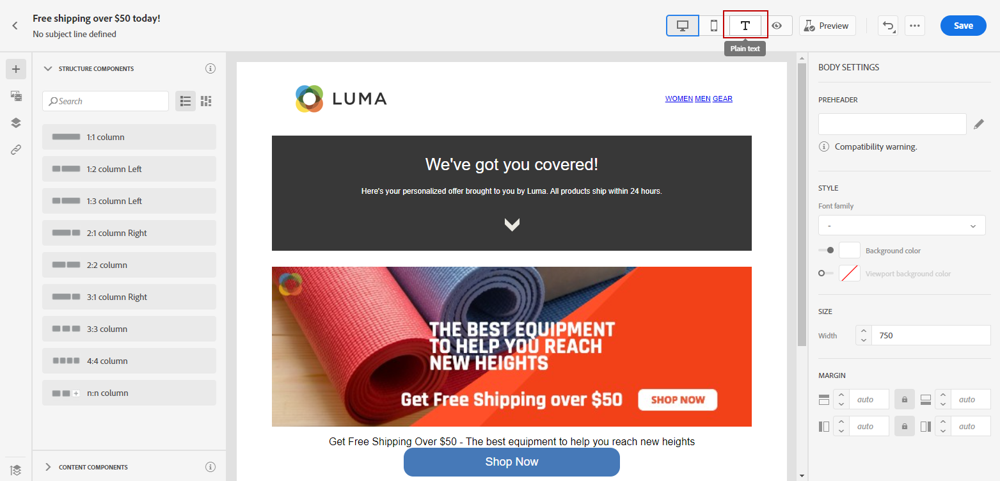
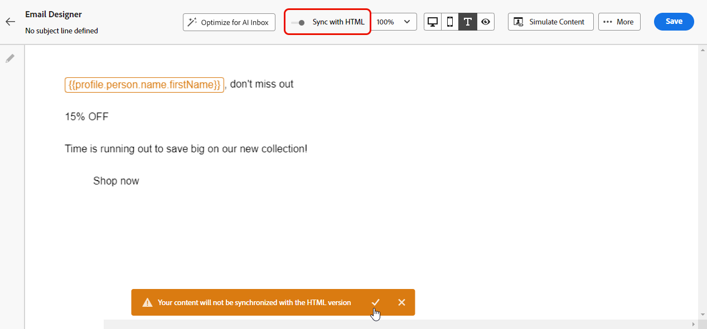
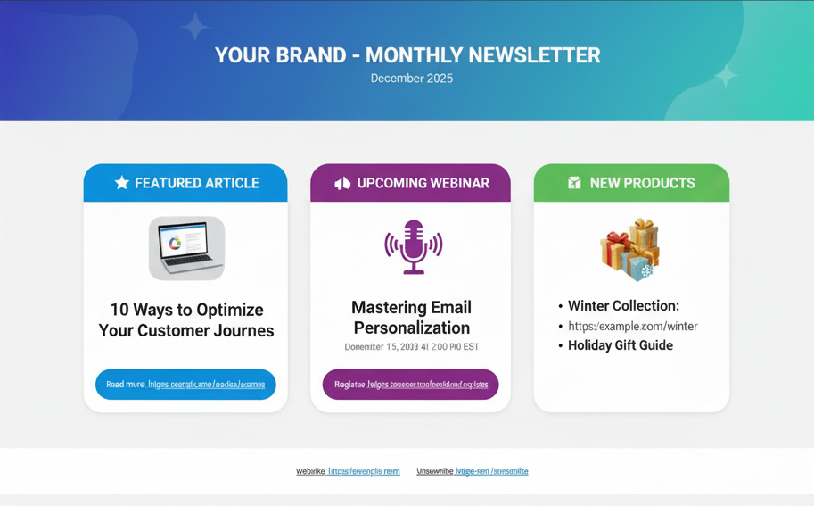
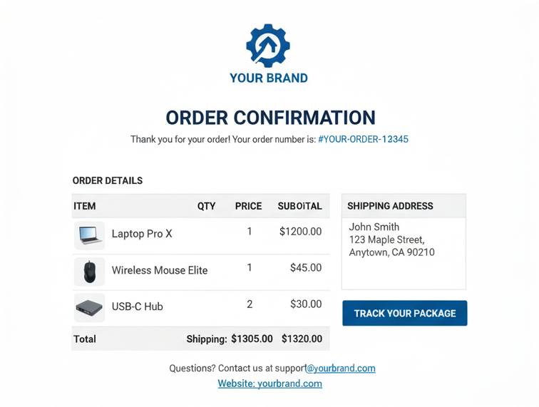

# Manage the text version of an email {#text-version-email}

It is recommended to create a text version of your email body, which is used when HTML content cannot be displayed.

From a security standpoint, offering a plain text version is important because HTML emails can carry risks such as malicious scripts, tracking pixels, or phishing attempts that rely on rich formatting and links. Plain text reduces the attack surface and is often preferred by security-conscious recipients or corporate email systems that restrict or strip HTML. Providing both versions lets recipients choose the format that fits their security and privacy requirements.

## Access the default text version {#plain-text-default}

By default, the Email Designer creates a **[!UICONTROL Plain text]** version of your email, including personalization fields. This  version is automatically generated and synchronized with the HTML version of your content.

To access the default text version, select the **[!UICONTROL Plain text]** icon from your email content.



## Use a custom text version {#plain-text-custom}

If you prefer using a different content for the plain text version, follow the steps below:

1. From your email, select the **[!UICONTROL Plain text]** icon.

1. Use the **[!UICONTROL Sync with HTML]** toggle to disable synchronization. Click the check mark to confirm your choice.

    

1. You can then edit the custom plain text version as desired.

>[!CAUTION]
>
> * When synchronization is disabled, changes made in **[!UICONTROL Plain text]** view are not reflected in HTML view.
>
> * If you re-enable the **[!UICONTROL Sync with HTML]** option  after updating your plain text content, your changes will be lost, and replaced with text content generated from the HTML version.

## When to use custom plain text versions {#when-to-use}

Understanding when to create a custom plain text version versus using auto-sync helps ensure optimal email delivery and readability.

### Use custom plain text (disable sync) when:

* **Complex HTML layouts** - Your HTML email includes multi-column layouts, tables, or complex CSS that don't translate well to plain text.
* **Visual-heavy content** - Your email relies heavily on images, and you want to provide descriptive text alternatives for image-disabled clients.
* **Different messaging structure** - You want to provide a simplified or reorganized message structure optimized for plain text readers.
* **Accessibility requirements** - You need specific plain text formatting to meet accessibility standards.
* **Legacy email clients** - Your audience includes users on older email clients (e.g., Outlook 2003, text-only mobile clients) that need specially formatted content.
* **ASCII formatting** - You want to include specific plain-text formatting like ASCII art, tables, or specific line breaks.

### Use auto-sync (default) when:

* **Simple HTML design** - Your HTML email has a simple, linear structure that translates well to plain text.
* **Consistent content** - You want to maintain exact consistency between HTML and plain text versions.
* **Frequent updates** - You regularly update email content and want to avoid manual duplication.
* **Personalization works well** - Your personalization fields function properly in both formats.
* **Time constraints** - You need to quickly launch emails without additional plain text customization.

## Practical examples {#practical-examples}

The following examples demonstrate real-world scenarios to help you decide whether to use custom plain text or auto-sync. Each example explains the context, the recommended approach, and the rationale behind the decision.

+++Example 1: Marketing newsletter with complex layout

**Scenario:** Multi-column newsletter with images, styled buttons, and color-coded sections.



**Recommendation:** Use custom plain text (disable sync).

**Why custom plain text:** The HTML version uses a three-column grid layout with banner images, styled buttons, and color-coded sections. These visual elements don't translate well to plain text through auto-sync, resulting in cluttered, hard-to-read content. A custom plain text version allows you to restructure the content into a linear, easy-to-scan format with clear section headers and properly formatted links.

**Custom plain text example:**

```
================================================
YOUR BRAND - MONTHLY NEWSLETTER
December 2025
================================================

🌟 FEATURED ARTICLE
"10 Ways to Optimize Your Customer Journeys"
Read more: https://example.com/articles/optimize-journeys

📢 UPCOMING WEBINAR
"Mastering Email Personalization"
December 15, 2025 at 2:00 PM EST
Register: https://example.com/webinar/register

📦 NEW PRODUCTS
- Winter Collection: https://example.com/winter
- Holiday Gift Guide: https://example.com/gifts

================================================
Website: https://example.com
Unsubscribe: https://example.com/unsubscribe
================================================
```

+++

+++Example 2: Transactional order confirmation

**Scenario:** Order confirmation with structured data (order number, items, prices, shipping details).



**Recommendation:** Use auto-sync.

**Why auto-sync works:** Order confirmations have a simple, linear structure that translates naturally from HTML to plain text. The information flows logically (order details → items → totals → shipping), and personalization fields like order numbers and customer names work identically in both formats. The structured, tabular data converts cleanly without requiring manual adjustments, saving time while maintaining clarity.

+++

+++Example 3: Event invitation with rich media

**Scenario:** Event invitation with background images, embedded videos, and interactive elements.


**Recommendation:** Use custom plain text (disable sync).

**Why custom plain text:** The HTML version relies on visual impact—background images, video embeds, and interactive RSVP buttons. Auto-sync would strip these elements out, leaving a confusing text version with broken references. A custom plain text version allows you to provide clear event details, speaker information, and direct registration links in a well-organized format that works without visual elements.

**Custom plain text example:**

```
YOU'RE INVITED!
Annual Customer Summit 2025

📅 When: March 15-17, 2025
📍 Where: San Francisco Convention Center
         123 Market Street, San Francisco, CA

KEYNOTE SPEAKERS
- Jane Smith, CEO TechCorp: "The Future of Digital Marketing"
- John Doe, Chief Innovation Officer: "AI and Customer Experience"

REGISTER NOW: https://example.com/summit/register
Early bird discount ends February 1st

Full agenda: https://example.com/summit/agenda
Questions: events@example.com | 1-800-555-0123
```

+++

## Common use cases {#common-use-cases}

The following use cases demonstrate situations where creating a custom plain text version (disabling sync) is beneficial. Each example shows the challenge posed by the HTML version and how a custom plain text solution addresses it.

+++Use case 1: Product catalog emails

**Challenge:** HTML shows grid of products with images, prices, and buy buttons

**Plain text solution:** Create a structured list with clear product names, prices, and direct links

```
FEATURED PRODUCTS
=================

1. Premium Leather Wallet
   Price: $89.99
   View product: https://example.com/product/wallet
   
2. Designer Sunglasses
   Price: $129.99
   View product: https://example.com/product/sunglasses
```

+++

+++Use case 2: Welcome email series

**Challenge:** Branded welcome email with company logo and styled formatting

**Plain text solution:** Use ASCII art or text formatting to create visual hierarchy

```
***************************************************
*                                                 *
*     WELCOME TO [BRAND NAME]                    *
*     We're thrilled to have you!                *
*                                                 *
***************************************************
```

+++

+++Use case 3: Survey or feedback request

**Challenge:** HTML includes styled buttons and form elements

**Plain text solution:** Provide clear text links with instructions

```
We'd love your feedback!
------------------------

Please take 2 minutes to complete our survey:
https://example.com/survey/customer-feedback

Your input helps us improve our service.
```

+++

## Frequently asked questions {#faq}

**Will my personalization fields work in plain text?**  
Yes, personalization fields like `{{profile.firstName}}` work identically in both HTML and plain text versions.

**How do I test my plain text version?**  
* Toggle to **[!UICONTROL Plain text]** view in the Email Designer. [Learn how](#text-version-email)
* Send test emails to text-only email clients like old versions of Pine or basic mobile email apps.

**What happens if I forget to create a plain text version?**  
The system automatically generates a plain text version from your HTML, which may not be optimally formatted but will ensure delivery to text-only clients.

**Can I use different personalization in HTML vs. plain text?**  
Yes, once you disable sync, you can customize each version independently, including using different personalization fields or content.

**Which email clients only support plain text?**  
Very few modern clients are text-only, but some corporate email policies, accessibility tools, and older mobile devices may display plain text. It's also a fallback when HTML rendering fails.

**How often should I update my plain text version?**  
Update it whenever you make significant changes to your HTML content. Minor HTML tweaks may not require plain text updates if the core message remains the same.

**Can I include links in plain text emails?**  
Yes! Include full URLs (e.g., https://example.com/page) and most email clients will automatically make them clickable.

**Should I include images in plain text?**  
No, plain text doesn't support images. Instead, describe what the image shows or provide a link to view it online.
