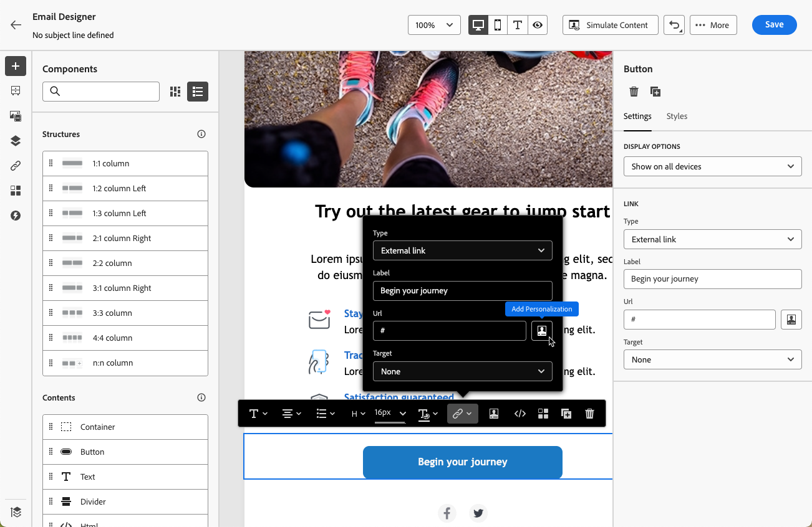
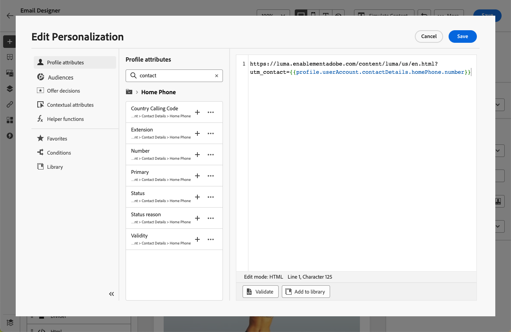

# Personalize URLs in emails {#url-personalization}

>[!BEGINSHADEBOX]

**On this page:** Learn how to personalize email URLs with profile attributes, including complete or base URLs and per-link tracking parameters, while keeping links valid and trackable.

>[!ENDSHADEBOX]

Personalized URLs help you deliver contextual experiences through your [!DNL Journey Optimizer] email messages, such as generating recipient-specific links or appending dynamic parameters.

They take recipients to specific pages of a website, or to a personalized microsite, depending on the profile attributes.

## Personalize a URL {#personalize-url}

To personalize a URL, follow the steps below.

1. In the Email Designer, select an element in the content and [insert a link](message-tracking.md#insert-links) using the contextual toolbar.

    >[!IMPORTANT]
    >
    >Personalization is only available for **[!UICONTROL External link]**, **[!UICONTROL Unsubscription link]** and **[!DNL Opt-Out]**. Make sure to select an appropriate link type.

1. Select the personalization icon.

    

1. Use the personalization editor to add the profile attributes you want to personalize the URL with.

1. Save your changes.

Here are some examples of personalized URLs:

* `https://www.adobe.com/users/{{profile.person.name.lastName}}` 
* `https://www.adobe.com/users?uid={{profile.person.name.firstName}}`
* `https://www.adobe.com/usera?uid={{context.journey.technicalProperties.journeyUID}}`
* `https://www.adobe.com/users?uid={{profile.person.crmid}}&token={{context.token}}`

>[!NOTE]
>
>When editing a personalized URL in the personalization editor, helper functions and audiences membership are disabled for security reasons.
>
>Spaces are not supported in the personalization tokens used inside urls.

For reliable rendering and tracking, follow the [best practices and guardrails](#best-practices) below.

## Personalize a complete/base URL {#personalize-complete-base-url}

Journey Optimizer supports personalizing the **entire** URL or the **base domain** of a URL, for example:

```html
<a href="{{profile.social.link}}" />
<a href="{{profile.social.baseUrl}}/profile" />
<a href="https://{{profile.social.baseUrl}}/profile" />
```

>[!CAUTION]
>
>To enable complete or base URL personalization, you must first add your accepted domains to the allowed list. [Learn how](#manage-accepted-domains)
>
>Dynamically generated URLs have a known limitation: click data may not appear in journey or campaign reports. [Learn more](#click-tracking-limitation)


### Add domains for complete/base URL personalization {#manage-accepted-domains}

To enable complete or base URL personalization, you must first add your accepted domains to the allowed list.

This ensures that only approved domains are used in your personalized URLs and to help prevent unsafe redirects.

>[!NOTE]
>
>To view, add or remove domains from the allowed list, you need the **[!UICONTROL Manage messages general settings]** and the **[!UICONTROL View messages general settings]** permissions. [Learn more](../administration/ootb-permissions.md)

To manage your allowed domains, follow the steps below.

1. In Adobe Journey Optimizer, go to **[!UICONTROL Administration]** > **[!UICONTROL Channels]** > **[!UICONTROL Email settings]** > **[!UICONTROL Allowed list - domains]**.

    

    From there, you can browse all approved domains, add new ones, and delete existing ones.

1. Click the **[!UICONTROL Add domain]** button.

1. Enter the full subdomain or root domain.

    {width="80%"}

    >[!NOTE]
    >
    >Do not include https:// or a trailing slash as this will cause the domain to be rejected. For example, enter `www.example.com` or `example.com`, not `https://www.example.com/`.

1. Click **[!UICONTROL Confirm]**. The domain is added to the allowed list and can now be used in complete or base URL personalization.

1. To remove a domain, click the **[!UICONTROL Delete]** icon next to that domain.

    >[!CAUTION]
    >
    >If you remove a domain that is already in use in a personalized URL, the safety of the link cannot be guaranteed. Make sure to update any personalized URLs that reference this domain before removing it from the allowed list.

### Click tracking limitation {#click-tracking-limitation}

Dynamically generated URLs — where the entire URL or base domain resolves from a profile attribute at send time — have a known tracking limitation: Journey Optimizer cannot reliably track clicks for these links, and **click data may not appear in journey or campaign reports**.

This occurs because the tracking redirect is applied at design time, before the final URL is known. When the resolved value differs per recipient, the redirect chain breaks and clicks go unrecorded. Additionally, the resolved URL must start with `http` or `https` for every recipient — if it does not, tracking is silently skipped for that link.
    
To maintain reliable click tracking, use one of the following approaches:

* Use a fixed base URL and append personalized parameters only (for example, `https://www.example.com/page?uid={{profile.person.crmid}}`).

* Pre-generate a personalized URL per recipient, store it as a profile attribute, and reference it in your email content.

## Personalize URL tracking parameters {#personalize-url-tracking-parameters}

[URL tracking](url-tracking.md) is managed at the channel configuration level and applies to all URLs included in your message content. You can also personalize URL tracking parameters for an individual link in the Email Designer. This lets you append a recipient-specific parameter to a single link (for example, to pass an identifier to your web analytics tools).

To do so, [insert a link](message-tracking.md#insert-links), select the personalization icon, add the URL tracking parameter and select the profile attribute of your choice from the [personalization editor](../personalization/personalization-build-expressions.md).



Repeat the steps above for each link you want to add this tracking parameter to.

Now when the email is sent out, this parameter is automatically appended to the end of the URL. You can then capture this parameter in web analytics tools or in performance reports.

>[!NOTE]
>
>To verify the final URL, you can [send a proof](../content-management/proofs.md) and click the link in the content of the email once you receive the proof. The URL should display the tracking parameter. For example: <https://luma.enablementadobe.com/content/luma/us/en.html?utm_contact=profile.userAccount.contactDetails.homePhone.number>

<!--
## Best practices and guardrails {#best-practices}

To keep links valid, clickable, and trackable, follow the best practices and guardrails below.

### Braces for dynamic URLs {#use-braces}

When inserting a URL that contains personalization, use three curly braces (`{{{ ... }}}`) for the dynamic portion of the URL. This prevents escaping from altering special characters (for example `/` and `+`) and helps avoid broken URLs, incorrect redirects, or tracking issues.

Here is an example:

```html
<a href="https://example.com/path/{{{profile.person.customSlug}}}?ref={{{context.system.source.id}}}">View details</a>
```

>[!IMPORTANT]
>
>Using raw output (`{{{ ... }}}`) means the value is inserted as-is. Only use it with values you trust and that are intended to be URL-safe (for example, values you generate or validate upstream).

### Correct URL tracking {#enable-url-tracking}

* When using personalization to generate the URL, ensure the resolved value starts with `http`/`https` for every recipient. Otherwise, tracking may not be applied and the link may not behave as expected.

* Do not use dynamic logic such as `let`, `each`, or `if` statements directly in the personalization editor's URL field. These are disabled for security reasons.

* If your scenario involves complex logic to generate personalized URLs, avoid placing that logic directly in the personalization editor's URL field. Instead:
    * Add the necessary logic and statements in the HTML content above or near the URL field.
    * Generate and store personalized attributes separately, then reference them in your email content.

### URL encoding and length {#encoding}

* URI syntax rules ([RFC 3986 standard](https://datatracker.ietf.org/doc/html/rfc3986){target="_blank"}) apply to all URLs in your email content. However, personalized URLs are more likely to surface encoding issues because recipient-specific values can introduce reserved characters (for example in query parameters). Therefore, ensure your dynamic values are URL-encoded (especially spaces, `&`, `#`, `%`, and `+`) and avoid using `+` for query values.

* Very long URLs can be truncated or rejected by browsers, mail clients, or downstream systems. For example, mirror page URLs can grow significantly when runtime personalization is heavy. Keep personalized payloads small and avoid embedding large objects into URLs.

### Recommended validation steps {#validation}

Before activating a journey or campaign, follow the recommendations below:

* Send a [proof](../content-management/proofs.md) and click links to confirm the resolved URL starts with `http`/`https` and keeps the expected structure.
* If tracking parameters are appended, confirm the final URL includes them (either via configuration-level URL tracking or per-link tracking parameters).
-->

{{$include /help/_includes/do-not-localize/email/ai-augmented-url-personalization.md}}
