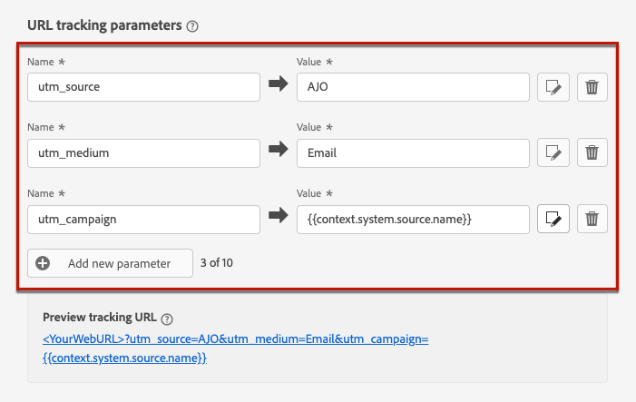
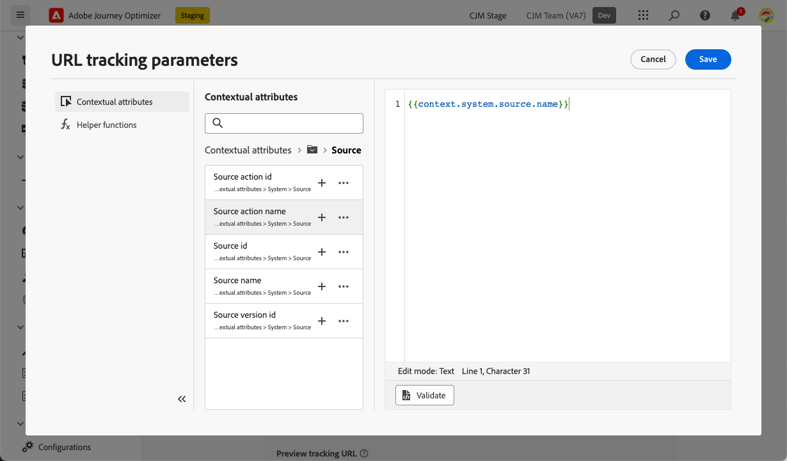
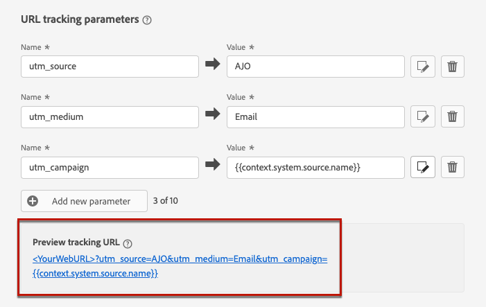

# URL tracking {#url-tracking}

>[!BEGINSHADEBOX]

**On this page:** Learn how to define URL tracking parameters at the email channel configuration level so they are appended to your content links and captured in web analytics and performance reports.

>[!ENDSHADEBOX]

>[!CONTEXTUALHELP]
>id="ajo_admin_preset_utm"
>title="Define URL tracking parameters"
>abstract="Use this section to automatically append tracking parameters to the URLs present in your email content. This feature is optional."

>[!CONTEXTUALHELP]
>id="ajo_admin_preset_url_preview"
>title="Preview URL tracking parameters"
>abstract="Review how tracking parameters will be appended to the URLs present in your email content."

When configuring a new [email channel configuration](email-settings.md), you can define **[!UICONTROL URL tracking parameters]** to measure the effectiveness of your marketing efforts across channels. Activating this feature is optional.

The parameters defined in the corresponding section will be appended to the end of the URLs included in your email message content. You can then capture these parameters in web analytics tools such as Adobe Analytics or Google Analytics, and create various performance reports.

>[!NOTE]
>
>The order of URL tracking parameters appended to the URL is random and cannot be controlled. If your system requires parameters in a specific order, you will need to parse and reorder them on your side.

You can add up to 10 tracking parameters using the **[!UICONTROL Add new parameter]** button.

{width="80%"}

To configure a URL tracking parameter, you can directly enter the desired values in the **[!UICONTROL Name]** and **[!UICONTROL Value]** fields.

You can also edit each **[!UICONTROL Value]** field using the [personalization editor](../personalization/personalization-build-expressions.md). Click the edition icon to open the editor. From there, you can select the available contextual attributes and/or directly edit the text.

The following predefined values are available through the personalization editor:

* **Message profile id**: Message-oriented attribute identifying uniquely each message sent to each targeted profile in a delivery.

* **Offer id**: ID of the offer used in the email.

* **Source action id**: ID of the Email action added to the journey or campaign.

  >[!NOTE]
  >
  >Journeys that were closed or not republished after a product change may fail to populate `context.system.source.actionId` in tracking URLs, resulting in empty placeholders (for example, `cid=em-acou-adob{}`). To ensure tracking parameters are correctly populated, [republish the affected journey](../building-journeys/publish-journey.md#journey-create-new-version) or remove the reference to this context field for closed journeys. Learn more in [Troubleshoot your live journey execution](../building-journeys/troubleshooting-execution.md#tracking-parameters-closed-journeys).

* **Source action name**: name of the Email action added to the journey or campaign.

* **Source id**: ID of the journey or campaign the email was sent with.

* **Source name**: name of the journey or campaign the email was sent with.

* **Source version id**: ID of the journey or campaign version the email was sent with.

>[!NOTE]
>
>You can combine typing text values and using contextual attributes from the personalization editor. Each **[!UICONTROL Value]** field can contain a number of characters up to the limit of 5 KB.

<!--You can drag and drop the parameters to reorder them.-->

Below are examples of Adobe Analytics and Google Analytics compatible URLs.

* Adobe Analytics compatible URL: `www.YourLandingURL.com?cid=email_AJO_{{context.system.source.id}}_image_{{context.system.source.name}}`

* Google Analytics compatible URL: `www.YourLandingURL.com?utm_medium=email&utm_source=AJO&utm_campaign={{context.system.source.id}}&utm_content=image`

You can dynamically preview the resulting tracking URL. Each time you add, edit or remove a parameter, the preview is automatically updated.

>[!NOTE]
>
>You can also add dynamic personalized tracking parameters to the links present in your email content. [Learn more](surface-personalization.md#personalize-url-tracking)
