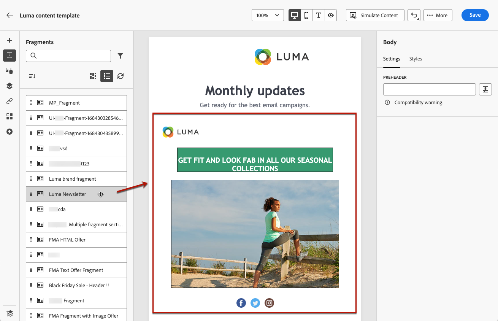

# Add visual fragments to your emails {#use-visual-fragments}

A fragment is a reusable component that can be referenced in one or more emails across Journey Optimizer campaigns, journeys or content template. This functionality allows to prebuild multiple custom content blocks that can be used by marketing users to quickly assemble email contents in an improved design process. [Learn how to create and manage fragments](../content-management/fragments.md).

➡️ [Learn how to manage, author and use fragments in this video](../content-management/fragments.md#video-fragments)

## Use a fragment {#use-fragment}

To use a fragment into an email, follow the steps below.

>[!NOTE]
>
>You can add up to 30 fragments in a given delivery. Fragments can only be nested up to 1 level.

1. Open any email or template content using the [Email Designer](get-started-email-design.md).

1. Select the **[!UICONTROL Fragments]** icon from the left rail.

    

1. The list of all visual fragments created on the current sandbox is displayed. They are sorted by creation date: recently added visual fragments are shown first in the list. You can:

    * Search for a specific fragment by starting typing its label.
    * Sort fragments in ascending or descending order.
    * Change the way the fragments are displayed (cards or list view).
    * Refresh the list.

    >[!NOTE]
    >
    >If some fragments were modified or added while you are editing your content, the list will be updated with the latest changes.

1. Drag and drop any fragment from the list into the area where you want to insert it.

    

    >[!CAUTION]
    >
    >You can add any **Draft** or **Live** fragment to your content. However, you won't be able to activate your journey or campaign if a fragment with the Draft status is being used in it. At journey or campaign publication, draft fragments will show an error and you'll need to approve them to be able to publish.
    
1. Like any other component, you can move the fragment around in your content.

1. Select the fragment to display the corresponding pane on the right. From there, you can delete the fragment from your content, or duplicate it. You can also perform these actions directly from the contextual menu that displays on top of the fragment.

    

1. From the **[!UICONTROL Settings]** tab, you can:

    * Choose the devices you want the fragment to be displayed on.
    * Open the fragment in a new tab to edit it if needed. [Learn more](../content-management/fragments.md#edit-fragments)
    * Explore references. [Learn more](../content-management/fragments.md#explore-references)

1. You can further customize your fragment using the **[!UICONTROL Styles]** tab.

1. If needed, you can break the inheritance with the original fragment. [Learn more](#break-inheritance)

1. Add as many fragments as you want and **[!UICONTROL Save]** your changes.

## Use implicit variables {#implicit-variables-in-fragments}

The implicit variables enhance the existing fragment functionality to improve efficiency for content reusability & scripting use cases. Fragments can use input variables and create output variables usable in campaign and journey content.

Learn how to use implicit variables in [this section](../personalization/use-expression-fragments.md#implicit-variables).

## Customize editable fields {#customize-fields}

If certains portions of the selected fragment have been made editable, you can override their default value after adding the fragment into your content. [Learn how to make your fragments customizable](../content-management/customizable-fragments.md)

To customize editable fields in a fragment, follow these steps:

1. Add the fragment to your content and select it to open the properties pane on the right-hand side.

1. All editable fields in the fragment are displayed in the **Settings** tab, under the **Fragment** section.

    Editable fields are highlighted in green in the preview pane when selected in the right pane, making it easy to identify their location in your content.

    In the example below, the image **source** and **alt text** can be edited, as well as the "Click here" button **URL**.

    

## Break inheritance {#break-inheritance}

When you edit a visual fragment, the changes are synchronized. They are automatically propagated to all draft or live journeys/campaigns and content templates containing that fragment.

When added to an email or a content template, fragments are synchronized by default. However, you can break the inheritance from the original fragment. In that case, the content of the fragment is copied into the current design, and the changes are not synchronized anymore.

To break inheritance, follow the steps below:

1. Select the fragment.

1. Click the unlock icon from the contextual toolbar.

    

1. That fragment becomes a standalone element that is not linked anymore to the original fragment. Edit it as any other content component in your content. [Learn more](content-components.md)
